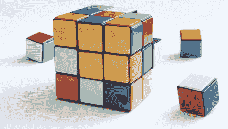

# 软件开发人员提高评估能力的 5 种方法

> 原文：<https://simpleprogrammer.com/5-ways-software-developers-can-become-better-estimation/>

在我的上一篇文章中，我详细列出了软件开发人员评估能力差的四个最大原因，但是我没有谈到如何解决我提出的任何问题。

虽然对软件开发人员来说，评估总是固有的困难，但是并没有失去所有的希望。

在这篇文章中，我会给你五个真正的技巧，你可以利用它们来更好地进行评估——即使是复杂的软件开发任务。

## 技巧 1:把事情分解得更小

在我的上一篇文章中，我谈到了在软件开发项目中很常见的长时间周期是如何使评估变得非常困难和不准确的。

如果你被要求估计一件只花你五分钟的事情，你比被要求估计一件要花你五个月的事情更有可能准确。

那么，如何才能解决这个问题呢？

实际上有一个相对简单的解决办法:把事情分解成更小的块，并估计那些更小的块。

是的，我知道这看起来简单明了——我也知道这种方法经常遭到质疑。你可以为为什么不能把事情分解成更小的部分找很多借口，但事实是，大多数事情都可以分解——如果你愿意付出努力的话。

我实际上已经谈论过[为什么越小越好](https://simpleprogrammer.com/2010/07/09/why-small-is-better/)和[如何在过去分解一个积压](https://simpleprogrammer.com/2011/08/08/how-to-break-down-a-backlog/)，所以我不会在这里再次重复所有的细节。

要认识到的关键点是，你永远不可能擅长估算大的事物。好吧，让我换一种说法:**你将变得擅长估算大事情的唯一方法是学习如何将它们分解成许多小事情。**

如果你真的需要准确地估计某件事，花时间把你估计的事情分解成更小的部分是非常值得的。

例如，假设我要估计写一篇博文需要多长时间。这不是一个非常大的任务，但它足够大，估计可能有点不准确。

如果我想更准确，我可以把任务分解成更小的部分。

考虑以下两者的区别:

*   撰写并发布一篇博客文章

并且:

*   研究博客文章，集思广益
*   概述博客文章
*   撰写博客文章的初稿
*   添加图像、链接和标注
*   计划发布文章

通过将事情分解成更小的部分，我可以更准确地估计每一部分。事实上——这里有一个小技巧——当事情被分解成这么小的时候，我实际上可以对过程的某些部分进行时间限制——这有效地确保了我的估计是准确的(但是，我们正在向前跳跃，我们稍后将更多地讨论时间限制。)

下一次你被要求实现某个功能时，不要估计你认为整体完成它需要多长时间，试着把任务分解成非常小的部分，然后单独估计每一部分。您总是可以将较小的估计值相加，以给出更准确的整体估计值。

但是等等！我很清楚你会说这种估计是错误的。当然，每一个单独部分的估计可能更准确，但是当你把它们加在一起时，总的来说，你仍然会得到和你估计一个大东西一样的误差水平。

对于这种观点，我只能说“试试看”从某种程度上说，你是对的，小块中的小误差会累积起来，导致整体误差更大，但小块也会趋于平均。所以，有些花费更少的时间，有些花费更多的时间，这意味着，总的来说，你最终会比估计一个误差很大的大东西要精确得多。

## 技巧 2:花时间研究

你为什么不擅长评估？

因为你对你所估计的东西了解得还不够。

在上一篇文章中，我谈到了困扰许多软件开发项目的未知因素如何使评估变得极其困难，但我并没有真正谈到如何处理这些我们不知道自己不知道的事情。

答案其实很简单:研究。

摆脱未知的最好方法是了解它。

每当你承担评估某事的任务时，你的第一反应应该是想做一些研究——试着发现你还不知道的是什么。

不幸的是，大多数软件开发人员在试图评估某件事情时，不会立即考虑做研究。相反，他们依赖过去的经验。如果他们在过去做了一些他们认为足够相似的事情，他们会自信地估计它——忽略未知的未知的可能陷阱。如果他们从来没有做过类似于他们被要求评估的事情，他们会假设到处都有未知的未知，并得出充满填充的评估。

这两种方法都不好。相反，你应该先试着估计一下研究一项任务需要多长时间，然后再估计实际任务需要多长时间。我发现大多数软件开发人员非常擅长估计研究一项任务需要多长时间，尽管他们可能不擅长估计完成这项任务本身需要多长时间。

一旦你有了研究，你应该有更少的未知的未知要处理。你可能还有一些未知，但至少你会了解它们。

但是，这在现实中看起来如何呢？

你实际上是如何研究你应该评估的任务的？

嗯，有时候这需要往后推，提前计划一些事情。我将给你一个例子，说明这在 Scrum 或敏捷团队中是如何工作的。

假设您想通过在评估任务之前做研究来开始改进您的评估。问题是，当你在一个敏捷项目中工作时，你通常需要评估迭代中的任务，并且在评估之前没有时间研究每一个任务——尤其是大任务。

我发现，在这种情况下，最好的办法是不要预先估计大任务，而是将任务向后推一个迭代，并估计研究每个大任务需要多长时间。

因此，在您的迭代中，您可能会有任意数量的小研究任务，这些任务的目的只是为了让您获得足够的信息，以便在下一次迭代中对大任务进行更准确的估计。在这些研究任务中，随着你对它们的了解越来越多，你也可以把大任务分解成小任务。

等等…等等..等等…我知道你在想什么。我不能只是把一个任务推到下一个迭代中。我的老板和商人不会喜欢那样的。他们希望在这次迭代中完成。

你说得对，那么你如何处理这个问题呢？

简单。你只需要在需要完成的时候提前一次迭代就开始计划更大的任务。如果你在一个敏捷团队中工作，你应该养成向前看的习惯，为将来迭代中出现的大任务挑选研究任务。

在评估任何实质性的东西之前，总是向前看并做研究，你会养成做出更准确评估的习惯。

这种技术也可以应用到更小的任务中，有时，在给出评估之前，只需要花五分钟或十分钟对任务进行少量的研究。

下一次你试图评估一项任务时，先花些时间做些研究。你会惊奇地发现你的估计变得更加准确了。

## 提示 3:记录你的时间

我们评估事物的一个大问题是我们没有准确的时间观念。我对过去项目所花时间的记忆往往会因为一些因素而有所偏差，比如我有多喜欢这项工作，我有多饿。

我们头脑中这种扭曲的时间会导致一些非常错误的估计。

因此，记录事情花费你实际时间是很重要的。

无论你在做什么工作，养成记录时间的习惯是一个非常好的主意。现在，当我写这篇博文的时候，我的番茄钟正在计时，记录我的时间，这样我就能更好地知道我写博文要花多长时间。如果我在这个过程的某个部分花了太多时间，我也会有一个想法。

一旦你养成了记录时间的习惯，你就会更清楚事情实际上花了你多长时间，你把时间花在了哪里。

如果你甚至不能准确说出已经发生的事情花了多长时间，那么认为你擅长估计还没有发生的事情是疯狂的。

说真的，考虑一下。不，真的。我想让你思考一下，当你对自己所做的事情过去了多长时间没有一个准确的概念时，相信自己可以擅长估计任何事情是多么荒谬。

许多人认为软件开发不同于其他工作，它不能被精确地估计。虽然我同意软件开发比安装地毯或重新盖屋顶更难估计，但我认为许多软件开发人员在估计方面很糟糕，因为他们不知道事情实际上需要多长时间。

帮你自己一个忙，开始记录你的时间。有很多很好的工具可以做到这一点，比如:

*   [重新约定时间](https://www.rescuetime.com/)
*   [Toggl](https://www.toggl.com/)
*   [PayMo](http://www.paymo.biz/)

如果你对我如何跟踪我的时间和计划我的一周感到好奇，看看我做的解释我开发的过程的视频:

[https://www.youtube.com/embed/W9k0OhJkjQ0?feature=oembed](https://www.youtube.com/embed/W9k0OhJkjQ0?feature=oembed)

顺便说一下，遵循这个过程使我变得非常擅长估算。我通常可以在一到两个小时的准确度内估算出一整周的工作量。我知道这是事实，因为我跟踪它。

## 技巧 4:时间盒的东西

我说过我会回到这一个，这就是了。

成为更擅长评估任务的软件开发人员的一个大秘密是给这些任务设定时间框。这几乎就像作弊。

当你给一项任务设定时间表时，你要确保它会和你计划的一样长。

你可能认为大多数软件开发任务不能被时间限制，但是你错了。我经常使用这个技巧，并且我发现我们做的许多任务在我们完成它们的时间上有很大的变化。

我发现，如果你给一项任务一定的时间——而且仅仅是这段时间——你就可以确保在这段时间内完成工作。

考虑编写单元测试的例子:

对于大多数软件开发人员来说，编写单元测试是一件非常主观的事情。除非你追求 100%的代码覆盖率，否则你通常只写单元测试，直到你觉得你已经充分测试了你要测试的代码。(如果你做测试驱动开发，TDD，那可能也不正确。)

如果你为你将要花在编写单元测试上的时间设置了一个时间框，你可以强迫自己先做最重要的单元测试，并按照 80 / 20 原则操作，以确保你得到最大的回报。

对于许多任务来说，你可能会花上几个小时的额外时间来处理那些没有多大影响的小细节。时间限制迫使你先做重要的事情，避免过早优化或过分担心变量名。

当然，有时候，你不得不提前完成你为一项任务设定的时间表，但是很多时候，你会发现你实际上已经完成了需要做的事情，如果有时间的话，你随时都可以回来处理这些事情。

同样，就像跟踪你的时间一样，计时拳击是你必须养成的习惯，但是一旦你习惯了，你就能把它当作一个骗局来使用，从而比你想象的更准确地估计时间。

你可能想给自己买一个番茄钟或厨房计时器来帮助你记录时间和时间盒任务。有时候有一个物理计时器是很好的。T3】

## 提示 5:修改你的估计

这里有一个小秘密:你不必一开始就做对。相反，你可以在完成任务的过程中修改你的估计。

是的，我知道你的老板希望你现在给出一个准确的估计，而不是在你接近完成的时候，但是你总是可以现在给出你的最佳估计，并在你完成任务的过程中修改它。

我想象不出任何情况下，提供更多最新信息会不受欢迎。

使用另外四个技巧来确保你最初的估计尽可能的准确，但是偶尔，你应该花一点时间来重新评估实际的当前估计。

你知道当你下载一个文件，它会告诉你需要多长时间？您是否希望它在下载过程开始时就计算持续时间，而不进行更新？当然不是。相反，大多数下载管理器显示一个持续更新的剩余时间估计值。

一般来说，仅仅经历这个过程就能让你更好地进行评估。当你不断地更新和修改你的评估时，你不得不面对为什么你最初的评估是错误的。

## 你呢？

这些只是我用来提高估计准确性的一些最有用的技巧，但是你呢？我是不是漏了什么东西？请在下面的评论中告诉我。

另外，如果你喜欢这篇文章，请加入 6000 多名其他软件开发人员的简单程序员社区。只需在这里注册，开始你成为更好、更健康、更高效的软件开发人员的旅程。