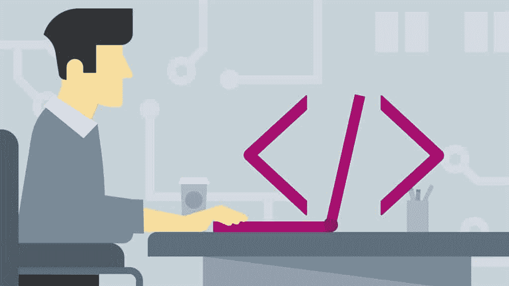

# 新程序员面临的 9 个最常见的问题

> 原文:[https://simple programmer . com/9-common-problems-new-programmers-face/](https://simpleprogrammer.com/9-common-problems-new-programmers-face/)

作为程序员，你的第一份工作开始时令人兴奋。但是几周之后，工作的负面影响——截止日期、错误报告、被你的经理大吼大叫——开始困扰你。

但是并没有失去一切。

好消息是每个人都会犯错。你所犯的所有错误都是和你一样起步的人所犯的。其他新程序员从容应对这些问题，寻找解决方案，并最终取得了更好的结果。

你也可以。

让我们看看新程序员面临的一些最常见的问题，以了解如何获得视角并解决自己的问题。

## 1–不理解用户

### 问题是

在软件开发中，以用户为中心不是一个选项，而是一个优先事项。当然，要使任何软件以用户为中心，你必须知道用户想要什么。

你的用户可能对产品应该如何工作有自己的看法。这些观点可能与您的开发团队的观点不同。但是新程序员通常很难理解他们的用户想要什么，因为他们很少能直接与用户互动。

当然，像 Agile/Scrum 这样的项目管理技术使得开发团队在整个开发周期中随着用户需求的变化而更新软件变得更加容易，但是对于仍然在学习诀窍的程序员来说，平衡用户的需求和缺乏对它们的访问是具有挑战性的。

### 狐狸

最终，使用你的产品的人将会是最终用户。

然而，用户可能知道他们希望产品完成什么任务，但不知道产品的特性。这是你的工作。正如亨利·福特曾经说过的一句名言，“如果我问我的顾客他们想要什么，他们会说是一匹更快的马。”

*   与直接接触用户的人交谈:(不，不是项目经理。)如果你真的想知道你的用户期望什么，去找用户体验专家或者设计师。他们需要用以人为中心的设计方法来处理每一个产品，并直接接触到最终产品的实际使用者。他们的洞察力将为你的代码指明方向。
*   测试你的产品:如果你真的想知道你的用户对你的产品有什么看法，那就测试一下。像苹果这样成功的公司经常会发布他们产品的测试版，在正式推出之前看看用户会有什么反应。这有助于他们修复用户可能指出的任何错误和问题。

## 2–调试

### 问题是

想象一下这个场景。在为完善一个程序工作了几天之后，你满意地回到家，它会像预期的那样工作。当你第二天来上班时，你的质量保证部门的同事给了你一长串需要解决的问题。网络表单上的“取消”按钮是不可点击的，错误消息上的语法是不正确的，并且该软件还有其他错误，这些错误在用户体验中造成了障碍。

调试所有这些听起来让人不知所措，不是吗？对于新程序员来说更是如此。有些 bug 很容易调试，但很多不容易，这会导致开发时间的浪费和新程序员无尽的挫败感。

但好消息是，编程中的 bug 很常见。事实上，即使是写得最好的代码也会有这样的问题。它们是可以修复的。

### 狐狸

在职业足球中，人们说最好的防守是良好的进攻。当应用于编程时，对 bug 最好的防御是一个好的调试策略。作为一名新的程序员，结合调试策略也可以帮助你。你可以这样做:

*   **重现错误:**花无数个小时试图解决一个你不理解的问题可能会很紧张。要修复你的 bug，要理解它们为什么会发生。怎么会？从复制它们开始。你所发现的将会给你一个如何修复它们的好主意。
*   寻求帮助:这个建议可能是显而易见的，但是当项目处于关键的最后期限时，大多数新程序员倾向于先惊慌，后思考。如果你不能重现一个错误，寻求帮助。发现错误的测试人员可以帮助您重现错误。

## 3–跟上技术发展

### 问题是

随着技术的不断增长和扩展，程序员需要[跟上](https://simpleprogrammer.com/2017/06/12/developer-skills-updated/)。框架、工具和库很快就会过时。例如，在新的更新版本出现之前，前端框架通常会持续一两年。

从某种意义上说，更新的版本是好的，因为它们更高效，让你的工作更轻松。但是你也需要很快适应它们——作为一个新的程序员，这可能是你很难适应的。

资深程序员知道迭代和频繁更新是必然的。最成功的版本一个月更新一到四次。作为一名新程序员，你可能会在这种压力下屈服。

### 狐狸

有两个简单的解决方法:

*   花些时间学习新系统:工作日只有这么多时间来完成工作。但是挤出 20 到 30 分钟来学习新工具是如何工作的也无妨。例如，如果您认为使用更新版本的项目管理软件会工作得更好，那么就在业余时间学习如何使用它，一旦您最终习惯了它，就用它来改进您的工作流程。
*   跟上最新趋势:当有工作截止日期要赶时，阅读可能不在你的优先考虑之列。但是跟上最新的编程趋势只会对你有所帮助。学习新的编码实践和工具意味着你将更好地创建代码，并能开发更多创新的产品。

为了使学习成为一种更易于管理的实践，使用现成的资源，如 [Codecademy](https://simpleprogrammer.com/codecademy-py) 和 [Stack Overflow](https://stackoverflow.com/) 。更好的是，利用午餐时间向团队中更有经验的程序员请教最新的技术和最佳实践。这些对话会让你了解情况，帮助你更好地利用时间。

## 4–通信

### 问题是

作为一个新的程序员，你在新的工作场所可能一个人都不认识。当然，也许你认识告诉你职位空缺的同事，但不认识你的团队成员或你将共事的项目经理。如果你不认识他们，你可能会犹豫要不要和他们谈论任何事情，从代码相关的问题到了解公司的权力等级。

沟通不畅是大多数新程序员在某个时候都会面临的问题。最糟糕的是，这可能会在工作场所引发冲突。如果你发现自己对一个项目的问题不清楚，如果你不能和你的队友交谈，你可能不知道如何解决它们或寻求帮助。例如，如果您不与团队成员协调，您可能会陷入代码合并问题。这是我作为一个软件开发公司的新员工所经历的。我团队中的每个人都遵循一种我完全不熟悉的编码策略。因此，我遇到了很多合并冲突，并经常与我的团队成员发生冲突。

沟通不畅的责任落在你身上，因为这是你力所能及的。如果你不尝试与你的团队建立良好的沟通，你最终要对这个问题负责。

### 狐狸

说到软件开发，沟通技巧和技术技巧一样重要。以下是你如何提高这些技能的方法:

*   **积极主动**:只在你需要什么或被问及问题时才进行沟通，这在工作场所是行不通的。与你的同事打成一片，不要害怕问他们问题，尤其是关于你在工作中面临的任何问题。如果你向他人敞开心扉，你可以更快地适应职场文化。如果你是一个害羞的人，那么，你缺乏自信是你必须努力克服的。
*   **保持一致**:有时候你说话可能不够清晰或连贯，这会导致问题。接受会有这样的时刻，从中吸取教训，下次做得更好。练习，直到你能更流利地表达自己。

## 5-时间估计

### 问题是

也许你不知道如何做一个好的估计。也可能你给了一个估计，但是没有坚持。最后，你跟不上团队的其他成员，你的项目超过了计划。

作为一名在受截止日期控制的行业中工作的专业人员，您可能会被要求提供完成一项任务(比如调试代码或在 sprint 中完成某些功能)所需的估计时间。

评估在软件开发中很重要。它们可以作为报价和项目进度的基础。进度延迟会导致问题，并可能损害信任。

作为一名新的程序员，你可能会尝试投入比任务所需更多的时间，并认为这样做可能会给你的老板留下深刻印象，对项目有好处。但这样做可能会反过来咬你一口。这会让你远远落后于计划和团队，这让你看起来很糟糕。

### 狐狸

要解决这个问题:

*   分解任务:让任务更容易管理的最好方法是[把它们分解](http://www.amazon.com/exec/obidos/ASIN/0985056436/makithecompsi-20)成一系列更小的任务。QA 刚刚是不是在你的工作中发现了一打 bug？将每个修复视为一个小任务，并估计完成这些任务可能需要的时间。以这种方式分解你的工作量会让事情不至于变得不堪重负。
*   给自己适当的时间安排:给每项任务一个完成的时间框架，但也给自己一个缓冲。例如，如果一项任务通常需要 20 分钟，那就给自己设定一个缓冲时间，将时间限制在 30 分钟。你永远不知道会发生什么样的骚乱。

## 6-坐几个小时

### 问题是

说到软件开发，长时间坐着是工作的一部分。背痛、腿麻和脖子扭伤也是如此。作为一名新程序员，你可能不习惯长时间坐着。毕竟，在学校里，任务不会花你八个小时来完成。

对于程序员来说，坐着可能不会被认为是一个问题，但是考虑到对健康的影响，它应该是一个考虑因素。

研究表明，每天久坐超过五个小时会导致严重的健康风险，如心血管疾病和肥胖。这也会让你在白天感觉更累。

### 狐狸

你不能改变你的工作把你限制在办公桌前的事实。但是您可以通过以下方式改变您的工作方式:

*   站起来工作:站起来工作可以减轻背部压力，促进血液循环。这也让你工作更有效率。事实上，一些企业甚至投资购买高度可调的办公桌，让员工更容易使用这种工作方式。
*   做些运动:坐办公室的人白天经常会感到疲倦和没有动力。为了减轻压力，让你的身体得到锻炼。即使是上班前 30 分钟的散步或慢跑也能让你一整天都工作得更好，只要你把它变成一种习惯。如果你抽不出时间锻炼，那就出去散散步，吃点午饭或喝杯咖啡。

## 7–安全威胁

### 问题是

数据是一种有价值的商品。有些人愿意花大价钱购买，包括你客户的竞争对手，他们想窥探你可能正在做的绝密项目(比如营销或企业软件)。

您的客户依赖您来保护他们的信息免受这些威胁。压力太大了。不幸的是，初学者经常忽略代码中的安全漏洞，直到安全漏洞发生后才意识到后果。

作为一名新的程序员，您可能最终会忽略安全漏洞，特别是如果您的重点更多地是交付无错误的代码，而不是检查它是否安全。黑客知道这一弱点，并一直在寻找渗透您的代码的方法。

### 狐狸

你不能阻止某人试图侵入你的代码，但是你可以通过防止普通的侵入方法使他们更难侵入你的代码。以下是方法:

*   **使用 SQL 注入的参数化查询:**攻击者可以使用 SQL 注入来窃取数据，如用户的登录详细信息。为了防止这种攻击，请在您使用的编程语言中使用参数化查询。
*   **确保您工作站的安全:**攻击者并不总是在线；他们也可以是你工作场所的某个人。例如，一名被解雇的员工可能决定通过使用您的系统窃取或修改项目数据来报复您的雇主。为了防止这种攻击的发生，请在使用完任何软件后注销。

## 8–使用他人的代码

### 问题是

即使是新员工也不得不在某些时候参与他人创建的项目。例如，在编程中，你可能不得不处理另一个开发者写的代码。这种情况会引起问题。

最初编写代码的程序员可能已经不在那里工作了，并且在离开之前没有向任何人简要介绍他们的工作。或者，如果他们仍然在你的工作场所，他们可能太忙，没有时间回答你的任何问题。

或者在最坏的情况下，可能会有办公室政治。例如，也许你的同事与以前的程序员相处有困难，可能不愿意帮助你理解他们的代码。

### 狐狸

编写另一个程序员的代码可能是一个问题，但这是一个可以解决的问题。最好的方法就是把它当成一个挑战。这是一个开始:

*   **意识到现在是你的代码了**:解决这个问题意味着改变你对它的态度。如果有人把代码留给你，那就不再是他们的代码了。现在是你的了。从一开始就承担责任会减轻任务的压力。
*   花更多的时间阅读代码:花一些时间了解其他开发人员是如何工作的，包括他们的方法和风格。一旦你这样做了，你会更容易适应代码。

## 9–不规划您的代码

### 问题是

毫无疑问，第一印象很重要。但深思熟虑的计划也是如此。

这是一份新工作，你想证明自己，这完全可以理解。但是为了获得一个好的第一印象，你可能会急着写你的代码，并且弄清楚它以后的发展方向。

但是这种方法会反过来咬你一口。你的代码在你的头脑中可能是有意义的，但是它却走向了一个完全相反的方向。

### 狐狸

花在计划外代码上的时间是浪费时间。为了避免这种情况，把你的想法写在纸上，而不是带着它们在脑子里转。以下是一些你可以尝试的建议:

*   从一个想法开始:每个软件程序都是从一个想法开始的。例如，你对应用程序的想法可能是让用户记住约会的工具。这一步让您专注于您将要编码的内容。
*   **使用思维导图找出用户问题:**一旦你想出了自己的想法，下一步就是把它绘制出来。从你的产品要解决的问题开始。将你的想法写在纸上，并为其创建副标题。例如，如果你的想法是一个约会提醒应用程序，一个副标题可能是为什么用户可能需要它(例如，他们有太多的约会要跟踪)。
*   找出可能的解决方案:在你描绘出你的产品将要解决的问题之后，思考这些问题的可能解决方案。例如，如果用户需要您的产品来跟踪多个任务，可能的功能是通知系统或电子邮件提醒，提醒他们一天中的任何约会。

## 做一个新人没关系

当你刚开始做程序员的时候，从你应该写的代码到与同事交流，所有的事情看起来都让人不知所措。

但是好消息是你的感受有一个完全合理的解释。你面临的挑战不是不可克服的。记住这些建议，并从你不是唯一一个这样的事实中得到安慰；你的同事在某些时候也面临这些问题。