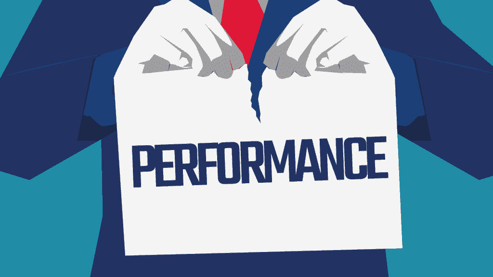

# 如何赢得下一次年度评估

> 原文：<https://simpleprogrammer.com/ace-your-next-annual-review/>

审查过程。

啊，如此美好的回忆…

如此糟糕的回忆…

如此…扯淡。

是的，你知道这是真的。

**[大部分复习流程正是那个:牛屎。](http://amzn.to/2dJpxfj)T3】**

让我们继续下去，调整这些目标，以符合你实际做的事情，而不是我们六个月前决定设定的目标。

我不能给你一个完美的评论，所以让我看看我是否能想到一些需要改进的地方。

自我评价——我们稍后会谈到这个问题。

如果你和我都知道大多数评估过程都是虚假的，那么学习如何掌握这种虚假仍然很重要，这样你就可以获得加薪并拥有一份良好的员工档案。

这一章是关于如何，但首先，一个故事。

## 我是如何扭转我的评论的

很久以前，我在一家名为惠普的公司工作。

该公司在审核过程中使用了一个堆栈排名系统。

我们稍后会详细讨论，但基本上这就像在曲线上评分。

只有那么多人能拿到最高排名，那么多人能拿到中间，一些可怜的冤大头——不管是不是他们应得的——不得不拿到可怜的收视率。

在这特殊的一年里，我踢了屁股。

真的。

我阅读了大约 15 本技术书籍，获得了 5 项微软认证，组建并领导了一个全新的团队，为开发环境开发了几个新工具，并且是引入新的。NET 架构到打印机。

不仅如此，我还超额完成了之前绩效评估中“明年目标”部分的所有目标。

我已经准备好获得最高的评价，可能还有升职。

我填写了评估文件中属于我的部分，写下了我完成的工作，列出了我明年的目标，然后和我的经理召开了评估会议。

我已经定期和他联系过了，所以我很确定不会有什么意外。

会议进行得很顺利，他对我的成就印象深刻。

我耐心地等待——嗯，不完全是耐心地——找出我的评级。

第二周，当所有的评论都完成后，我登录查看我的评分。

天啊。

我的排名低于平均水平。排名倒数一级。

我差点在椅子上摔倒。

一定是弄错了。

我安排了一次会议，向我的老板询问这件事。

他承认，由于我最近获得了晋升，并且处于工资级别的高端，他受到了压力，要求他将其他一些开发人员排在顶端，以便他们可以平衡一下。

他强调，如果由他决定，我会得到尽可能高的评级，但他们只能给出其中一个排名，只有有了那个排名，他们才能给另一个开发者升职，所以他们必须做出一些艰难的选择。

我不开心。

他告诉我，我可以对评级提出上诉，他会看看他能做什么，但我需要提供一些文件，说明为什么我认为这不是一个公平的排名，以及我是如何超越我的所有目标的。

第二天，我从我的每周报告中提取了所有的亮点，并整理了我在 Outlook 电子邮件程序中创建的“kudos”文件夹。

我查看了每个排名的公开要求。

我把所有这些都放在一个几页的文档中，**列出了我在那一年中取得的大约 50 项成就**，我收到的来自经理、同事和利益相关者的 10 封最令人印象深刻的称赞电子邮件，以及我的绩效评估中每个目标的详细清单，以及我是如何超额完成的。

哦，我还附上了文档和电子邮件，我每周都和我的老板检查，问我是否达到了目标，是否有任何我需要努力和改进的地方。

我的案子无懈可击。

在这一点上，你可能期待典型的“但这并不重要”的结局。

事情不是这样的。

第二周，当我开始工作时，我的桌子上放着修改过的员工评估。

我现在排名第一，获得了职位晋升和大幅加薪。

我完成了不可能的任务。

怎么会？

让我们谈谈那个。

## 提前登记

你的年度评估不应该是你和你的老板第一次讨论你做得如何以及你需要改进的地方。

事实上，如果你的年度评估中的任何事情或者你的老板对你的年度评估说的任何话让你感到震惊，你已经搞砸了。

我不喜欢听天由命，我也不喜欢惊喜。

一旦你制定了今年的计划，概述了你的目标和工作领域，**你应该向你的老板了解你的进展情况**，至少每两周一次，最好是每周一次。

你应该直截了当地问自己做得怎么样，是否有任何事情需要改进。

如果有什么事情，努力去做，然后在下一次“检查”中展示进展

如果什么都没有，那就确认一下。

说，“那么，你的意思是，现在我 100%有望实现今年的所有目标，你认为我绝对没有什么需要改进的地方？”

"我只是想确认一下我理解得对不对。"

将此记录下来。

记下日期和时间，以及具体说了什么。

如果你真的很聪明，你会在面对面会谈后发邮件问这个问题。

它叫 CYA。我会让你找出缩写。

通过这样做，你将完成一些关键的事情。

首先，**在实际评估之前，你将有机会修正任何实际的或感觉到的不足之处**。

第二，你将**依靠一致性原则**来确保你的评估没有意外。

人们非常强烈地被迫与他们过去说过或做过的事情保持一致。

(你可以在罗伯特·恰尔迪尼的名著 *[影响:说服的心理学](http://amzn.to/2enVICk)* 中读到这一点。)

如果你的老板说你做得很好，你现在没有什么可以改进的，他会更被迫在评估时说同样的话。

最后，你正在创造极其令人信服的证据，证明你正在尽一切努力以防万一。

## 有明确的目标，让他们知道

你复习的目的或目标是什么？

你想得到晋升吗？

才能拿到满分的复习分？

也许你正在努力克服去年评估中的一个弱点，而今年你希望它成为一个优势？

无论你的目标是什么，都要弄清楚并让大家知道。

告诉你的老板在你的评估中你想要完成什么。

让它广为人知，然后问你需要做些什么来实现它。

记录响应。

写下来。

如果你能通过电子邮件得到它，那就更好了。

一旦你说“根据 HR 角色描述，一个软件工程师 IV 需要能够做 X，等等，等等…”

你告诉你的老板你想被提升为软件工程师 IV，你正在做 X 来达到这个目标，并问他什么能让你在下一次评估时清楚地知道你在那里…

他已经告诉你了。

你已经记录下来了。

然后，你就有了几乎可以拿到银行去的东西。

只是做那些被同意的事情，并让人们知道你正在做什么；如果你现在满足了这些要求，在回顾的时候，你将会有一个很好的机会去得到你想要的。

真的就这么简单。

## 跟踪并记录你的进展

这是关键。

我已经说过很多次了，但是**确保你记录了所有的事情**，尤其是你的进展。

[你应该已经在创建周报告](https://www.youtube.com/watch?v=xso5G7m_Hxg)了，它详细描述了你每天所做的高级事情，并总结了你一周的亮点。

但是你不应该就此打住。

**记录[你读过的书](https://simpleprogrammer.com/2016/01/01/all-the-books-i-read-in-2015/)，你参加过的任何培训，任何显示你朝着目标进步的东西。**

看看你之前的评估和今年的目标。

尽你所能记录下你正在实现这些目标和/或朝着这些目标前进的一切。

再说一次，这不是火箭科学。

这实际上是常识，但是仍然有很多软件开发者被评论弄得措手不及。

在生活中，你会发现大多数人不会记录事情，但是如果你和记录事情的人发生争执或打官司——哦，天哪。

成为那个男孩或女孩。

## 建立您的案例

你想记录每件事的部分原因是为了在考核中获得高分或最终获得晋升。

把你手头的关于朝着目标前进的文件，以及你的老板指示你需要做什么和你是如何做的，结合你需要的其他一切来建立一个无懈可击的案例。

假装你是律师。

收集人们称赞你的电子邮件。

当有人称赞你时，请他们给你发一封电子邮件。

我曾经在我的邮箱里放了一个 kudos 文件夹，用来储存我一年中从人们那里收到的所有好的邮件。

这些都是支持你的论点的好证据。

你的老板，尤其是他的上司，不会知道你一直在做的所有伟大的事情。你必须告诉他们。

所以，去做吧。

不要害怕在这里吹牛。

当你走进评论时，它应该带着一份即使是最强硬的陪审团也不能忽视的材料。

## 上诉，如果需要的话

我做了我在这里推荐的所有事情，但还是被骗了。

但是你猜怎么着？我没有放弃。

尤其是在大公司里，人力资源部不希望你去抗争。

他们有他们的 BS 栈排名系统，他们知道是 BS。

他们有一个虚假的审查过程和工作级别描述，用来提供一些公平和秩序的表象，但它们真的没有任何意义。

也就是说，直到你用证据挑战它。

我在惠普做的事情是前所未闻的。

没有人会改变他们的评价。

然而，我做到了——而且很容易。

因为**我有证据支持我的案子**,而没有人有任何相反的证据。

也许有人可以收集一些不利于我的证据，证明我确实没有达到预期，或者我没有达到某些目标，但这需要相当多的工作。

更容易的是找到一些其他不会这么努力的笨蛋，给他更低的排名，给我我想要的。

所以，**不要害怕对判决**提出上诉。

只要确保你有足够的证据来支持你的上诉，否则你会看起来像一个爱抱怨的人。

卡培什？

## 你自己的速度陷阱

最臭名昭著的回顾陷阱之一是你“开始”给自己打分。

你是怎么处理这种情况的？

你会给自己所有的完美评分，并冒着看起来像一个自恋的混蛋的风险吗？

你会谦虚地把自己评价得比你真正应得的低，希望你的老板会纠正你，把你提升得更高吗？

你真的试着从公正的角度评价自己吗？哈，好像那是可能的。

真的，你是做什么的？

首先，**如果你能拒绝给自己打分，那就去做。**

简单地说，你不能以一种公正的方式合理地评价自己——没有人能做到——你写下的任何东西都不会是准确的。

如果失败了，老实说，这是最有可能的，那么我认为这是最好的策略:

除了你最薄弱的地方，尽可能给自己打高分，给自己打一个低于完美的分数。

这背后的原因很简单。

如果你被要求评价自己，你为什么要故意伤害自己呢？

一点意义都没有。

你给自己一个低评级是没有任何好处的。

最好的情况是，你的老板说“你应该得到更高的报酬”，最坏的情况是他相信你。

相反，你应该尽可能地给自己打分。

最坏的情况是，你的老板说“你不觉得这有点高吗？”

你回答说“你让我给自己打分。”

最好的情况是，他相信你。

我不知道你怎么想，但我不喜欢伤害自己。T3】

你给我一把枪，告诉我找个地方开枪自杀，我会瞄准我脚趾间的空隙。

如果我认为你可以侥幸逃脱，我会说把自己评价为完全完美——实际上，我对此仍持观望态度。

但是，我认为你至少给自己一个低于完美的分数会做得更好，因为这会让你的自我评价更可信。

声明一下，**我绝对讨厌自我排名和同行排名。**

两者都是极端偏颇的，只呈现给你只能害你不能帮你的局面。

## 同行排名

我不打算谈论同行排名，但因为我刚才提到了它，让我们花一点时间来讨论一下。

所以，同行排名…

你该怎么办？

如果你被迫采取这种共产主义的、出卖朋友的策略，拒绝成为盖世太保的一员，只要尽可能完美地评价你所有的同伴。

是的，你没听错。

给他们完美的评价，说他们很多好话。

给你的同事差评不会有什么好结果。

充其量，他们被降职或解雇，这是极不可能的。

最坏的情况是，他们发现了这件事，他们成为你的老板或团队领导，让你的生活一团糟，你的老板认为你是个混蛋，每个人都认为你是个混蛋，你不得不辞职另找工作，因为你给自己创造了一个充满敌意的工作环境。

所以，即使你的同事很差劲，应该被解雇，除非你是真正负责解雇的老板，否则不要做让他们失望的傻瓜。

*快速提示:*

我想清楚地说明为什么我提倡一些人可能会认为自我评价和同事评价是不诚实的做法。

我为什么不说，尽可能诚实地评价你自己和你的同龄人呢？

我完全理解这种情绪，我也想提倡这种方式，但我有一个问题。

我认为自我评级和同行评级在任何层面上都是狗屎。

让人们陷入不得不刺伤自己或旁边人的境地是不公平的。

*和**无论你写下什么都不意味着杰克。**T3】*

这就像是一种虚假的心理测试，当你认为这是真的时，他们会看看你会用多少虚假的电流电击某人。

如果我认为自我评定和同事评定是公平的——或者它们可能是公平的、无偏见的，不会带来极其负面的影响——我会完全支持诚实地填写它们。

我主张退而求其次，而不是走上街头抗议这类评论。我选择更被动的抵抗方式。

通过颠覆体制来剥夺他们的权力。

不要刺伤你自己或你的朋友。

不同意也没关系。

## 堆叠排名

我不喜欢堆积排名，就像我不喜欢同行评审一样，但堆积排名只是一些公司的生活现实，我们必须面对它。

我发现最近越来越多的公司正在摆脱堆积如山的排名程序。

堆叠排名背后的想法相当简单，实际上也有一定的意义。

基本上，你把所有的员工都找出来，找出成绩最好的 10%，一般的 80%，最差的 10%。

你提拔和奖励前 10%的员工，解雇后 10%的员工。

不过，这种方法存在一些问题。

最大的一个问题是，大多数人力资源部门和经理实际上并不根据业绩进行排名，而是根据其他动机进行排名。

所以，他们不是把前 10%的人排在最前面，而是根据政治、工资水平和其他因素来挑选。

由于只有这么多的“顶级职位”可供选择，经理和部门往往会在这些职位上讨价还价，同样，排名更多地是由政治而不是绩效决定的。

不要误解我的意思，我认为理论上这是一个很好的系统——我完全支持解雇任何公司中倒数 10%的员工——但是，在实践中，它会导致各种各样的问题。

这里的重点不是抱怨堆积的排名系统；它会告诉你该怎么做。

显然，你想做的是远离倒数 10%的人，最好是进入前 10%的人。

做到这一点的最好方法是，再次强调，要有足够的证据来支持你的观点，证明你在公司里是一个超额完成任务的人。

我们已经介绍了如何做到这一点，所以我不会在这里重复。

下一步是确保你知道政治上正在发生什么。

你的小组有多少员工？

排名靠前的有几个？

试着弄清楚你的竞争对手是谁，以及任何可能正在进行的政治运动。

如果其他小组或团队的经理与你的老板分享排名位置，你可能需要与他们交朋友，并一起决定如何分配他们的位置。

此外，要了解关于他们如何分配排名的人力资源政策。

应该有一个关于排名系统如何工作的书面定义。

你要确保你清楚地展示了在你的评估中排名前 10%需要什么。

知识是你的盟友。

让你的老板知道你的目标是最高排名也无妨。

这将在任何政治场合给他制造额外的压力，在这种情况下，他可能会想把你扔到公共汽车底下。

然而最终，不管你做什么，你都可能会…被搞砸。

是真的。

在这种情况下，上诉。

但是，即使这样，你也不能保证一个积极的结果。

尽你所能，确保你能做到最好，并且明白有些事情你无法控制。

祝你好运！

* * *

