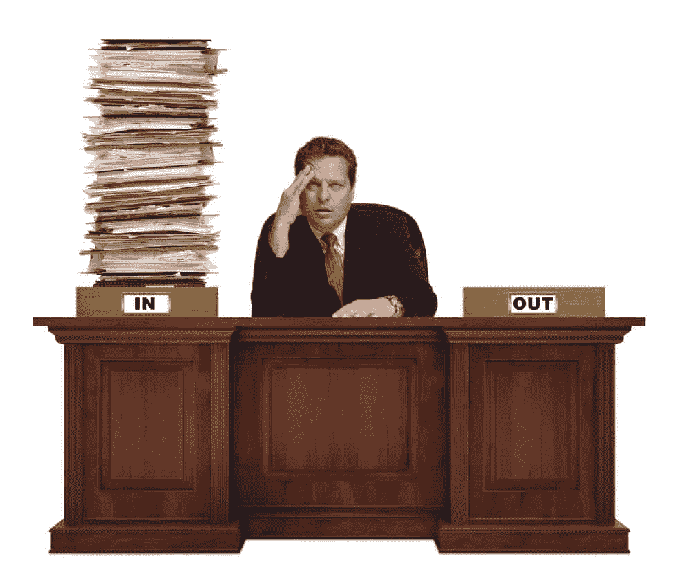

# 实现超强的首席执行官生产力

> 原文:[https://simple programmer . com/achieve-super charged-CEO-productivity/](https://simpleprogrammer.com/achieve-supercharged-ceo-productivity/)

有没有觉得一切都太多了？信息太多，要做的事太多，做的时间太少？

你的副业项目没有动，你还有一个其他事情的待办清单，只是一直在增长。事实上，你几乎不记得你早餐吃了什么，更不用说你盘子里的数百万日常任务了。

你是否想知道为什么一些首席执行官和公司负责人似乎无处不在，看起来超高效？

你猜怎么着？我告诉你一个小秘密。你也可以成为那样的人。

这需要一些时间和坚持，但我会给你一些工具和技巧，确保你掌握一切，我是说*一切*——这样你就永远不会让自己感到压力，也不会对再次失败感到内疚。

### 你的盘子太多了

You've probably heard of the system of *[Getting Things Done](http://www.amazon.com/exec/obidos/ASIN/0749922648/makithecompsi-20)*. Maybe you've dismissed it as an unworkable myth of ultra-productivity. Maybe someone mentioned it in passing and you forgot about it. Whatever the reason, I'm going to try and convince you that, even if this philosophy isn't for you, there are things you can take from it that will improve your life and productivity immeasurably.

### 开环

那么，什么能把事情做好呢(GTD)？它是由大卫·艾伦创造的，作为一种基本上封闭“开放循环”的哲学。如果你把人类的大脑和记忆想象成 RAM，我们就只有这么多。在你的“公羊”里有一些想法，只是等待着在以后的某一天浮出水面，而且通常不是在你选择的某一天。

如果你能把你的思想从所有其他事情中解放出来，专注于你正在关注的任务，并且更频繁地达到禅或“流动”的点，这不是很不可思议吗？

“开放循环”是占据你头脑的想法，你需要完成的任务，甚至是你知道你现在需要做的项目。它们应该在你信任的系统中被捕获，这样你的大脑就知道它们被处理了。例如，在黑板上有组织的便利贴或项目清单或日记中。本质上，GTD 哲学与其说是关于系统是什么，不如说是关于系统是否万无一失，是否能捕捉到你现在需要知道的一切。

这个概念很重要，对哲学来说也很重要，因为你的大脑必须相信你设置的系统，以确保你不会丢失任何东西。如果信任不存在，行动或项目仍然是一个“开放的循环”，不断地困扰你，因为它仍然没有行动或处理。

现在，如果你在你信任的系统中放置一个“开放循环”和一个相关的下一个动作，那么你将能够忘记它，直到下一次提醒你。例如，假设你需要归还一些图书馆的书。动作将是“去图书馆还书”，上下文为“差事”(我们稍后将重新讨论这个概念)。

## 开始行动——大清场

现在，这个过程的第一步是漫长的，它需要一定的纪律来完成，但是如果你真的致力于使这个工作，这是绝对必须的。

Central to the philosophy of GTD is an initial place to deposit the “stuff” that you need to get done. This is your Inbox.

进入你收件箱的东西本质上是任何需要处理或考虑的东西。如果你需要清理一个你一直在往里面倒东西的柜子，里面塞满了“东西”，门都快被挤破了，你可以在你的收件箱里放一张便条，上面写着:“整理爆裂的柜子。”也许如果它是一个有多个动作的足够大的任务，你可以把它做成一个项目，然后把更小的动作放在里面。不过现在，你可以做一个简单的动作来提醒自己需要做什么。

在大清理中，你需要花一天或者可能一整个周末的时间来整理你办公室和家里的所有东西，直到没有任何事情让你心烦意乱，你的“开放循环”变得清晰。

有些人，尤其是首席执行官们，有太多的东西要扔掉，他们会雇一个逃兵过周末！

虽然在你的收件箱里收集“东西”的过程可能需要 24-48 小时，但你最终会有一大堆“东西”等待处理。一旦你这样做了，那种感觉是绝对自由的。

这是 GTD 的精髓，但实际上你的系统可能是电子的，而不是物理的收件箱。我在 Mac 和 iPhone 上使用 Omnifocus 应用程序，所以我可以跟踪“东西”，快速记下事情，然后扔进收件箱供以后处理。

### 五分钟规则

有一条规则可以帮助你快速解决困扰你的事情，那就是在此时此地处理五分钟的任务。如果不到五分钟，就去做。

这个论点是，在现实中，我们可以在很短的时间内完成所有五分钟的任务。我们不会总是有五分钟的任务要完成，所以优先级不是那么重要。如果你碰巧有许多需要完成的五分钟任务，问问自己，为什么你有这么多？你一定要做吗？

如果花费的时间超过五分钟，那么您需要另一种机制和工作流程来处理它们。

### 四个 D

使用四个决定来处理收件箱的策略被称为四个 D:

*   做——算出一项行动需要多长时间。如果需要五分钟，那么现在就做。
*   决定——将你的行动分配给一个**项目**,给它一个**背景**,并记下你认为需要多少**精力**,以及你认为需要多少**时间**来完成它。这是最重要的一步，所以我们将在后面讨论。
*   转储——如果你不想用一个动作做任何事情，不想把它放在身边，或者不需要把它存档以供参考，就把它扔进垃圾箱。感谢它从你的生活中消失了，或者如果它是你觉得其他人可能想要使用的东西，也许可以回收它(当然，这将采取另一种行动)。
*   委派——如果你在一项行动中什么也做不了，而且不是你要做的行动——但它仍然需要完成——委派给其他人。这些事情需要被跟踪，所以我建议你有某种形式的“等待”列表，在那里你放置每一个你被授权的行动。此外，记录下你最初收到行动的日期也很方便，这样你就能知道它在你的盘子里放了多长时间，什么时候你需要去追逐它。

## 什么是项目？

答案乍一看似乎显而易见，但实际上并非如此。一个项目应该是任何需要多个行动来完成的事情，但是我们理想的项目也应该有一个最终目标。我的意思是，它应该是一个聪明的目标:具体的，可衡量的，可实现的，现实的，有时间限制的。

让我们看一个简单的例子来演示。你可以给自己设定一个目标“提高你博客的流量”不过，这还不够具体。

相反，一个更好的目标应该是说，“我想在 2015 年底之前把我的网站的流量增加到每天 200 次。”考虑到目前你每天浏览博客的次数是 50 次(离年底只有几个月了)，这看起来是一个现实的、具体的、有时间限制的目标，你绝对可以努力实现。

为了实现这个目标，你需要有下一个行动。那么，你会如何朝着这个目标前进呢？为了给你的网站带来流量，你需要写内容；因此，你的行动之一应该是定期写博客，因为你需要博客来提升 SEO 排名和吸引用户。

甚至在那之前，你需要有一个行动来头脑风暴以内容为中心的想法。在这种情况下，我有两个行动，一个计划每周写一篇博客文章，另一个计划每两周进行一次头脑风暴来构思新的博客文章。这将保持内容机器充满和你的博客充满新鲜，定期的内容。

### 环境——效率的关键

作为人类，我们最不擅长的事情之一就是高效利用自己的时间。我们多久会发现自己浏览了一篇随机的*每日邮报*文章(这是一篇无用的英国在线名人八卦新闻小报，我相信每个新闻网站最终都会指向它！)想知道我们到底是怎么到那里的(可能是通过一些随机的视频，一只穿着有趣的星球大战主题服装的猫或狗)。

互联网 1-[焦点](https://simpleprogrammer.com/2015/09/17/help-i-dont-know-what-to-focus-on/) 0

在 GTD，我们在创造的每一个行动中都使用“环境”这个概念。上下文的一个很好的例子是移动上下文。如果我们想要将所有需要呼叫某人的动作组合在一起，那么我们可以将所有这些动作的上下文设置为移动的。

下次我们有几分钟的时间，而我们身上只有一部手机，我们可以给一群人打电话，然后迅速地把这些行动从清单上划掉。

有了背景，选择下一步需要处理的任务也变得容易得多。我们主要使用上下文，然后我们看我们有多少时间，接着是我们感觉有多精力充沛。这样，我们就可以在决定下一步该做什么的时候关掉大脑。

许多聪明人不成功的最大原因之一是因为他们患有决策麻痹。他们可以选择做许多不同的事情，但他们不能选择做什么，并且经常过度分析为什么他们不能做某事，要么是因为害怕失败，要么是因为无尽的假设问题。让你的大脑在决策过程中别无选择，实际上会大大提高生产力。

## 清晰的头脑是有创造力的头脑

Having purged your mind of “open loops,” you will find that you can unlock greater creative potential in the brain. Your mind no longer has to be filled with remembering “stuff” and can shift to being creative and thinking about the big picture instead. Whether that be through new ideas or ideas around the projects you need to complete (or start).

出于这个原因，你给自己买一些笔记本或电子应用程序来头脑风暴和记下快速的想法是非常重要的。然而，我发现当你想记下尽可能多的想法时，没有真正的纸和笔的替代品。没有什么比一块空白的画布更能激发大脑的活力了。

偶尔你可能还想做些音频笔记。 [Evernote](https://evernote.com/) 是完美伴侣。它允许你以一种有组织的基于云的格式写下书面的、音频的和视觉的笔记，你可以在任何需要的地方通过移动设备、平板电脑或 PC 访问它。重要的是，你要有一个记录你一天中每一点想法的机制；否则，你就有滑回到你的大脑记得“东西”的状态的风险，你的内存不再是自由的。

### 永远与你的目标保持一致

十多年来，迈克·弗林特一直是沃伦·巴菲特的私人飞机驾驶员。一天，沃伦·巴菲特和弗林特先生讨论他们生活中的优先事项。巴菲特要求弗林特列出他的 25 个职业目标，然后圈出其中的五个目标作为首要目标。

他告诉弗林特先生把五个目标标在清单 A 上，其余的标在清单 B 上。最重要的是，他建议他不惜一切代价避免清单 B 上的一切。

这是一个强有力的建议，因为知道你在做什么和不在做什么同样重要。我们经常花太多时间在生活中不重要的事情上，这对那些重要的事情造成了损害。专注于重要的目标。

### 熵——一切都趋向混乱

在自然界，就像在生活中一样，一切都倾向于从有序走向无序。一张整洁的桌子，一个整洁的家，总会趋向于不整洁和混乱。保持房子整洁的唯一方法是定期打扫。你的项目和行动也是如此。

你必须定期对你的未完成的任务和未完成的循环进行检查，这样你就能确保你的项目有下一步行动，并且你当前的项目是你在给定时刻应该做的项目。定期清理你的任务并像这样做一个概述被称为每周回顾。

*每周评估*要求您:

*   算出你是否有任何你没有想过的“开环”；
*   检查您是否有继续项目所需的所有后续行动；
*   确保所有现有操作都是您应该执行的操作，或者其他操作可能更适合您；
*   通过用项目、背景、时间和精力标记所有现有的行动来清空你的收件箱。

### 从天上看

有一个基本的观点是很好的，也是很重要的，但是正如我们之前提到的，你需要把你最重要的目标统一起来，这样你才能指导你的实际行动。类似于将军，除非你从更高的层面知道你的目标是什么，否则你永远不可能确保他们都朝着同一个方向努力。

为了更好地利用你的时间，你可以试着选择几个彼此相似的目标，这意味着在一个目标上工作有助于同时在其他目标上工作。

比如，我最近发布了一篇文章，公开宣布了我自己的目标，其中包括提高社交媒体的关注度和博客访问量。通过追求这两个目标，我可以[最大化](https://simpleprogrammer.com/2012/10/28/my-15-minute-rule-to-productivity/)的利益，这些行动。<

当你审视自己的人生方向时，你需要有几个高层次的视角来理解你现在应该做什么。这些应归类为:

*   

    50,000 ft – Purpose: Who am I? Who do I want to be and what do I stand for? This will help focus you away from goals that don't align with your being and morals.
*   40，000 英尺——愿景:未来 5 年你想去哪里？
*   30，000 英尺——目标:我在未来 3-5 年内实现愿景的目标是什么？
*   20，000 英尺–关注领域:我的责任领域是什么？我在工作中应该做些什么？我在家里的角色是什么？
*   10，000 英尺项目:为了实现我的目标，我需要做什么项目？它们符合我的关注领域和我的人生目标吗？
*   0 英尺(跑道)-行动:我们现在需要采取什么行动？

采取行动:现在，停下来思考每一个角度。你有没有停下来，动笔，思考过这个问题？当你完成后，我希望你有更强的目标感，并且知道你现在需要做什么来实现这些梦想。

用华特·迪士尼的话说:“如果你能梦想，你就能建造它。”

### 有一天/也许

除了所有的日常行动，你还会有你现在不能或不想做的渴望和行动。也许它们是你在想将来可能想做的事情。它们可能是你想带孩子去的地方，或者是你想学习技能的地方，比如学习演奏一种乐器或者说一门外语。这就是为什么你需要一个有朝一日/也许清单。我列了清单，比如我想看的书或电影，我现在真的没有时间，但我知道我将来可能会有时间。只要确保它不会成为一个垃圾场，而是一个你真正感兴趣的地方。否则，把它们放进去，把它们勾掉，然后忘掉它们。

### 利用你的日历

大卫·艾伦提到了一个叫做备忘录的文件。这是一个非常古老的技术，但基本上是一堆容易访问的文件夹，上面有数字 1-31，代表一个月中的每一天。随着每一天的进展，你把离你最近的文件夹的内容移到最后面，然后清空里面的内容。每个文件都应该写满你当天需要完成的事情。

在现代，这种方法被日历所取代。我们的日历应该充满了绝对必须在那一天和/或那一时间完成的行动。

就我个人而言，我使用 Omnifocus 与 fantastic 2 的出色集成，这样当他们绝对需要做的时候，行动就会显示在我的日历中。

不要试图把每一个行动都放在日历上，试图迫使事情变得紧急，或者作为一个提醒系统，因为这不是日历的目的。

为了区分我现在应该做的事情和那些有特定日期或时间的事情，我在 Omnifocus 中将它们标记为重要。这样我就能很快看出哪些行动是优先的。

## 前进并繁衍

I really think that the techniques I've taught you in this article are very worthwhile to implement. They've certainly changed my life for the better and I hope they change yours too.

如果你有兴趣了解更多关于[把事情做好](http://gettingthingsdone.com/)的心态，看看[大卫·艾伦的书](http://www.amazon.com/exec/obidos/ASIN/0143126563/makithecompsi-20)和他的网站了解更多信息。

感谢您的阅读——现在向前迈进，传播 GTD 语，繁衍后代！