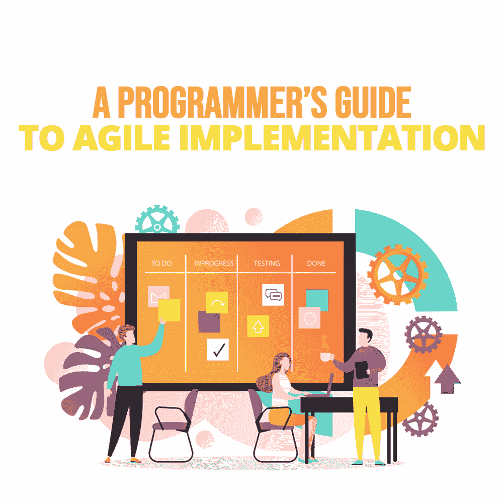

# 敏捷实现的程序员指南

> 原文：<https://simpleprogrammer.com/agile-implementation/>

<figure class="alignright is-resized">

</figure>

敏捷方法是当今最受欢迎的软件开发模型。它促进开发和[测试](https://reqtest.com/testing-blog/automation-testing-tools/)中的持续迭代。敏捷就是快速前进，经常发布，并朝着用户的真正需求努力。当涉及到需求不可预测的业务时，敏捷应该是首选方法。[敏捷开发](https://simpleprogrammer.com/agilesoftdev)的核心价值观是:

*   过程和工具之上的个人和交互
*   综合文档之上的工作软件
*   合同谈判中的客户协作
*   响应变化而不是遵循计划

敏捷计划的关键在于，随着产品的不断发展，它为产品的变更提供了灵活性。

在本文中，我将向您展示如何实施敏捷，以及选择敏捷时需要记住的要点。

## 如何实施敏捷？

在我们看到如何实现敏捷之前，让我们来看看最重要的敏捷开发原则。

一般来说，敏捷的目标是交付一个快速且有价值的软件，让客户满意。这种方法适用于不断变化的需求，即使这些需求在开发过程的后期突然出现。这样，它就能利用变化来获得竞争优势。

同时，敏捷有助于在短时间内交付高质量的软件，使团队更容易合作。敏捷在激励个人的同时开发产品，因为它提供合适的环境并激发信任。

开发团队内部需要一对一的交流和协作。评估开发中软件的进度需要高效和有效的沟通。

敏捷过程保持恒定的速度来促进可持续发展，关注技术优势和注重细节的良好设计。结果，敏捷变得至关重要，因为它最大化了团队完成的工作量。

最后，敏捷使用自我激励团队的最佳架构、需求和设计，并帮助变得更有生产力——这可以在整个软件开发生命周期中看到。

为了[实现敏捷](https://simpleprogrammer.com/agile-estimating)，第一步是定义一个清晰的业务愿景和实现敏捷的需求。它将帮助您理解完整项目管理的路线图。

定义清晰的愿景包括以下步骤:

*   确定项目的需求
*   为项目分配名称和类别
*   列出使用该产品的主要好处，并确定购买和使用该产品的令人信服的理由
*   识别有竞争力的替代产品
*   起草产品交付的最终声明

敏捷实现有助于交付更好的产品，这映射到更好的 ROI 的业务目标。

定义业务愿景是你获得项目支持的地方，所以应该有尽可能多的关键利益相关者出席，包括相关的高管、经理和董事，以及所有的产品所有者。

定义远景的过程应该有一个在项目开始前发生什么的策略。它还应该包括会议和更新，总的来说，任务本身应该是有效的。

## 敏捷框架成功实施的关键点

<figure class="alignright is-resized">

</figure>

你几乎可以将敏捷应用到任何项目中，但是这种方法的应用需要选择正确的产品来确保最大的收益。

在很难获得好的结果并且保持对项目的控制是一项单调乏味的工作的项目中，使用和应用以下敏捷方法总是明智的。

### 团队考虑

敏捷产生了优秀的软件交付，团队处理大量变更和多学科团队的实验项目。然而，团队在敏捷项目中的角色不同于其在传统团队中的角色。

尽管项目经理在传统的项目管理中扮演着至关重要的角色，但在敏捷中，他们是整个过程的推动者。他们致力于确保信息的无缝流动，并定义清晰的角色来正确地实现方法。

同时，团队应该保持一种多学科的方法，能够自我组织和管理，以面对在项目开发中实施敏捷的各种挑战。

敏捷需要[管理团队紧张](https://simpleprogrammer.com/effective-communication-agile-teams/)。这需要一个自我激励、注重结果、自我管理和熟练的团队，努力提高生产率，增加工作量。

### 要考虑的敏捷限制

应该考虑到使用敏捷的局限性。如果在考虑使用敏捷之前，你首先定义了项目的范围、期限、成本和质量因素，这将是一个很大的帮助。原因是整个软件有许多迭代，这些迭代需要放入一个时间盒中，以管理所做工作的工作量和时间限制。

敏捷中的操作限制对于在规定的时间内维持整个开发是必不可少的。敏捷方法的工作就像一场比赛，你需要在团队深入参与的情况下，以省时的方式快速开发。

### 项目管理考虑因素

为了分析项目管理中的生产力，使用诸如速度、流程和对法规遵从性的响应之类的度量来改进团队合作是很重要的。敏捷交付速度很快，但是有了它，确保它工作良好并满足客户需求是至关重要的。

因为关注的焦点是提高交付速度，管理估计，以及拥有一个自我管理的团队，所以合并质量验证、度量和交付变得很重要。

Scrum 方法开始了一系列的角色、会议和阶段，为了让这些方法按照预期工作，应该保留、体验和维护这些角色、会议和阶段。使用这种方法你会变得更舒服，因为这种方法是可伸缩的，这意味着你可以扩展项目的规模。

想象一下，你正在进行面试和评估，以了解什么可行，什么不可行。审查交付以使新方法适应您的需求和文化是非常重要的。

实施敏捷所需的努力程度是最重要的。它不再需要对整个项目进行评估，因为它可以在各种快速迭代中工作。重点总是放在手头的任务或者下一个冲刺。

敏捷在项目交付时间表方面提供了灵活性，将每个耗时的模块转化为更易管理的任务。

然而，有时组织发现很难适应不断变化的环境，因为敏捷方法也要求人们的观点发生变化。因此，最大化可见性对于确保敏捷方法的成功实施至关重要。

此外，记住你应该有一个测试管理工具来支持敏捷，这可以帮助你在你的组织中实现敏捷。拥有一个工具有助于分享信息、跟踪和衡量进展。高效和有效的工具对于保持对项目进度、成本和收入以及工作的控制非常重要。

正确的项目管理工具总是能帮助你使用正确的工具来提高性能和交付高价值的产品。

## 敏捷:高效和有效的软件开发

现在你已经对[敏捷项目管理](https://simpleprogrammer.com/agile-approach-in-it/)有了清晰的理解，以及使用它进行软件开发管理的强大方法。

敏捷方法的实施有助于高效和有效的软件开发。在适当的管理和 it 的帮助下，您可以让敏捷实现保持在正轨上。