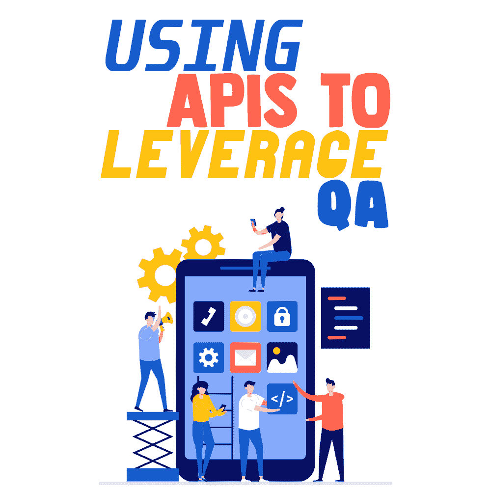

# 使用 API 来利用质量保证

> 原文：<https://simpleprogrammer.com/apis-quality-assurance/>

An [application programming interface](https://www.programmableweb.com/api-university/what-are-apis-and-how-do-they-work) (API) is a software intermediary that enables interactions between two different applications.

例如，每次你在手机上查看天气，你都在使用一个 API。这是因为谷歌本身并不获取天气数据，而是从第三方获取信息。

亚马逊、Salesforce 和易贝等科技巨头的巨大成功得益于其 API 的引入，使其平台对外部用户有效，并易于集成到各行各业公司的工作流程中。

此外，API 的普及导致了更加开放的计算趋势。这一趋势导致技术世界开始开放其软件，鼓励系统之间更多的协同作用。

随着移动应用程序的流行，API 的新用途和创新用途开始涌现，以至于现在似乎什么都有一个 API。所有这些发展意味着 API 正日益成为软件开发人员生活中不可或缺的一部分。

那么，这和[质保](https://simpleprogrammer.com/advanced-software-testing/) (QA)有什么关系呢？

QA 是确保您交付的软件具有最高质量的过程。通过有效地测试软件，您可以确保客户收到的是高质量的产品。

传统上，质量保证被认为是一个耗时的过程。软件测试以前被认为是占用宝贵资源的成本中心。这是由于开发人员和 QA 之间的脱节，QA 工具提供较慢的测试结果，许多开发人员将 QA 视为他们成功的瓶颈。

但现在，随着科技市场竞争日益激烈，质量的重要性变得更加普遍。因此，公司更加注重确保他们交付的[无缺陷](https://simpleprogrammer.com/reduce-software-bugs-quality-code/)产品能够打动客户，并确保他们不会转向竞争对手。

这里的挑战是使工程团队能够以一种快速且不减慢软件开发生命周期的方式进行软件测试。

这就是 API 发挥作用的地方。

## API 如何利用 QA 测试？

每个开发人员和程序员都知道，快速交付的压力越来越大。科技行业的竞争本质意味着每个团队总是在竞争对手之前竞相发布新功能，试图满足闪电般快速的 SDLCs 中包含的截止日期。现在，除了这种压力之外，还需要进行彻底的测试。

由于这些要求，专门为简化流程而设计的软件产品的使用显著增加。这些产品有助于扩展工程团队的能力，而不需要招聘预算或许多额外的人手。在这个产品领域中，专门设计来加速测试过程的平台的使用也在不断增加。

API 可以在这方面有所帮助，尤其是在质量保证方面。

通过使用来自软件测试平台的 API，工程团队可以将测试直接集成到他们的开发生命周期中。这种整合软化了 QA 的边缘，使其成为一个持续的过程。

例如，如果您正在使用一个不使用 API 的众测平台，您可能需要退出代码，登录到平台，上传您的测试脚本，并运行测试。这些过程给你的发布周期增加了不必要的阻碍，并且会变成一个令人讨厌的任务，一次又一次地重复。用 API 替换过程减少了开发和 QA 之间的摩擦，使体验成为一个流线型的过程。

## 更深入地了解优势

当你使用 API 作为质量保证过程的一部分时，你可以简化你的 SDLC。这几乎就像 API 是开发列车车轮上的润滑油，确保它平稳运行，不会减速。

但让我们更深入地探究这意味着什么。

### 减少摩擦，增加测试的便利性

我们知道，在许多工程团队中，QA 可以被视为成功的瓶颈。

特别是在 QA 没有通过持续测试完全集成到您的 SDLC 中的情况下， [QA](https://www.amazon/dp/1473973422/makithecompsi-20) 可能会成为开发过程中的最后一步。例如，在[瀑布方法](https://airbrake.io/blog/sdlc/waterfall-model)中，测试只是 5 个阶段中的第 4 个阶段，这意味着它发生在团队想要发布并完成工作的时候。这种方法的最后一分钟性质几乎没有留下时间来确保质量刚刚好。

这个问题意味着，对于许多开发人员来说，QA 被视为问题的创造者，而不是问题的解决者——团队努力工作以满足紧迫的期限，但最后却面临着一堵砖墙。

那么 API 如何缓解这个痛点呢？

假设您正在使用一个外部自动化测试工具。如果这个工具具有 API 功能，您可以将其直接集成到您现有的工具和流程中。因此，您可以在 SDLC 的任何阶段运行自动化测试，并且无缝地运行。

没有等待测试结果的时间，并且可以很容易地共享和访问错误报告。这个过程减少了 QA 和 SDLC 的其他部分之间的摩擦，因此测试可以成为开发过程中可实现的常规部分。

### 提高释放速度

With less friction between your QA and the rest of your engineering team, it’s no wonder that APIs can help engineering teams ship products faster than usual.

API 因其速度而被用于许多不同的场合——脸书 API、天气 API、Twitter APIs 等等。事实上，它们可以用于你能想到的几乎任何事情！这是因为在竞争日益激烈的技术世界中，如果一个 API 连接到另一个工具可以更快地完成某件事情，那么一个团队就会尽最大努力去实现它。

无缝的客户体验会带来满意的客户，因此任何提供这种体验的流程都是受欢迎的工具。

软件开发也是如此。

我们想快速执行任务，不想等待。API 提供了这种能力，因为它们快速而可靠。你永远不需要等待一个人来获取、记录和提供你测试结果。一个 API 可以代替你做这些，例如，直接导入错误报告到你现有的工具和系统中，像吉拉。

类似于减少摩擦的好处，在 QA 过程中使用 API 有助于实现那些让许多软件开发人员做噩梦的闪电般快速的 SDLCs。这一切都是为了帮助你达到这些目标，而不用担心放慢速度。

### 提高与外部提供商集成的便利性

使用外部工具来改进 QA 过程是软件开发中的一种常见方法。这是因为没有多少软件开发团队有无限的预算和招聘机会——尤其是在当前的环境下。

外部提供商可以提供错误跟踪器、自动化测试、众包测试(比如[全球应用测试](https://www.globalapptesting.com/))、功能测试等等。但是如果这些解决方案中的一些没有提供 API，可能它们实际上没有加快你的发布速度。

这是因为每个产品都有自己的平台，可以创建新账户，浏览和理解平台，以及在你的 Google Drive 深处查找登录信息。

然而，当外部提供者为您的团队创建 API 时，它可以降低瓶颈的风险。这意味着团队可以充分利用软件解决方案，并从他们支付的费用中获得最大收益。

毕竟，我们想让我们的钱花得更有价值，我们不想觉得这样做很难。

## 通过 API 利用您的 QA

质量是当今市场的关键。这是因为在一个过度饱和、高度竞争的技术领域，客户期待一款出色的产品。如果你不提供，他们很可能会删除你的应用，支持你的竞争对手。

但这并不意味着 QA 需要让你慢下来。测试不一定是一台给软件开发人员制造问题的又大又笨重的机器。

API 利用外部 QA 工具，无缝地集成到您的 SDLC 中，这样您的测试结果、测试脚本等等就可以被轻松地访问，没有摩擦。

API 可以帮助您:

*   减少摩擦，增加测试的便利性。
*   增加释放速度。
*   提高与外部提供商集成的便利性。

总的来说，效果是减少了质量保证是一个瓶颈的观点。相反，通过使用 API 的软件测试变成了一个无缝的、流线型的过程。