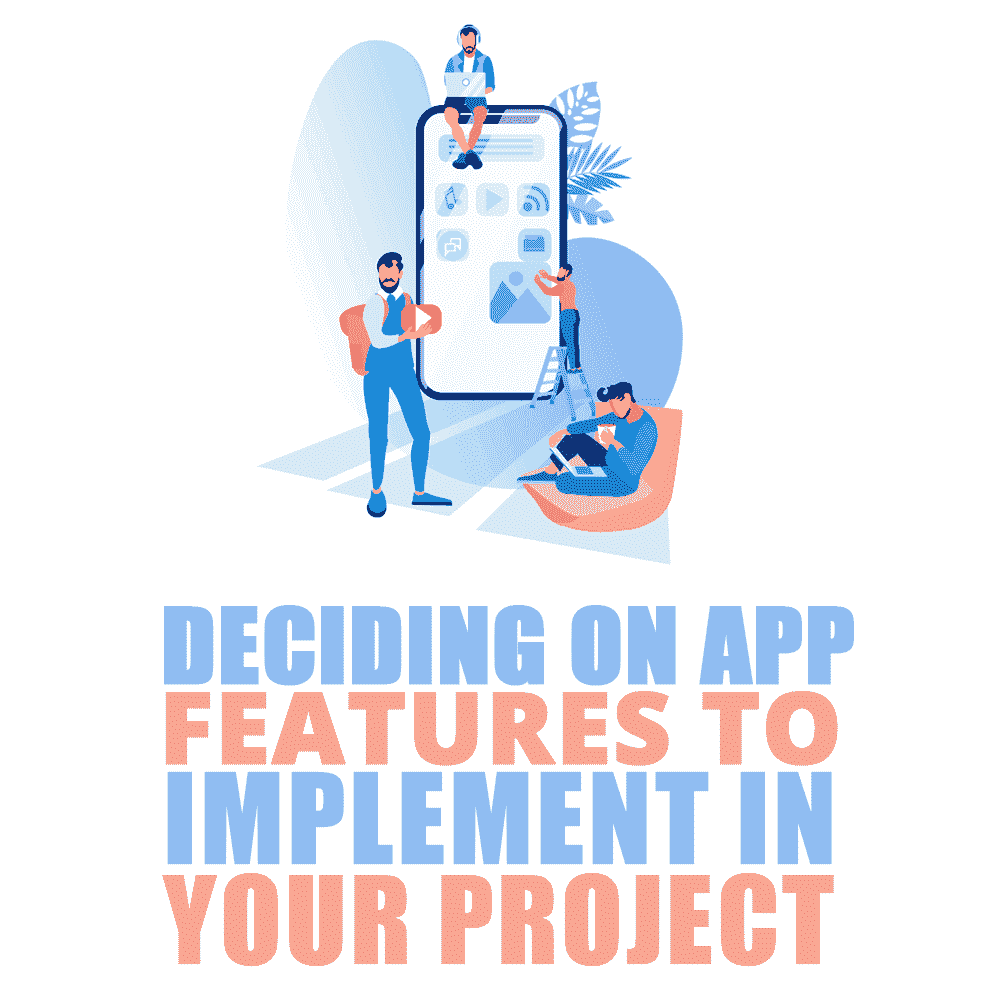

# 决定要在项目中实施的应用程序功能

> 原文：<https://simpleprogrammer.com/app-features-for-your-project/>

<figure class="alignright is-resized">

</figure>

在我之前的文章[“应用开发者的未来是什么样子的”](https://simpleprogrammer.com/app-developer-future-2019/)中，我谈到了 2019 年采用的技术趋势。

虽然所有这些趋势都非常令人兴奋(我敢打赌，你已经迫不及待地开始在自己的应用程序中使用一个或多个了)，但如果你不知道从哪里开始，该怎么办呢？或者您目前没有实现这些功能的技能？

在这篇文章中，我介绍了应用程序开发人员可以选择哪些趋势特性用于他们的项目，以及实现这些特性的选项。这些选项适用于初学者以及希望尝试新功能和扩展技能的专业人士。

## 您可用的实施选项

在实现[趋势应用功能](https://simpleprogrammer.com/billion-dollar-app)时，有几个选项可供选择。有的侧重范围；其他人根据客户的需求。要记住的重要一点是，你的选择应该考虑并服务于你的个人情况。

### 选择一个特征并坚持下去

当您考虑到成功和自信地寻找一个特性作为对您的客户群的永久提供所需的学习曲线和资源(时间、金钱、人员)时，您可能倾向于只实现一个特性。

**Pro**

通过只关注一个要实现的特性，你给自己一个机会成为这个特性的主人并建立这个技能。你的客户也会非常清楚你提供的服务。这将使你在一个你能够主宰的小领域建立起强大的声誉。

**Con**

如果你是一名自由职业者，很有可能你能够为你的客户提供他们需要的东西，但当他们的需求扩大时，你却不能马上帮助他们。因此，这种方法可能会导致要么失去一个客户，要么不得不快速培养新技能以保住他们的业务。

**适宜性**

我向初学者推荐这个策略，因为这意味着你不会为了服务你的客户而分散你的精力去学习很多东西。你可以专注于在所有领域缓慢而稳定地发展你的业务，而不仅仅是技术方面。

### 挑选一些特性，花时间学习它们

这类似于第一个选项，但是在工具箱中提供了更多的工具。也许你已经发现了一些互补的特性，所以能够把它们都提供给你的客户看起来是一个不错的明智的捆绑交易。

**Pro**

这种策略将使你获得更广泛的客户，并长期保持他们，因为你可以为他们提供不止一种服务。

**Con**

你提供的服务可能会令人困惑，因为提供不同的功能可能会分散你的注意力。您可以尝试通过提供补充功能来限制这一点，但请记住，您添加的每一个额外功能都会增加您提高技能的时间。

**适宜性**

这种策略适合那些在他们的发展旅程中走得更远的人。掌握了(或至少习惯于)实现一个特性后，您可以开始考虑扩展您的产品。但是注意不要承担超出你能力范围的事情。

### 寻找适合您当前客户的功能

<figure class="alignright is-resized">

</figure>

你的客户可能不需要你做所有的事情。通过调查或直接问他们，了解哪些功能对他们最重要。然后，你就有了你的[黄金清单](https://simpleprogrammer.com/considerations-ios-app-development/),确切地列出了你的客户想要的和愿意支付的东西。

**Pro**

当你宣布你的产品或服务的新特性时，给你的顾客他们想要的是减少听到蟋蟀叫声的一个确定的方法。

**Con**

迎合你的顾客意味着你没有考虑到你认为生意应该往哪里发展。不要误解我的意思，如果他们想要的和业务需要的是一致的，那么尽一切办法去做吧。但是要注意，顾客所说的他们想要的东西并不总是他们所需要的。

这方面的一些很好的例子是当福特制造他们的第一辆汽车时和当 iPhone 被引入市场时。市场不想要也没有要求这些产品，但它们被创造出来并获得了巨大的成功。

**适宜性**

我推荐这个策略给那些有明确产品或服务的人，他们正考虑以新的方式扩展。这种选择适合那些有经验和/或业务成熟的人。

### 测试每一个特性，决定你喜欢哪一个

您可能会发现，归根结底，您不喜欢实现某些功能。所以如果你对他们都是新手，那就给他们一个尝试，看看你喜欢哪一个；哪个给你最大的投资回报率；或者说哪个最简单，最有趣，最过瘾。

**Pro**

有了每个特性实现的小原型，您就可以判断输出并看到一些实际的东西。它会给你一个更清晰的方法来决定使用哪个特性。

这还意味着您了解实现每个功能的过程以及最好地判断其潜在 ROI 所需的资源。这在团队中尤其有用，因为你的反馈将基于相同的起点。

**Con**

如果你是一个资源有限的小团队，你可能要考虑对每个特性的原型阶段进行限制。你可能无法实现所有的目标，并为你的努力获得积极的、有价值的投资回报。

**适宜性**

这个选项对新手(但可能只有那些有团队的，不受时间或其他资源限制的)和更成熟的公司都有用。游戏公司举办名为 Game Jams 的活动，以提出新的创造性想法，激发新产品或服务的创造。这个选项可以以同样的方式使用。

### 外包该功能

因此，您已经确定了一个新功能，它将是您已经提供的服务的一个很好的补充。如果您面临以下任何想法，将此功能外包可能是一个不错的选择:

*   没有时间学习
*   不想学
*   宁愿花时间做其他业务任务

**Pro**

外包不仅会让你有时间专注于其他事情，还会让你开始建立一个团队，慢慢摆脱日常业务活动。

如果你开始创业是为了摆脱我们大多数人都有的朝九晚五的职业生涯，这是必不可少的一步。

尽早外包将有助于你建立招聘技巧，并与有望帮助你发展业务的正规可靠的承包商建立关系。

只需选择一个特性，并深入像 Fiverr 这样的网站，看看谁可以提供帮助。

**Con**

外包需要前期资金来完成工作。而且(在某些情况下)你负担的越多，产品或服务的质量就越高。

如果他们需要大量的项目管理，或者质量很差，必须重做几次或者根本不起作用，那么把你有限的时间和金钱花在帮助你开发的人身上是没有意义的！

**适宜性**

这个选择我只会推荐给那些有自由资本的人，那些有能力承担风险的人。不过，推荐是降低这种风险的好方法。所以，如果你要开始和一个没有被推荐给你的人一起工作，我会阅读他们网站或个人资料页面上的评论，以确认你可能存在的任何担忧。

## 还是不确定选哪个？

如果该说的都说了，该做的都做了，你还是觉得不确定，那么我会说你的决定(至少在短期内)很容易。不要添加任何新功能！保持在你现在的车道上。

<figure class="alignright is-resized">

</figure>

让另一家公司抓住这个机会，而你继续努力工作，提高自己的定位，成为 x 功能领域的佼佼者。成为(或保持)小池塘里的大鱼。

因擅长做一件或几件事而出名，而不是因什么都懂而出名，这很好。您可以继续提高自己的技能，为当前需要这些应用程序功能的客户服务，并在该领域积累您的专业知识。

成为 X 功能的首选代理，继续定位你的客户，使你的产品有稳定的客户基础。如果它没坏，就不要修理它！

我建议，如果你想开始吸引新客户，或者如果老客户要求新功能，只尝试添加一些新的东西。如果有需求，改变是合理的。