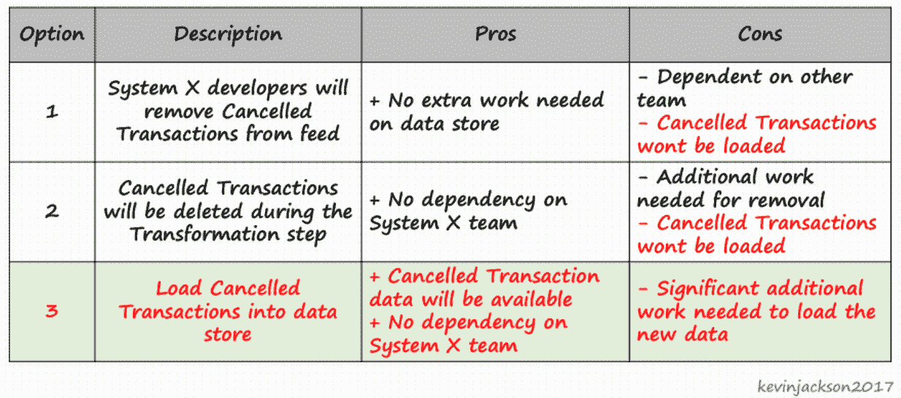
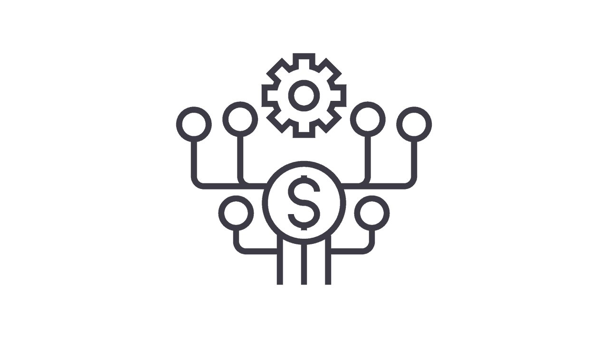

# 最合适的解决方案选择模式

> 原文:[https://simple programmer . com/appropriate-solution-selection-pattern/](https://simpleprogrammer.com/appropriate-solution-selection-pattern/)

## 什么是软技能模式？

软件开发人员需要强大的软技能来有效地解决我们面临的许多问题。

著名管理教育家彼得·德鲁克告诉我们*“做正确的事比把事情做对更重要。”直觉上，这句格言是有道理的。对于程序员来说，打造一个没人要的伟大产品还有价值吗？*

软技能，包括沟通、团队合作和解决问题，定义了我们“做正确的事情”的能力。我们的硬(技术)技能只能帮助我们“把事情做对”因此，可以说，我们的软技能对我们的效率——我们创造价值的能力——比硬技能更重要。

自从 1995 年“四人帮”给了我们“[设计模式:可重用的面向对象软件的元素](https://www.amazon.co.uk/dp/0201633612/ref=as_at?slotNum=4&ie=UTF8&linkCode=g14&linkId=T5LO7MSEHZOVINEZ&imprToken=rTS.eGBFaklAA1Lm33Pmqg&creativeASIN=0201633612%3FslotNum%3D4%26ie%3DUTF8&tag=simplprogr0e-21&creative=390957&camp=1789)”以来，软件开发人员已经理解了众所周知的模式的好处。我们知道，虽然我们面临的没有两个问题是完全相同的，但重复出现的主题往往是可以识别的。

一旦我们确定了这样的主题，我们就可以将证明有效的解决方案转化为定义好的可重用模式。这些模式不仅帮助我们有效地解决常见的硬技能问题，还减少了我们做出决策的时间，并增加了对解决方案的共同理解。

所以，如果我们能从解决硬技能问题的模式中受益，我们能同样解决软技能问题吗？

让我们来看看[可重用模式](http://www.softskillpatterns.co.uk/)中的一种，我们可以用它来帮助我们找到“做正确的事情”问题的正确解决方案。我们将浏览“最合适的解决方案选择”模式，并讨论如何有效地使用它来帮助我们建立和使用软技能，同时做出好的决策。

## 为什么是这种特殊的模式？

T2】

如果您想要交付被更多人理解和支持的更好的解决方案，并且花费更少的努力来获得更好的解决方案，您应该使用“最合适的解决方案选择”模式。

作为软件开发人员，我们所做的许多工作和所做的决定都可以用几种不同的方式来执行。当然，几乎总会有人准备说:*“你应该这样做，”*而且可能还有人问你*“你为什么不那样做？”*听起来熟悉吗？

这种模式将帮助您为一个复杂的问题选择最合适的解决方案，该问题有多个不同适用性的可能解决方案。

虽然(据我所知)没有办法确保你总是选择完美的方法，但是如果你遵循这个模式，它将帮助你做出更好的决定。

## 什么是“最合适的选择方案”模式？

“最合适的解决方案选择”模式是一种概述所有可能的解决方案及其优缺点的方式，然后使用收集到的信息在所有利益相关者的支持下做出共同的决策。

从本质上讲，这不仅仅是一种选择行动计划的方式，也是一种建立共识的方式，以便更多的人理解和支持解决方案。

## 如何使用该模式

让我们一步步来看看如何使用这个模式。您将在上面的模式定义图中找到这些步骤。我还将强调每个步骤中使用的主要软技能。

### 步骤 1:定义一个问题或任务

这是模式的入口点。你已经确定了一个你需要解决的问题，并且你认为有许多可能的有效解决方案。

### 步骤 2:确定潜在的解决方案

在这一步中，你将使用你的 ***分析思维*** 技能来识别并列出问题的可能解决方案。您还没有尝试比较或选择解决方案，应该避免这样做。

这一步的输出是一个潜在解决方案的列表，每个解决方案都有一个标识符(“解决方案 1”，等等)。).您还需要为每个解决方案提供足够的细节，以便以后进行比较。

在确定解决方案时，考虑包括“什么都不做”选项。在许多情况下，当前状态可能被认为比所有“做点什么”的解决方案更好。通过包含它，您可以确保讨论是否有任何替代方案比当前状态更合适。在我包含“什么都不做”的地方，我通常将它命名为“选项零”，以明确区分它。

### 第三步:比较列出的每个解决方案的优缺点。

确定潜在的解决方案后，下一步是比较它们的相对优点。这一步不应该导致解决方案的选择，甚至是偏好的识别。选择应该只发生在过程的后面，当决定的全部背景被建立的时候。

在这一阶段，你将运用 ***批判性思维*** 技能列出每个解决方案的利弊。这些应该记录在选项表中。该表为每个潜在解决方案显示一行。有四列:标识符(名称)、描述(简短的描述，强调解决方案之间的差异)、优点和缺点。

你在桌子上列出了*相对*的优点。因此，包括所有备选方案共有的优点并没有增加任何价值。例如，如果所有解决方案都需要购买相同的第三方产品，那么将这一事实作为一个缺点添加到每个解决方案中是没有用的。

在某些情况下，强调这种差异是有用的。例如，“解决方案 A 比解决方案 b 要多花大约五倍的精力。”当使用表示质量度量的语言时，请确保陈述是客观的。可量化的测量通常是有用的，但是避免主观陈述，因为它们可能有不太清楚的含义。认为“贵多了”比“贵多了”更客观。

一个选择的支持者成为另一个选择的反对者是非常正常的。例如，如果方案 1 是方案 2 的“一半成本”，那么方案 2 是方案 1 的“两倍成本”。把双方都列出来，比较更清晰。如果有三个或更多可能的解决方案，请务必说明您比较的是哪一个解决方案。以下情况将是清楚的:

*   A 的亲:A 是最便宜的
*   B 的一个亲:B 比 C 便宜
*   B 的缺点是:B 比 A 贵
*   C: C 的 con 是最贵的

你用 ***诚实*** 和 ***正直*** 记录功德很关键。如果你有意识地夸大一个解决方案的优点，你应该问问自己为什么。如果你真的想找到最合适的解决方案，就不要左右摇摆。

### 步骤 4:通过与决策者和主题专家的讨论做出选择

现在您已经有了一个潜在解决方案及其相对优点的列表，是时候选择最合适的一个了。只有在您完成了所述的识别和比较阶段后，此模式才会有效。

这一步是过程中最**c*和****的阶段。安排一次与关键利益相关者、决策者和主题专家的会议，讨论您创建的选项表。提前将表格发给他们，以便他们查看。阻止任何通过电子邮件或其他对话在会议前选择选项的企图。*

*通过再次确认你试图解决的问题来开始会议。在寻找解决方案之前，就问题达成共识。现在使用你的 ***表达技巧*** 来简要描述这些选项及其优点。通常，在这一点上，与会者将提出问题，发表意见，最有价值的是，向小组提供背景信息。这种背景是允许小组选择最合适的选择的最终因素。使用你的 ***引导技能*** 来捕捉这种情境。例如，其中一名与会者可能会说:“*我们必须在下周之前找到解决方案，否则……*”在这种情况下，获得的 ***上下文意识*** 是交付时间可能对遵循长期战略更重要。*

*在不同的会议中，你可能会听到:“*…我们需要这个版本真正稳定，因为用户对所有的问题都感到沮丧。*“同样，这句话给出了一个清晰的上下文，这将推动决策。向小组成员重新陈述并记录这一背景，最好写在白板上，让与会者都能看到，给他们一个质疑和理解的机会。*

*一旦捕获了上下文，最合适的解决方案通常是显而易见的。如果没有，请再次浏览选项，并将它们与您收集的上下文相关联。*

*你可以这样说:“*看来选项 A 不合适，因为它需要很长时间才能交货。*“有时，你会通过排除备选方案找到最合适的解决方案。*

*设法 ***影响*** 会议圆满结束。如果你不能达成完全一致，考虑接受多数投票或请关键利益相关者决定。没有比现在更好的时机来做决定了。*

**

### *成果 1:选择最合适的解决方案*

*通过遵循该模式，您将选择一个被认为是当前环境下最合适的解决方案。保留最终的选项表，以备将来再次参考。*

### *成果 2:达成共识*

*做出这个决定需要团队的努力。模式所描述的过程很自然地将问题的知识和理解以及解决方案传播给了很多人。*

*你可能会在很多方面从这个过程中受益。例如，不参与决策过程的人对决策提出质疑是很常见的。与其他方法相比，这种模式让更多的人参与决策，因此减少了挑战的可能性。*

*此外，决策团队可能包括许多将参与交付和使用解决方案的人员。这些人将受益于通过早期参与获得的对解决方案的深刻理解，以及对他们能够影响决策过程的满意。*

## *行动中的模式*

*Ash 是一名软件开发人员，他所在的团队负责构建一个数据存储库，该数据存储库从组织的许多领域收集数据。他们*从许多源系统、数据库和文件中提取*数据，*将其转换*以符合他们的数据模型，然后*将数据加载*到该模型中(一个经典的 ETL 过程)。*

*Ash 被分配的任务是建立一个新的从系统 X 到数据存储的事务数据的常规数据馈送。快速分析之后，她注意到来自系统 X 的一些数据看起来与其他数据不同，不适合现有的数据模型。异常数据她该怎么办？*

*让我们看看她可以采取的三种替代方法。*

***方法一:Ash 删除意外数据。**在没有与任何人讨论这个问题的情况下，Ash 认为这些意外的数据看起来不是很有用，并且肯定不适合现有的数据模型。她的任务估计只需要两天，她不可能在这段时间内加载额外的数据。然而，她有理由相信，她可以添加一些额外的代码来删除意外的数据，并完成所需的其余工作，大约在两天的估计时间内。*

***方法 2: Ash 与 X 系统专家交谈。** Ash 决定与系统 x 的开发人员交谈。他们告诉她，异常数据代表已取消的交易，因此可能不需要，因为她正在加载(未取消的)交易。他们还告诉她，从提要中删除取消数据很容易，而不是她添加代码来删除它。Ash 很高兴接受他们的帮助，因为这意味着她不再需要做额外的工作。她可以在计划的两天内完成任务。*

***方法 3: Ash 遵循最合适的解决方案选择模式。** Ash 意识到任务与计划略有不同。她认为自己没有足够的信息来做出决定，所以她决定遵循这种模式。与方法 2 一样，Ash 与 System X 开发人员交谈，这有助于她更好地理解问题及其可能的解决方案。然而，Ash 并没有自己做决定，而是列出了一个选项表。然后，她安排了一个简短的会议，与一些通常的决策者讨论这个问题。Ash 希望从他们的知识中获益，并确保他们有机会影响决策。*

**

*在会议期间，团队的产品负责人 Basil 说，“*我认为有一个选项 3:将取消的交易加载到数据存储中。*“Basil 建议说，取消数据非常有用，他们当然希望在商店中获取这些数据。Ash 在表格中添加了选项 3，他们记录了它的利弊。*

**

*会议一致同意 Ash 应遵循选项 3，因为数据非常有用。完成这项任务所需的时间比最初的估计要长，但结果却更令人满意。每个人都微笑着离开会场。*

*Ash 在团队的工作日志系统中记录决策和选项表。完成任务后，Ash 收到了 Basil 发来的一封感谢信，Basil 对她带领团队取得如此巨大的成果印象深刻。在他的笔记中，他评论道“*这让我想起了那本 [7 个习惯的书](https://www.stephencovey.com/7habits/7habits-habit6.php)，当它谈到协同作用时:两个人的头脑胜过一个*Ash 又笑了——她喜欢传递巨大的价值。*

## *反模式:要避免的陷阱*

*在这个例子中，这个模式对 Ash 很有效，但是在将这个模式结合到您的决策中时，有一些重要的事情需要注意*

*“最合适”的解决方案并不总是“最好的”你会注意到这种模式并不被称为最佳解决方案选择模式。当我们试图做出正确的决定时,“最好”这个词可能会碍事。*

*考虑一下这个问题:以下哪种在线服务订阅是最好的:免费、标准还是高级？完全是主观的。许多人会回答高级，因为它提供了最多的功能。其他人会说免费，因为我们不需要付费。*

*如果改为“*哪个最合适？*“这是一个问题，大多数人(希望是所有人)会回答“*嗯，这取决于…* ”选择任何解决方案都是一样的。最合适的解决方案取决于上下文。有时这将是最昂贵和功能最丰富的解决方案。其他时候，它将是最便宜和功能最差的解决方案。*

*协作对于有效使用这种模式至关重要，这样就可以从团队中收集上下文，并与团队共享。由于协作有限，可能无法建立真实的环境，因此只能选择次优的解决方案。*

***避免过早偏好。为了让这种模式帮助你，你需要诚实地面对每种解决方案的优缺点。很容易过早地偏好一种解决方案，并过分强调其优点或替代方案的缺点。***

*不要让自己过早下结论，因为这可能导致两种情况中的一种。首先，你的偏见可能会被其他决策者发现，这将影响他们对整个过程的看法，可能还会影响你。或者，你的偏见可能没有被注意到，这可能会导致小组的次优解决方案。*

*保持开放的心态，诚实正直地评估每个解决方案。您希望将解决方案的选择推迟到对优点进行评估之后。*

*注意个性化偏见。在确定潜在解决方案时，通常会有多人提出替代方案。这很好，但不要称之为“查理的想法”或“迪内什的解决方案”坚持“方案 1”和“方案 2”(等等。).*

*一旦一个解决方案与一个人有内在联系，你就冒着个人、政治或保护主义偏见影响评估的风险。例如，如果 Dinesh 是一位资深人士，与会者可能会偏向(甚至下意识地)试图讨好“Dinesh 的解决方案”。*

*同样，查理很可能非常偏向于“查理的想法”，因为人类对正确的渴望是强烈的。这些偏差很容易导致次优的解决方案，因此避免它们是很重要的。*

*记录所有提出的解决方案。在我主持的一次选拔会议上，一名与会者提出了一个“新”解决方案。我告诉她，“*我们确实考虑过这种方法，但我们认为它不可行，所以我们没有把它包括在内*她理所当然地问道，“*为什么不可行？*“我当时记不起来了，结合更多的语境来看，她的建议显得很恰当。我本可以通过在最初的列表中包含替代选项来避免这种不舒服的情况。这种情况教会了我记录和展示所有被提议的选项的价值，即使它们被认为是不可行的。*

*保留最终的决定。这种模式的一个好处是流程自然地记录了重要的决策和推理。决定被质疑或事后被重新考虑是很常见的。如果保留选项表，它可以用来帮助这些查询。如果输出没有被保留，那么它就不能增加更多的价值。*

*大多数开发团队都会有一个知识库，或者一个工作日志系统。这些是保存选项表和决策记录的最佳位置。*

## *让决策更简单*

**

*这一切都归结于找到一种方法使我们的决定更简单。让决策变得更简单会让我们在工作和生活中更有效率，并帮助我们不断“做正确的事情”*

*我们可以使用模式来解决与软技能(沟通、团队合作、解决问题)相关的问题，就像我们使用模式来解决硬技能问题一样。*

*考虑软技能模式的潜在价值，并尝试最合适的解决方案选择模式。我希望如果你发现它对你有用，你也会考虑尝试其他模式。*