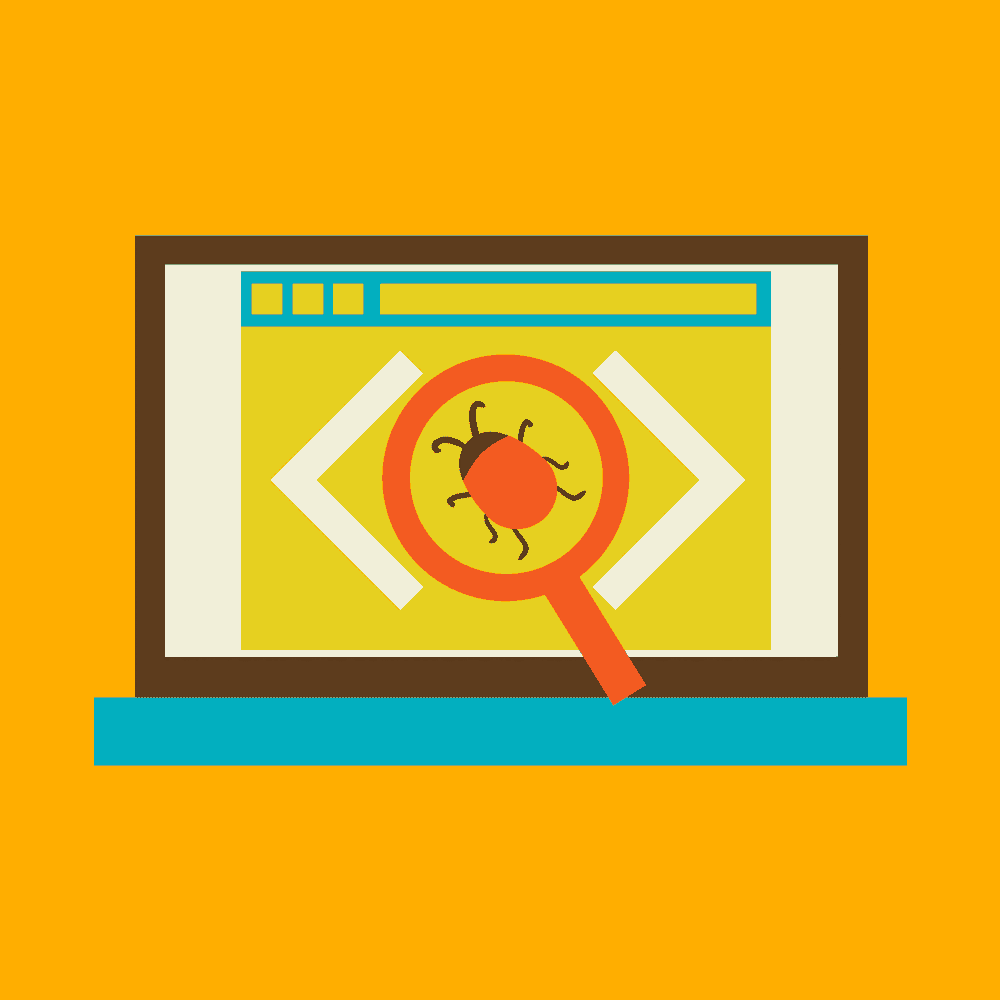

# 从软件工程师到人工智能:改变你的编程生涯

> 原文：<https://simpleprogrammer.com/artificial-intelligence-software-engineer/>

It’s 2020, and fears about how the emergence of AI will affect job security are disrupting the minds of many.

现在，机器可以学习新事物，并执行以前只有人脑才能完成的认知任务。人工智能已经[改变了世界](https://www.amazon.com/exec/obidos/ASIN/3982103827/makithecompsi-20)并在整个文明中传播。

但我们才刚刚开始。人工智能技术每天都在变得更加复杂。从自动驾驶汽车到预测飓风，各大行业对人工智能的采用正在加速。

人工智能领域的职业在未来会很重要。他们已经是了。

拥有人工智能技能的技术人员将承担其他专业人员无法完成的任务。这无疑会对制造业和汽车业等行业中拥有常规技能的个人造成威胁。

人工智能将创造大量的[编程工作机会](https://jooble.org/)，主要是在数据科学行业的技术工程前沿。

根据世界经济论坛，**的数据，到 2022 年将会有大约 1 . 3 亿新的人工智能工作。**

你的技术技能将主导未来的工作，但仍有一个空缺。仔细看，供需之间还是不平衡的。

随着劳动力市场的快速发展，识别更新的人工智能工作并获得技能将有助于有抱负的技术人员跟上步伐。

## 为什么科技工作者转向人工智能？

“人工智能正在偷走我们的工作。”

令人毛骨悚然的一句话。

人工智能和机器人不是来抢你饭碗的。尽管世界被它所震撼，但人工智能的快速进步正在帮助当前的劳动力。随着工作变得越来越复杂，今天的工作将需要新的工具和技术。人工智能和自动化的兴起将会改善我们的日常生活。

话虽如此，科技工作者和软件工程师开始担心人工智能在未来可能引发的问题。

到 2020 年底，人工智能将接管近 180 万份工作。

到 2037 年，这些工作可能会变得多余，并被自动化取代:

*   视频技术取代体育裁判
*   被电子阅读设备取代的送报男孩
*   移动应用取代出租车调度员
*   自助结账机取代了收银员
*   自动化机器人取代了电话推销员
*   人工智能聊天机器人取代了旅行社
*   被人工智能软件取代的记者
*   自动化机器人取代了装配线工人

你的职业属于这些类别吗？

我希望不会。

大多数工作都会受到人工智能的影响，但只是在机器和人类之间形成伙伴关系。对于像人工智能工程师这样的专业人士来说，这意味着巨大的就业机会。

## 从软件工程转到 AI 是什么样子的？

对许多人来说，这种转变已经开始了。

软件工程师已经被要求[用最新的工具、框架和技术保持最新](https://www.amazon.com/Advances-Artificial-Intelligence-Data-Engineering/dp/9811535132/)。毫无疑问，他们有热情不断学习新的工作技能，这让他们更容易实现职业转变。

以下是您首先需要做的事情:

*   获取当前技术趋势的广泛知识。
*   对理论有了深入的了解。
*   掌握以非确定性方式构建问题的艺术。

下面的技能将会给希望进入人工智能职业的开发者和程序员带来巨大的好处。

## 机器学习

机器学习让电脑更聪明。有没有想过是什么机制促使你在网飞看下一部电影？或者是在 Spotify 为你的播放列表推荐歌曲的背后？嗯，那就是机器学习！

在所有这些过程中，这些平台通过你正在观看的电影或你喜欢听的音乐类型收集尽可能多的数据。这些步骤只是外面的基础。

你知道训练神经网络时会发生什么吗？有哪些主要的组成部分可以让事情顺利进行，而让其他事情不顺利？

获得坚实理解的理想方式是在深入研究理论之前，先学习机器学习。你应该知道:

*   功能丧失是如何发生的。
*   如何建立功能模型，并能够有效地交流发现。
*   反向传播的好处。

## 软件工程

软件工程师考虑用户开发和设计新应用程序的需求。它是借助编程语言，通过设计、构建和测试应用程序进行分析的过程。

学习机器学习中的新技能将增强软件工程技能，例如:

*   创建可重复使用的代码，以加快您正在进行的实验的速度。
*   测试管道的各种功能，如数据预处理、输入或输出净化和增强，以及模型干扰时间线。
*   为不同培训级别的模型提供备份(检查点)。
*   建立一个分布式基础设施来跟踪超参数搜索，运行训练，并以更系统的方式找出推论。

## 统计数字

统计学是所有进入人工智能领域的技术专业人员都需要的基本技能。没有统计数据，进入人工智能领域会很有挑战性。

你应该有:

*   对过度配合和欠配合有深刻的理解。当统计模型可以捕捉数据的噪声时，就会发生过度拟合。同样，欠拟合是指机器学习模型或统计模型无法检测或捕捉数据。了解过度拟合和欠拟合将有助于您分析即将到来的预测。
*   为从模型中获得的结果提供正确归因的能力和置信度。
*   了解确定和衡量模型成功的各种方法。如 ROC 曲线下面积、召回率、精确度等。还要看看基于模型输出的评估度量偏差。

## 数据管理

你 90%的时间都花在数据管理上，问问任何一个数据科学家就知道了。这项技能对于一个希望成为人工智能工程师的软件工程师来说同样重要。为了提高模型的继承率，您需要知道您的模型是否与数据的质量或数量相关。

数据任务分为以下几类:

*   数据预处理(数据扩充、缺失数据截断和交叉验证分割)和数据后处理(清除伪影和处理特殊异常值)。
*   寻找可靠且能准确衡量数据质量的数据源。

## 调试和调整模型

In traditional software development, a bug generally leads to the program crashing. This may be annoying for the user, but is important for the developer.

当程序失败时，开发人员可以很容易地检查错误并进行调试，解决问题，甚至找出原因。

然而，当机器学习模型遇到同类情况时，它会发出骚动，往往是因为没有明确的原因导致程序崩溃。

虽然可以手动进行预测，但最常见的是，机器学习模型往往会因输出预测不佳而失败。当这样的程序失败时，[人工智能工程师](https://www.artiba.org/certification/artificial-intelligence-certification)需要检查错误，理解偏差，并调试程序。

因此，找到合适的参数和合适的架构来测试各种配置非常重要。

您可以从创建一个简单的模型开始。线性回归和最近邻法等统计模型通常会使您实现模型的时间加快 80%。

稍后，如果您决定对更复杂的模型进行训练，您将需要从训练模型以适应数据集的一小部分开始。

## 学习人工智能来改变你的软件工程职业

2020 年的人工智能轨迹对寻求职业转变的软件工程师来说有很多潜在的好处。

“尽管软件工程还不是一门真正的工程学科，但它有成为一门真正的工程学科的潜力，”美国软件工程师、卡耐基-梅隆大学软件工程研究所首席科学家玛丽·肖说……从 1992 年到 1999 年。看看这变化得多快！

人工智能职业的兴奋感不会消退。机器被认为是“智能”的时刻即将到来(如果我们还没有超越它的话！)