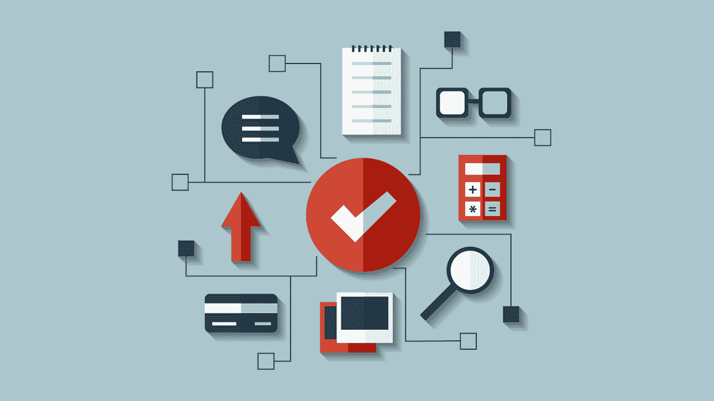
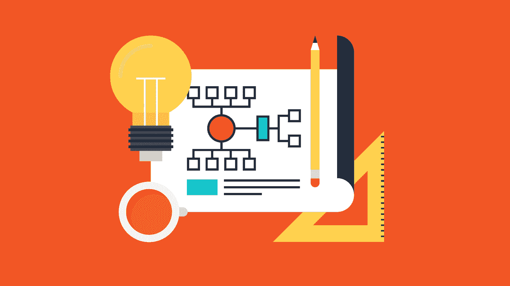

# 移动应用需求文档初学者指南

> 原文:[https://simple programmer . com/初学者指南-手机-应用-需求/](https://simpleprogrammer.com/beginners-guide-mobile-application-requirements/)

截至 2017 年 9 月，谷歌 Play 商店托管了[330 万个应用](https://www.statista.com/statistics/266210/number-of-available-applications-in-the-google-play-store/)，但并非所有应用都是平等的。用户对这些应用的评分很低，而且这些应用的下载量很少。

几个因素导致了应用程序的低性能。一些常见的原因包括错误的设计，糟糕的用户体验(UX)，过多的错误和缺乏对功能的关注。

另一个因素是，在许多项目中，应用程序所有者和开发人员并不在同一页面上。

想象自己处于一个想要开发一个应用程序的情境中。接下来你要做的是寻找一个可以开发你的应用程序并向他描述你的想法的开发者。尽管你认为你在同一页上，当开发者第一次发布应用程序时，它与你实际想要的相差甚远。

哪里出了问题？模糊、非正式的想法可能是潜在的原因。当这种情况发生时，开发人员可能会以所有者不希望的方式构建应用程序。这种断开也会导致应用程序出现问题。

作为一名开发人员，你如何预先阻止[问题场景](https://simpleprogrammer.com/2017/11/10/six-mobile-app-development-mistakes/)的发生？

在开始任何工作之前，确保所有的项目需求都非常清楚。准备一份应用程序需求文档可以让任何新的应用程序变得清晰，让每个人在项目的所有方面都保持一致。与开发人员分享这个文档，它描述了您如何看到开发过程的结果。

在本文中，我们将带您了解编写需求文档的最常见的方法。我们将帮助您编写移动应用需求的基本步骤，以及一份好的需求文档应该是什么样的。

## 新手应用程序开发:基础

在开始实际的应用程序开发任务之前，开发人员需要弄清项目的六个主要组成部分:

1.  文本叙述或用户故事
2.  项目范围
3.  技术条件
4.  草图和线框
5.  资产创造
6.  将所有内容放在一个工作流文档中。

这六个组件构成了一个 [app 需求文档](http://www.amazon.com/exec/obidos/ASIN/B072R26C3M/makithecompsi-20)的核心。在编写任何代码之前，开发人员需要与应用程序所有者就所有这些组件达成共识。理想情况下，项目涉众，尤其是开发人员、企业所有者和经理，会聚在一起，就上面列出的每一项达成共识。

首先要记住的重要一点是，对于应用程序需求文档来说，没有硬性的规则，也没有任何严格的格式。该清单涵盖了大多数文档中包含的基本组件，但是您可以根据自己项目的需要包含其他信息。如果你是一个新的开发人员，你应该会发现这个清单很方便，这样你就可以以结构化的方式开发应用需求文档，而不会遗漏任何东西。

### 1.文本叙述或用户故事

用户故事是移动应用程序开发过程中的第一个方法步骤。它讲述了应用程序将为目标用户提供什么，还列出了应用程序的目标客户。

最好的用户故事是合作的成果。开发文本叙述的过程包括开发团队、业务经理和最终用户。这些利益相关者聚在一起，确定应用程序将解决什么问题，或者应用程序将改善公司运营的哪个方面。他们为应用程序准备了一个具体的功能特性列表。

一个恰当的叙述准确地指出了应用程序的核心特征。它深入细节，不留任何含糊的余地。它从用户的角度列出了应用程序的各种可能性。通常，一个大的故事被分割成子故事，以关注特定的用户场景。

最好的用户故事简单易懂。虽然用户故事本身不能成为开发应用的基础，但它提供了一个很好的起点。

### 2.项目范围

用户故事不是一个技术文档，没有任何固定的格式。项目范围从用户故事中提取明确的技术需求，为应用程序的目的提供一个连贯的形状。它还列出了应用程序中要包含的所有组件。

一个好的范围大纲说明了应用程序的目的，换句话说，它要解决的问题或者它要简化的过程。提前写好大纲给应用程序一个明确的方向和目标。

项目范围包括应用程序的业务模型，如应用程序是面向客户还是内部员工，应用程序是否用于盈利，等等。一个 app 的结构取决于商业模式。例如，一个旨在赚钱的应用程序可能需要付费墙。一个面向内部员工的应用程序在设计上可能是精简和极简的。另一方面，面向客户的应用程序可能需要更多的资产，如图像和横幅。

范围处理应用程序将在多大程度上利用公司或最终用户已经可用的任何资产，以及支持应用程序所需的新资产。例如，如果一家公司为员工推出了一款新的移动应用，而该公司已经在 Android 手机上运行了 BYOD(自带设备)生态系统，则该应用可以直接安装到这些手机上。另一方面，如果该公司正在为高层管理人员推出一个新的高度安全的 iOS 应用程序，而目标用户没有苹果 iPhones，则新应用程序需要购买新的智能手机。

范围还列出了适用于项目的约束或限制。最常见的限制与预算和时间有关。其他限制与范围、风险承受能力、资源可用性和人员配备有关。对这些限制的澄清确保了开发团队在开发过程中不会走极端，并且将实际限制与最佳实践相协调。

范围清晰对于规划每个特性和功能非常重要。一个应用程序的每个组件都是相互关联的，一个组件连接到另一个组件。一个特定的功能可能依赖于另一个功能，这意味着在后期添加特性和功能可能会导致整个代码和架构的重大变化。后期阶段的返工会破坏项目预算和时间表，并可能使项目失去动力。

### 3.技术条件

范围大纲导致制定项目的[技术规范。在应用程序需求文档中列出项目的技术规格，对于确定应用程序的实际预算以及确定项目所需的时间和工作量至关重要。对于管理层和为应用程序付费的人来说，准确理解项目在时间和金钱方面的要求非常重要，这样他们就不会在开发过程中感到惊讶或要求不合理的更改。](http://www.amazon.com/exec/obidos/ASIN/1519204582/makithecompsi-20)

一个很好的技术规范列表详细说明了应用程序运行的平台，以及应用程序支持的操作系统版本。该应用程序可能是跨平台开发的，也可能是为 Android、iOS 或 Windows 操作系统开发的。

技术规范列表可能包含配置文件、帐户和平台凭证。最重要的凭证是苹果、谷歌或其他开发者账户。虽然此类信息也可能在稍后阶段获得，但不会影响开发流程，提前识别此类信息意味着您不必在流程的稍后阶段返回并再次收集信息，并且应用程序可以在准备就绪时立即启动，无需在帐户上浪费更多时间。

技术规范列表中的另一个关键内容是应用程序发布后的维护蓝图。所有应用都需要发布后支持。一个好的应用程序需求文档列出了应用程序需要的支持范围，以及在什么时候需要这样的支持。

所有应用程序肯定都需要服务文档，所以在技术规范中包含这些资源会给你一个更全面的列表。

所有应用都运行在由第三方软件、服务器和数据库组成的生态系统上。应用程序还利用依赖硬件进行通信，在某些情况下，只是为了运行。例如，信标可以为物联网应用提供动力。为触摸屏信息亭设计的应用程序需要信息亭本身作为依赖硬件。

最佳技术规格列表全面而详细。然而，与此同时，它并不涉及更精细的细节，例如按钮的颜色。这些更好的细节可以在稍后阶段安全地修复，而不会改变应用程序的范围或预算。

### 4.草图和线框

UX [成就或破坏一个应用](https://www.statista.com/statistics/266210/number-of-available-applications-in-the-google-play-store/)。一个好的 UX 可以让用户很容易找到他们想要的，提高客户满意度。线框草图是 UX 设计的重要组成部分。基于用户需求，UX 的设计者使用线框来定义屏幕上项目的层次结构，以及任何可能的功能。

为什么线框在移动应用程序开发过程中很重要？

不管你有多能干，如果不仔细研究一下中间的细节，就不可能从一个想法直接构建出来。对每个设计师来说，在构思之前勾画出你的想法是必要的。

移动应用开发的线框就是架构的蓝图。线框是你未来应用的视觉概念，或者说，是整个构建过程的指南。它可能不会给出任何关于设计的想法，但有助于理解你未来的应用程序将如何工作。草图和线框明确了不同特征和功能之间的关系。它们还说明了行动-反应顺序。

在本节中，我们将指导如何进行线框草图绘制。

从详细的屏幕草图开始，使需求变得清晰。草图本质上是基本的，它清楚地表明了用户将在每个屏幕上看到什么。屏幕设计草图说明了序列链。由用户操作触发的每个新路径都代表一个场景，并与项目范围相关联。例如，一个草图可以说明当用户执行向下滑动动作时会发生什么。

然后创建一个线框，它细化了概念，非常详细地明确了应用程序将如何工作。线框通常是在像素化的灰度部件中准备的，并进入元素的精确大小、位置和顺序。

创新的设计师将用户故事转化为线框，提供对拟议功能的全面描述，以及这些功能如何出现在应用程序屏幕上。

创建良好用户体验界面的最佳实践，尤其是如果你是开发应用程序的新手，是按照标准用户在使用应用程序时的顺序进行。最常见的起点是 onboarding 屏幕和用户注册。从这里开始，你应该涵盖用户旅程中的所有路径和可能性。

一个应用的成功取决于对什么是好的 UX 的认识。了解标准导航模式、如何链接不同的屏幕以及各种元素之间的关系也会有所帮助。创建一个涵盖所有可能性的文档很重要，比如当用户使用推送通知打开应用程序时，该应用程序将如何表现。

开发团队也可能在草图和线框中包含任何必要的品牌和设计指南。

### 5.为应用程序创建所需的资产

一份写得很好的需求文档描述了 app store 提交所需的所有技术资产和信息。

虽然 app store 信息可能因 app store 本身而异，但要包含的一些资产信息包括图标的支持大小、闪屏的支持大小、屏幕截图的正确大小、所需语言的应用程序描述和关键字，以及支持的设备和操作系统版本列表。

开发团队可以选择在编码之前创建这样的资产，这将在产品准备就绪时加快提交过程。他们也可以选择等待，在以后的阶段开发资产，并在最后将其集成到软件中。许多开发人员选择外包这样的资产创建任务，从而实现同步开发。

### 6.将所有这些放在应用程序需求文档中

[移动应用需求文档](https://www.fingent.com/insights/portfolio/mobile-app-specification-template/)概述了产品或解决方案如何满足公司或应用所面向的用户的需求。它将上面列出的所有元素汇集在一起，成为整个开发团队和其他利益相关者的基本参考文档。

app 需求文档从叙述引导到范围大纲，从范围大纲引导到页面设计。它还列出了技术规范，以及与应用程序相关的资产列表。页面设计成为图形和视频或音频文件的基础。

最好的需求文档是:

1.  易于阅读，语言简洁明了
2.  精确而详细，没有含糊不清的余地
3.  迭代；虽然细节可能会改变，但基本要求保持不变
4.  协作，采纳与应用程序相关的所有利益相关者的观点。

## 作为指南的模板

上面提到的准备一个优秀的手机 app 需求文档的步骤，是供你使用的指南。最佳实践不是一成不变的。

应用需求文档有几种流行的格式。最常见的方法包括功能规范文档和故事板。记录需求[的最佳方法取决于项目的性质](https://simpleprogrammer.com/2017/11/08/progressive-web-applications/)。最佳格式取决于具体的项目。

然而，不管是哪种形式，这些关键的组成部分在应用程序开发项目过程中都是至关重要的，尤其是如果你是一个新的开发者。

应用程序需求文档构成了应用程序的蓝图，在某种程度上，它是开发者和拥有应用程序的公司或个人之间的技术协议。没有它，开发过程可能会以混乱结束，有歧义，需要不同涉众的确认，甚至范围蔓延，这可能会破坏一个项目。