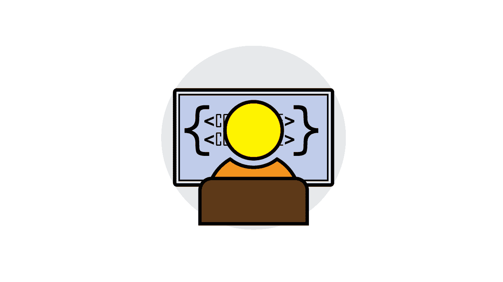

# 作为新开发人员构建有效的软件

> 原文：<https://simpleprogrammer.com/building-effective-software/>

许多新开发人员认为，掌握大量编程语言是构建有效软件的全部要求，但这就像说建造一栋房子只需要多种木材一样。

如果你在盖房子，真正重要的是知道如何使用木材。开发软件也是如此:能够使用一种语言作为工具来构建强大的软件比了解许多不同的语言更重要。

那么，如果掌握多种语言不是答案，那么对于一个新的软件开发人员来说，怎样才能开发出优秀的软件呢？这是许多因素的结合，也是深入研究代码本身之前的大量准备工作。

我将带您了解构建最有效软件的五个关键要素。这个过程是任何开发人员都可以遵循的，但是如果你是软件开发新手，你会发现这些步骤对帮助你[开始](https://simpleprogrammer.com/2017/11/30/become-self-taught-programmer/)特别有用。

## 指定软件要求

你不能设计和建造你不能描述的东西。为了以正确的方式开始一个软件项目，你的第一步应该是指定你的软件需求。

软件需求是对软件必须具备的特性和功能的描述。定义你的需求使得理解你的软件变得容易，这反过来导致清晰的设计。一旦你有了一个清晰的设计，编写代码将会很容易。

你的需求越多，你的软件就越复杂。知道什么是正确的需求是很重要的:你需要覆盖软件应该实现的所有功能，预期的输入，以及最终的输出。

你还需要计划适当的时间来完成每一项要求。一个技巧是按照从最重要到最不重要的顺序排列需求列表。如果你没有完成所有的需求，软件的一些功能将会不完整，但是如果你分清主次，你将会完成最关键的部分。

为了创建正确的优先需求列表，你应该和你的客户坐在一起，让他们告诉你他们需要解决的问题。你对问题了解得越多，你就越能理解需求。

另一个技巧是创建一个所有需求和功能的清单，当你完成构建软件程序时，仔细检查清单以确保这些功能确实存在并按预期工作，检查问题是否已经解决，并确保满足需求。

一开始，与客户进行多次会面可能会感到奇怪，但是作为开发人员，你工作的时间越长，你就会越习惯。

需求收集需要时间；你可能需要与客户多次会面，才能正确理解他们的观点，并有一个双方都同意的完整的需求列表。在开始编写软件之前创建这个需求列表将有助于您更好地构建有效的软件。

## 设计软件

有时候当我写代码时，我会陷入逻辑中。语言本身不能拯救我，所以必须有其他的东西——可以引导代码以良好的方式工作的东西，就像描述软件不同模块所需的蓝图一样。

软件设计就是干这个的！它为代码构建正确的软件指明了道路。如果你不知道汽车是什么样子，你就不能制造汽车。你必须知道你的汽车的不同部分是什么，根据它们的优先顺序对它们进行分类，以知道从哪里开始，然后指定你需要的工具和材料来将所有东西组装在一起。

[软件设计](http://www.amazon.com/exec/obidos/ASIN/0201633612/makithecompsi-20)是关于定义需要构建的模块，以达到客户的要求。它将要求纳入行动计划。

您需要描述每个模块，它是如何工作的，以及所有模块是如何集成并一起工作而没有任何错误或性能问题的。此时，您还应该知道数据是如何在不同模块之间流动的。

图表是描述你的设计的最好方式，因为它们给你一个你需要编程的可视化表示。软件设计中使用的图表有很多种。每种类型描述了设计的不同层次。数据流图、用例图、序列图和类图都是常用图的例子。

拥有一个好的设计会使你的代码编写更加容易，因为你已经知道你需要构建的模块，以及每个模块的功能。

## 选择语言

新开发人员会花时间选择在他们的软件中使用哪种编程语言，但这没什么大不了的。您可以搜索最广泛使用的语言的优点，并选择最适合您需求的语言。

每种语言都有一套框架，可以用来减少您编写的代码行，这有助于您事半功倍地达到目标。您可以使用您已经知道的语言，并使用有助于您的项目的框架。

因为您知道自己的需求，并且有一个好的设计，所以您可以选择一种最能帮助您实现目标的语言。

## 测试您的软件

软件测试对于确保你朝着正确的方向前进是非常重要的。就像如果你在制造一辆汽车，你会问自己，“这真的是它(汽车或软件)应该有的样子吗？应该这样吗？这是客户所期望的吗？”

即使不容易满足客户的所有期望，您也要确保您已经涵盖了需求列表上的所有内容，以便客户获得他们要求并支付的功能。

那么，你的软件现在可以交付了吗？不测试不知道。

您需要根据您的需求编写测试场景，这样您就知道您正在以正确的方式构建正确的软件。这些场景有助于您检测是否有任何需要修复的错误或者任何缺失的需求。

您运行的测试应该回答几个问题:

*   程序好用吗？
*   是适应变化还是需要大量动手修改？
*   使用安全吗？
*   可以增强它以消耗更少的资源吗？

此外，测试你的软件性能非常重要——没有人喜欢等很长时间才得到响应！

不幸的是，一些开发人员为了时间而跳过测试，然后他们在软件发布后才发现代码中的问题。不要犯那个错误；花时间测试你的软件，它会让你成为一个更好的开发者。

## 保持更新

软件推出后，可以应用很多增强功能；这也是为什么大多数软件都有很多版本的原因。

新版本的软件可能包含对一些在发布后发现的错误的修复。它还可以包括新的特性和功能，或者它可以只是用户界面设计的一些修改，以增加可用性。

保持你的软件是最新的，并不断增强它，以确保软件是最高质量的。

## 满怀信心地开始构建您的软件

如果你是一个新的开发者，你可能会在构建新软件的过程中纠结于从哪里开始。上面讨论的五个步骤是您可以使用的清晰而简单的指南。

这些指导方针是你在程序员的职业生涯中可以并且应该继续遵循的，但是当你刚刚开始时，它们尤其有用。

通过理解[您的客户想要什么](https://simpleprogrammer.com/2017/07/14/cultivate-patrons/)，用清晰的图表描述它，用您熟悉的语言编写您的代码，测试软件，然后保持它最新，您可以构建具有最佳性能的全功能软件。更好的是，您可以满足客户的全部期望，甚至超越它们。