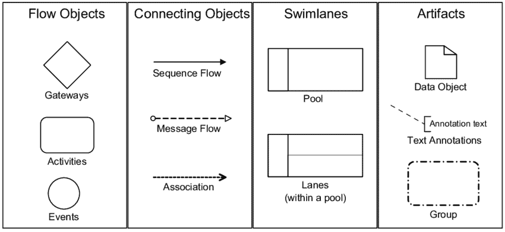

# 什么是业务流程建模符号(BPMN ),它将如何使你的下一个编程项目受益？

> 原文：<https://simpleprogrammer.com/business-process-modeling-notation/>

As you might know, we can use modeling languages like [UML](https://simpleprogrammer.com/unified-modeling-language-age-of-agile/) (Unified Modeling Language) to specify complex software systems. However, there’s a chance that you are still unaware of Business Process Model and Notation (BPMN).

BPMN 是一个标准的处理模型，它在业务流程图(BPD)中提供了业务或软件需求的图形化表示。简而言之，它是一个为了便于理解产品开发的整个过程而设计的模型。

BPMN 的目标是支持业务和技术用户的业务流程管理。它提供了一种可以被业务分析师轻松掌握的符号，但却表示复杂的语法。

了解 BPMN 是学习如何以清晰、有效的方式与参与项目的每个人分享细节的第一步。

## 过程建模符号和 BPMN 综述

理解过程建模符号有两种观点:**理论**和**操作**。从理论的角度来看，过程建模符号指的是描述解释整个开发过程所需的主要元素。通过这种方式，我们可以了解事情发生的内容、时间和原因。

另一方面，操作的观点集中于指导应用程序开发人员和方法工程师。允许业务流程模型变得完全可执行的一些技术包括模型驱动的架构、统一建模语言和面向服务的架构。

流程建模符号是一种人类可以阅读并用来描述业务流程结构的语言。但是，当谈到选择适合您的业务的建模符号时，专家建议选择符合您的需求的标准，并由经过培训或参考的各种工具提供支持。

业务流程建模符号是一种开源的标准化图形符号，任何人都可以使用。它的原始代码可供任何想要修改和使用它的人使用。

[BPMN](https://www.amazon.com/dp/0982368100/makithecompsi-20) 通常以业务流程图开始和结束。如果由程序员或组织使用，它将成为一个技术地图，以标准化的语言概述可用的流程和实践，用户可以很容易地改进、遵循和共享该模型。

最终，BPMN 有点像使用流程图或演示幻灯片，只是更加灵活和标准化，提供了一种技术人员和非技术人员都能理解的语言。这样可以减少误解，促进交流。

## BPMN 的目的以及如何从中受益

从理论的角度来看，BPMN 是为利益相关者和参与者设计的，他们需要通过视觉表现来理解完成一个过程所需的步骤。相反，从操作的角度来看， [BPMN](https://www.bpmn.org/) 是为那些将要执行过程的人准备的，他们需要一个精确实现的详细解释。

BPMN 的主要目的是成为每个用户都能理解的符号。除此之外，它的目标是:

*   确保模型的完成，而不需要额外的文档
*   提供一致的结构
*   始终保持高度可读性
*   作为可执行的流程与 IT 部门共享

无论你是一个商业分析师，经理，技术开发人员，程序员，或顾问，BPMN 是一个易于理解的标准语言。它通过提供业务活动的清晰性和细节消除了过程意图和实现之间的差距。

图表比文本更容易理解。它们使高效流程和高质量结果的对话和协作变得更加容易。使用 BPMN，您可以与 XML 文档进行通信以执行流程。

使用 BPMN 可以实现的一些好处包括:

*   显示一系列活动实现和数据交换的控制检查点
*   显示支持该流程的信息系统
*   完全了解过程是如何被调节的
*   流程实施过程中交换的任何信息都是可见的

## 何时使用 BPMN

BPMN 的用户称之为简单，复杂，排除，同时又有帮助。尽管如此，有些时候你会想使用 [BPMN 方法和风格](https://www.amazon.com/BPMN-Method-Style-levels-based-methodology/dp/0982368100)作为你的标准语言。三个最重要的是:

*   如果你被困在一堆常用的[工作流程图](https://simpleprogrammer.com/7-tools-improve-web-development-workflow/)元素来传达你的概念，那么 BPMN 可以帮助你有选择地绘制整个流程。
*   如果你想展示你是业务流程管理的专家，没有什么能打败建模语言。当申请一个需要业务流程模型专业知识的职位时，BPMN 的知识会让你脱颖而出。
*   如果您的组织或客户想要创建软件开发的理想过程。

最初，BPMN 是一种建模符号，用于向所有利益相关者提供标准化的图表语言。然而，随着第二个版本的发布，它现在提供了一个在软件工具之间映射的 XML 模式。

## BPMN 2.0 图表符号和元素

就像流程图一样，业务流程建模符号图由一组符号组成，其中每个形状都有其特定的含义和作用。借助这些符号，人们可以创建易于理解的业务流程图，并在开发团队和组织中共享它们。

BPMN 主要由四种元素组成:

*   流对象:这些用于定义业务流程。
    *   方法
    *   事件
    *   活动
*   连接对象:这些箭头显示了流对象之间的连接。
    *   顺序流程
    *   信息流
    *   联合
*   泳道:每个泳道代表流程责任所在的位置，而池显示参与者。
    *   游泳池还是球道
*   工件:这些给出了关于过程的附加信息。
    *   注释
    *   组

在图中保持一致的外观和感觉可以使 BPM 中的元素最少。此外，你可以在完成一个基本类别后添加更多的细节。

## BPMN 意味着灵活性

本质上，BPMN 是一种业务流程建模技术，虽然类似于流程图，但有点复杂。然而，这也是其灵活性的一部分。

BPMN 使用符号的图形表示来显示业务流程步骤。它要么被组织用来设计他们的工作流程，要么被技术公司或程序员用来概述软件、web 应用程序或网站的开发过程。

通过理解 BPMN 流程图中的联系，人们可以很容易地识别企业是如何组织其流程的。BPMN 的主要优点之一是它可以轻松地应用于任何复杂的应用程序。

与您设计的其他流程图模型或文档类似，BPMN 有助于将有价值的信息传递给团队的不同成员，甚至是客户。您可以根据为 BPMN 提供的规格轻松开发模型。它将指导涉众有效地解释和理解过程或解决方案，并提供技术开发人员和业务用户之间的交流途径。