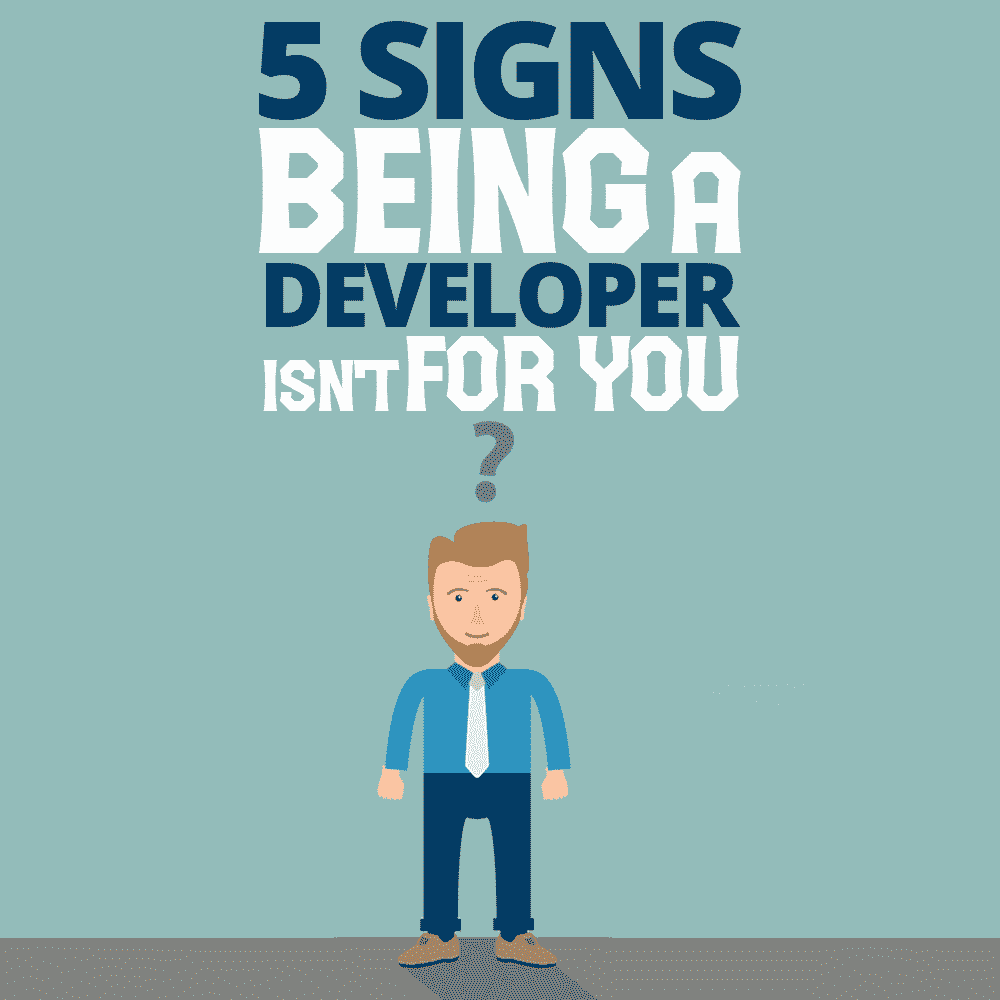

# 成为开发人员的 5 个标志不适合你

> 原文：<https://simpleprogrammer.com/career-as-software-developer/>

Technology is everywhere these days, and it’s being used in many different ways, from predictive modeling and analytics to online and mobile shopping. At the heart of all these digital experiences is the software and platforms powering them.

在你可以使用手机应用程序浏览产品和从你最喜欢的商店购物之前，必须有人开发它。在零售商或营销人员能够利用精确的工具来跟踪业绩统计甚至网络活动之前，必须有人来建立这个系统。在制造商能够在其工厂内推出漂亮、尖端的 IIoT 系统之前，开发人员必须构建软件来支持这一切。

这解释了为什么对熟练可靠的开发人员有如此高的需求。没有软件工程师的参与，任何体验、应用、软件或数字环境都无法存在。

只有 46%的学生报告说他们的学校帮助他们找到了与他们的兴趣和能力相匹配的职业，很容易看出在我们的技术时代有多少人可以将开发/编程视为他们应该尝试的领域。尽管开发人员/程序员很重要，但这并不是一条适合所有人的职业道路。

想知道是不是很适合你？以下是一些不适合发展职业的迹象。

## 1.你不喜欢学习语言

编程和开发语言是另一种形式的语言。参加课程并与他们一起工作类似于学习西班牙语、法语或任何其他语言。相似之处仍然存在，你将在工作中日复一日地继续使用这门语言，你的词汇量将永远不会停止增长。

此外，只要你的工作遵循行业内的最佳实践，新的方法、机会和渠道就会源源不断地出现在你的指尖。这意味着有一些创造性的空间，但你仍然需要遵循一个基本的结构。

体验因语言而异。你可能爱一些人，而恨另一些人。如果你喜欢或讨厌一些你必须使用的语言，这是可以的，但是如果你基本上不能容忍编程方法，这就清楚地表明你不属于这个领域。

## 2.你不能(或者不喜欢)自学

作为一名开发人员，你还不如做一名自由职业者或合同工。即使在现存的一些最大的组织中工作也是如此。为什么？因为你被期望在第一天就具备完成工作所需的大部分技能和专业知识。也没有人会牵你的手。通常不提供特定工作和角色的培训。

当然，总有极少数情况下，公司会提供短期培训或免费在线课程，但这种情况只在使用专有平台、系统或语言时常见。

在我们所处的不断发展的数字世界中，仅仅了解基础知识是不够的。随着每年不同技术的出现，开发人员被期望能够将这些新技术结合到他们正在开发的产品中。

此外，编程的技术本质有助于形成这样一种态度，即所有开发人员都超级聪明，组织良好，并且确切地知道他们在做什么——即使现实几乎总是相反。你需要能够管理好自己的工作时间，继续自己的教育和培训，并在遇到问题时找到解决方案。

你基本上是单飞。

## 3.你喜欢标准的朝九晚五的时间表

在开发领域，没有“正常工作时间”或“标准时间表”这样的东西。许多开发项目因运行时间晚而臭名昭著，导致了所谓的“关键时刻”，团队中的每个人都把他们醒着的时间都花在了工作上。如果你在从事某种安全或硬件系统的工作，你可能会随叫随到，这意味着你的工作时间会有所波动。

作为一名开发人员，很容易让家庭义务和活动退居次要位置，所以要做好安排，计划好出现在孩子的学校演出中，因为[找到工作/生活的平衡](https://simpleprogrammer.com/work-life-balance/)可能很难。

## 4.你讨厌计划

Software developers and engineers spend a lot more time planning and drawing out potential projects than they do at their keyboards actually writing code. In fact, there’s a good chance that if you sit down and write—without any formal planning—your code will be removed or rendered worthless later anyway.

大多数开发项目都涉及到与一个由志趣相投的协作人员组成的大型团队一起工作，他们每个人都在大计划中扮演着自己的角色。一个开发人员可能在开发应用程序的 UI 和视觉元素，而另一个可能在开发网络交互，等等。这些不同的部分通常会组合成一个整体，构成最终的应用程序或软件产品。

要做到这一点，你需要在管理层进行大量的计划和协调，这意味着你将不断地留意和适应监督。

如果你讨厌计划或遵从上级制定的计划或策略，花点时间重新考虑一下。如果你讨厌与大型团队合作，并且只能接触到完整拼图中的一小部分，那么这条路不适合你。

## 5.你不是左脑思考者和右脑思考者

编程和开发是一个非常技术性的职业，需要考虑很多分析和数学问题。正因为如此，人们很容易认为这几乎不涉及创造性。但那完全不是真的。

尽管开发往往是面向左脑的活动，但编码和编程仍然需要大量的右脑。换句话说，你需要有创造力，为你遇到的问题想出独特的解决方案和答案。

此外，编写代码和整合软件的基础需要一定的技巧。所谓的“混乱”编码或写作会彻底破坏一个项目，尤其是当其他人不得不进来阅读或理解你的作品时。这就像当你看不懂某人糟糕或难看的笔迹时，试图去理解他的手写文章一样。这种体验甚至在屏幕上也能体现出来，因为大部分内容都是通过物理键盘输入和制作的。

## 软件开发适合你吗？

上面的考虑将帮助你决定软件开发是否适合你，但是还有很多其他的因素你也需要考虑。

你喜欢和令人讨厌的人在一起吗——或者更确切地说，和开发人员在一起吗？你对自己的工作感到自豪吗？你有坚定的职业道德吗？你能在团队中工作吗？你能在截止日期前完成任务，这样其他人也能按计划进行吗？[你容易受挫吗](https://www.techrepublic.com/article/is-a-developer-career-right-for-you-10-questions-to-ask-yourself/)，或者你容易放弃挑战吗？

如果上面提到的特质也适用于你，也许是时候换个领域了。如果上述特征都不适合你，那么听起来你会在软件开发领域做得很好。祝你好运！