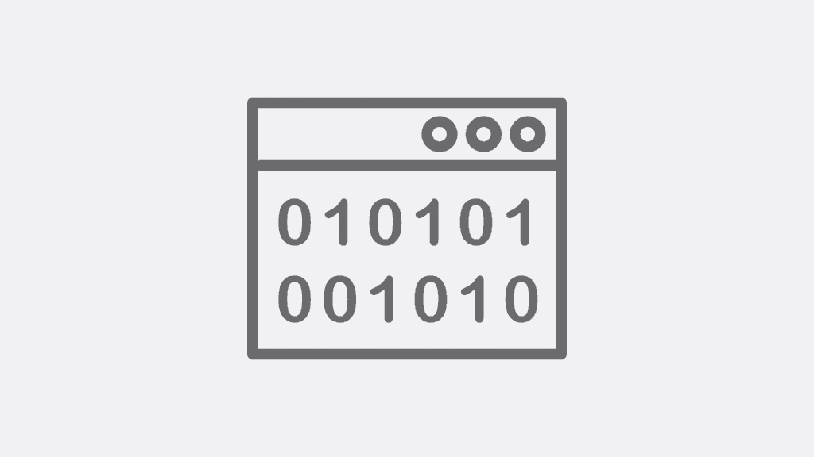

# 如何在代码中选择好的名字

> 原文：<https://simpleprogrammer.com/choose-good-names-code/>

为一段代码选择一个好名字是非常重要的。如果你的代码至少要被阅读一次——如果只是你自己——那么名字将在你使用它的能力中扮演重要角色。

变量名、函数名、类名、接口名:所有这些都是让读者知道一段代码在做什么的无价方式。在工作中的代码审查期间，我对我的团队成员在好的命名方面相当挑剔——抱歉，伙计们！——但我相信这可以决定我们代码的质量。

即使有其他有价值的方法来了解一段代码在做什么，比如文档，好的名称也是传达代码信息的一个非常有效的渠道，至少有两个原因:

*   非常好的名字**会立即**告诉你代码中正在发生什么，而不是查找文档并通过跟随它找到绕过代码的方法。

*   命名可以很快提高。你可以做一个快速的修正来更新代码中的一些名字，手动地或者通过使用一个工具(比如流行的 [clang-tidy](http://clang.llvm.org/extra/clang-tidy/) 举例来说)，如果你的代码构建好了，你几乎可以肯定它会通过测试。

因为这很重要，我将为你提供如何选择好名字的指导。我从史蒂夫·麦康奈尔的参考书 *[Code Complete](http://www.amazon.com/exec/obidos/ASIN/0735619670/makithecompsi-20)* 中摘录了一些指导方针(这是约翰在他的文章“[如何开始软件开发](https://simpleprogrammer.com/2016/07/11/get-started-software-development/)”中建议的必读内容的一部分)。

一些技巧来自我与同事在工作中的讨论、建议和代码评审。其中一些是我多年来通过代码实验自己想出来的。

我们将从解释如何避免不好的名字开始，然后关注如何挑选好的名字。

## 不要使用任何非法的东西

让我们澄清一下:在给定的语言中，有些名字是不允许使用的。

除了使用标准保留的名称(如' int ')，这将停止编译，每种语言都有其特定的合法名称规则。例如，在 C++中，名称中下划线(_)的某些组合虽然不合法，但可以编译，因为它们是为编译器或标准库实现者保留的。使用它们可能会与它们声明的对象或例程冲突，导致微妙的错误和意外的行为。

以下是 C++中为编译器和标准库实现者保留的名称:

*   任何包含两个连续下划线(__)的名称

*   以一个下划线开头并紧跟一个大写字母(_isOk，isOk_too，_IsNotOk)的任何名称

*   以一个下划线开头并位于全局命名空间中的名称

所以不要考虑使用这样的名字，因为它们会给你带来麻烦。

## 不要浪费信息

当你考虑它的时候，你的代码完全知道它在做什么。事实上，它是最清楚的:它尽可能忠实地执行其中的内容！

起一个好名字实际上就是尽可能多地保留代码所包含的信息。换句话说，就是不要因为混淆代码而浪费信息。有趣的是，通过封装来隐藏信息经常受到鼓励。但是在这种情况下，你想要的是信息披露。

为此，**限制缩写的使用。**缩写和首字母缩略词写起来很方便，但读起来很难。俗话说，代码写一遍，读很多遍。

然而，你不必系统地拼出*所有的*缩写来使代码更清晰，一些重复的未缩写代码甚至会损害可读性。

例如，在您的代码中使用“VAT”而不是每次使用它时都编写 valueAddedTax 似乎是合理的，因为每个人都知道 VAT 是什么。

你如何选择是否在代码中使用缩写？经验法则:如果你的应用程序的终端用户能够理解一个特定的缩写，那么在代码中使用它是可以的，因为这表明你领域中的每个人都知道它的意思。

而且，**不要试图为了最少的字符数**而优化。在论坛上，你可以看到有人争辩说他们的方法更好，因为它涉及更少的输入。但是哪一个更麻烦呢:敲几下键盘，还是盯着代码看几分钟，试图弄明白它？

你当然不想浪费时间去弄清楚一个函数和方法的名字是什么意思，尤其是当你可以把它们的名字弄得尽可能长的时候。南安普敦大学的研究表明，函数和方法的名称可以达到 35 个字符，这听起来很多，但是更长的名称可以帮助你快速浏览一下就明白一段代码是什么，它是做什么的。

然而，函数名的长度也会因为一些不好的原因而变长:

*   如果一个函数的名字太长是因为函数**做了太多的事情**，解决方法不是在命名上，而是在函数层次上，把它分解成几个逻辑部分。
*   当函数名包含多余的信息时，这些信息已经由它们的参数类型表达了。例如:

可以重命名:

这导致调用点的代码更加自然:

相对于:

*   **否定**是一个名字中不需要的信息的另一个例子，因为它们迫使读者做出智力努力，将它们还原成它们的正面意义，以便解析代码。下面的例子:

可以通过使用肯定的名称来改善:

既然我们已经排除了某些不好的命名习惯，让我们把注意力集中在如何挑选好名字上。

## 选择与抽象层次一致的名字

如前一篇文章所述，[尊重抽象层次](https://simpleprogrammer.com/2017/01/27/respecting-abstraction/)是许多良好实践的基础。其中一个做法就是好的命名。

好的名字是与周围代码的抽象层次一致的名字。正如在关于抽象层次的文章中所解释的，一个好的名字表达了代码在做什么，而不是它是如何做的。

为了说明这一点，让我们以一个计算公司所有雇员工资的函数为例。该函数返回将键(雇员)与值(薪金)相关联的结果集合。

一个糟糕的函数名，关注于**函数是如何**实现的，应该是:

这种函数名的问题在于，它表达了函数以向量对的形式计算结果，而不是关注**它做什么**，即计算雇员的工资。对此的快速解决方法是将名称替换为以下内容:

这将调用站点从一些实现细节中解放出来，让您——作为代码的读者——知道代码打算做什么。

尊重抽象层次对变量和对象名有着有趣的影响。通常在代码中，变量和对象比它们的类型所暗示的更抽象。

例如，int 通常不仅仅代表 int:它还可以代表一个人的年龄或集合中元素的数量。或者 Employee 类型的特定对象可以代表团队的经理。或者 std::vector <double>可以表示过去一个月在纽约观察到的日平均温度。(当然，这不适用于非常低级的代码，比如添加两个 int，或者在使用[强类型](http://www.fluentcpp.com/2016/12/08/strong-types-for-strong-interfaces/)的地方。)</double>

在这种情况下，你需要在**之后命名变量，它代表的是**而不是它的类型。你应该把你的整型变量命名为‘age’，而不是‘I’。你应该将上述员工命名为“经理”，而不仅仅是“员工”。你应该把这个向量命名为“温度”而不是“双精度”。

这似乎是显而易见的，然而在有些情况下，我们通常忽略了应用这一准则。让我们用**迭代器**和 C++ **模板类型来说明这一点。**

让我们以一个金融产品支付或收到的现金流集合为例。这些现金流中有些是正的；有些是负面的。我们希望获得流向我们的第一笔现金流，因此我们将关注第一笔正现金流。下面是编写这段代码的第一次尝试:

这段代码使用了“it”这个名字，反映了这个变量是如何实现的(用迭代器)，而不是这个变量意味着什么。如何将它与下面的代码进行比较？

哪个代码让你在理解它的时候最省力？你能想象当你不用读两行代码，而是读 10 行，或者 50 行代码时会有什么不同吗？请注意，这与我们上一节关于不要浪费代码了解自身的宝贵信息的内容是一致的。

同样的逻辑也适用于**模板参数。**特别是在学习使用模板时，我们看到的许多例子都来自学术来源，我们倾向于为所有模板类和函数编写以下代码行:

…虽然你对 T 的了解可能不止这些，但它只是一种类型。

在对类型一无所知的非常通用的代码中，使用 T 作为类型名是很好的，比如在 std::is_const:

但是任何关于 T 代表什么的信息都应该写入你的代码。让我们看一个简单的例子，一个解析序列化输入的函数:

通过更明确地展示 T 代表什么:

比较两段代码。你认为哪一个更容易合作？我肯定会说第二个，因为它告诉你类型是要被解析的类型，而第一个只告诉你 T 是…一个类型。

您可能认为命名类型有很大的不同，也可能认为没有。但可以肯定的是，第二段代码中包含了更多的文档，而且**是免费的**。在您自己的代码中用一个好名字替换一个坏名字所花费的时间，尤其是在本地使用的名字，接近于零，而一个更清晰的名字所带来的性能成本正好等于零。

这种成本的缺失对于好的命名来说是真实的:这一次有免费的午餐，所以让我们好好利用它。