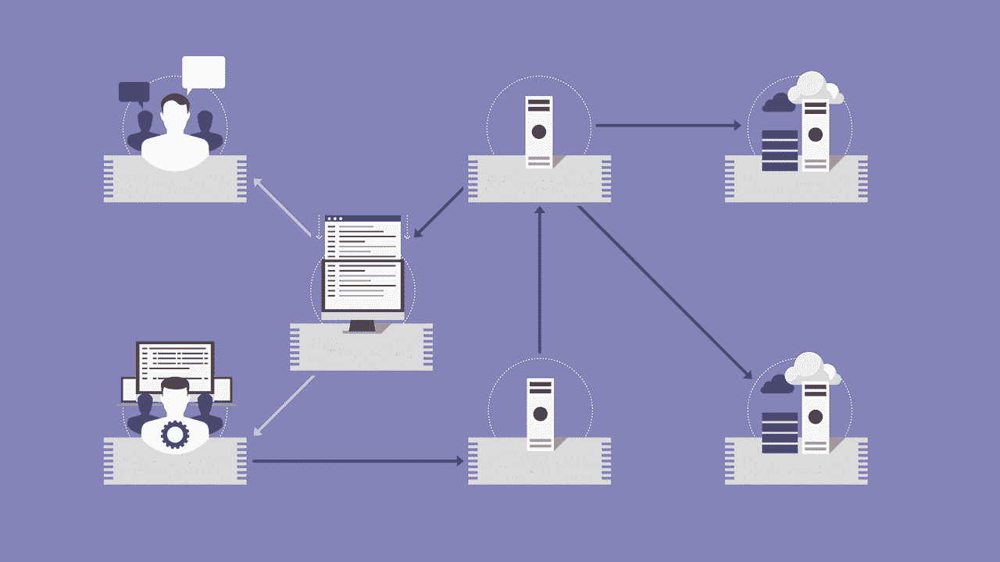
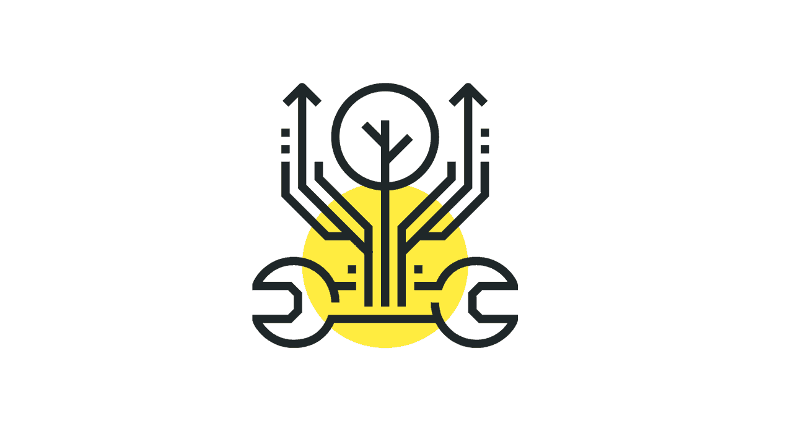

# CI 和 CD 对一个学员有多重要？

> 原文:# t0]https://simple programmer . com/ci-CD-apprentier/

白天，我做测试工程师。但我也认为自己是一名开发人员——更确切地说，是一名[学徒](https://en.wikipedia.org/wiki/Appreneur)。

什么是学徒？为什么，这是任何企业家试图通过移动应用程序建立业务。你可以制作模板供他人使用，创建应用程序直接在应用程序商店销售，或者提供许多其他依赖于移动应用程序的服务。

我独自工作，所以我独自经营一家公司。大多数学徒以这种方式工作，尽管有少数人有一个可信任的承包商小组来处理专门的工作。

重要的是找到工具和流程来帮助你在应用发布后继续保持其质量。尤其是只有你一个人的时候；你想花更多的时间和资源来创造和推出新产品，而不是维护旧产品。

您希望减少在单个任务上花费的时间，提高最终产品的质量，并降低整体工作的成本，您需要仔细考虑哪些工具可能有助于您完成所有这些工作。

持续集成和持续开发已经被项目开发团队使用了很多年，以使开发过程更加高效，并获得更好的最终结果。我们能像学徒一样使用同样的过程吗？

作为一名学徒，我负责设计、开发、测试，以及参与创造和向市场发布产品的商业活动。毫无疑问，完成其中一个项目绝非易事。

如果你是一名学徒，你可能会尝试增加或更新你在应用商店中销售的应用程序范围，或者将你的目录扩展到一个新的应用商店生态系统，或者创建一个与应用开发相关的新的可持续收入流。这完全取决于你在你的业务中的位置。

不管你在追求什么样的特定道路，你肯定在努力工作，为你的业务处理多种活动、里程碑和产品。即使你有一个小的承包商团队，你仍然在监督整个事情。再加上生活中所有的压力和干扰，你已经应付了很多。

持续集成和持续部署旨在让团队更好地运作，并创建更顺畅的工作流程。一般来说，当你有很多人在一个产品或项目上工作时，使用它们来减少混乱、潜在的瓶颈和发布有问题的产品的可能性。对于 appreneurs，只有你或一个小团队——这些过程真的有帮助吗？

让我们看看持续集成和持续开发到底是什么，讨论一些优点和缺点，然后谈谈它们是否适合你作为一个单独的或小团队的学徒。

## 什么是持续集成？

持续集成(CI)是将已经被验证的开发分支合并到一个单一的、共享的存储库中的实践。CI 被各行各业的成熟专业企业所使用。

开发人员使用 CI 来避免“集成地狱”,这是一个冲突解决之战的问题，它反对将多个代码分支合并到一个共享位置。

CI 的概念被采用到[极限编程(XP)](https://en.wikipedia.org/wiki/Extreme_programming) (旨在提高软件质量和响应能力)的实践中，与自动单元测试结合使用，在提交到主线分支之前，自动单元测试将在开发人员的本地环境中自动运行。

提交是将开发代码从本地存储库移动到远程存储库的行为。一旦代码全部通过了这些自动化测试(在构建服务器上运行)，提交到主线(共享存储库)的操作就被接受了。

在构建成功之后，这些自动化测试在构建服务器上运行(通常由开发人员或测试工程师等具有 CI 和 CD 工具经验的人来设置)。

这个过程有助于避免一个开发人员的工作进展破坏另一个开发人员的特性。这也意味着开发人员可以更有信心，如果测试失败，那么他们的工作将不会进入生产环境，或者，更糟的是，带着错误进入他们的客户手中。

XP 通常不被单人开发者或小团队采用；它通常由大型的、专业的、成熟的产品团队使用。CI 不是一个专门为开发应用程序的学习者设计的过程，但是它是一个通用的实践，任何开发软件的人都可以采用。

### CI 的常用工具

在撰写本文时，最常用的 CI 工具有:

*   詹金斯
*   TeamCity
*   特拉维斯·CI
*   Go CD
*   竹子
*   GitLab CI
*   绕圈圈圈圈圈圈圈圈圈圈圈圈圈圈圈圈圈圈圈圈圈圈圈圈圈圈圈圈圈圈圈圈圈圈圈圈圈圈圈圈圈圈圈圈圈圈圈圈
*   代码船

关于以上所有工具的更详细的解释，请参见这篇关于代码迷宫的[优秀文章。](https://www.code-maze.com/top-8-continuous-integration-tools/)

## 什么是持续部署？

持续部署(CD)在开发过程的各个阶段通过自动化测试对产品的更改进行验证后，会持续向生产环境发布更新。它还被各行各业的成熟专业企业所使用。

CD 工具在一系列事件中使用，因此当工作流程中的一个步骤成功时，下一个步骤就开始了。当这个成功了，下一个就开始了。这种做法意味着部署到生产环境中不需要手动干预。

这个过程一步一步地进行，直到它进入生产环境。如果某个步骤在任何时候失败，就会向相应的人员发出警报并进行修复，以确保流程能够成功启动并再次运行。

将 CD 与 CI 结合使用意味着开发团队向客户发布有问题的产品的机会应该更少。

持续部署应该是大多数不受法规或其他要求约束的公司的目标。因为它自动化了这个过程，所以不会因为错误或忘记的步骤而耽误，这也意味着不能错过失败的步骤。

再说一次，CD 不是专门为开发应用程序的学习者准备的，但是它可以让你在生产部署过程中更加自给自足。

### CD 的常用工具

有一些有用的工具有助于自动化部署。这些工具通常被较大的团队使用，但是你可以单独使用它们。以下是一些最常用的光盘工具:

*   詹金斯
*   电流
*   工具
*   厨师
*   章鱼部署
*   IBM 城市代码
*   AWS 代码部署
*   部署机器人
*   可装运的
*   TeamCity
*   编码(c)
*   迪斯泰利
*   XL 部署
*   GoCD
*   他们明白吗

关于这些工具和其他工具的更详细的解释，请参见 DZone 的这个[CD 和 CI 工具的伟大列表。](https://dzone.com/articles/21-automated-deployment-tools-you-should-know)

## Fastlane

其他流程的自动化也很有帮助。我为移动应用开发者找到了一个自动化应用提交过程的工具，叫做[浪子](https://fastlane.tools/)。浪子是开源的，所以可以免费使用。该工具可与 CI 和 CD 结合使用，帮助您更快地将应用从提交过程推向生产。

由于应用程序提交过程如此令人厌倦，即使你只提交一个平台，也值得看看浪子来节省你的时间。

## CI 与 CD 的利弊

一般来说，CI 和 CD 被认为是大多数公司应该使用的实践。既然如此，学习者是否也应该尝试并实现这些概念呢？

让我们来看看这些实践的一些优点和缺点，看看它是否对我们这些小角色有用。

### 好处

**安心**

不需要担心被破坏的[构建会被部署，因为](http://www.amazon.com/exec/obidos/ASIN/0321336380/makithecompsi-20) e，假设你有正确的测试，构建会失败，它不会被发布。

但是如果您已经准备好了测试，构建怎么可能仍然失败呢？构建软件总是一个迭代的过程。我们只是人，所以如果你的大部分代码没有被测试覆盖，小的甚至大的错误都有可能溜进生产环境。

防止同样的错误再次出现的方法是编写一个新的测试来帮助确定这种情况何时会发生。所以如果测试失败，你就会知道这个 bug 很可能会再次发生。然后，您可以修改您的代码，以确保测试通过，并且 bug 不再出现在产品中。

**新测试自动运行**

您在开发过程中添加的任何测试都会被自动拾取并运行。您还可以传递不同的参数来在特定条件下运行版本测试。

**允许您以最小的团队规模工作**

你不需要一个全职的开发人员、发布经理和几个测试人员来确保你的产品在不同的环境中保持质量水平。一旦您建立了相关的构建链，您就可以确保您的开发和产品发布由来自不同学科的最少数量的人来监控。

**灵活可靠**

如果您的团队扩展了，您不需要担心他们会忘记在执行提交到主分支之前运行测试。如果他们的提交失败，并不会破坏其他人的一切。

**使用模板易于扩展**

在为您的项目想出完美的配置之后，您可以创建一个模板来重用。随着项目的增长，您可以使用该模板创建新的生成配置。

### 缺点

**设置 CI/CD 的时间**

一旦您的 CI 和 CD 构建完成，您只需维护它们。但是在此之前，您必须花一些时间来设置初始构建配置模板。

多少时间？嗯，这完全取决于你学习的速度，你对 CI 和 CD 工具有多少经验，以及你选择什么工具。所以这很主观，基于你。

**会有一个学习曲线**

你需要克服的学习曲线有多陡将取决于你对 CI 和 CD 工具有多少经验。

您必须学习如何设置构建配置，将这些配置链接到您的代码存储库，编写单元测试(如果您还没有这样做)，将测试集成到构建中，并且还可能在每次构建后添加一个工具来输出您的代码覆盖率水平。然后，一旦构建被创建并通过，您必须学会将构建的输出(可能是应用程序可执行文件)链接到 CD 工具，以推进您的下一步。

**维护**

那些闪亮的新工具也会更新，所以你需要掌握软件更新和许可。也许没有必要把所有的东西都升级到最新版本，但是要确保你的工具互相兼容，并且关注新版本中出现的新特性。

**对于更流行的工具来说成本可能很高**

我们不要忘记，这些工具中的一些不是免费的，其中一些提供免费版本的工具是有上限的。因此，如果你想要更昂贵的选择，确保你有足够的预算用于这些开发成本。

虽然大公司有时更喜欢价格较高的选项，因为它们提供了使用免费许可证时无法获得的一定程度的支持，但我发现使用免费许可证并让谷歌任你支配可以走得很远。我建议你在花钱购买付费服务之前先试用一个免费工具。毕竟，使用 CI 和 CD 工具可能不适合你或你的项目，所以请记住你自己和你的预算。

**构建可能变化无常**

在我之前的工作中，当我的团队刚加入 TeamCity 时，我们发现我们的构建经常失败。同样，这种失败是学习曲线的一部分；它也应该被考虑在你需要放在一起的一个健壮的模板的时间预算中。因此，如果你发现你的构建经常失败，你将不得不花更多的时间来找出原因。

## 那么:学习者应该使用 CI 和 CD 吗？

使用 CI 和 CD 有一些优点——主要是这些过程使学习者能够更长时间地保持自给自足，并使您相信您的构建在生产过程中一直是稳定和高质量的。

但这确实需要大量的前期工作。如果你以前没有任何使用 CI 和 CD 工具的经验，这可能会花费你更长的时间。

如果你把使用应用作为一种爱好，并且没有任何使用这些工具的经验，我不建议你设置 CI 或 CD 流程。你花在学习工具和维护工具上的时间可能不会给你很大的回报。

但是如果这是为一个长期项目建立一个坚实的开发基础和实践的开始，你真的没有什么可失去的。

先从一个流程开始，最好是 CI。然后，您可以构建您的测试套件，以确保高水平的代码覆盖率(单元测试覆盖的代码),并仍然控制发布过程，以确保在您仍然学习工具时不会意外发布任何东西。在您对 CI 构建充满信心后，选择一个免费的 CD 工具来帮助您构建坚实的基础。

你所能做的任何事情，只要能让你的应用业务更有效率，让你的产品更强大、质量更高，都只会是一件好事。