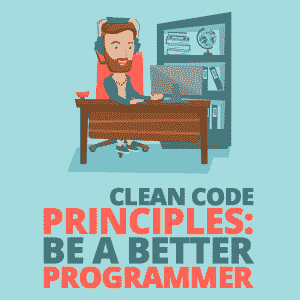

# 干净代码原则:成为更好的程序员

> 原文：<https://simpleprogrammer.com/clean-code-principles-better-programmer/>

“My code is working well, the website I built is looking great, and my client is happy. So why would I still care about writing clean code?”

如果这听起来像你，那么继续读下去。

不久前，我和我的一个朋友卡比尔进行了一次讨论。卡比尔是一位经验丰富的程序员。他正在做一个复杂的项目，他正在和我讨论一个问题。当我要求看那个问题的代码时，他说，听起来很自豪，“我建立了这个项目，所以我们是唯一能理解代码的人。”

我非常害怕。我问他是不是故意写脏代码。

“客户没有给我足够的时间，”我的朋友告诉我。“他总是匆匆忙忙，催着送货，所以我没有时间考虑清理。”

当我问及肮脏代码时，这几乎总是我听到的借口。

一些程序员写脏代码，因为他们计划发布第一个工作版本，然后努力使它干净。但是它不起作用；没有客户会给你时间清理代码。一旦第一个版本发布，他们会催促你第二个。所以，养成一种习惯，从代码的第一行开始就尽可能干净地编写代码。

我一直都知道使用干净代码原则有很多好处，这篇文章会告诉你为什么。

项目经理、销售主管或客户的工作就是在最短的时间内完成项目，这样他们就可以控制项目的成本。但是作为程序员，生产高质量、干净的代码是你的职责。

编写干净的代码并不是一个大的或者费时的任务，但是让它成为你的例行公事，并致力于它，将会对你的职业发展和作为程序员提高你自己的时间管理和生产力大有帮助。

干净的代码总是看起来像是由关心它的人写的。

> “任何傻瓜都能写出计算机能理解的代码。优秀的程序员会写出人类能理解的代码。”—马丁·福勒

您读到这里可能有两个原因:首先，您是一名程序员。第二，你想成为一个更好的程序员。很好。我们需要更好的程序员。

继续阅读，了解为什么干净的代码很重要，你会成为一名更好的程序员。

## 为什么我们要争取干净的代码？

无论读者是代码的作者还是新程序员，干净的代码对每个人来说都是可读和易于理解的。

编写干净的代码是一种必要的心态。编写干净和结构化的代码需要练习，随着时间的推移，你将学会这样做。但是你需要从这样写的心态开始。你将习惯于回顾和修改你的代码，使它尽可能的干净。

没有人是完美的，所以你也不是。几天或几周后，当你回来检查你的代码时，你总会找到一些机会来改进或重构代码。因此，从代码的第一行开始尽可能干净地编写代码，这样以后您就可以在性能和逻辑改进方面做更多的工作。

## 干净代码的好处

“为什么我应该关心编写干净的代码？”你可能还在问自己。

有很多原因可以让你进入我上面描述的干净代码的思维模式。一些最重要的原因是:

### 更好地利用你的时间

干净代码的第一个受益者是程序员自己。如果你在一个项目上工作了几个月，很容易忘记你在代码中做的事情，尤其是当你的客户带着修改回来的时候。干净的代码行使得修改更加容易。

### 新团队成员更容易入职

使用干净代码原则有助于让一个新的程序员加入进来。理解代码不需要文档；新程序员可以直接跳进去。这也节省了培训新程序员的时间以及新程序员适应项目的时间。

### 更容易调试

不管你写的是脏代码还是干净代码，bug 都是不可避免的。但是干净的代码将帮助你更快地调试，不管你有多少经验或专业知识。

而且你的同事或者经理帮你解决问题的情况并不少见。如果你写了干净的代码，没问题:他们可以帮助你。但是如果你的经理不得不处理你的肮脏代码，那么，你可能会像我的朋友卡比尔一样。

### 更高效的维护

> “当然，坏代码可以被清理掉。但是很贵。”罗伯特·马丁

维护不是指修复 bug。随着任何项目的增长，它将需要新的特性，或者对现有特性的改变。

您知道任何软件项目的主要成本都在维护上吗？公司总是会尽早发布第一个版本，或者最小可行产品(MVP)。随着软件的使用越来越多，额外的或新的特性总是事后才想到的。干净的代码使维护变得相对快速和容易。

前三点解释了干净的代码如何节省程序员的时间。并且，每天节省一点时间将对软件的交付时间和成本产生复合影响。这对你的公司有好处。

### 你会感觉很好

Does it help you feel confident to share your work with others, too? Or with your client?
If you’re writing quality, clean code, you should feel super confident. You should not have a fear of breakdown; you can fix defects faster.

这意味着你可能也喜欢这个程序。

那么，如何编写干净的代码呢？

## 如何编写干净的代码

> "你应该像给第一个孩子命名一样小心地给一个变量命名。"
> ―罗伯特·c·马丁，*干净的代码:敏捷软件工艺手册*

程序员是作者，但他们可能会在识别受众方面犯错误。一个程序员的受众是其他程序员，而不是计算机。如果计算机是观众，那么你可能用机器语言写代码。

所以，为了让你的读者容易理解，你应该为变量、函数和类使用有意义的命名法。并通过在适当的地方使用缩进、短方法和短语句来提高可读性:

*   为变量和方法使用容易发音的名字。不要在变量名和方法名中使用缩写。使用完整形式的变量名，这样它就容易发音，每个人都能理解。

| 肮脏代码示例 | 干净代码示例 |
| --- | --- |
| public $ notiSms
public $ add CMT； | public $ notify SMS
public $ add comment； |
| foreach($ people as $ x){
echo $ x->名称；
} | foreach($ people as $ person){
echo $ person->名称；
} |
| $ user-> create user()；createUser 方法没有意义，因为它是在 User 类中编写的。 | $ user-> create()；
去除冗余 |

*   **用名字来表示意图。**阅读变量名称的人应该能够理解变量的用途。写下你会说的名字。

| 肮脏代码示例 | 干净代码示例 |
| --- | --- |
| 受保护的$ d；//以天为单位的经过时间 | 受保护的$ elapsedTimeInDays
受保护的$ daysSinceCreation
受保护的$ daysSinceModification
受保护的$ fileAgeInDays
 |
| if('已支付' = = = $申请->状态){
//处理已支付申请
} | if($ application-> isPaid()){
//处理付费申请
} |

*   **不要创新；简单点。**展示逻辑上的创新，而不是命名变量或方法上的创新。有一个简单的名字让每个人都能理解。

| 脏代码示例 | 干净代码示例 |
| --- | --- |
| $ order-> letItGo()； | $ order-> delete()；
 |

*   **保持一致。**相似的功能用一个字。不要在一个类中使用“get”而在另一个类中使用“fetch”。
*   不要犹豫在名字中使用专业术语。继续，使用技术术语。你的程序员同事会理解的。例如，“jobQueue”比“jobs”好。
*   在 method 中使用动词作为第一个单词，在 class 中使用名词。使用 camelCase 作为变量和函数名。上课要从首都开始。

| 肮脏代码示例 | 干净代码示例 |
| --- | --- |
| 公共函数 priceIncrement() | 公共函数增加价格() |
| public
$ length validate subdomain | public $ validateLengthOfSubdomain； |
| 类别计算实例 | 阶级激励 |

*   使用一致的命名约定。始终使用大写字母，用下划线分隔单词。

| 脏代码示例 | 干净代码示例 |
| --- | --- |
| define('APIKEY '，' 123456 ')； | define('API_KEY '，' 123456 ')； |

*   **使功能显而易见。**保持一个函数尽可能的短。我理想的方法长度是 15 行。有时它可以更长，但是代码应该在概念上清晰易懂。
*   保持参数少于或等于三个。(如果参数多于三个，那么你必须考虑将函数重构为一个类。)

您还应该将一个函数或方法限制在一个任务中。(避免在方法名中使用“and”，如“validateAndSave”相反，创建两个方法，一个用于验证，另一个用于保存)。

缩进也很重要。您的干净代码必须使用四个空格进行缩进，而不是 tab 键。如果您已经习惯使用 tab 键，请更改您的 IDE 设置，使 tab 键表示四个空格，而不是通常的五个。

如果你的方法有三个以上的缩进，那么是时候用新方法重构了。

*   **类和对象的行为。**一个班要做一件事。如果是为了用户，那么所有的方法都必须完全为了用户体验而写。
*   不要评论糟糕的代码。如果你必须添加注释来解释你的代码，这意味着你需要重构你的代码并创建新的方法。只有在法律要求或者你需要对程序的未来或历史做记录的情况下，才进行注释。

| 脏代码示例 | 干净代码示例 |
| --- | --- |
| //检查该员工是否有资格获得全部福利
if($ employee->flags&&self::HOURLY _ FLAG&&$ employee->age>65) | if(＄employee-> iseligibleforfull benefits())
 |

*   使用 Git 记录版本历史。有时候，特性改变，方法需要重写。通常，我们注释掉旧代码，因为担心客户会掉头要求旧版本。但是如果你使用 Git 版本控制系统，它会保存所有的版本，所以没有必要保存死代码。删除它，使你的代码干净。
*   避免使用大型数组。避免为大数据集做数组；相反，请使用类。这使得它可读性更好，更不用说它为您的应用程序创造了额外的安全性。
*   **不要重复代码。**每次写方法的时候，问问自己类似的东西是不是已经构建好了。查看代码库或其他文档。
*   **不要硬编码。**定义常量或使用变量，而不是硬编码值。使用该变量不仅使其可读，而且如果在多个地方使用，也使其易于更改。

| 脏代码示例 | 干净代码示例 |
| --- | --- |
| if (7 == $today) {
返回‘今天是假日’；
} | const 星期六= 7；
if(self::SATURDAY = = $ today){
返回‘今天是假日’；
}

 |

*   使陈述具有可读性。为了使语句可读性更好，请保持该行较短，这样就不需要水平滚动来阅读完整的一行。

## 更干净代码的一些其他技巧

****

**自己审查你的代码。**偶尔检查一下你的代码。我相信你每次重访都会发现新的需要改进的地方。

与你的同事一起检查你的代码。检查您同事的代码，并请他们检查您的代码。不要犹豫考虑建议。

每种语言都有自己的命名约定。如果你是为 PHP 编写，使用 [PSR-2 的编码风格指南](https://www.php-fig.org/psr/psr-2/)。

为了提高代码的质量，你应该使用 [TDD 方法并编写单元测试](https://simpleprogrammer.com/tdd-unit-testing/)。测试驱动开发使代码更改变得容易；你不需要担心代码崩溃。如果您犯了任何错误，单元测试将会失败，并且您将会知道失败的测试用例以及导致失败的代码块。

使用 [Git 版本控制系统](https://www.successfuler.com/basic-git-commands-with-examples/)来协作开发。当多个程序员在一个项目上工作时，Git 成为一个必不可少的工具。如果您使用版本控制系统，代码审查会变得很容易。

为了将来的阅读，看看罗伯特·c·马丁的 [*干净的代码*。](https://www.amazon.com/Clean-Code-Handbook-Software-Craftsmanship/dp/0132350882/)

## 向更干净的代码前进

编写干净的代码有很多好处，很容易看出为什么。

有了这些建议，你就可以很好地编写每个人都能理解的代码——从长远来看，这将使你的生活更轻松。

这将有助于你的同事、你的团队以及你的雇主。