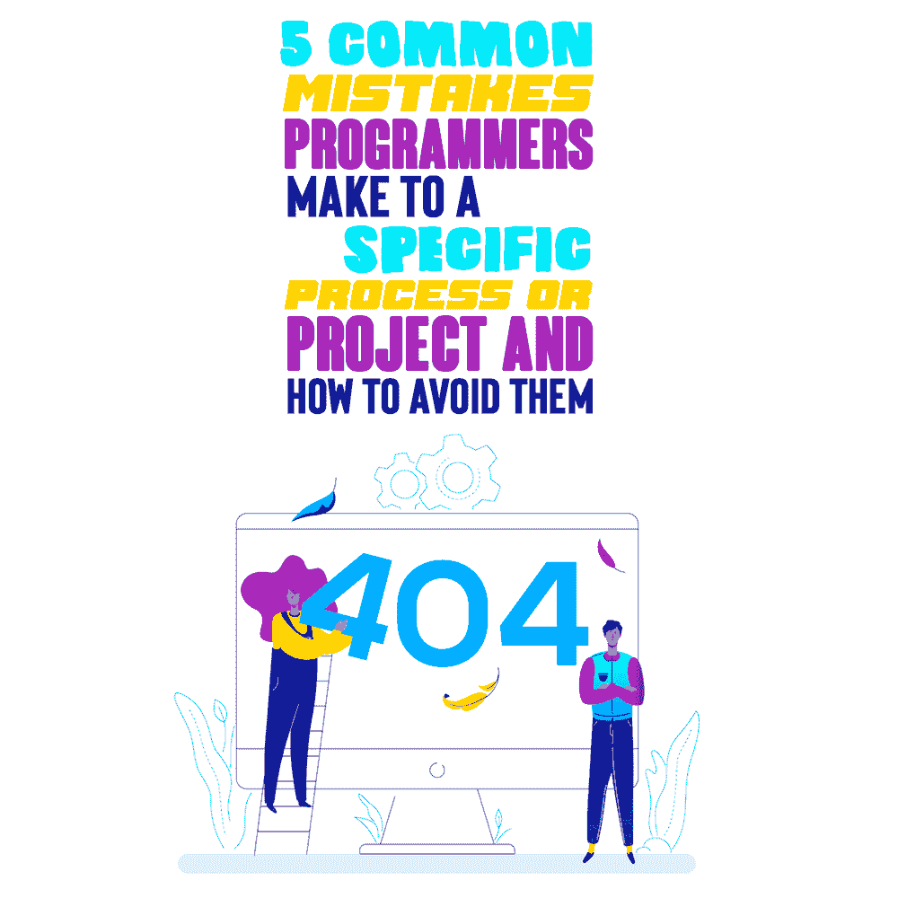

# 程序员在特定过程或项目中常犯的 5 个错误以及如何避免它们

> 原文:[https://simple programmer . com/common-errors-programmers-make/](https://simpleprogrammer.com/common-mistakes-programmers-make/)

Programming mistakes are going to happen from time to time. Even the most brilliant coders make errors occasionally. We’re all human, after all!

也就是说，编程需要精确性和准确性才能正常运行。如果一个程序员犯了太多的错误，他们的代码就不会工作。如果你的代码不是生死攸关的情况，偶尔的错误不应该成为问题，但是频繁的错误可能会让你失去信誉，甚至丢掉工作。

如果你想成为一名更好的程序员，你需要了解最常见的错误，这样你就可以避免它们。这里有五个你应该避免犯的错误。

## 在我们谈论编程错误之前，我们先来谈谈错误

错误几乎可以存在于程序的任何地方，但是有三种主要类型的错误会导致代码中的 bug。这三种错误类型是:

*   句法
*   逻辑
*   运行时间

编程语言的语法描述了应该如何编写代码才能正常运行。虽然许多程序员知道几种编程语言，但是它们之间有很大的区别，语法错误会使程序完全失去功能。拼写错误和缺少括号只是语法错误的两个例子。

逻辑错误不太可能完全阻止程序运行，但可能会使程序以意想不到的方式运行。偶尔，程序员会不小心创建一个无限循环，这是一个逻辑错误的例子。这些可能是最难查明的错误。

最后，程序运行时会出现运行时错误。这些错误会导致崩溃。

编程错误并不总是导致错误，但是当错误出现时，知道您正在处理哪种错误是至关重要的。没有一个程序员可以完全避免错误，但是理解它们是如何工作的可以帮助减少错误。

## 常见的编程错误&如何避免它们

### 1.错误的变量命名

写代码的时候，你应该总是努力做到尽可能的清晰。当你或其他人返回代码时，他们应该能够马上理解它。这意味着[避免单字母变量名和不清楚的缩写](https://www.samanthaming.com/tidbits/36-bad-variable-names-to-avoid/)。

不要让你的变量名晦涩难懂(也就是说，不要编造一些东西)。对于以后需要使用代码的人来说，这只会增加难度。在给变量命名时，不要试图变得聪明或有创造性！清晰更重要。

### 2.不使用注释

同样，这又回到了使你的代码易于解释的问题上。程序员必须使他们的代码清晰易懂，便于人和机器理解。

您可能最终会让同事审查甚至修改您的代码。有些新手根本不使用注释，这会使代码难以阅读，或者使工作看起来极其混乱。

另一方面，有可能使用太多的注释。它们会碍事，提供冗余信息，并需要维护。在你发表评论之前，问问你自己:这真的有必要吗？

当有可能代码对于有能力的程序员来说不是自解释的时候，使用注释。一些很好的注释应用包括在修复一个 bug 后做笔记，使用外部引用，解释看起来不必要但对程序保持功能性很重要的代码。但是请记住，好的注释并不能弥补糟糕的代码。

### 3.缺乏一致性

许多新的程序员不考虑将来的代码维护。但是如果有人几个月或几年后重访你的代码，如果你的代码缺乏一致性，他们会非常非常恼火。编程是一门抽象艺术，即使是在已建立的语言中，你必须在每个项目开始时创建你的约定，并坚持它们。

这看起来像什么？嗯，它可能[涉及几个不同的因素](https://queirozf.com/entries/on-coding-consistency)，包括命名约定的一致性、代码格式(比如括号放置)和方法设计。许多组织都有程序员应该遵循的风格指南。

你可能会争辩说，只要代码有效，这并不重要。但是，如果您曾经不得不与他人不一致的编程工作一起工作，您就会知道遇到命名和约定的差异是多么令人恼火..

### 4.创建笨重的函数

如果有必要的话，应该将函数分解，以创建干净和精简的代码。想想保养！如果创建大型函数，维护程序就变得很麻烦。较小的功能更容易操作，并允许更集中的维护。

如果你尽可能地简化事情，创建一个函数式程序会更容易。简单实际上感觉起来像是更多的工作，但是一个伟大的程序员明白保持事情简单以减少以后工作的力量。

### 5.不问问题

如果你在与某件事做斗争，或者你不知道如何继续，你可能会感到害羞。那很正常！但是拒绝提问会让你陷入大麻烦。

网上有很多资源，所以在直接问别人之前，看看你的问题是否已经有人回答了是个好主意。[像“什么是回文串”这样的基本问题](https://www.softwaretestinghelp.com/coding-interview-questions/)大概不需要去找你老板。但是如果你有一个关于你正在做的代码的具体问题，而你又找不到答案，那就去问吧！

在这个行业呆久了的人，通常都很乐意分享自己的知识。他们喜欢谈论代码。继续[提出你的问题](https://www.makeuseof.com/tag/common-programming-coding-mistakes/)——你会成为一名更好的程序员，避免许多编程错误。导师、老板、同事或老师应该能够帮助你！

## 要避免的其他错误

### 选择一种晦涩的编程语言

If you’re looking to become a programmer, don’t choose some obscure language in hopes that it will become the next big thing and you’ll be on the cutting edge. [Learn a programming language](https://online.maryville.edu/online-bachelors-degrees/computer-science/what-programming-languages-should-i-learn) that everyone is using, like [Python](https://simpleprogrammer.com/5-benefits-of-python/) or Java. You’ll have access to more resources and opportunities.

### 没有备份您的代码！

几乎每个人都知道因为忘记点击“保存”而丢失学校论文的痛苦这同样适用于您的代码。坚持备份——你永远不会后悔保存你的工作，但你会永远后悔丢失它。

### 累了就编程

当你累的时候工作从来都不是一个好主意。这会导致草率和[决策疲劳](https://onlinemba.wsu.edu/mba/resources/decision-fatigue/)，从而导致错误。好好睡一觉后，你会更有效率！

### 变懒了

许多最常见的编程错误归结于懒惰和草率的工作。不要偷工减料，让那些必须为你的代码工作的人日子更难过。慢慢来，保持一致，并创建您可以引以为豪的代码！

## 避免这些错误，成为明星程序员

每个人都会犯错。但是这些错误通常是可以避免的，只要多加小心和注意细节。作为一名程序员，你应该着手做的不仅仅是创建函数式程序——你应该致力于创建人类和计算机都能理解的函数式程序。

明星程序员并不总是创造最创新程序的人。有时，他们只是创建程序的人，这些程序能够工作并经得起时间的考验。用干净、无错的代码让你和你的同事的生活变得更轻松，成为一名明星程序员。