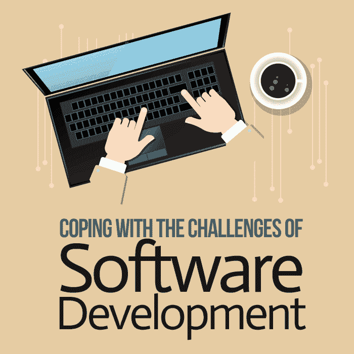
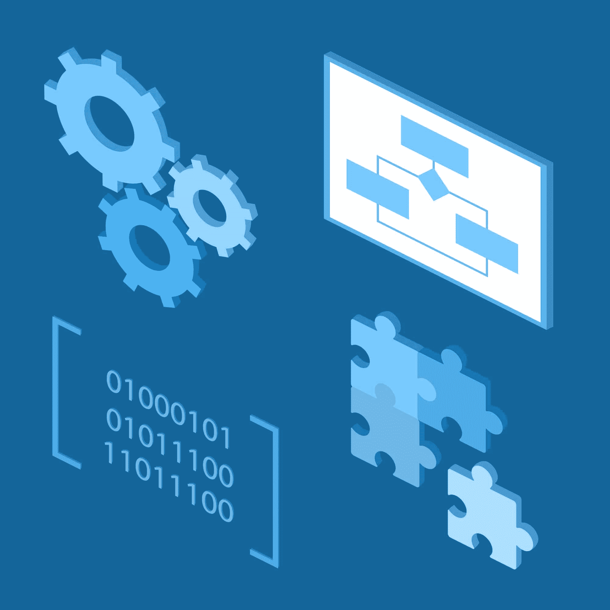

# 应对软件开发的挑战

> 原文：<https://simpleprogrammer.com/coping-challenges-software-developer/>

The Information Technology (IT) sector is arguably the fastest growing and most in-demand industry, as technology is now a vital component of modern life and a significant driving force behind the global economy. The more that is accomplished by technological solutions, the higher the expectations become as people create more and more requirements.

软件开发是一个庞大而复杂的行业不可或缺的一部分。虽然对于任何 it 专业人员来说，对系统中的一切如何协同工作有一些基本的了解是必不可少的，但并不要求对每个方面都有深入的了解。即使在软件开发中，编程的基础可能是相同的，但是实际的细节根据使用的开发工具和系统的需求而不同。

由于 IT 行业的复杂性，人们倾向于专业化，并在特定领域建立自己的职业生涯。本文基于业务软件应用领域的经验，但是其中一些挑战和解决方案也适用于 IT 领域的其他学科。

毫无疑问，软件应用程序开发是一个智力过程，需要对计算的基础及其在现实生活问题的技术解决方案开发中的应用有坚实的理解。有一个坚实的基础，如计算机学位是必不可少的，因为它灌输了一个基础知识，可以进一步发展为任何特定学科的相关知识。

与普遍的看法相反，一个人不需要成为超级书呆子才能成为软件开发人员，但是对他们来说充满激情并愿意付出努力是绝对必要的。

技术知识可以通过学习获得，但是成功的专业软件开发所需的技能是通过学习和经验逐渐形成的。解决问题的心态和建立并遵循解决问题的系统方法的纪律是成功的关键因素。

这篇文章是根据我作为一名软件开发人员在 IT 行业的个人经历撰写的，我意识到需要做更多的工作来吸引和留住这个行业的开发人员。我的目的是传达软件开发中面临的挑战，以及如何通过采用一些简单的策略来克服这些挑战，从而享受一个有益的职业生涯。

在我们研究应对机制之前，很重要的一点是要很好地理解软件开发作为一种职业所面临的挑战。

## 软件开发的挑战

## 

T2】

软件系统是复杂和无形的。软件专业人员从概念上设计和开发他们的产品。通常，软件系统的体系结构由几个程序和不同程序组件之间的关系组成。这些程序被精确地定义和组织在系统结构的不同层次上，以实现有效和准确的信息流。

此外，大多数系统受行业特定的安全标准的控制，这些标准必须纳入设计中。应用程序可能还必须与其他外部系统进行交互，这要求它符合其他系统的数据格式和安全要求。系统的规模和解决的实际问题也归因于系统的复杂性。

作为一名开发人员，您需要从整体上理解系统，并且很好地理解您所开发的软件适合哪里。

程序是在编程语言或开发框架的限制下编写的。有许多开发工具可用于开发软件应用程序，合适的工具取决于硬件、操作系统和软件要求。软件开发人员面临的挑战是很好地理解他们开发的系统的不同选项，以便选择最合适的选项。

软件业面临的另一个挑战是技术的快速发展，这种发展不断推动着软件需求和设计的变化。一个应用程序今天可能是好的，但它的底层技术过时并需要升级只是时间问题。由于这种不断的移动，软件应用程序是易变的，必须在设计时考虑到易于更改。

应用程序的用户友好性是软件专业人员不得不应对的另一个问题。最终用户是软件应用程序的主要利益相关者，他们决定了系统的成败。用户通常不关心解决方案的复杂细节，而是真正关心它的易用性。

无论软件解决方案如何完美地解决给定的问题，如果最终用户发现它难以使用，他们很可能会拒绝它。软件开发人员面临的挑战是设计一个解决方案，不仅要满足功能需求，还要有一个用户友好的界面，给用户带来积极的体验。

Steve McConnell 在他的[书 *Code Complete* 、](https://simpleprogrammer.com/codecompletebook)中详细阐述了这些以及其他使软件构建变得复杂的因素。

## 应对软件开发的策略

像任何已建立的学科一样，随着时间的推移，软件工程师已经开发出一些机制来使工作易于管理，甚至看起来如此简单和优雅，以至于吸引了更多的观众。一些策略在软件工程文献中有很好的记录，但是实际应用中，当面对现实生活中的问题和迫在眉睫的最后期限时，很容易被忽略。

我已经从导师或我工作过的企业文化中获得了几种面对软件开发挑战的方法。为了我的个人利益和职业成熟，我有意采用这些实践。经过深思熟虑，您也可以实现这些实践中的每一个。

### 1.保持事情简单

软件系统是复杂的。理解和解决一个复杂问题的最有效方法是简化它。这是通过从一个问题的整体方法开始，递归地分解它，直到你得到它的最简单的子系统，而不失去预期的目标。那么你应该保持简单的解决方案。

这个设计概念在麦康奈尔的[书](https://www.amazon.co.uk/Code-Complete-Practical-Handbook-Construction/dp/0735619670)第五章中有解释。它植根于分而治之的理论，任何复杂的问题都可以分解成最简单的部分，用简单的方法就可以解决。这种思想还意味着，当面对不同的实现选项时，您会有意选择最简单的适用选项。

你可以学习如何让事情变得简单。这是一个积极追求的目标，也是一个有意应用的目标，以便为复杂的问题找到优雅的解决方案。简单的解决方案更容易开发，并且保证未来的变化不会成为实现的噩梦。

软件开发人员的目标应该是使用最简单的方法来满足操作需求，而不损害操作需求、效率和可扩展性。以下是实现简单性目标的一些实际步骤:

不要做不必要的事。

编写代码时，只写完成工作所需的最少部分——不多也不少。

就理解和维护而言，程序越大，就可能越复杂。如果要实现的解决方案需要已经存在的代码逻辑，请避免重复，而是重用现有的代码。

因此，如果出于某种原因需要更改逻辑，那么只有一个地方可以进行更改，从而使维护变得更加容易。新代码也应该被很好地分解，以便在需要时可以重用。

遵循既定的开发标准。

一个程序文件在其生命周期中很可能由不同的开发人员编写和维护。每个开发人员对于代码应该如何编写都有自己的看法，如果每个人都遵循自己的风格，那么代码将非常难以阅读和调试。

为了保持过程简单，不要担心你个人的代码编写风格。相反，要知道组织已经建立的编码标准，并坚持下去。如果所有开发人员都遵循相同的标准，我们就不必处理不可读代码带来的不必要的复杂性。

从同事那里获得反馈。

质量控制的同行评审也应该用于明确检查解决方案的简单性。如果另一个开发人员发现很难理解您的代码逻辑，那么这可能不够简单。作为一名开发人员，你需要接受来自同行的反馈；你也可以在评论别人的作品时提出更简单的选择。

一边做一边测试你的工作。

优雅和品质应该齐头并进。编程中的质量保证不应该被视为事后的想法，或者在编写了数百行代码后被作为最后一项任务。

在增量阶段开发您的解决方案以及在开发过程中对代码覆盖率进行单元测试要简单得多。这种方法将确保当不同的组件相互连接时，每一行代码都按照预期的方式运行。试图一次测试所有的东西是不必要的，而且很有可能代码覆盖测试无法完成。

### 2.投资领域/功能知识

### 

T2】

软件应用程序开发也称为解决方案开发。有了这种意识，任何问题都可以得到更有效的解决。

领域知识可能不是软件开发人员的要求，但是对于开发人员来说，理解他们必须自动化的环境和过程而不必完全依赖业务分析师是有益的。

由于软件开发本质上是将领域知识转换成代码行，因此软件开发人员用他们开发和维护的系统的功能知识来补充他们的技术技能是有益的。

正如约翰·桑梅兹的[书*软技能*第四章所强调的那样，](https://simpleprogrammer.com/softskills)软件开发人员不仅仅是写代码；他们花相当多的时间与人打交道。

拥有领域知识意味着您可以在概念层面上做出贡献，并根据您对业务或过程目标的理解，给出阐明需求的见解。当您能够利用您的技术技能来指导利益相关者实现什么目标时，这种优势尤其明显。

它还包括对领域内重复出现的问题和已知解决方案的理解。这种知识来自经验，因此，问题可以更有效地解决，因为问题和解决方案都是众所周知的。

主动学习相关领域是一种个人责任，它使您作为开发人员能够更优雅、更高效地完成工作。它使你有资格了解你工作的环境，包括利益相关者的需求。

它需要个人承诺从各种来源寻找相关信息，包括系统文献和操作手册；您甚至可能需要花时间与最终用户在一起，以便很好地了解他们如何使用系统来支持他们的日常操作。

个人成就感来自于知道你的工作如何有助于一个组织的目标。当你对你工作的领域有了很好的理解和热情时，作为一个软件开发人员，你会变得更有动力，知道你的贡献所带来的不同。除了使解决方案设计和开发更容易，领域知识还为职业发展铺平了道路，因此这是一项值得的个人投资。

### 3.跟上不断变化的技术

技术进步是软件行业不可回避的事实，软件开发人员面临的挑战是跟上技术趋势并保持相关性和生产力。

与 10 年前相比，编程语言、框架和方法发生了很大的变化，而且它们仍在不断发展。软件开发人员需要对新的趋势保持开放，学习新的方法，并保持在技术的边缘，以有效地工作。以下是你可以采取的一些实用步骤，以便在这个充满活力的行业中保持相关性:

承担持续学习的个人责任。

知识和技能是软件开发的关键资产。因此，勤奋和有意识地掌握一些技能对这个行业的职业发展和相关性当然是至关重要的。

通过投入时间和精力，甚至是工作之外的时间和精力，对自己的学习负起个人责任，理解新兴技术背后的概念以及它们试图解决的问题。这种理解将有助于你欣赏和拥抱新趋势，以及它们为你的工作带来的更高的生产力。

根据 John Sonmez (2015) 的说法，“最成功的开发者并不是偶然获得成功的。他们心中有一个目标，并为实现该目标制定了一个可靠且经过深思熟虑的计划。”

让你的学习有目的、有重点。

随着技术日新月异的发展，试图跟上所有的新趋势将会令人望而生畏。为了保持动力，关键是要明智地选择要学习的新东西，不要错过任何与你的工作相关的重要内容。

根据适用于你的工作或你有强烈兴趣的东西来集中你的学习努力。这样，就更容易建立和完成个人目标，并超越职业期望。

建立你的学习资源。

一旦你知道了你需要关注的领域，你就需要确定学习的方式和地点。根据您使用的技术、您工作的行业或您开发的软件类型，有大量的资源。重要的是找到符合你的学习目标和风格的资源，并以对你有益的方式使用它们。

### 4.照顾好你的健康

作为一种职业，软件开发可能非常有成就感和回报，但也可能充满压力。这需要很高的精神要求，需要集中精力处理交易中出现的各种复杂情况。

此外，试图跟上 amazon.com/…N/0932633439/makithecompsi-20 科技日新月异的步伐，长时间坐在电脑前会对身心造成损害，给软件开发人员带来不同程度的压力和疲惫。

汤姆·狄马克和蒂莫西·李斯特(1999) 探索了各种人力资本管理技术以及如何让人们在软件项目中保持积极性。我选择了本节中反映的一些概念。

作为一名软件开发人员，的确，只有当你的大脑和身体健康时，你才是高效的。因此，绝对必要的是，你要有目的地确保你的需求得到满足，无论是身体上的还是精神上的。以下是我们可以做的一些事情来保持健康的身心:

保持健康的饮食，定期锻炼。

说到身体健康，不幸的是，没有什么可以替代锻炼。定期参加某种形式的体育活动的好处与工作场所的生产力密切相关。

锻炼会释放让你感觉良好的内啡肽，提高健康水平，帮助增强核心肌肉(可能因为整天坐在椅子上而处于休眠状态)，提高新陈代谢和免疫力，给你信心。这些好处不可低估，因为它们可能意味着在软件开发中勉强度日和打造成功职业生涯之间的差别。

通过锻炼改变心态可以产生更好、更有创意的结果。因此，重要的是要有一个个人健身目标，并参加一些活动，你可以坚持纳入你的日常生活。你会看到它对你的生产力和工作动力的影响。

健康的身体孕育着健康的精神，科学证明，均衡的饮食对你的精神健康有积极的影响。当我们长时间坐在电脑前，解决复杂的问题，赶着紧迫的时间表工作时，我们很容易忽视规律饮食的需要。当你的身体营养充足时，你就不太可能患上某些疾病或容易疲劳。

未能在工作和健康之间取得平衡会对你的健康和工作效率产生不利影响。选择定制你的生活方式，确保你吃得好并定期锻炼，这是一个个人有意识的选择，它将让你在一份精神上要求很高的工作中保持强大。

做一些你喜欢的事情。

当你试图保持相关性并保持生产力的边缘时，技术可以很容易地接管你的生活。抽出一些时间做一些你喜欢的事情是至关重要的。有一些爱好，参加一些和技术无关的活动。有意留出时间做一些你喜欢的、让你感觉良好的事情。这次做一些有趣的活动对你的情绪和心理健康都有好处，而且肯定会提高你的工作效率。

从工作中抽出时间也同样重要。在软件开发中，你需要一段时间来调整精神状态，这样当你回到工作中的时候，你就会精神饱满。休假还能让你重新点燃人际关系，这有助于建立工作与生活的平衡。这个假期对个人实现是必不可少的。

最后，当你不在工作的时候，你必须关掉工作模式，为你的家人和其他亲戚服务。人们有时把工作带回家并不罕见，但如果这是常态，那么你需要重新评估，因为从长远来看，总是“工作”对你的个人福祉和生产力是有害的。

### 深思熟虑的应对意味着事业成功

软件开发作为一种职业可能并不适合每个人，但它并不像许多人认为的那样困难。围绕这一职业的污名成为许多人理解这一职业有多么令人满意和容易获得的障碍。

围绕软件系统的复杂性和需求是非常真实的。压力和疲惫程度各不相同，取决于个人的应对能力。不同的人有不同的应对机制；没有灵丹妙药。

关键是要确定什么适合你，然后有目的地实施它，这样你就能享受职业生涯带来的成就感。没有必要变得超级聪明——重要的是有意识地去做有助于你应对的事情。