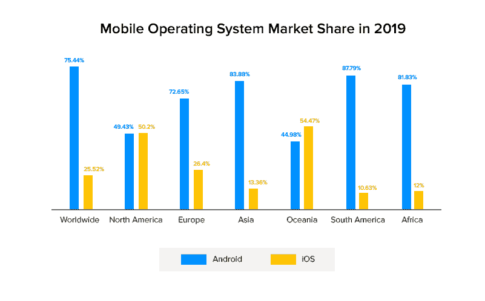

# 5 个跨平台应用开发框架将在 2021 年占据主导地位

> 原文：<https://simpleprogrammer.com/cross-platform-app-development-frameworks-2021/>

跨平台应用程序开发已经成为最热门的应用程序开发趋势之一，这是有充分理由的:随着像 Flutter 和 React Native 这样的平台在很大程度上得到开发，跨平台应用程序开发意味着在时间和精力以及金钱方面的重要节省。

然而，随着好处越来越多，一个新的问题出现了:在移动应用领域出现了数量[的跨平台框架，使得创业公司难以做出决定。](https://simpleprogrammer.com/app-cross-platform-development/)

在这篇文章中，我将向你展示创业公司可以选择的最好的跨平台应用开发框架。如果你是一名企业家，这将帮助你做出明智的决定，帮助你的公司。此外，如果你是一名软件开发人员，我会帮你记下这些工具。

## 跨平台开发方法的兴起

正如你在上面的图表中所看到的，Android 和 iOS 用户的隔离不利于任何一个操作系统。从全球来看，世界分为两部分。对于一个能够在尽可能短的时间内以最优的成本进入这两个平台的品牌来说，在竞争中胜出的机会大大增加。这种认识为跨平台开发框架奠定了基础。

在我们继续研究最好的跨平台开发工具之前，让我们看看为什么这种方法能让初创公司受益匪浅。

## 跨平台开发的好处是什么

用于移动应用程序开发的跨平台开发方法的优势带来了一系列好处。以下是让它成为初创公司最首选的选择:

*   **广阔的市场触角**。尽管我们都有最喜欢的操作系统选择，但我们不能让我们的偏见渗透到我们开展业务的平台上。跨平台应用程序可以在 Android 和 iOS 上使用，扩大了两个平台的市场覆盖范围，让初创公司获得了两个世界的最佳收益:Android 覆盖范围和 iOS 收入。
*   **单码库**。跨平台开发方法使您能够一次编写覆盖不同操作系统的代码。单个代码库对所有软件开发阶段都有影响，使您能够节省升级和修复两个独立代码的费用。
*   **快速廉价的开发**。由于开发人员必须在单个代码库上工作，设计、开发、维护或升级应用程序所需的时间比原生应用程序开发要少得多。显然，这在很大程度上降低了开发成本。
*   **平台不一致**。创业公司在跨平台开发中面临的最大挑战之一是在 Android、iOS 和 web 平台上的不一致性。然而，现代的跨平台工具打包了一些功能，使开发人员能够从单一平台创建特定于操作系统的应用程序。

现在，考虑到这些好处，是时候仔细看看创业公司可以使用的五个最佳跨平台框架了。

## 5 个最佳跨平台框架

### [离子型](https://ionicframework.com/)

Ionic 是基于 AngularJS 的最流行的跨平台框架之一。它使开发人员能够制作有创意的用户界面和直观的交互式应用程序。这也使得它非常适合 PWAs。

特点:

*   它是一个开源框架，允许修改代码结构。
*   它基于 SaaS UI 框架，该框架是为包含 UI 元素的操作系统设计的。这意味着，健壮的应用程序是 Ionic 应用程序开发的一个有保证的结果。
*   它基于 AngularJS 的事实使得为 HTML 语法提供扩展变得很方便。当在应用程序中添加有吸引力的组件和特性时，这很方便。
*   它使用 Cordova 插件，允许访问设备内置功能，如 GPS，相机和录音机。

### [颤动](https://flutter.dev/)

作为跨平台市场的一个相当新的产品，Flutter 是由谷歌在 2017 年推出的。然而，在很短的时间内， [Flutter 已经成为跨平台开发的理想选择](https://appinventiv.com/blog/flutter-cross-platform-mobile-app-development/)。这背后的原因是它为运行在 Android 和 iOS 上的应用程序提供的动态性和一致性。

特点:

*   它推广了一种便携式 GPU 来渲染 UI 功能，使其能够在新的界面上工作。
*   它不需要手动更新 UI 元素，因为它带有一个反应式框架。开发人员只需要更新变量，因为在此之后 UI 的变化就变得可见了。
*   事实上，它加速了开发过程，并且具有成本效益，这使得它成为 MVP 开发的理想选择。

### [反应原生](https://reactnative.dev/)

谈跨平台 app 开发，不能不提 react native。它是基于 JavaScript 开发的，用于编写代码，使应用程序在 iOS 和 Android 版本中具有原生的感觉。

该框架融合了 ReactJS 和 JavaScript 的最佳元素，并提供了用 Java、Swift 和 Objective-C 编写模块的优势。

特点:

*   它是一个开源框架，有大量的社区支持，帮助它修复问题和添加新的功能集。
*   它带来了一次性编码的好处，可以开发在 iOS 和 Android 上运行的应用程序。这也在很大程度上降低了应用程序的开发时间。
*   它对 UI 给予了特别的关注，产生了一个非常灵敏的界面。这意味着加载应用程序所需的时间大大减少。

### [Xamarin ](https://dotnet.microsoft.com/apps/xamarin)

作为一个简化的框架，用于构建 iOS、Android 和 Windows 应用程序。Net 和 C#， [Xamarin 和跨平台工具列表上的其他框架](https://www.amazon.com/dp/1617294381/makithecompsi-20)有很大不同。它使开发人员能够使用超过 90%的代码，否则这些代码将分别针对三种不同的平台和操作系统进行编码。

特点:

*   Xamarin 应用程序是在 C#的帮助下开发的，c#是一种对 Java 和 Objective-C 有强大杠杆作用的语言。
*   借助与通用设备功能一起工作的 API 和插件，它降低了硬件兼容性问题。
*   它提供了健壮的编译时检查，从而减少了运行时错误。

### [加速器钛](https://www.appcelerator.com/)

Appcelerator Titanium is one of the multiple cross-platform frameworks that are developed for assisting smooth app development. It is an amazing way for creating cross-platform applications with the help of a single codebase. The focus in the case of Appcelerator Titanium is on making app development streamlined with the native elements present in the JavaScript code.

特点:

*   它装载了几个快速应用程序开发工具。也就是说，它有助于快速创建原型。
*   它附带了 ArrowDB，这使得开发人员可以轻松地部署数据模型。
*   它带有为 MS SQL、MS Azure、Salesforce 等提供的预建连接器。

## 2021 年是跨平台软件开发年吗？

可以肯定的是，这种疫情持续得越久，对跨平台开发方法的需求就会越大。数字化转型的需求与有限的资金和团队资源相结合，将增加对多平台和单一代码库框架和工具的需求。

然而，我们不能忽视原生数字解决方案在质量和体验方面的优势。在这方面，我们可以预见框架在特性、开发和部署的便利性方面会有进一步的提升。

在这篇文章中，我向您展示了五个最好的跨平台开发框架，开发机构和企业一直依赖它们的多平台需求。每一种都有自己的优点和特点，所以研究它们会让你很好地了解自己的情况需要什么。

有了这些知识，下一步就是联系你的移动应用开发机构，讨论哪一个最能满足你的项目需求。