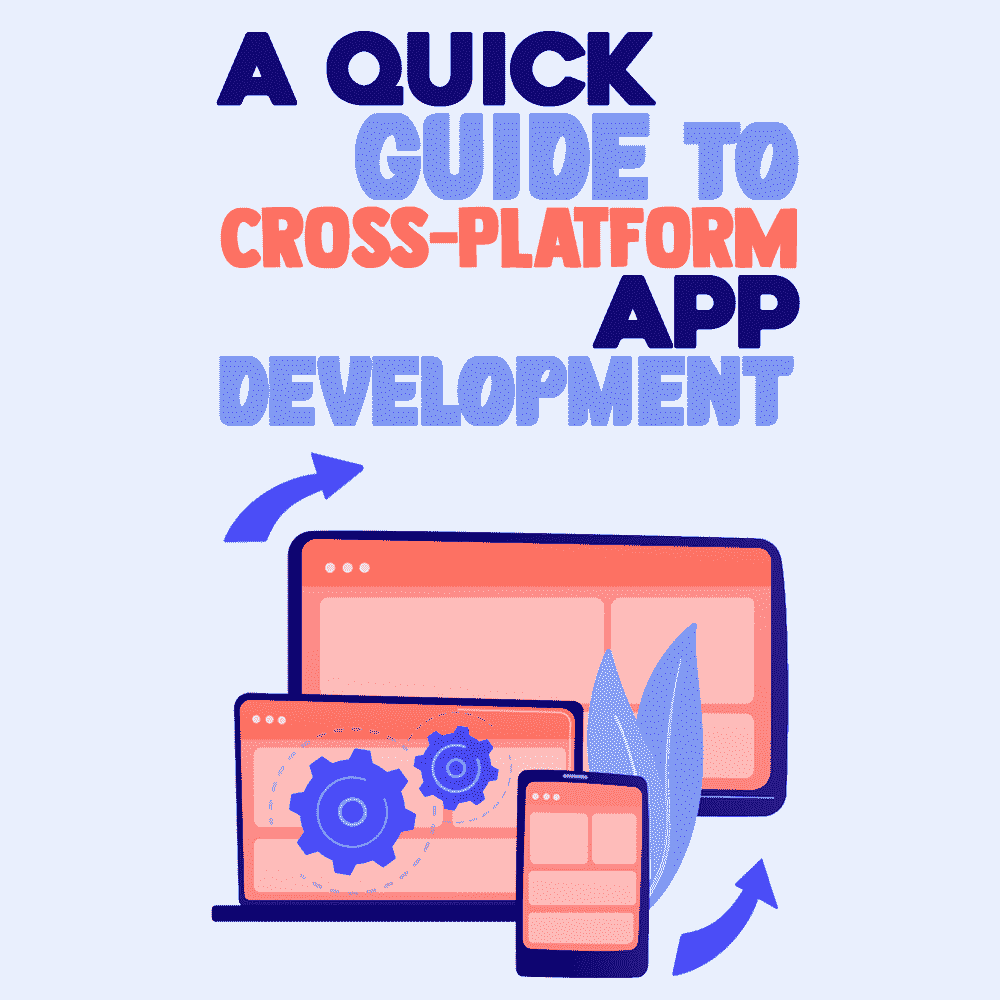

# 跨平台应用开发快速指南

> 原文：<https://simpleprogrammer.com/cross-platform-app-development/>

Mobile apps are everywhere. [More than 65,000 new Android apps](https://www.statista.com/statistics/1020956/android-app-releases-worldwide/) were released through the Google Play Store in the last month of 2021\. As a result of this competition, it is incredibly challenging for businesses to get their apps noticed.

即使一款应用引起了关注，也很难留住用户。平均来说，一个应用程序在三天后就会失去 77%的日活跃用户，而其中超过 95%的人会在三个月内消失。

怎样才能让一个手机应用程序受到关注*和*让用户继续使用它？有没有一个公式导致一眨眼的时间就有大量的 app 下载？如果你准备好学习秘制酱，你来对地方了。

在这本跨平台[移动应用开发指南](https://www.resourcifi.com/resources/ebooks/mobile-app/9-stages-mobile-app-development?utm_source=SimpleProgrammer&utm_medium=Offsite)中，我将讨论什么是跨平台应用开发，它与原生开发有何不同，它提供了哪些好处，以及当今企业可用的最佳跨平台应用开发框架是什么。简而言之，这将是你跨平台应用开发的完整指南。

## 什么是跨平台 App 开发？

兼容多个操作系统的移动应用程序被称为跨平台应用程序。这些应用是使用[跨平台框架](https://www.amazon.com/dp/B019EB9M9K/makithecompsi-20)开发的。

由于跨平台应用程序能够支持多种移动操作系统，因此越来越受欢迎。这样，通过使用单一代码库相对更快地发布产品，公司可以节省数千美元。Google 的 Flutter 和脸书的 React Native 是两个广泛使用的跨平台移动应用开发框架。

一些使用跨平台应用开发框架构建的流行应用包括:

*   《纽约时报》
*   照片墙
*   脸谱网
*   谷歌广告
*   网络电话
*   拼趣
*   彭博
*   特斯拉

## 跨平台应用开发与原生应用开发有何不同？

跨平台 vs 原生多年来一直是一个永无止境的争论。两者都是冠军，能够提供一个强大的移动应用。

然而，本地和跨平台应用程序开发方法之间有一些显著的差异。这些方法上的差异可以帮助你为你的最低可行产品和前进道路建立一个积极的策略。

因此，让我们仔细看看这两种方法之间的区别。

| **基础** | **原生** | **跨平台** |
| **用户界面/UX** | 特定于平台的交互式用户界面 | 各种应用的通用用户界面 |
| **定制** | 全部 | 完整，但因应用程序而异 |
| **人力** | 团队规模大；不同平台的不同团队 | 小团队对于所有平台都足够了 |
| **开发成本** | 相对高于跨平台 | 性价比高 |
| **使用的技术** | 对象 C，Swift，Java，Kotlin | JavaScript、C#、Dart |
| **性能** | 光滑的 | 性能问题可以通过某些变通方法来解决 |
| **第三方 SDK** | 出色的可用性 | 容易获得 |
| **易于开发** | 光滑的 | 光滑的 |

最终，不管 native 有多好，跨平台技术总是应用开发者和企业家的首选。我们来看看为什么。

## 跨平台 App 开发有什么好处？

既然您对跨平台 vs 原生有了一个概念，那么是时候进一步探索并了解跨平台[移动应用开发](https://www.resourcifi.com/blog/app-development?utm_source=SimpleProgrammer&utm_medium=Offsite)的好处了。

### 简单快速的开发过程

信息技术产业是世界上发展最快的产业之一。因此，如果你选择跨平台技术，你将能够更快地推出你的产品。因此，无论是开发人员还是企业都不必等待他们的初始版本。

### 受人喜爱

UI/UX 是任何应用未来成功的决定性因素之一。一个设计良好的用户界面会触动你的观众的心，而一个糟糕的用户界面会让他们困惑。在这里，跨平台技术创造了奇迹。

以这种方式设计的应用程序能够充分利用 UX 组件。这不仅简化了用户界面，还增强了整体设计。此外，这也是首席设计官(CDO)更喜欢跨平台应用程序(如 React Native)进行 UI 设计的原因之一。

### 接触广泛的客户群

曾经有一段时间，原生应用程序开发最为盛行。这意味着，如果一个应用程序是为 iOS 开发的，那么它只适用于 iPhone 用户，而不适用于 Android 或 Windows。

这种做法未能引起大众的注意，于是跨平台的 app 开发方法应运而生。现在，几乎所有使用跨平台框架开发的应用都可以在包括 iOS 和 Android 在内的各种操作系统上运行。

此外，还支持一些智能手表和智能家用电器/设备。这样，企业只需一个代码库就能最大限度地拓展业务。

### 快速简单的更新

正如我提到的，IT 和技术是世界上发展最快的行业之一。因此，应用程序往往会很快获得更新。然而，如果跨平台框架不可用，频繁更新应用程序(尤其是在更新中添加新功能)对于中小型企业(SME)来说绝对是一场噩梦。

[跨平台构建的应用](https://www.amazon.com/dp/B082D13TNV/makithecompsi-20)代码可重复使用高达 90%，这在不影响总收入的情况下大幅降低了成本。

### 成本效率

以如此低的成本获得如此多的好处，很明显，跨平台构建的应用程序很容易实现。即使是创业企业或预算紧张的人也可以用最少的投资开发他们的应用程序。

## 企业可用的最佳跨平台应用开发框架有哪些？

有很多跨平台的 app 框架可以免费使用。如果你让我挑选最好的，我会毫不犹豫地选择 React Native。然而，这里有一些最好的[跨平台应用开发框架](https://simpleprogrammer.com/cross-platform-mobile-development-ios-android-wp8)以及案例研究供你考虑。

## 你现在已经准备好开发一个跨平台的 App 了！

应用是趋势。他们是你的用户的需求。它们是伪装成小程序的真正的创收机器。许多企业已经在移动应用程序的帮助下站稳了脚跟，而且许多企业还在继续这样做。

从简单快速的开发到广泛的客户群，从快速更新到削减成本，跨平台开发肯定有很多好处。充分利用它们，让您的应用更上一层楼——简单的方法！