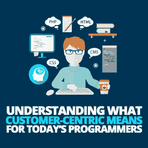

# 理解以客户为中心对今天的程序员意味着什么

> 原文：<https://simpleprogrammer.com/customer-centric-programming/>

Historically, software development centered around large, pre-configured milestones. A [team would work](https://simpleprogrammer.com/working-on-a-team/) on a new project leading up to release, stage an official—and sometimes very public—launch, and then move on to maintenance.

这意味着在可预见的未来，一些“活的”团队将致力于该项目，发布补丁、更新，甚至一些新特性。团队的其他成员将继续下一个大项目，在那里一切将重新开始。

一些开发团队仍然是这种结构，但是现在，他们是例外而不是规则。快速的技术进步、不断变化的消费者情绪以及创新的繁荣[改变了这个行业](https://thenewstack.io/modern-effective-software-development-15/)。您的客户需要一种新形式的模块化服务，旨在满足他们的需求和增长。

## 现代发展发生了怎样的变化

如今，团队不再专注于大规模发布。是的，它们仍然会发生，但是发展会持续到很久以后。公司不再只是维护产品；他们通过一个持续的交付过程来改进和适应它们。这允许开发团队交付一个不断运动的产品，而不是过去的静态应用程序。

往里看，这种改变似乎有点迫不得已，但实际上，这是自然而然发生的。市场变化和客户需求的转变引发了变革，这导致了新的、更活跃的软件和开发周期。

这个框架是今天软件开发的驱动力，也使得普通程序员或开发人员的前景完全不同。信不信由你，这是关于更加以客户为中心，关注你所服务的客户的需求。

因为它可能不会立即显现出来，所以首先理解为什么这种新的开发和设计理念被认为是“客户友好的”是有意义的

## 以客户为中心的开发是什么样的？

除了引用明显的“市场变化”，是什么让整个行业关注更积极、持续的开发周期？答案是客户需求或情绪。你的客户需要你做什么，你如何通过你的积极开发来进一步提高他们的效率和表现？

许多客户没有时间或耐心等待三到六个月的重大更新或新功能集。你总是可以声称这是由于千禧一代进入劳动力市场——他们现在要求几乎即时的反馈——但实际上，这是整个市场。

移动和现代技术使得我们可以随时随地互动、参与和消费内容。有了这些唾手可得的特性，我们现在希望它能渗透到渠道甚至企业中。此外，即时反馈有助于提高参与度和生产率，并灌输一种紧密团结的文化。

一直保持“在线”和连接，以及众多移动技术的存在，使得做过去不可能的事情成为可能。

通过持续的开发周期，您可以为移动应用程序交付增量的和定期的更新，例如，适应市场趋势、[安全问题](https://simpleprogrammer.com/security-from-the-start/)，或者甚至添加额外的支持。大多数人都将他们的设备设置为自动下载和安装上述更新，因此定期推送意味着你的客户几乎可以即时获得最新版本的应用程序或软件。

这也转化为商业和企业世界，公司必须确保他们的系统运行最新的代码，为及时的市场变化做好准备，并具有令人难以置信的响应能力和可靠性。他们必须准备好满足客户对超快速服务或交付的需求。

## 开发期间的客户反馈至关重要

过去的开发方法并没有减少对客户需求的重视，但是它通常在不同的时间考虑这些因素。例如，您可能会事先与客户会面，讨论出必要的特性和组件，然后带着这些信息进行开发。之后，你拿着接近最终的产品向那些受影响的人演示，目的是得到反馈——希望不要太消极。

如今，在整个项目过程中都会收集和权衡客户反馈，而不仅仅是在特定的接触点。例如，也许一个最近添加的功能不起作用，所以你和你的客户一起决定砍掉它。或者，您可能意识到在实时开发中，有些事情并不像它应该的那样高效，所以您与您的客户合作来寻找更好的解决方案。

然而，不仅仅如此。对于实时软件，您的客户通常在您使用它的同时使用它。这使您和您的团队能够更加动态地工作，即时适应客户的体验或需求。随着项目的发展，您甚至可能会发现或遇到全新的需求。

正是这种对灵活性的需求推动了对客户更友好的流程。这是创建以客户为中心的服务和项目的五个核心原则的一部分。

## 更加以客户为中心的技巧

Being “customer-focused” means adopting a more top-to-bottom approach. It calls for embedding your foundation and processes with a core question: What do your client and your client’s customers want?

这只有通过以下方式才能实现:

*   **可靠的沟通:**在整个项目中，你必须能够辨别出你的客户和你客户的顾客想要什么和需要什么，即使他们自己不能清楚地表达出来。这需要与相关人员进行密切而可靠的沟通，以及调整开发策略和工作进展以满足上述要求的灵活性。
*   **持续的反馈:**沟通提供了适应、改变和成长所必需的回顾和反馈信息，但这取决于你和你的团队如何整合你所学到的东西。为了跟随客户的愿景，你必须在整个项目中保持一个开放的反馈流和适应性。
*   适当的原型制作:即使是最精确的开发周期，最终产品也会在整个项目过程中发生相当大的变化。因此，重要的是利益相关者和客户有机会预览和体验项目。

## 客户成为设计伙伴、测试者和忠实用户

因为您的客户经常会使用您在后台开发的软件或工具，他们对整个运营来说是至关重要的。他们成为设计合作伙伴，提供关于特定功能或平台如何工作的见解。他们还充当 beta 测试人员，寻找您在预部署期间可能遗漏的 bug 或重大问题。他们成为你最忠诚和最早的追随者，为你的成功加油。

这正是像 IBM、Intuit 和 Rich 这样的公司如何彻底改革他们的开发过程，变得更加以客户为中心。不可思议的是，这不是强迫的。这不是你必须意识到的事情，也不是你需要支撑和支撑的事情。在实时开发过程中，您的客户自然而然地成为家庭的一部分，团队的一部分。

开发人员和程序员们，这就是在你们的开发和设计方法中变得更加“以客户为中心”的含义。