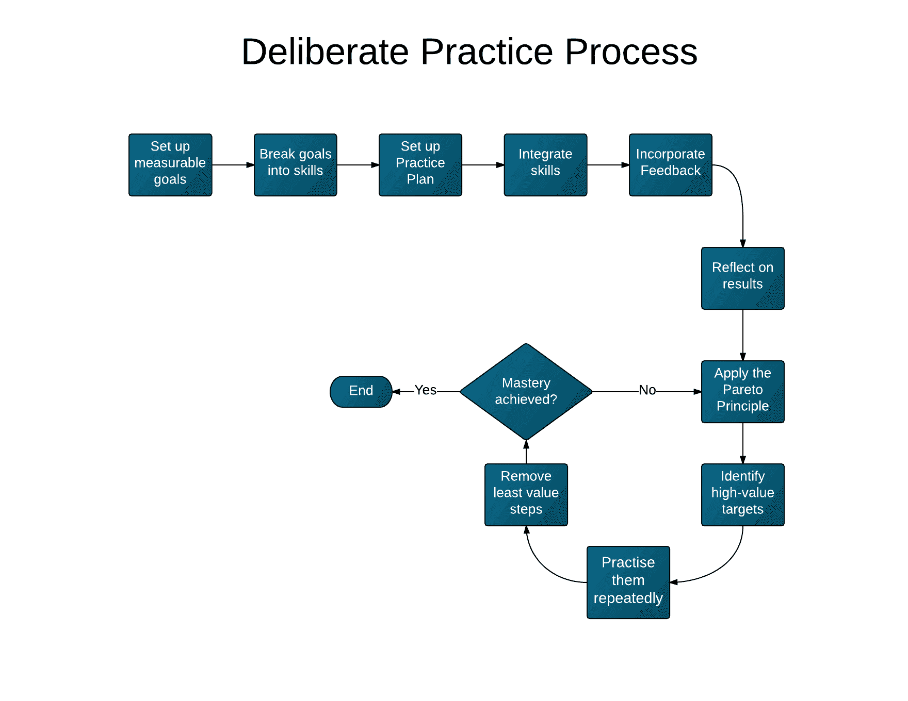

# 程序员的深思熟虑的实践:工作中学习的框架

> 原文：<https://simpleprogrammer.com/deliberate-practice-for-programmers-a-framework-for-learning-on-the-job/>

## **练习，练习，练习**

和大多数程序员一样，我对软件开发充满热情；对我来说，想要做得更好是很自然的。所以，我经常在网上查找如何做到这一点。

但似乎无论我看哪里，人们都在说:“练习，练习，练习。”我想:“好吧，那又怎样？”然后，我又看了一些，偶然发现了这样的事情:“多写些代码！”或者“程序员应该通过编程来练习编程。”

曾经问过别人关于职业的建议，而你得到的只是“追随你的激情！”我也有同样的感觉。

**“实践是成功的关键”**

我们已经听过很多次这样的陈词滥调了。

这种建议只会把我们引向一个地方:无处可去。

我不知道你，但当我要出去旅行时，我不想在不知道该走什么方向的情况下开始旅程。

## 

**在*之前你是否实际读过*开发者应该如何实践？**

为了寻找我们开发人员如何进行有意识实践的答案，我不得不阅读许多书籍，观看许多视频，并从博客上做大量笔记。现在，我想拯救那些和我一样经历挫折的人。我浏览了所有这些笔记和书籍，并把一些最好的想法整理成一个列表，希望你会喜欢并应用到你的工作中。

下面你会发现一个我们都可以尝试的 7 步框架。除了我建议的策略，你还可以结合自己的策略。

以下是该框架的概要:

1.  设定你可衡量的目标:知道你要去哪里。
2.  将目标分解成独立的技能。
3.  建立你的实践计划:你和你的同伴的操作程序。
4.  整合技能:理解他人的代码。
5.  整合反馈:坚持目标。
6.  反思你的结果:避免停滞。
7.  应用至关重要的少数法则:你的 80/20 是什么样的？

### **1。设定你可衡量的目标**

在没有明确目标之前，永远不要开始努力，尤其是在大型项目上。

你的头脑中应该有清晰的目标，这样它们可以帮助你避免在前进的道路上被不太重要的工作分心。

为了实现它，你需要对目的地有一个感觉。

糟糕目标的例子:*在年底前彻底理解 X 系统。*

一个更好的目标可能是:*在接下来的两周内了解 system X 的 3 个最常用的特性，A、B 和 C。*

请注意关于这个重新表述的目标的一些事情:

1.  子目标定义明确:“彻底”或“3 个最重要的特征”太模糊，除非这 3 个都列出来。
2.  他们有一个不太遥远的最后期限。应该是一个你可以合理估计的时间框架。

您接下来的步骤可能包括查阅架构图、查看用户界面或向同事询问应用程序的演示。这里的想法是获得一个高层次的感觉，你可以期望在项目中做什么。

同事在这里会对你特别有用:把他们当成你的导师。导师可以帮助你找到更重要的精力集中点，以及如何组织练习。

当你确定了你的高层次目标后，确保你理解了它们之间的相互关系。当目标一个接一个，当你完成每个目标时，它们会给你一种进步的感觉，以及项目的总体方向。

**提示**:当你承诺目标时，运用[一致性原则](http://en.wikipedia.org/wiki/Consistency_(negotiation))，让你的同事意识到它们，从而让你更有可能实现它们。

关于如何让这个想法为你所用的其他一些想法，我邀请你阅读[这篇文章](http://www.takebackyourbrain.com/2007/the-psychology-of-persuasion-consistency/)，它是基于我最喜欢的作者之一罗伯特·恰尔迪尼的的书。它向你展示了你如何在自己的生活中运用最强大的心理力量之一。

记住这句话:你打不中你看不见的目标。因此，确保你事先知道你想要实现什么。

**对于每个目标，问自己这些问题:**

*   你的目标可以衡量吗？你怎么知道你什么时候完成它？
*   它有明确的截止日期吗？
*   是否清晰且重点突出？
*   您可以使用哪些高级文档？
*   你需要谁的帮助来实现你的学习和实践目标？

### **2。将目标分解成独立的技能**

在你定义了明确且可衡量的目标后，你需要确定你需要什么技能来实现它们。

小而明确的技能更容易实现，并给你追求目标所需的信心。

在这里，您将识别库、框架，甚至项目本身的模块。

例如:如果您正在使用 Maven，请查阅 pom 文件来查看它们。如果你使用的是主流的 IDE，它应该有一个可视化的方法，比如这里有一个如何在 Intellij 中实现的例子。

**自问:**

*   我现在应该学习使用的库/框架的哪些部分？
*   项目中最常用的库是什么？

### **3。制定你的练习计划**

就像一个管理良好的软件项目被分解成具体的可交付成果一样，您的实践会议也应该如此。

接下来，你要写一份文件，全面列出所有技能，你需要它们的顺序，以及完成每项技能所需的时间。

编写这个文档的一个副作用是，就像编写学习测试一样(见下一步)，新开发人员可以在您的项目中使用它，而不需要每次都重复整个过程。

这将成为你的新员工参考和改进的操作程序。

**写练习计划时要问自己的一类问题:**

你列出了你需要的所有技能了吗？ **T2】**

*   这些技能是否很小，并且在估计的时间内可以实现？
*   下一个阅读本文档的人会拥有他需要的一切来尽快开始运行吗？

### **4。整合技能**

现在，你将学习如何在 中练习这个技能 ***。在上下文中练习会让你进步得更快，因为你将学习如何在项目中实际运用技能，而不仅仅是在没有明确方向的情况下练习。***

不要试图同时集成代码和学习代码；那会很难。先探索，再整合。

你可以尝试的一种方法是写*“学习测试”*

如果您需要熟悉某个库，请遵循这些建议，在您的项目环境中熟悉它(当然，您仍然需要查阅该库的参考资料)。

这些步骤适用于第三方代码以及项目自身的模块:

1.  看看在项目中使用它的一些场景。
2.  在这种情况下，编写一些使用该库的测试。
3.  通过改变概念来验证你对新概念的理解。
4.  然后，也只有到那时，您才应该将代码集成到您编写的新代码中。

顺便说一句，遵循这些步骤会迫使你考虑长远。下一个开发者将能够更容易地开始这个项目。学习测试甚至可以帮助您发现当您后来迁移到较新的库版本时可能出现的向后兼容性问题。

我第一次看到这个“学习测试”的宝石是在罗伯特·马丁的神奇的书《干净的代码》中。在书中，马丁解释道:

> “在学习测试中，我们调用第三方 API，因为我们希望在我们的应用程序中使用它。我们本质上是在做受控实验，检验对 API 的理解。测试的重点是我们希望从 API 中得到什么。

这里最重要的一点是要明白，你的实践越像你将要编写的新代码，你的学习就越有效。

所以，在整合技能的时候，问问自己:

*   当你实际上要使用它时，你的练习是否类似于你所期望的那种工作？
*   你会重复你最弱的动作吗？

如果你想在学习方面了解更多，看看这些来自丹尼尔·科伊尔的*天赋小书*的 [10 个小贴士，它们将会提高你的技能。](http://methodicalprogrammer.com/blog/little-book-talent-daniel-coyle)

###  **

5。纳入反馈**

反馈是练习环节的重要组成部分。你用它作为一个向导来帮助你知道你是否达到了目标。

您可以从多个来源获得反馈:

*   人，例如你的团队成员/邮件列表。
*   测试，例如，通过您的开发环境、持续集成服务器等中的测试。

反馈回路是做某事和收到结果之间的路径。为了加快你的进度，努力缩短反馈循环是有意义的。

这就是为什么自动化测试实践测试驱动开发(TDD)是有效的；无论是在 IDE 中，还是在来自持续集成服务器的报告中，您都可以快速、轻松地获得反馈。

以下是一些缩短反馈循环的其他方法:

*   配置您的 IDE 在保存/编译时运行测试。InfiniTest 是 Intellij 和 Eclipse 的一个插件，允许你这样做。
*   如果你正在编写前端网络应用，使用像 [LiveReload](http://livereload.com/) 这样的工具，它会自动刷新你的浏览器页面。
*   在 REPLs 中测试甚至运行代码，这在 Lisp、Scala 和 Python 环境中很常见。

如果你是一名高级开发人员，考虑跟踪和评估你的开发人员如何成功地对反馈采取行动。此外，不要忘记公开反馈可以帮助您的团队建立信任，并鼓励成员挑战自己的极限。

无论在什么情况下，你需要记住的是，在尝试一个想法和看到它的结果之间应该有尽可能少的摩擦*。*

***自问:***

*   *你是否定期接收并向你的团队成员提供反馈？*
*   *你有意识地留出时间练习吗？*
*   *你有没有设置好你的环境，让反馈循环尽可能的短？*
*   *你有编写快速自动化测试的习惯吗？*

### ***6。反思你的结果***

*这一步是原始的。没有什么比致力于自动驾驶和停滞不前更能扼杀进步了。*

*在看到你的结果后，你需要通过问这样的问题来反思它们:* 

*   *为什么你之前的尝试没有成功？当你尝试这种特殊的方法时，为什么现在还能工作呢？*
*   *你将来将如何应用在这次练习中所学到的知识？你能把这些写进“经验教训”文档并与团队分享吗？*
*   *在这个过程中，你有没有注意到任何可以改进的地方？你对练习计划有什么要补充的吗？*

*还有，这些来自 *[务实的程序员](http://www.amazon.com/exec/obidos/ASIN/020161622X/makithecompsi-20)* 的花絮可以启发你找到自己的想法:* 

*   *不要蒙着眼睛编码。如果你不了解你所从事的技术或应用程序，首先要关注熟悉基础知识。*
*   *记录你的假设。契约设计让你可以做到这一点；所以，考虑试一试吧。*
*   *不要做历史的奴隶；也就是说，不要让现有的代码支配未来的代码。如果有代码需要删除或重构，大胆去做，做出必要的修改。*

*像干净的代码一样，我强烈推荐你也阅读*实用程序员*。Sonmez 先生也同意这本书是必读书。点击这里阅读他的评论[。](https://simpleprogrammer.com/2010/08/10/book-review-the-pragmatic-programmer/)*

### *7 .**。运用‘至关重要的少数’法则***

*这一定律，通常被称为帕累托原则，本质上意味着所有活动中有一小部分产生最大份额的产出。*

*当你在优化性能时，这个想法可能特别有用(例如，通过识别在你的应用程序中占用大部分资源的方法)，但是它对你的实践计划也是有用的。* 

*分三步进行:* 

1.  *找出最能创造价值的东西。

    1.  当你刚刚开始这个项目时，这些应该是你在实践计划中已经确定的事情。随着你越来越有经验，它们可能是很多其他的东西
    2.  通过询问以下问题，确定您的团队面临的一些棘手问题:
        1.  是否有一些已知的易于退化或难以维护的区域？
        2.  我可以简化最常用领域的架构吗？
    3.  项目目标改变；因此，确定新的首要任务，并再次遵循本文中的步骤。* 
2.  *反复练习。这里的关键是尽可能多的重复这个动作，直到你感觉舒服为止。*
3.  *每几次迭代后，找出并去掉创造最少价值的东西，加上带来最大回报的东西，重复。*

***自问:***

*   *你的团队现在最需要帮助的是什么？*
*   *哪些领域的问题最常被报告？*
*   *已知源代码的哪些部分会导致可维护性问题？*

## *你的下一步*

*我为你总结了流程图中的七个步骤:*

# 

*T2】*

*你会从上面的答案中注意到有一个中心主题:留心这门手艺。不要忘记在“刻意练习”中有一个“刻意” ***观察并提取原理*** 一路上的每一步。* 

*就像没有方向的旅行会让你无处可去一样，没有意图的练习会让你在没有意图的情况下表演。*

*采取行动。看到自己进步会激励你更加相信*刻意练习*。所以，不要把练习留给机会，要刻意的练习和工作。*

### ***光靠信息是帮不上忙的***

*如果你已经知道这些想法，不要出去寻找闪亮的新策略。*

*你不必遵循所有关于刻意练习的建议(事实上，你不应该尝试)。只要遵循一个简单的框架就可以了。*

*随着你对刻意练习越来越放心，你将有机会对它做出改变，让它最适合你。*

### ***借此更进一步***

**

*通过采用系统将你的练习从一个“还可以”的阶段变成一个伟大的阶段**。之前我举了一个例子:你的练习计划。它可以作为你从初学者到大师的蓝图。**

想想你工作的哪些部分可以系统化。如果你想了解更多关于系统和自动化思维方式的知识，这将帮助你为实现目标铺平道路，[查看你的生产力博客](http://www.skyrocketyourproductivity.com/use-automation-to-dominate-your-work-today/)上的这篇文章。

### **其他推荐资源**

*   一些开发人员喜欢用“卡塔”来练习，通过这种方式，他们解决问题，锻炼特定领域的技能。一个有卡塔的地方是 codekata.com。
*   如果你想听听“魔鬼代言人”的观点，约翰对此有些复杂的感觉。注意他对这个问题的看法。
*   罗伯特·格林的《掌握》是我最喜欢的深入研究这个主题的书之一。
*   Chad Fowler 的《激情程序员》。标题清楚地说明了它的目标受众:)强烈推荐。
*   让它粘在彼得·布朗身边。研究支持的书，从中我学到了很多关于学习。

为了给其他读者一些如何采取行动的想法，请在评论中分享你如何将这些应用到工作中的例子。我迫不及待地想看看你的想法！

你也可以看看我的课程[“快速学习的 10 个步骤”](https://simpleprogrammer.com/store/products/learn-anything-quickly/)，寻找优化学习的方法。*