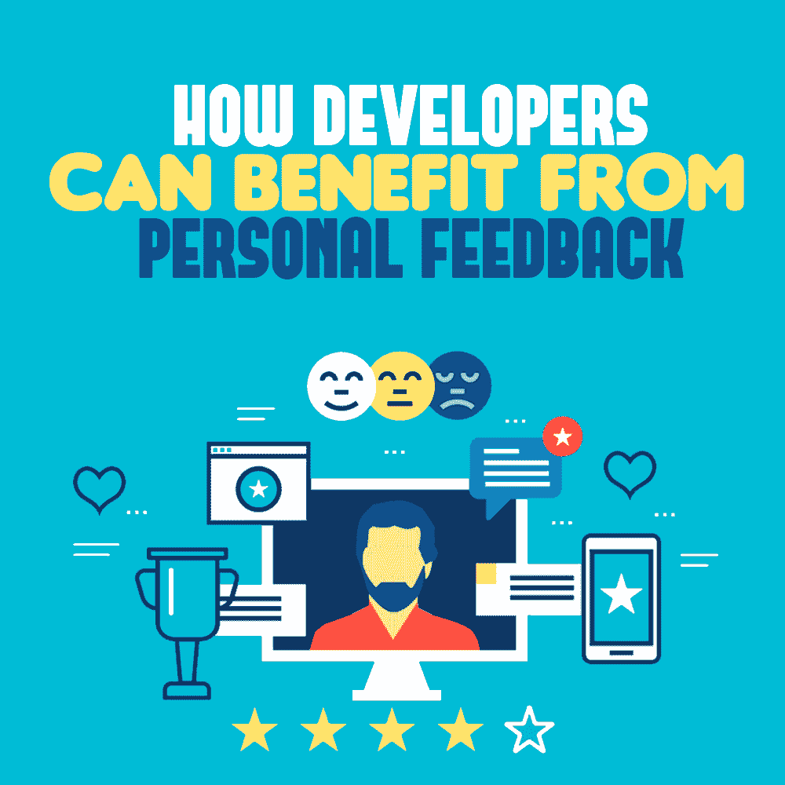

# 开发人员如何从个人反馈中获益

> 原文：<https://simpleprogrammer.com/developers-personal-feedback/>

<figure class="alignright is-resized">

</figure>

放松呼吸——团队刚刚完成了一次紧张的冲刺。激烈的交流，热烈的争论，紧迫的期限都在你身后。

是时候向前看了。但是随后——您的项目经理召集了一次团队会议。烧烤开始了。这都是关于你做错了什么以及你如何*搞砸了。* 

你的血液开始流动。你看到红色。在你付出了所有的努力之后，现在你听到的是你做错了什么，而不是你做对了什么。

不要往心里去；这是学习过程的一部分，并不是一切都会顺利。倾听反馈，你将作为一名开发人员得到提高。

在本帖中，你将了解个人反馈如何帮助你提高个人技能，使你成为更好的团队成员，并帮助你确定未来的目标和抱负。

你还将学习如何接受个人反馈，以获得所有的回报。

让我们开始成为顶尖开发人员的旅程。

## 个人反馈发展你的个人技能

开发人员倾向于关注他们的技术技能，这是有充分理由的。毕竟，这是让你成为不可或缺的团队成员的基础。

然而，重要的是要记住消极和缺乏情商通常是员工被解雇的原因。

你个人的一面和你的技术能力一样重要。项目经理不希望身边的人在他们的部门传播消极情绪。他们不想蹑手蹑脚地靠近你，因为害怕你无法处理建设性的批评。

进入个人反馈的世界。

当你接受建设性的批评时，作为一名开发人员，你会获得宝贵的软技能:

*   思想开放——不要被贴上牛头的标签。开发人员必须准备好改变他们的观点，不要认为他们的方式是唯一的。反馈有助于打开你的思维，让你接受别人为你所面临的问题提供的新解决方案。
*   诚实**–**承认自己的错误很难。每个人都会这样。个人反馈有助于你承认这些错误。这有助于你从中吸取教训，并在未来避免它们。
*   **创造力–**成为一名伟大的程序员的一部分是能够跳出框框思考，并创新你的解决方案。但这并不意味着每当出现问题时，你都必须重新发明轮子。获得个人反馈有助于丰富你解决问题的方法，与其他人一起集思广益，找出更好的解决方案。
*   **倾听技巧–**当你听取个人反馈时，它会帮助你成为一个更有效的倾听者。你的倾听变得更加积极。你倾听别人在说什么，然后你做出回应，表示你理解。它有助于减少防御性，促进自尊，化解情感交流。
*   **人际交往技能–**个人反馈可以提高对任何员工都至关重要的人际交往技能，如积极倾听、解决冲突和与他人有效沟通等相关能力。

为什么这些技能对开发人员如此重要？很简单:[拥有这些技能的开发人员能够在一个团队中发挥作用](https://simpleprogrammer.com/clean-coder)，当雇主不得不在解雇两个同样合格的候选人之间做出选择时，这往往是一个决定性的因素。

要点是:个人反馈有助于你塑造有个性的一面，对你与同事相处融洽至关重要。

## 个人反馈促进您的职业发展

当你奋力冲刺完成项目时，你的技术技能就会开花结果。

你的个人技能来自个人反馈。

但是你的职业发展又如何呢？个人反馈有帮助吗？

绝对的。

它帮助你确定未来的目标和抱负。事情是这样的:你的经理会告诉你需要改进的地方，这样你就能发现哪里出了问题，哪里可以改进。

这种进步对职业发展至关重要。你能够[设定目标，以确定如何变得更好](https://www.forbes.com/sites/averyblank/2017/01/04/how-to-identify-and-prioritize-your-career-goals-to-advance-quickly/#44eccd321b1e)并实现职业生涯中可以想象的最佳成长。

<figure class="alignright is-resized">

</figure>

你更清楚需要改变什么，但这也向你的团队领导表明，作为一名员工，你是如何进步的，你是如何成长的。这有助于你在目前的情况下取得成功。

此外，它还能帮助你知道在你的职位和职业生涯中你下一步想做什么。假设你想扩展你现在的角色。当涉及到某些语言或程序时，你知道你有弱点。但是你希望在这些方面做得更好，以便能够成为一名高级开发人员或者团队领导。

从他人那里获得个人反馈有助于你了解自己目前的掌握程度以及如何提高。这让你可以建立自己的技能，并向高层管理人员展示你可以承担更大更好的项目，因为你现在有能力处理它们。

这是提高你的技能和知道该做什么的可靠方法，这样你就能第一个获得晋升！或者，如果你正在寻找其他开发人员的工作，确保在你的简历中突出这些职位——这能让你在激烈的竞争中脱颖而出。

## 转变成一名宝贵的团队成员

当程序员增长个人技能，走到一起作为一个团队工作时，会发生什么？

这让他们无法阻挡。

当你将个人反馈应用到团队层面时，每个人和每件事都会受益——程序员、过程和管理。

以下是个人反馈对提高团队整体绩效的作用:

*   **创造共享的环境—**想象团队中的每个人都互相提供反馈。欢迎提出想法并进行讨论。当涉及到解决每个人都在努力解决的问题时，它有助于建立团队意识和稳定性。它创造了一个更加透明的氛围，当其他人也有类似的责任时，它可以减轻你的压力。
*   **创造共享的成功—**当一个团队成员成功时，整个团队也会成功。个人反馈消除了独狼程序员的心态，并以更好的方式分配得失。
*   **深化团队的技术经验****–**当团队成员从个人反馈中受益时，团队的绩效会得到全面提升。开发人员与技术打交道，成为专家。当他们通过建设性的批评分享这些知识时，每个人都会受益。
*   **开启变革和创新—**无论企业处于哪个行业，变革和创新都是必不可少的。个人反馈推动每个团队成员提高技能，适应最新技术。

个人反馈的好处是巨大的。但真正的问题是，你如何在不针对个人的情况下接受建设性的批评？

## 如何收集个人反馈

接受批评可能很难，因为可能会发生公开而激烈的讨论。

首先，确保保持冷静，让交流尽可能专业。如果你觉得这种交流不专业，请你的团队领导或其他人给出具体的批评例子。

如果你进入自我驱动的过程，你不会从个人反馈中受益。[你必须从头开始重新构建流程](https://simpleprogrammer.com/7-tips-to-present-an-idea/)。你需要听到不同的反馈。在困难的情况下，试着着眼于大局，问问自己应该从中学到什么。

大多数时候，反馈不仅仅是关于你的。这是整个过程，但你可以通过了解下一次如何提高你在这个过程中的作用来发展。你必须考虑大局，专注于手头的大项目。

最后，在获得个人反馈时，确保你要求时间跟进。你必须花时间思考所说的话，以及你应该如何改变。或者你可能会考虑在某些问题上给予一些让步。但是记得暂停一下，暂时不要反应过来；花点时间考虑一下。

## 接受反馈，加速你的成长

<figure class="alignright is-resized">

</figure>

想成为顶尖的开发者很难。但是请记住，提高个人和技术技能的最快方法是接受个人反馈的过程。

不要错过这个发展的机会。你现在明白了作为一名程序员，反馈能给你带来什么。它现在和将来都有巨大的好处。勇往直前，知道你已经做好了接受它的心理准备。

从今天开始，这是一条通往成功和成为最好的程序员的必由之路。