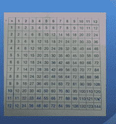

# 为什么开发人员是糟糕的测试人员，对此可以做些什么

> 原文：<https://simpleprogrammer.com/developers-poor-testers-can-done/>

"我认识的大多数开发人员实际上都是非常糟糕的测试人员."

这是一位测试人员在最近的一次简短调查中的反馈。调查还证实了更多的开发人员正在参与测试任务，据 37%的组织报告。

该调查包括来自世界各地的组织的测试人员，并侧重于他们组织中的测试工作。随着敏捷方法的增长，这并不奇怪。

在许多情况下，测试人员往往对开发人员的测试结果不满意。为什么开发人员没有擅长测试“天生能力”,原因有很多。

如果你确实有技能，但你只是看不到你在职业生涯中应得的成功，那么一定要参加我们简单的程序员课程[“如何作为一名软件开发人员推销自己”。](https://simpleprogrammer.com/store/products/how-to-market-yourself/)T3】

### 原因 1:父母对他们的准则的感觉

丑小孩测验:当站在一个满是人的房间里时，你可以问:“谁有一个丑小孩？”

百分之九十九的情况下，不会有人举手。

现在，继续问，“谁有朋友的孩子很丑？”

我可以向你保证，这个数字要高得多。

当向开发人员询问他们自己编写的代码时，也会出现类似的“盲点”现象。我们往往会忽略自己创作中的缺陷，看不到某个特征不在顶层的情况，即使我们能够在涉及到其他人的工作/孩子时正确地识别它。

### 原因 2:开发人员简化了复杂的问题

开发人员专注于解决用户故事或需求中的[复杂问题](http://www.amazon.com/exec/obidos/ASIN/0321803027/makithecompsi-20),并将它们转化为小而可行的任务，然后再转化为简单的代码行。一个这样的例子是创建一个按钮，允许用户注册试用，把它变成代码行，然后允许按钮变成可点击的。

测试是完全相反的。测试人员的任务是获取简单的特性，并考虑复杂的场景，这些复杂的场景会导致它们出现错误！

### 原因 3:关注“积极的场景”

同样，开发人员正在考虑如何让事情发生，如何用代码实现他们想要的结果。这都是关于采取一个抽象的想法，编写代码，并将其转换成一个可编译的程序，可以执行所需的行动。在测试时，我们需要确定如何分解事物，并在事情不会像计划的那样顺利时尝试找到这些地方。

测试人员工作的一个重要部分是[找到系统的弱点](http://www.amazon.com/exec/obidos/ASIN/B00HL2S4LW/makithecompsi-20)以及其中易损坏的位置，以便修复它们。大多数开发人员关心的是解决问题，而不是制造问题，这反过来使得他们很难进入测试人员破坏而不是构建的思维模式。

### 原因 4:忽略大局中的小事

这些测验要求参与者找出隐藏的错误。

让我们快速跳转到您的脸书订阅源，您可能已经看过这个测验或类似的测验。他们经常声称自己是各种智力水平或天才的指示器。

当然，它们实际上只是关于模式和字符串。

测试人员自然倾向于发现打破模式的东西。编码人员自然倾向于发现或创建模式。

*(*结果将出现在本文末尾。)*

### 原因 5:缺乏端到端知识和真实用户视角

大多数组织不会花费时间和精力来让开发人员理解他们产品的用户。昂贵的开发人员被派去做他们被雇来做的事情，即编写代码和开发新产品，而理解客户的用户故事的任务则留给了产品经理。

难怪很多时候开发者不能想出用户使用系统的方法。因此，他们不会花时间去预测用户在使用所述系统或产品时会遇到的所有潜在问题。

我猜这些文字一直都在墙上…

## 怎样才能变得更擅长测试？

很明显，开发人员并不是默认的“优秀的测试人员”，那么在我们将系统发布到现场之前，为了增加我们发现系统中的 bug 的机会，我们可以做些什么呢？你会感到惊讶，但有很多可以实现的。

### 不要把测试看作是一种谴责

一个好的敏捷团队需要开发人员和测试人员都进行测试。记住这一点，变得更擅长测试的第一步是停止怨恨你正在测试的事实。测试不是一项脏活，从前面的几点可以理解，它也不是一项容易的工作。

如果你想擅长测试，那么从像对待日常工作中的其他工作一样认真对待这份工作开始，确保留出足够的时间进行测试。

### 了解你作为开发人员的局限性和弱点

意识到自己的“盲点”是改进的前提。了解你的[优势和劣势](https://simpleprogrammer.com/2015/12/11/your-automation-test-sucks/)将有助于你更好地完成工作。如果有你需要学习的东西，就去学吧。如果你需要问别人怎么做，那就去做吧。与他人商量并寻求他们的帮助并不可耻。

### 根据您的约束来计划您的测试

测试需要计划以确保你正确地工作，并且在你的产品的正确方面工作。为了更好地计划您的测试，您可以做以下一些事情:

*   不要测试你自己的代码:继续我之前提到的丑陋的孩子测试，尽你最大的努力测试其他程序员开发的特性，并让其他人测试你写的东西。
*   在开始测试之前，请思考一下！想想积极和消极的场景，想想你的用户如何使用系统(以及他们如何滥用它！)，对你即将测试的产品进行分析，寻找薄弱点。
*   使用清单和启发式方法。在开始测试之前，一定要写下你想测试的内容，以确保一旦进入正题，你不会错过任何重要的东西。

## 如果这是你的代码，那么你需要关心

即使测试任务没有被列为你梦想的编程工作的一部分，但事实是它们已经[在这里](https://simpleprogrammer.com/2010/09/09/why-field-testing-changes-everything/)了。

无论是感觉对你的代码过度保护，缺乏用户知识，还是其他原因，我希望你已经了解了阻碍你成功执行测试任务的一些原因。

向前看，你现在可以提高你的测试能力，结果是，为了我们所有人的利益，创造更好的、经过彻底测试的产品将被发布。

**测验结果:*
*你能找出**的错误吗？单词“the”的双重使用。11 乘以 12 的结果应该是 132，而不是看上去的 123。***