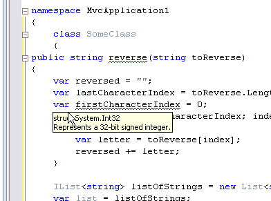

# 你有一个不同罪恶感的案例吗？

> 原文:[https://simple programmer . com/do-you-have-a-case-of-var-歉疚/](https://simpleprogrammer.com/do-you-have-a-case-of-var-guilt/)

自从 *var* 被宣布为 C# 3.0 的关键字以来，我就一直有这个问题。

我知道它是强类型的，但是我觉得它有点不对劲。感觉像是某种令人厌恶的东西。

也许我只是喜欢重复自己。

最后，我开始使用 *var* 关键字，因为我不知道 LINQ 查询究竟会返回什么。我只知道，如果我把 var 放在 LINQ 查询之前的变量声明中，它就能工作。如果我在 foreach 循环中把 var 放在变量之前，那也一样。

我不情愿地开始使用 var，但每次我这样做时，我都会感到内疚。好像我做错了什么。好像我是个坏人。就像我在写强类型的 VB 代码一样。我觉得很脏。

## 干净点，我的儿子们！挣脱你的枷锁！

这个问题我考虑了很久。几个月来，这个 var 关键字问题一直困扰着我，慢慢地渗透到我的代码中。**然后，我恍然大悟！**

var 只是一个抽象概念。我不需要像编译器那样知道变量的类型。

使用 *var* 的时候也不用有罪恶感。它阻止了你的代码的读者关注变量的类型，而是关注变量的用途。

我尽可能使用 var 关键字重写了一些代码，看看它是否降低了可读性。(我把它发挥到了极致)

诚然，这看起来有点奇怪。但是老实说，如果我把所有的类型都放在这里，而不是 var，阅读起来会更困难吗？这实际上给了你任何有用的信息来帮助你理解这些代码吗？只要我的变量名是好的，我敢说可读性提高了，因为任何添加对代码不重要的信息都会分散注意力。

## 好处:脱钩

当我思考这个问题时，我意识到除了审美之外，还有一些东西把我推向了原力的另一边。 *var* 在我使用代码时减少了代码中的耦合。

如果我在代码中调用一个返回某个对象的方法，但是我用一个我用 *var* ，*T3】声明的变量来保存对它的引用，如果这个方法改变为返回其他类似用法的东西，我就不必修改源代码。(不过我必须重新编译。)在许多情况下， *var* 关键字可以在方法返回具体类型的地方起到额外的作用，稍微分离你的应用程序。一点一滴都有帮助。*

在我看来，任何减少对具体类型的依赖，使代码更加灵活，同时仍然在编译时而不是运行时捕捉问题的方法都是好的。

## 挂在 ide 上

这里有一个警告。这完全取决于 IDE。你必须有智能感知和自动完成功能，否则整个系统就会崩溃。我不需要知道底层类型，因为我可以直接点击“.”告诉我有哪些选择。在 Visual Studio 中，我只需将鼠标悬停在 *var* 声明上，就可以回过头来找出类型是什么。

如果没有这些能力， *var* 关键字就不会这么好。如果没有这些能力，你将不得不回到变量被声明的地方，并且可能追踪一个方法调用来计算返回类型，以知道*变量*将被初始化成什么类型。