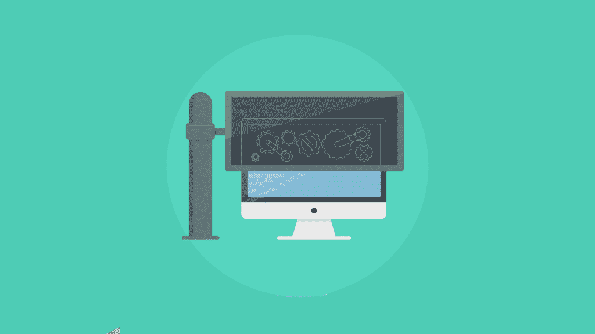
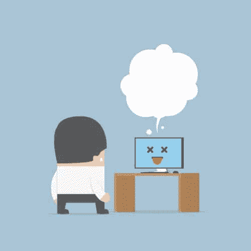

# 有效调试的程序员指南

> 原文：<https://simpleprogrammer.com/effective-debugging/>

作为一名软件开发人员，我可以向你保证一件事:**你将会花大量的时间调试代码。**

生活中有一些不可避免的常数:死亡、税收和程序员制造的错误。

既然你会花很多时间调试代码，那么擅长调试可能是个好主意，你不觉得吗？

不幸的是，许多开发人员——甚至是经验丰富的开发人员——往往，嗯……很差劲。

有很多开发人员可以快速开发新功能，然后像无人问津一样到处乱丢代码，但是谁来清理他们留下的一堆 bug 呢？

知道如何写好代码是一回事；知道如何调试你一生中见过的最丑陋的代码是另一回事，这些代码是由传奇人物 Bob 编写的，他在自己的地下室中用 48 小时构建了整个应用程序的第一个版本，但他是一个“古怪”的家伙。

幸运的是，调试和其他技能一样，是可以学习的。

如果你运用正确的技术并练习，你会变得很棒。

谁知道呢？你甚至可能会喜欢它。

调试的关键是认识到这一切都与心态有关。

这是关于对问题采取系统的方法——不要匆忙，也不要期望你能找到问题，进去，然后出来。

这是关于保持冷静和镇定:从逻辑和分析的角度而不是情绪的角度来解决问题。

在这一章中，我将展示一个系统化的调试方法，这将帮助你避免可怕的[调试器思维](https://simpleprogrammer.com/2011/06/17/the-debugger-mindset/)，并将你的调试技能提升到一个新的水平。

## 什么是调试？

在我们潜深之前，先潜浅一点。

调试到底是什么？

这似乎很明显，对不对？

你打开调试器，用代码“调试”问题。

啊，但这就是你错的地方。

**调试与调试器无关。**

调试与**在代码库中找到问题的根源**，**识别可能的原因，测试假设**直到找到最终的根本原因，然后最终**消除那个原因**和**确保它不会再次发生。**

好吧，我想我们可以称之为修复错误。语义学。

关键是，调试不仅仅是在调试器中摆弄和修改代码，直到它看起来可以工作为止。

## 调试的第一条规则:不要使用调试器

啊，你说这是什么？

一个新的 bug 需要我去修复？

哦，这是一个多毛的？

别害怕，先生。我将释放我精神武器的全部力量来对付这个邪恶的恐怖。

带着这种心态，你这个程序员坐在你的办公桌前。

你启动调试器。

仔细阅读代码。

时间似乎模糊了，几分钟变成几小时，几小时变成几周。

你是一个坐在键盘前的老人，仍然在同一个调试会话中，但不知何故你“更接近了”。

你的孩子都长大了。你的妻子离开了你。

唯一剩下的就是…虫子。

当大多数程序员想调试代码中的问题时，他们做的第一件事就是启动旧的调试器，开始四处查看。

不对。

不要这样。

调试器应该是你最后的选择。

当您立即启动调试器时，您实际上是在说，“我不知道是什么导致了这个问题，但我只是四处看看。”

这就像当你的车坏了，而你对汽车一无所知，所以你打开引擎盖，寻找问题所在。

您在找什么？

你都不知道。

不要误解我。

调试器是一个奇妙而强大的工具。

如果使用得当，调试器可以帮助您解决各种问题，并且可以帮助您了解代码运行时发生了什么。

然而，这不是开始的地方，而且许多错误可以在不接触调试器的情况下被解决。

你看，就像脸书或有趣的 YouTube 猫视频，调试器有办法把你吸进去。

## 重现错误

那么，如果你不简单地启动调试器来调试问题，你会怎么做呢？

很高兴你问了。

任何一个正常人应该做的第一件事就是 **[重现这个 bug，以确保它确实是一个 bug](https://simpleprogrammer.com/2011/05/20/step-1-reproduce-the-problem/)** ，并且你将能够调试它。

无法重现的问题百分之百无法调试。

因此，如果你不能重现问题，调试它就没有意义。听到了吗？

你不仅不能调试一个不能重现的问题，而且，即使你确实修复了它，你也不能验证它是否被修复了。

所以，当你试着调试一个 bug 时，你应该做的第一件事就是确保你能自己重现这个 bug。

如果你不能，去寻求帮助。

如果一个测试人员记录了这个错误，让他们为你重现它。

如果错误是间歇性的，并且无法可靠地重现，这意味着您不知道重现问题所需的环境。

不存在间歇性的问题。

如果是问题，可以转载；你只需要知道怎么做。

***侧注关于间歇问题:***

好吧，你的老板要求你解决这个问题。

他们在生产中见过它。顾客都看到了。这肯定是个问题。

“我不能复制它”的推诿不起作用——他们不买。

你是做什么的？

你仍然无法调试一个你无法重现的问题。

但是你能做的是收集更多的证据。

*在代码中插入日志语句。*

尽可能多地收集问题发生的时间和条件的详细信息。

如果可以的话，人工再造环境和情况。

不要试图对你无法重现的问题进行“修复”。

如果你对问题的理解不足以重现它，你偶然通过猜测解决它的可能性非常非常低，而且你将很难知道你的解决方法是否有效。

*找到重现问题的方法，哪怕只是在生产中重现。*

## 坐下来思考

在您可以重现您的问题之后，下一步是大多数软件开发人员跳过的一步，因为他们非常渴望解决问题——但是这一步是至关重要的。

这是一个非常简单的步骤。

坐下来想一想。

是的，没错。

思考问题以及可能的原因。

想想这个系统是如何工作的，以及是什么导致了你所看到的奇怪行为。

你会急着跳入代码和调试器，开始“观察事物”，但是在你开始观察事物之前，重要的是要知道你在寻找什么和观察什么。

你可能会想出一些可能导致问题的想法或假设。

如果没有，耐心点。继续坐着思考。

如果有帮助的话，站起来四处走走，但是在你继续前进之前，你至少应该有一些你想测试的想法。

如果你完全想不出任何东西，继续抵制启动调试器，取而代之的是**浏览源代码**，看看你是否能收集到更多关于系统应该如何工作的线索。

从这一步开始，你至少应该有**两到三个好的假设**可以测试。

## 测试你的假设

好的，你已经有了一些好的假设，对吗？

通量电容器连接到 thingamabob，所以如果 whozitswatt 输出的电压低于等级…THINGAMABOB 一定配置错误！

呃……差不多吧。

好了，让我们启动调试器，测试我们的假设！是的，伙计，我们开始吧！

不要！不对。

站住，小伙子。

我们现在还不需要调试器。

等等，什么？你可能会问，如果我不能使用调试器，我将如何测试我的假设？

单元测试。

是的，没错:单元测试。

试着写一个单元测试来测试你的假设。

如果你认为系统的某个部分不能正常工作，编写一个你认为可以利用这个问题的单元测试。

如果您是正确的，并且您已经找到了问题，那么您可以立即修复它，现在您将有一个单元测试来验证修复并确保它不会再次发生。

(不过，在你称之为修复之前，还是要确保你尝试并重现了实际的 bug。)

如果你错了，而你编写的单元测试如预期的那样通过了，**你只是通过向项目中添加另一个单元测试使系统变得更加健壮了一点**，并且你已经证明了你的一个假设是错误的。

可以把它看作是问题空间的逐步扩大。

每次你写单元测试并且它通过了，你就在排除可能性。一旦你发现门是死胡同，你就锁上并关上身后的门，穿越你的调试之旅。

如果您曾经在调试会话中迷失了几个小时或几天，您应该立即意识到这是多么有价值。

调试器如此糟糕的原因之一是因为**当我们检查和重新检查我们的假设时，它会鼓励我们一次又一次地重新访问相同的错误走廊**，要么忘记我们已经寻找的内容，要么不相信我们已经足够努力地寻找了。

单元测试就像爬山，并在适当的位置放置一个锚，以确保你不会落后太多。

编写单元测试来测试你的假设也将确保你不会随意地尝试一些事情和四处张望。

当你写单元测试时，为了帮助调试问题，你必须有一个特定的假设。

现在，我是一个现实主义者。

我很务实。

我知道有时候编写一个单元测试来测试一个假设是极其困难或者不可能的。

在这种情况下，启动调试器是可以的，但前提是您必须遵守这条规则:

做这件事要有明确的目的。

当您使用调试器时，确切地知道您在寻找什么和检查什么。

不要只是进去四处看看。

我知道这看起来好像我对整件事有点偏激和迂腐，但是相信我，这是有原因的。

我希望你成为一名熟练的调试器，你只有通过仔细考虑如何调试才能达到这个目的。

## 检查你的假设

大多数时候，你的假设是不会成功的。

这就是生活。

如果是这样的话，接下来你能做的最好的事情就是检查你对事情如何运作的假设。

我们通常假设代码以某种方式工作，或者某个输入或输出必须是某个值。

我们经常想，“这不可能发生。我正在看这里的代码。它不可能产生这样的输出。”

通常，我们是错的。

它发生在我们最好的人身上。

对于这些假设，你能做的最好的事情就是检查它们。

检查它们的最好方法是什么？

是的，没错。更多单元测试。

编写一些单元测试，检查在您试图调试的问题的工作流程中“必须工作”的明显的东西。

这些测试中的大多数应该很容易通过，你会说，“废话。”

但是，每隔一段时间，你会写一个单元测试来测试一些显而易见的假设，结果会让你震惊。

记住，如果问题的答案显而易见，那就根本不是问题。

我的实用主义者一面不得不再次告诉你，是的，打开调试器来检查你的假设也是可以的。

但是只有在你首先尝试使用单元测试来检查假设之后。

再说一遍，这就像爬上那座山，沿途抛锚。

如果可以的话，避免使用调试器，如果必须的话，使用它，但是，还是那句话，只是为了验证或否定你已经形成的特定假设。

## 

各个击破

我记得在一个非常棘手的问题上，一个打印机错误地解释了一个用 PostScript 打印语言编写的打印文件。

我尝试了所有我能想到的方法来解决这个问题。

我测试了各种假设。

一无所获。

看起来这个 bug 是打印文件中多个命令的某种组合，我不知道是哪一个。

那么，我做了什么？

我把打印文件切成了两半。

窃听器还在。

所以，我又把它切成两半。

这次消失了。

我试了另一半。又回来了。

我不停地处理打印文件，直到我把整个文件从几千行代码减少到只有五行。

按照这个顺序，产生 bug 的五行代码。

很简单。

有时当你陷入调试时，你需要做的是想出一个办法将问题减半，或者尽可能多地解决问题。

根据问题的不同，这可能看起来非常不同，但是**试着想办法消除大量的代码**或者移除大量的系统或变量，并且仍然重现 bug。

看看你是否能想出测试来完全消除系统中对错误负责的部分。

然后再做一次…一次又一次。

如果您继续研究，您可能会找到产生错误所需的关键组件，然后问题会变得相对容易解决。

## 如果你修好了，要明白为什么

我要给你最后一条关于调试的建议——尽管我确信我可以就这个主题写一整本书。

如果你解决了一个问题，理解为什么你所做的能解决它。

如果你不明白为什么你所做的解决了问题，你还没有完成。

您可能无意中导致了一个不同的问题，或者，很有可能，您还没有解决原来的问题。

问题不会自己消失。

如果你没有解决问题，我可以向你保证它没有解决。只是躲起来了。

但是如果你解决了问题，不要止步于此。更深入地探究一下，确保您确切地了解最初是什么导致了这个问题，以及您是如何解决这个问题的。

太多的软件开发人员通过修改位来调试问题，代码显然开始工作，他们甚至不知道为什么就认为问题已经解决了。

这是一个危险的习惯，原因有很多。

正如我上面提到的，当你随意调整系统中的东西，到处修改代码时，你可能会导致各种你没有意识到的其他问题。

但是，也许不止如此，你正在把自己训练成一个糟糕的调试器。

你正在养成弄乱东西直到有用的习惯。没有技巧，不严谨。

有时你可能很幸运，但是你没有可重复的过程或者可靠的调试技能。

你不仅应该了解什么东西坏了，为什么坏了，以及你是如何修复的，而且你还应该验证修复。

我知道这看起来像是常识，但是我不能告诉你程序员“修复一个问题”浪费了多少时间，假设修复有效，将代码传递给 QA 只是为了让 QA 重现问题并让它回到开发者那里，开发者不得不从头开始。

这是一个巨大的时间浪费，如果多花五分钟来验证你所修复的东西确实被修复了，这是可以避免的。

事实上，不要只是验证修复；为这个问题写一个回归测试，这样它就不会再发生了。

如果您真正理解您所修复的问题，您应该能够编写利用该问题的单元测试，然后您的修复应该使该单元测试通过。

最后，**寻找同类错误的其他实例。**

虫子倾向于一起出去。

如果您发现您对系统所做的一个假设有问题，或者某个错误编码的组件有问题，那么很可能还有其他问题也是由相同的问题引起的。

同样，这也是为什么理解真正的问题是什么以及为什么你的解决方案解决了它是如此重要。

如果您知道发生了什么以及为什么会发生，您就可以很快判断出是否有其他问题是由相同的潜在问题引起的。

## 艺术和科学

记住，调试和软件开发一样，既是艺术也是科学。

只有通过练习，你才能擅长调试。

但是练习是不够的。你必须明确地、系统地调试，而不仅仅是在调试器中摆弄。

希望我已经很好地概述了如何做到这一点；现在剩下的就看你的了。

* * *

