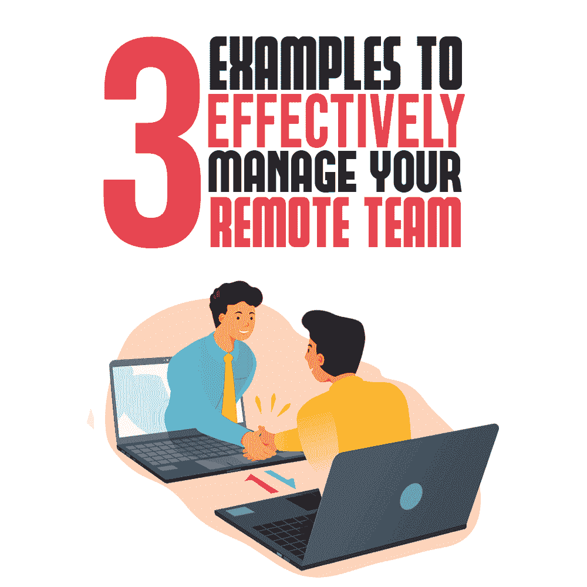

# 有效管理远程团队的 3 个示例

> 原文：<https://simpleprogrammer.com/effective-remote-team-management/>

The COVID-19 pandemic has put millions of workers in remote mode. And, although we currently have an abundance of support from cloud technology that assists us with telework, many companies around the globe found themselves unprepared for this transition.

随着世界向远程工作的转变，越来越多类似的工作将出现在市场上。

例如，一名软件开发人员目前是排名前五的远程工作，其需求预计到 2026 年将增长 24%。然而，当前的疫情可能会进一步推动需求。

随着我们看到越来越多的公司转向远程模式，他们将很快雇佣整个远程开发团队，从而完全外包编程工作。

但是这些公司准备好管理这些团队了吗？从目前的情况来看，管理远程开发团队将是一个相当大的挑战，因为许多公司缺乏做好这件事的方法。

正如《Bizcatalyst 360》杂志解释的那样，最普遍的原因是企业难以找到与远程员工沟通的有效方式，或者根本没有准备好从传统的朝九晚五工作时间转变过来。

然而，也有相当多的公司直到今天还在继续蓬勃发展，因为他们很久以前就开始将工作外包给远程团队。他们外包给远程员工的最受欢迎的工作都与编程有关。

如果你浏览 FlexJobs 或 Glassdoor 等在线平台，寻找完全远程公司的职位空缺，你会注意到这些职位中有一半以上与编程有关——Ruby on Rails 工程师、 [Java 开发人员](http://www.amazon.com/exec/obidos/ASIN/0131872486/makithecompsi-20)、Python 开发人员、Kentico 开发人员等。

因此，让我们看看一些公司的例子，以及他们管理远程开发团队的方法。了解如何有效管理您的远程团队可能是您与竞争对手的关键区别，也是保持相关性和努力奋斗的关键区别。

## 扎皮尔的交流方法

Zapier 在 2011 年转向完全远程工作。当时，这一举动并没有被认真看待，正如该公司的联合创始人兼首席技术官 Bryan Helmig 在采访中所说，分享了 Zapier 经历这一转变的经历。

当时，Zapier 在不同的城市拥有远程开发团队。当公司搬到旧金山时，管理层决定不再雇佣新的内部开发团队；相反，他们从已经共事过的人中创建了一个远程团队。

在过渡期间，Helmig 说他们犯了很多错误。他们通过加倍加强沟通来解决这些问题，这种做法他们今天仍然在做。

过多的交流肯定会被认为是富有成效的合作的障碍。但是，过度沟通和[微观管理](https://simpleprogrammer.com/team-leader-delegation/)是有区别的。

两者都是管理风格的变体，经常被拿来比较。“微观管理与过度沟通有关，表明工作场所缺乏自由，”Alltopreviews.com 公司的人力资源经理马丁·哈里斯说。

然而，过度沟通并不一定意味着剥夺你的团队的自由。微观管理意味着管理者完全控制团队成员而不考虑他们的意见。

然而，过度沟通不仅适用于团队经理，也适用于团队成员。同事可以使用不同的渠道，以不同的方式分享问题的解决方案。

正如 Helmig 所强调的，一件值得说的事情值得重复十几次。因此，与您的远程开发团队过度沟通并不可耻，只要所有团队成员都理解这种沟通的必要性。

## 10up 和远程工作指南

一名新成员刚刚加入了您的远程开发团队。你应该如何以一种让每个人都更容易的方式来应对这种变化？

Jake Goldman 和 Zach Brown 是 10up(一家网络开发和设计公司)的创始人，他们在 PressNomics 播客中分享了管理远程开发团队的经验。

两家公司的经理都承认，并不是他们雇佣的每个开发人员都适合远程工作。他们意味着人们通常没有应对机制来帮助他们管理工作，并与其他团队成员进行远程交流。

为了让新员工轻松进入远程工作流程，公司制定了一份指南。高盛粗略描述了新开发人员必须遵循的指南，列出了以下几点:

*   让你的团队知道你的计划，开始你的一天。高盛解释说，披露你将要做的事情不是控制的问题，而是必要的。通常，有两三个开发人员编写相同的代码，他们每个人都需要定期更新工作状态，以便能够完成他们那部分的任务。
*   每个通信信道用于不同种类的消息。Goldman 的意思是，指导方针教导新开发人员应该如何使用 Slack、电子邮件和视频电话。例如，如果讨论编码问题的松弛线程太长，建议切换到视频呼叫来解决它。
*   与“入职伙伴”一起工作高盛表示，为了帮助新的开发团队成员更好地适应远程工作，公司给他们每个人都分配了一个入职伙伴。这些人的任务是回答最简单的问题，并帮助新来者在团队中建立联系。

On top of that, Goldman mentions that they copy Zapier’s over-communication approach in how they manage their remote dev teams. According to him, over-communication in 10up is encouraged from the early stages of employment.

依赖远程开发团队的公司，如 [Grammarly](https://app.grammarly.com/) 和[grabmyesay](https://www.topwritersreview.com/reviews/grabmyessay/)，让他们所有的程序员参加一个虚拟的入职计划，类似于 10up 的指导方针。该计划以一个简短的测试和与高层管理人员的个别谈话结束，团队成员可以从他们的问题中获得答案。

这种指南因公司而异，取决于公司正在开发的产品和远程工作的团队成员的数量。但是拥有一个远程工作入门指南可以帮助建立一个未来远程开发团队成员之间高效合作的坚实基础。

## 戴尔与构建远程企业文化

将工作外包给一个远程开发团队，或者以完全远程的模式运营你的公司，并不意味着你可以从创建企业文化中解脱出来。

企业文化关系到每一个至少有两名员工的企业，因为它决定了公司员工和管理层之间的沟通方式。企业文化也有助于在公司创造一个社会和心理环境，以及建立公司成员必须遵守的惯例，以[减轻远程工作的不利影响](https://simpleprogrammer.com/downsides-of-remote-work/)并解决冲突。

但是*遥远的*企业文化呢？

有一些特殊性。

早在 2013 年，戴尔在决定到 2020 年将一半员工转移到远程工作后，首次尝试建立远程企业文化。

该公司认识到，企业文化通常是在日常交流中建立起来的，例如在饮水机旁聊天。这就是为什么他们鼓励他们的远程开发团队进行轻松对话和视频通话，以更频繁地讨论工作之外的话题。

在与福布斯的一次对话中，戴尔大学关系和招聘主管 Jennifer Newbill 分享了该公司发起的在线聊天室，开发者可以加入其他团队讨论戴尔的志愿服务机会。

根据 Newbill 的说法，这种方法既可以支持公司的价值观，也可以将来自同一团队和不同部门的员工聚集在一起，建立信任，营造支持的氛围。

事实上，如果你只有一个远程操作的开发团队，他们可能会觉得被公司生活所遗忘。像在线聊天室这样的计划可以帮助您的远程开发团队与其他团队建立联系，以进行更有成效的合作，并且总体上有一种属于企业文化的感觉。

## 总结高效远程工作的原则

当几个作者一起写一本书时，他们应该得到读者的同等认可。

这同样适用于远程工作。Zapier 的首席技术官 Helmig 说，2011 年转向远程工作是一个团队的努力，而不是联合创始人的唯一倡议。现在，随着他们成功过渡到远程工作的努力被证明是有效的，他承认所有团队成员的同等贡献。

因此，让我们列出组建高效远程团队的步骤:

*   过度沟通。创建指导方针并帮助您的团队遵循它们。专注于建立一种强大的远程文化，让你的员工有一种团体感。
*   如果你管理一个远程开发团队，确保每个团队成员平等地理解他们在项目和公司中的角色。这样，他们作为一个团队会工作得更好。
*   让你的团队成员了解你目前在项目中的进展，并确保每个人都理解他们贡献的本质。激发他们成为公司一员的感觉。

如果你做到了这一切，你的团队就不需要太多的努力就能高效地合作。这是一个建立坚实基础和良好习惯的问题。其余的将会到位！