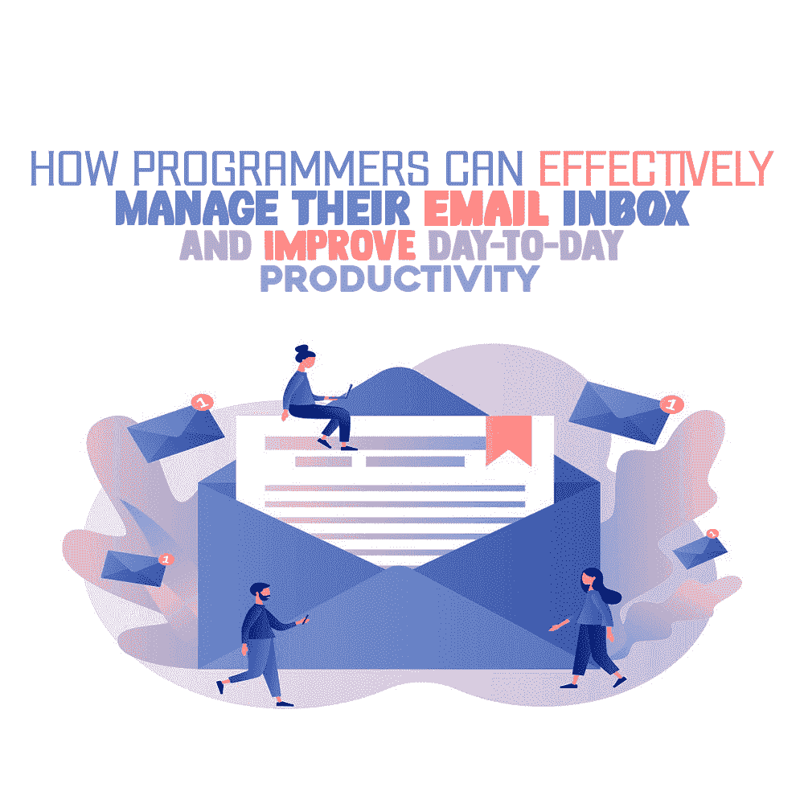

# 程序员如何有效地管理他们的电子邮件收件箱并提高日常工作效率

> 原文：<https://simpleprogrammer.com/effectively-manage-email-inbox/>

As a programmer, email is the lifeblood of your operations. You rely on it to communicate with your team, receive insightful newsletters, get emails from clients, and market yourself to potential prospects.

然而，你花在沟通工具上的时间越多，你就会越快偏离你最重要的任务。

同时，完全摆脱电子邮件也有点挑战性。那么如何创造平衡呢？

在本指南中，我们将了解一些管理电子邮件和掌控日常事务的技巧。

## 1.取消订阅不必要的简讯

这可能是显而易见的，但从基础开始不会有什么坏处。

平均来说，专业人士的收件箱里有大约 200 封电子邮件，并且每天会额外收到 120 封 T2 邮件。几乎不可能阅读或回复这些邮件的一半。

程序员也没什么不同。你想向该领域的其他专家学习。但是当你不断地把你的电子邮件地址发送给其他每一个注册表单时，你的收件箱很快就会变得乱糟糟的。

很快，你将不得不翻遍一大堆简讯，只为了得到你的全体员工的每周电子邮件。

也就是说，检查你的电子邮件订阅，标记那些你从未打开过的无趣的时事通讯。取消订阅列表，给你的收件箱一些空间。

## 2.暂停你的电子邮件应用

每封邮件一进入你的收件箱就阅读它可以防止邮件堆积。虽然这也适用于其他职业，但编程就完全不同了。当你开始着手一个高价值的项目时，你不想被任何声音分散注意力，哪怕是一根针掉在地上。

在工作时让你的电子邮件程序打盹，有助于你保持流畅的状态，只要你能让它持续下去。

一旦完成了这个项目，或者当你短暂休息时，你现在可以偷看你的收件箱，在回去工作之前回复一些邮件。

对一些人来说，在电子邮件上打盹可能有点过了。相反，他们会在一天中的某个时间间隔查看电子邮件。

这两种策略本质上是一样的。但对于后者，你必须完全自律，以避免在时间未到时检查邮件的诱惑。

不管怎样，提醒你的团队或老板你一天中会有一段时间不收发邮件，这样他们就不会因为你没有回复邮件而生气。如果是紧急事件，他们可以给你打电话或使用即时消息。

## 3.使用一分钟规则

一分钟规则适用于那些不能在邮件中打盹，但足够自律不会被邮件通知吓跑的程序员。

经验法则很简单。如果你能立即回复邮件，那就回复吧。但是确保它不会占用你超过一分钟的时间。

这条规则可以避免你的收件箱被不必要的邮件堵塞，而这些邮件你本可以早点回复的。

为什么？把邮件留在收件箱里不会让你在工作时感到安心。你会不断提醒自己收件箱里还有未完成的工作。

为了避免这种“折磨”，只需回复这些邮件，但不要每封邮件都超过一分钟，因为这会破坏你已经建立的信息流。

## 4.用标签组织您的收件箱

Deleting emails is the easy way. However, it can prove too costly if you delete an essential thread that you need to check again in the future.

例如，你不想摆脱一个愤怒的客户的电子邮件线程，他的投诉你还没有解决。

如果发生这种情况，你会发现自己和老板的关系很紧张。如果没有其他人保存客户的电子邮件，你必须使用一个[电子邮件提取器](https://www.voilanorbert.com/blog/email-extractor-software/)来搜索电子邮件地址，联系他们，并再次开始整个过程。这既是浪费时间，又有辱人格。

为了避免所有的压力，只需整理你的电子邮件收件箱。保持收件箱有条理，可以让你在一个标签上对邮件进行优先排序、分组和分类。

一旦您创建了电子邮件标签，以后的所有通信都将存储在标签中。没有电子邮件会发送到主收件箱。因此，查找电子邮件将变得容易，节省时间并提高生产力。

## 5.打开电子邮件预览功能

如果你在截止日期前不想错过重要的邮件，邮件预览功能会很方便。

该功能允许您在单独的窗口中查看消息的第一行。这意味着，如果邮件不重要，你不必阅读整封邮件。此外，它减少了打开带有病毒的电子邮件的机会。

要在 Gmail 上打开电子邮件预览功能，请在打开 Gmail 帐户后点击**设置**。点击**查看所有设置**并前往**收件箱标签**。

向下滚动到**阅读窗格**并选择分割窗格模式。一旦完成，点击**保存更改**。

## 6.使用日历跟踪需要跟进的电子邮件

如果收件人没有在规定的时间内回复，你的一些邮件需要跟进。另一方面，你可能会收到不需要立即回复的电子邮件，或者你可能需要在回复之前从你的上司那里得到澄清。

无论如何，你都需要借助电子邮件服务提供商的日历集成。那么它是如何工作的呢？

首先，将电子邮件移动到电子邮件中的指定文件夹。完成后，在您的日历应用程序上添加一个提醒，其中包括文件夹位置和您想要跟进的日期。

这将帮助你不要忘记回复重要的邮件，并防止你的收件箱被你没有回复的邮件堵塞。

如果您使用的是 Outlook，您可以将其与 Outlook 日历无缝连接。在 Gmail 中，打开要添加到日历中的电子邮件。点击**更多**按钮，**创建事件**。

## 7.为类似的电子邮件和回复创建模板

回复邮件需要很长时间，尤其是隔一天收到几十封的时候。

例如，你可能会收到不计其数的电子邮件，邀请你参加会议的人不是你的直接下属，或者收到不知道他们想说什么的用户的投诉。

如果你是一名高级程序员，你可能会收到来自你的下级的电子邮件，要求澄清一个正在进行的项目，或者来自你不认识的人的指导请求。

虽然所有这些邮件都很重要，但如果你回复每个人，它们会占用你一半的工作日。

相反，建立[电子邮件模板](https://www.rightinbox.com/blog/how-to-set-up-email-templates-in-gmail)来回复每个人，同时保持个人风格。例如，与其发送电子邮件拒绝会议，不如定制一个模板，然后一次发送给所有人。

你将花费你宝贵时间的一小部分，仍然用个性化的信息回复每个发件人。

但是，请记住，有些回复可能需要特别注意。因此，请确保仅在问题不重要时才使用模板。

## 让你的一天富有成效

程序员是办公室里最忙的人。组织中的每个人都依赖您来创建、维护和改进他们的计算机和软件操作。

既然你有很多事情要做，电子邮件甚至不应该占用你一点时间。如果是这样的话，你需要放弃那些剥夺你生产力的习惯。试试这些建议，看看效果如何。