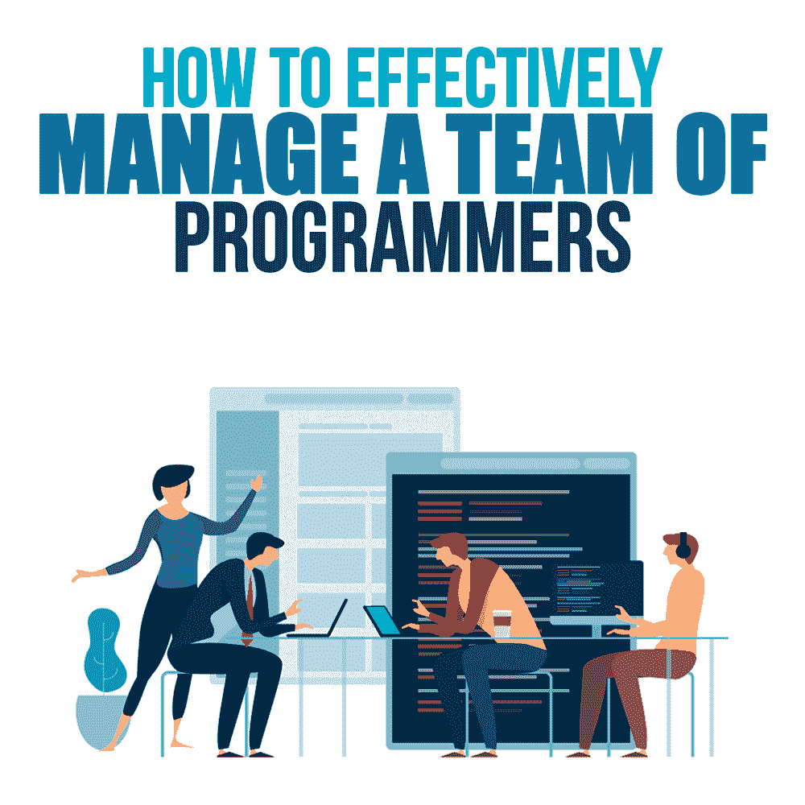

# 如何有效管理一个程序员团队

> 原文：<https://simpleprogrammer.com/effectively-manage-team/>

**

*团队越强，业务越强，这一切都始于有效的管理。*

众所周知，程序员很难找到、筛选和录用。他们是艺术家。他们雄心勃勃。无论你有一个小的还是快速扩张的程序员团队，你都有可能遇到严重影响员工快乐和士气的情况。

流行的说法“员工不辞职，他们辞职的是他们的经理”，有很多道理。人们绝对不能忽视经理通常对员工的工作生活平衡、项目的成功和失败以及整体团队发展的影响。

科技行业的许多团队经理继续努力管理他们的团队(包括远程和内部)。说实话，管理[来之不易](https://www.amazon.com/gp/product/1617292397/ref=as_li_tl?ie=UTF8&camp=1789&creative=390957&creativeASIN=1617292397&linkCode=as2&tag=makithecompsi-20&linkId=YNX4566EEVSNF3IL)。我不想假装是一个专业的经理，但是我有一些建议可以确保你的程序员团队表现良好并保持在正轨上。让我们开始吧。

## 使用项目管理系统

如果没有项目管理，您如何判断有多少资源处于忙碌状态，有多少资源是可用的，以及它们是否都被有效地用于业务？项目管理系统是一种通过计划、组织和管理资源来管理项目的方法，特别是那些支持项目管理的资源。它让项目经理可以轻松地安排项目、跟踪进度以及对项目进行调整。

拥有一个好的项目管理系统的项目经理将拥有他们所需要的一切来进行改变，以保持项目的进度和预算。

### 1\. [ProofHub](https://www.proofhub.com/)

ProofHub 是一个基于云的项目管理系统，管理您的截止日期和可交付成果。当您投资 ProofHub 时，您将获得当今市场上最好的项目管理软件。通过使用它，团队可以轻松地充分利用他们的一天，并最终达到他们的目标。

ProofHub 非常适合:

*   **计划/安排**–在一个地方计划和委派任务、子任务、文件夹、模板、工作流和日历。
*   **协作**–分配任务、添加评论、组织仪表板以及审阅校对和批准。
*   **文档**–借助文件管理功能避免任何文件丢失。
*   **评估**–通过资源管理和报告来跟踪和评估生产力。

### 2. [Axosoft](https://www.axosoft.com/)

Axosoft 是另一个广泛使用的敏捷项目管理工具，对 Scrum 框架感兴趣的软件和应用程序程序员可以使用它。它帮助程序员按时创建和交付全功能、无错误的软件。

使用 Axosoft，您可以:

*   使用 Axosoft Release Planner 高效规划冲刺。
*   使用 Axosoft 的卡片视图可视化进度，这是一个完全可定制和编辑的交互式看板。
*   当您手边有正确的度量标准时，按时发布项目。

Axosoft 帮助您创建开发计划，设计流程步骤，高效无缝地协作，安排发布时间，并在交付前及时发现和解决问题。

### 3\. [Assembla](https://www.assembla.com/home/)

Assembla is a trusted partner on your journey to discovering “what’s next” on your project. It is a cloud-based task and code management tool for software developers wanting to secure open source code. Assembla Git scans for secret key credentials and vulnerable component dependencies automatically.

使用汇编，您可以:

*   改进和管理开发过程。
*   比较和对比修订。
*   组织应用和其他系统的发布。
*   消除错误和问题。

通过使用 Assembla，开发团队从典型的 Scrum 敏捷转向更连续、分布式和可伸缩的东西。它提供了一整套项目管理工具——与 Git、SVN 和 Perforce 项目集成——全部在云中。

Assembla 也是 Dropbox 集成、敏捷任务管理、团队协作和项目管理的提供商。您可以涵盖从构思到生产的所有方面，管理代码审查，记录您的工作，等等。

## 不要太专横

一些经理在告诉程序员事情应该如何做、计划和适应时要求太高。对员工来说，日复一日和一个事无巨细的老板打交道是非常令人沮丧的。相反，做一个细心的老板，永远帮助员工提高，做最好的自己。

如果你的团队一直说你专横，有些事情需要改变。友好地与员工讨论你分配给他们的任务，不要太急于求成，让他们用自己独特的才能和技能以自己的方式完成任务——这将显示结果。如果你不是一个要求苛刻的老板，团队动力可能会随着生产力的飙升和更牢固的长期关系而不断改善。

## 提供灵活的工作时间和远程工作

传统的观点认为员工应该朝九晚五地在办公室工作，这在现代劳动力中正在迅速改变，并成为过去。程序员要不断解决问题，很多时候会卡在代码里。他们需要返工。因此，他们最终要求在最有效率的时间自由灵活地工作，以取得更好的结果。

[远程工作](https://www.amazon.com/Remote-Office-Required-Jason-Fried/dp/0804137501)可以通过为您的敏捷开发团队使用合适的工具来完成。Owl Labs 的一份[报告显示，提供远程友好选项的公司比其他公司的营业额少 25%。然而，现代劳动力也在其他方面发生着变化。今天的员工不只是在寻找一个朝九晚五的时间表和一份薪水；他们也想要一份能激励他们并符合他们的生活方式、常规和未来目标的工作。](https://www.owllabs.com/state-of-remote-work)

## 提供反馈

对于团队交付的任务，[提供反馈](https://simpleprogrammer.com/programming-project-manager/)始终是必要的，因为这涉及到积极倾听，花时间分析他们的表现，然后提出最佳解决方案，让他们表现得更好。

每个程序员迟早都需要一些反馈。给他们反馈同时又不吓跑他们的最好方法是什么？

*   及时分享反馈:及时提供反馈将为程序员节省时间，并确保不会忘记任何重要信息。
*   **抓住要点:**只提供适当的反馈。
*   不要关注他人的成就:将一名员工与其他开发人员进行比较会引起争议，而不是团队合作的顺利进行。
*   **不要添加新的需求:**反馈会议应该只包括对正在进行的、已完成的或未完成的任务的反馈。

不要犯错误:对程序员的定期反馈将保持一个高效、敬业的团队。

## 做一个领导者，而不是管理者

There is always a buzz when talking about the difference between a leader and a manager. Leadership is a skill; management is a discipline. Leaders and managers each play a big role—a leader is the one who inspires and influences the team to work willingly. On the other hand, a manager is a major link between the firm and its stakeholders.

做一个让团队参与、有动力、有灵感的领导者。管理者不再是作为控制机器而存在的时候了。如果你想赢得团队的尊重，做一个乐于助人、注重结果的人。最好的经理不会告诉别人如何工作；他们只是营造一种环境，让他们的团队能够发挥出最佳水平。

当领导一个程序员团队时，让他们觉得你会支持他们。例如，如果他们想写代码，那么就让他们去做，只要这样做对公司有利。推动他们扩展自己的知识——无论是关于特定语言还是该语言的特定子集——并帮助他们理解组织的目标和格言。

## 是时候让你的团队大放异彩了

一个好的项目经理能让事情发生。团队管理从来都不容易，但是你有能力帮助团队做到最好。

遵循这些简单的步骤会让你和你的程序员团队一起工作既愉快又高效。有了这种方法，成功的可能性更大，所以为什么不从今天开始改变呢？