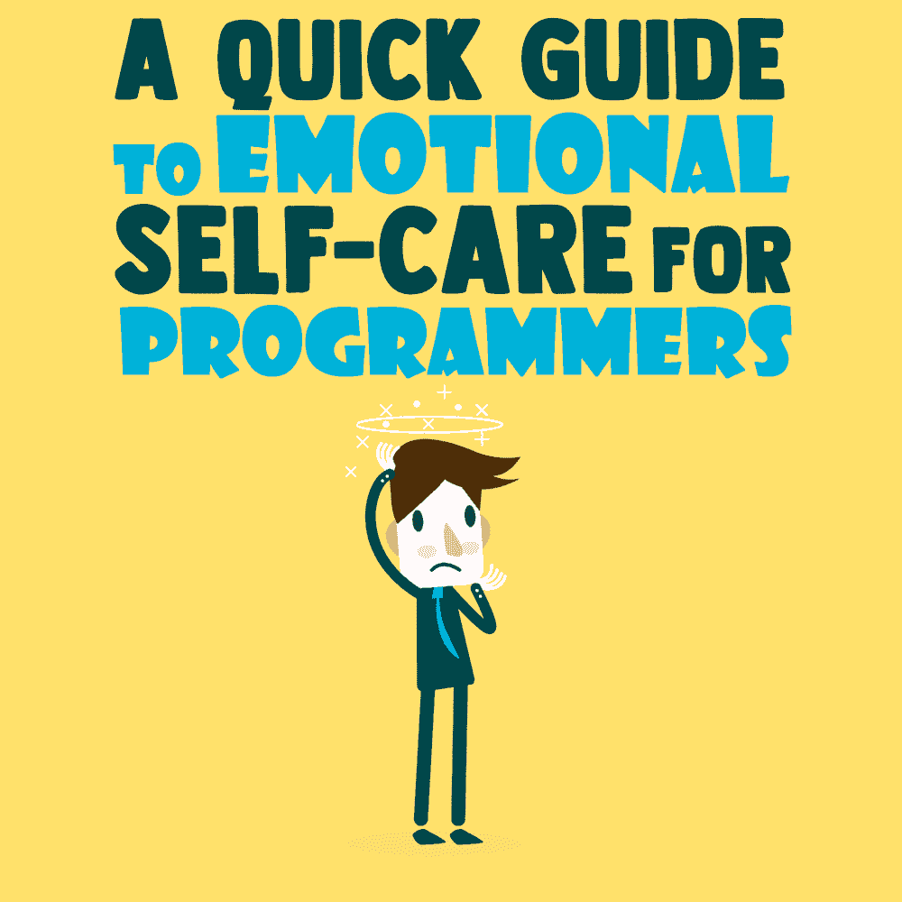

# 程序员情感自理快速指南

> 原文：<https://simpleprogrammer.com/emotional-self-care-for-programmers/>

<figure class="alignright is-resized">

</figure>

关于人类的一个有趣的事情——事实上，一个决定性的特征——是我们自我意识的能力。

在任何给定的时刻，我可以调谐到我正在经历的事情，并告诉你一些关于它的事情。

这种体验的要素可以这样分类:

*   **思想:**存在于脑海中的画面、文字、记忆。
*   **身体感觉:**疼痛、不适、愉悦、精力等等。
*   **情绪:**肉体和精神相交的感情世界。

这些经验的每一个元素本身都很重要。思想对程序员来说尤其重要——我们将思想转化为代码。身体的感觉经常提醒我们潜在的伤害(例如，疼痛)或敦促我们满足一些基本需求(例如，饥饿)。感情促使我们采取行动，为生活增添色彩，并为深层进化目的服务。

关于软件开发者有很多[的刻板印象。一个常见的比喻是，我们是没有感情、完全理性的机器人。我一直对这个很好奇，因为它与我的经历相去甚远。](https://www.linkedin.com/pulse/armando-you-dont-look-like-software-engineer-armando-pantoja/)

我以前写过很多关于[想法](https://codingmindfully.com/how-your-mind-evolved-to-keep-you-safe-and-why-you-dont-always-feel-that-way/)的文章。今天我要解决情绪问题。这些年来，我不得不学会控制自己的情绪，主要是因为我不知道如何正确地调节它们。我轻微失控的情绪有时会妨碍我的生活，包括职业上的。我经常会经历强烈的焦虑(这是恐惧情绪的放大版本)。

我将从检查一个开发人员在日常编程中可能经历的一系列情绪开始。然后我会分享我用来帮助管理自己情感生活的三个策略。

我承认，人们对自己的情感生活会有不同的体验。我在这里提供的是一些原则，我希望许多人可以从中受益，尽管你的收益可能会有所不同。

## 程序员日常工作中情绪的起伏

想象一下，我和我的老板或利益相关者聊天，我被要求承担一项编程任务。以下是我可能经历的典型情绪序列。

首先，好奇心。我觉得我想更多地了解手头的任务，谁参与了，范围是什么。

这很快被**自我怀疑**所取代。这是我面对新任务时常见的一句话。我觉得我有时无法完成任务。在最坏的情况下，这可能会变成一种**恐惧**的感觉。

一旦我克服了自我怀疑(这是我拖延的一个巨大来源)，我开始感受到完成任务的决心。我经常利用这种感觉开始取得一些实际进展。

通常，随着我的进步，我会进入心流阶段(这可能包括积极的情绪，如**快乐**和**满足**)。有时候，当面对特别棘手的问题时，我会不知所措，最终陷入**沮丧**的境地——我会进入堆栈溢出兔子洞……

有时自我怀疑会在这个阶段再次出现——它有时会循环成自责，并在最糟糕的时候激活我的冒名顶替综合症。

随着任务越来越接近尾声，我常常会对任务完成的前景感到**希望**！也许甚至**对自己的能力有信心。**

然后是演示日。接下来会发生什么取决于演示如何进行！如果一切进展顺利，那是一种工作做得很好的成功感和更多的工作满足感。如果有问题，很可能会有更多的沮丧、**失望、**甚至**愤怒**。

在这个例子中，我已经确定了 13 种不同的情绪状态。你可能完全或部分认同。或者对你来说根本不真实。无论如何，学会如何控制自己的情绪是非常必要的。

## 用你的情感工作

<figure class="alignright is-resized">

</figure>

我不想把情绪非正常化，也不想暗示它们是应该避免或抑制的。情绪是相当低级的人类反应。对于我们大多数人来说，没有办法绕过它们——尽管每个人的神经都不同，经历的反应范围也因人而异。

学会带着情绪工作会带来两个立竿见影的好处，可以提高你的生活质量。首先，你可以学会放大有益或愉快的情绪状态。其次，你可以学会解决或驾驭困难或不愉快的情绪状态。

我们大多数人都会时不时进入困难的情绪状态。我认为困难的情绪状态是指你的情绪干扰了你的目标或愿望。

例如，强烈的自我怀疑会削弱你完成工作的能力。同样过度焦虑。

以下是我发现的管理自己情绪状态的三个有用策略。我称它们为**名和规范**，**成词**，**认知融合**。让我们一个一个来看看。

### 命名和规范

给一种情绪命名可以帮助你消除它的一些力量。

学习如何做到这一点包括训练自己识别何时出现了一种特定的情绪或混合的情绪。

我将在随后的文章中更深入地探讨这一点，但是我们许多人通过身体的感觉来注意情绪的存在。

比如我焦虑的时候会觉得肚子里有疙瘩。当我快乐的时候，我感觉到一种轻盈感和一种能量感在我的胸部中心移动。当我难过的时候，我的眼睛后面有一种沉重的感觉。

*(如果你想学习如何做到这一点，从[正念冥想](https://codingmindfully.com/ultimate-guide)学习身体扫描技术会有帮助)*。

能够说“愤怒就在眼前”是很有用的，因为它让我摆脱了一些困惑。我开始意识到自己的感受，这让我转向一种更符合逻辑的运作模式。

我已经建立了一个我的身体感觉和情绪状态之间关系的目录。你也可以！特定的情绪在不同的文化中表现出来的方式是非常一致的——我建议看看这篇文章，看看什么是真实的。

一旦你能够注意到并说出自己的情绪状态，你就可以做两件事之一:

*   如果它是令人愉快的，或者在那一刻是有用的，你可以简单地品味这种感觉。
*   如果目前没有用，你可以采取一些行动来调节情绪的强度。

品味是不言自明的。我们都想感觉良好。所以当我们这样做的时候，我们可以，也应该，享受它。

调节技巧包括在情绪上加上词语(我将在下一节讨论这个)或者练习其他技巧来帮助你驱散情绪的强度。锻炼通常对我很有用。

我还发现我在冥想练习中发展的[正念技巧](http://codingmindfully.com)在这些方面非常有价值。

### 用语言表达

作为开发人员，我们通常需要依靠我们的理性思维——我们自身清晰思维的一部分，它允许我们将想法转化为代码。

当我们非常情绪化的时候，很难接近自己的这一部分。

用我们选择的语言造句可以帮助我们回到这种运作模式。将文字融入我们的情感体验可以帮助我们理解它们。

<figure class="alignright is-resized">

</figure>

我用下面的句子结构。它的效果是尊重一件事情已经发生的事实，但是把你的感觉的责任完全放在你自己身上，那是它们应该在的地方。

当(事情发生)的时候，我感受到了(情绪)。

有两种方法可以做到这一点:

*   与另一个人类交谈。
*   在[私有，通过写](https://simpleprogrammer.com/a-year-of-mindfulness)。

让我们面对它；说话真好。人类是群居动物，我们生来就是互相帮助的(我们天生就是部落)。所以，找一个你信任的人——朋友、同事或你生活中的其他人——把它说出来。如果你不习惯公开你的情绪状态，你会觉得很脆弱。但是如果你注意别人对你说的话，你会发现这其实很平常。

如果你发现自己经常处于特别棘手的情绪领域，不要害怕去找治疗师。是的，这是无价之宝。

对此的补充是写日记或任何其他形式的写作。如果我发现自己对某事感到不安或高兴，我做的第一件事就是拿起我的日记。比起与人交谈，这是一种不那么脆弱的处理情绪的方式。

### 认知融合

我们会被情绪弄得如此混乱的原因之一是我们太认同它们了。

从本质上来说(我将在以后的文章中继续讨论)，情绪只是一系列的感觉，它们给了我们关于周围世界的信息。然而，我们倾向于认同这些感觉，好像它们在某种程度上是“我们”

我们说“*我*生气”或者“*我*悲伤”通过使用这个短语，我们**变成了**这些情绪。

我使用的一个来自正念/认知心理学的技巧叫做认知融合。

不要在情绪状态中使用“我”的陈述，而是使用“(情绪)存在”的表述例如，如果我正在经历愤怒，我可以说“愤怒就在眼前”

试试看，看看什么适合你！

## 带着你的情感工作会让你成为更好的开发者

对我们大多数人来说，情感是生活中丰富的一部分。他们能给生活增添色彩，同样，当他们失去控制时，他们也会碍事。学会识别我们的情绪状态，把它们用语言表达出来，并从中化解，是聪明地处理情绪的好方法。

学会带着情绪工作可以让你成为更好的开发者。了解你自己可以帮助你发展同理心和你的整体软技能，所以这是一项值得进行的练习。