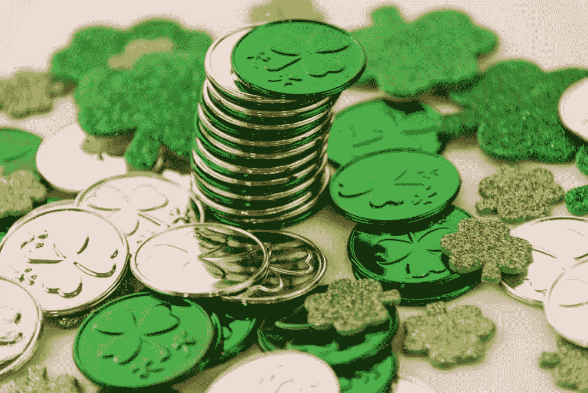

# 如何策划你的“幸运之旅”

> 原文：<https://simpleprogrammer.com/engineer-lucky-break/>

对大多数人来说，运气就是掷骰子，在地上找到一美元，或者在最后一分钟提交代码后通过所有测试。

许多人的奋斗和成就都归功于运气。有些人把运气不好作为他们目前失败的原因。与此同时，有些人可能把他们生活中的所有成功都归功于好运。

运气是偶然的，还是可以被设计的？

好吧，我们是这里的软件开发人员。我们是一群非常怀疑的人。你们大多数人可能想知道运气是否存在。还没有找到确切的答案。也许运气只存在于一个幸运的人的头脑中。

这并不意味着我们不能建立一个相似的心态，并利用我们的优势运气。

"运气是对机遇的准备."塞内加

看待运气的另一种方式是把它视为拥有机会。如果给你更多的机会，你更有可能取得突破。同时，如果我们不抓住已经给我们的机会，什么也不会发生。

这就是为什么运气永远不可能是一个人成功的百分之百的原因。运气可能会给你一个击球手，但并不保证你会打一个本垒打。

好消息是，有了正确的准备，任何人都可以有一个幸运的突破。

## 是什么让一些人比其他人幸运？

运气很可能与兔脚或铜币无关。

心理学家理查德·怀斯曼调查了数百人，以找出谁认为自己幸运或不幸。然后，他对两组人进行不同的测试，以观察他们的表现。那些认为自己幸运的人总是表现得更好。

怀斯曼最终将他的大部分研究收集到一本名为《运气因素:四大基本原则 的书中。在书中，怀斯曼博士谈到了幸运的人遵循的四个原则。

### 原则一:最大化机会

幸运的人善于创造、注意和把握机会。他们发展了洞察力和思想。他们不只是观看，他们行动。他们不只是看到趋势，他们驾驭趋势。

一个偶然的机会可能会遇到一个老朋友，他的公司正在招聘更多的开发人员。甚至在会议上因为其他人生病而被要求做一个小演示也是一个机会。

一个很好的例子是 John Sonmez 和他在一个名为 Pluralsight 的培训网站上的工作。当约翰被要求为 Pluralsight 制作一个关于 Android 开发的视频教程时，他得到了一个很好的机会。他最大限度地利用了这个机会，创建了 50 多个球场。

作为软件开发人员，我们倾向于独处，这会限制我们获得随机机遇的机会。你不必改变自己。如果你是一个内向的人，那很好。与他人见面时保持放松的态度会有所帮助。你也可以接触老朋友，建立更深的关系。在现实世界和网上建立你的人际网络会带来很多好处。

### 原则二:倾听幸运的预感

幸运的人通过倾听他们的直觉和直觉做出有效的决定。

当涉及到大多数决策时，软件开发人员可能会过于逻辑化。当在链表和数组之间做出选择时，大多数软件开发人员不会选择感觉正确的。我们将根据应用程序的逻辑需求做出决定。即使像[找到下一个](https://simpleprogrammer.com/2015/08/07/finding-what-to-learn-next/)要学什么这样的事情，我们也倾向于跟随我们的头脑，而不是我们的直觉。我们在日常工作中面临的大多数挑战都可以用逻辑来解决。对于大多数编程项目来说，强烈关注逻辑是鼓励的、有益的，并且是必要的。

作为软件开发人员，基于逻辑的问题并不是我们面临的唯一问题。跟随你的直觉有助于解决那些没有清晰逻辑答案的混乱问题。直觉的好处在于它可以随着时间的推移而提高。提高直觉的一个好方法是养成每天冥想的习惯。使用像[顶空](https://www.headspace.com/)或[蛤蜊](http://www.calm.com/)这样的应用程序真的有帮助。从几分钟开始。

跟随直觉的另一个好处是，它能帮助你更快地做出决定。快速决策有助于抓住机遇。

### 原则三:期待好运

幸运的人确信未来会很好。

他们如此相信这一点，以至于这几乎成了自我实现。拥有积极的观点也能改善与他人的互动。当事情变得艰难时，幸运的人仍然乐观，这有助于他们继续前进。他们相信一切最终都会解决，他们的努力会有回报。

阿诺德·施瓦辛格的一生就是一个很好的例子。别人贬低他，但他对自己有足够的信心，继续朝着成为电影明星的目标努力。

作为软件开发人员，我们需要避免怀疑主义的陷阱。我们的信念会对我们的工作和同事产生切实的影响。约翰·桑梅兹有一个很好的视频，讲述了[你的信念如何决定你的现实](https://simpleprogrammer.com/2014/05/08/belief-determines-reality/)。

### 原则四:化厄运为好运

Lucky people use different techniques to help them deal with setbacks. They even thrive when bad things happen. Taking the time to remember how good they really have it helps. They don’t constantly worry about the future or the past. The lucky group also tried to take control of every situation.

Ryan Holiday 有一本关于这个主题的很棒的书叫做[障碍是方式](http://www.amazon.com/exec/obidos/ASIN/1591846358/makithecompsi-20)。在书中，瑞安谈到了历史上成功人士用来克服挑战的斯多葛派原则。他讨论了甘地如何没有亲自为印度的独立而战:“有时候，你克服障碍不是靠攻击他们，而是靠退缩，让他们攻击你。你可以用别人的行动来反对自己，而不是自己行动。”

**软件开发就是解决问题**。当我们面临挑战时，我们需要将它们视为提高技能的机会。这样我们可以回顾过去，把坏运气变成好运气。

“通过我们对事件的感知，我们对我们的每一个障碍的产生——以及毁灭——负有责任。”–Ryan Holiday，*障碍就在眼前。*

## 如何策划你的幸运之旅

运气不是某种精神力量。更多的是你的行为方式和你如何看待日常生活的结果。运气是你可以通过以上四个原则学到的东西。这只需要改变你的心态。现在，让我们来看看你可以做的一些战术性的事情，来帮助你策划你的幸运突破。

### 变得多产。

"取得成功的秘诀在于开始行动。"马克·吐温

通过做大量的工作，你大大增加了其中一些会带来更大机会的机会。你可以写博客，制作培训视频，或者建立在线课程。从更技术性的角度来看，你也可以开发移动应用、游戏，或者启动一个开源项目。

约翰有一个关于如何多产的视频。简而言之，你围绕你的工作建立系统。当你有了一个系统之后，随着时间的推移，你会继续一遍又一遍地使用它来产生大量的工作。

### 不要放弃。

"我们必须明智地利用时间，永远意识到做正确事情的时机总是成熟的."纳尔逊·曼德拉

作为一名软件开发人员，你会经历好运和厄运。大多数人在几次倒霉的休息后就停下来了。成功的事业不是在一瞬间建立起来的。这是数百万个被时间串连在一起的瞬间。

随着时间的推移，当你每天都出现并尽力而为时，你更有可能抓住新的机会。你只需要逐渐积累成功。这样做需要顽强的毅力和从重复失败中优雅恢复的能力。

**时间是最大的均衡器**。记得要有耐心。

### 要有灵活的长远眼光。

"你必须是无形的，无形的，像水一样."-李小龙

一旦你确定了你的最终目标，你必须相信有很多方法可以达到目的。明确长期目标很重要，但不要太拘泥于你认为应该走的路。

发现并抓住机会的人对生活的岔路更加开放，因此他们看到了其他人错过的可能性。

要做到这一点，你必须像黑客一样进行实验。黑客尝试了很多不同的东西。他们不会被决定所麻痹。黑客采取行动，并根据结果改变他们的实验。这需要对生活中令人惊讶的波折保持开放，这会带来更多的幸运。

“所有的生活都是一场实验。做的实验越多越好。”拉尔夫·瓦尔多·爱默生

### 去冰球要去的地方。

“一个好的冰球运动员会在冰球所在的地方打球。一个伟大的冰球运动员会在冰球要去的地方打球。”韦恩·格雷兹基

俗话说，你必须在正确的时间出现在正确的地方。你能做的最大的事情就是在更多的时间出现在更多相关的地方，以增加你的幸运几率。

这意味着遵循基于未来的轨迹——而不总是现在正在发生的。

培养一双发现趋势的眼睛将有助于你策划你的幸运之旅。举个小例子，随着许多公司转向微服务，对 API 空间的需求越来越大。另一个更长期的游戏可能是加密货币或虚拟现实。

## 今天就开始为你的下一个幸运假期努力吧

有更多的运气可能只是改变心态，但只要做一点点工作，我们都可以有更多的机会。

我有过几次幸运的突破，但我仍在为下一次努力。也许这篇文章会是它。

你过去有过哪些幸运的突破？请在下面的评论区告诉我。

祝你好运！