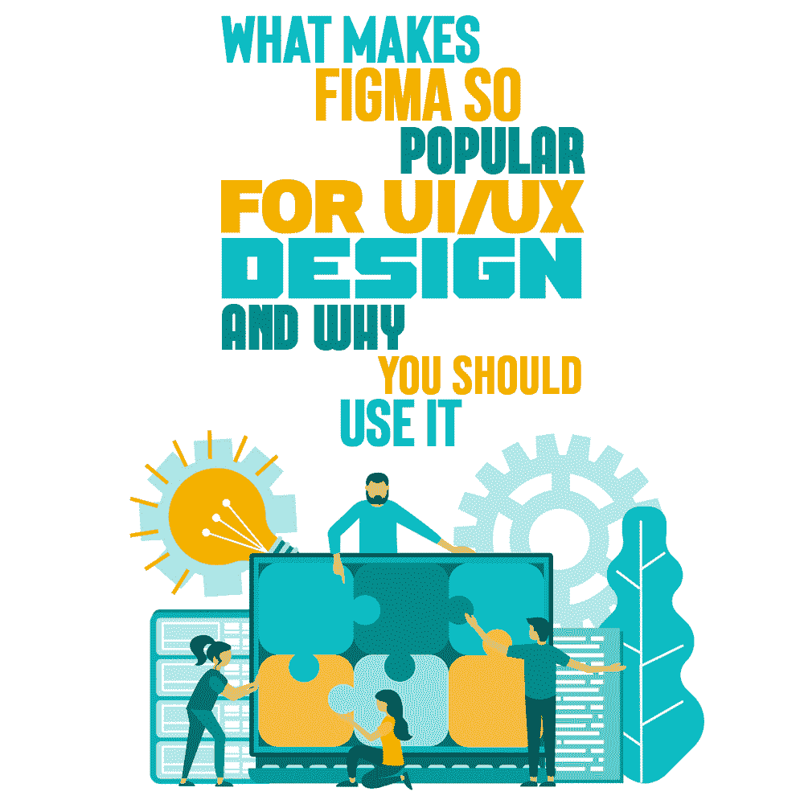
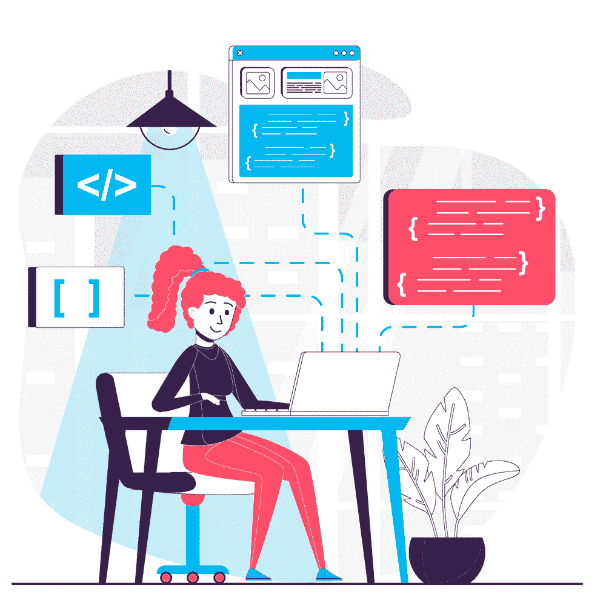

# 是什么让 Figma 在 UI/UX 设计中如此受欢迎，为什么你应该使用它

> 原文：<https://simpleprogrammer.com/figma-ui-ux-design/>

In September 2016, a long-awaited dream of two brilliant minds, Dylan Field and Evan Wallace, came true when the design tool Figma was released.

在当时统治设计领域的工具中，Figma 是个例外。以协作为基石，它在传统的离线、单人竞技场上有效地铺平了一条新的道路。五年后的今天，Figma 已经成为大多数设计团队执行设计流程的首选。

毫无疑问 [Figma](https://www.amazon.com/dp/B09B3HHS3D/makithecompsi-20) 是一款潜力巨大的工具。它具有从头到尾支持设计过程的能力。用 Figma 的联合创始人迪伦·菲尔德(Dylan Field)的话说，“设计正在经历一场巨大的转变——从设计处于产品周期的最后阶段，人们只是让东西变得更漂亮，到现在它贯穿整个过程。”

Figma 正是基于这种远见而开发的。随着设计经历转变，设计工具也必须改变 Figma 是这一转变的先锋！

那么，是什么让 Figma 成为如此有前途的设计工具呢？Figma 带来了哪些独特的功能？让我们在本文中对此进行更多的探索。这样，你会对设计工具领域的最新发展有一个全面的了解，并且知道你是否错过了一些重要的东西。或许，在这篇文章的结尾，我会说服你去尝试一下 Figma。

## Figma:强大的设计工具

当 Figma 推出时，一个让许多人惊讶并同样获得赞赏的特点是它是基于网络的。

传统上，所有的设计工具都是桌面应用程序，必须下载并安装才能使用。他们还依赖于他们运行的平台。基于浏览器的 Figma 就是在这种环境下进入市场的。

任何操作系统——Mac、Windows 或 Linux——如果有网络浏览器，都可以运行 Figma。不需要下载或安装，这是 Figma 协作特性的基础。

今天，Figma 有一个 web 应用程序和一个移动应用程序(处于测试阶段)。它有几个惊人的资源，功能和插件，有助于使设计过程更加顺畅。它结合了网络的可访问性和应用程序的效率，带来了一个与众不同的工具。

从头脑风暴到创建线框、原型和最终设计；从协作到反馈收集和开发人员移交，Figma 将其支持延伸到整个过程。

让我们仔细看看 Figma 使其成为最佳工具的一些关键方面，从[策略到设计。](https://www.amazon.com/dp/B087R9NH12/makithecompsi-20)

### 快速协作

如果不先讨论 Figma 的协作能力，就不应该开始讨论它。毕竟 Figma 是为[协作](https://simpleprogrammer.com/top-developer-collaboration-tools/)打造的。

在你创建一个账户后，你就可以组建你的团队并让他们加入进来。您可以邀请其他设计者、利益相关者或开发人员加入团队，并授予他们相关的访问权限(即编辑者、查看者或所有者)。此外，共享可以在团队级别、项目级别甚至文件级别进行。

分享需要什么？无非就是分享一个链接。合作者可以通过点击链接开始工作，并根据他们的角色采取行动。Figma 设计人员的姓名显示在顶部，因此很容易跟踪谁在做什么。通过评论功能可以轻松收集反馈并进行修改。

一些设计团队发现，在远程工作或展示设计时，实时协作支持非常有益。

### 简化迭代

一个 [UX 设计过程](https://aufaitux.com/blog/ui-ux-design-process/)包括在最终设计被确认之前的多次迭代。设计师创建草图、线框和原型，每一个都由相关方评审，并根据需要进行迭代循环。

在引入 Figma 之前，需要多种工具来执行各个过程，如线框化、原型化和评审。这意味着要来回发送一系列文件。这使得迭代周期变得复杂、混乱和耗时。

Figma 允许设计团队绕过这个复杂的过程。从草图到评论，一切都可以在 Figma 内部完成，不再需要第三方工具或数百个文件的交换。迭代可以通过满足所有必要需求的单一平台快速有效地完成。

### 简单的原型制作和测试

Creating interactive prototypes is quite simple in Figma. Designers can switch between design mode and prototype mode with just a click. And in prototype mode, making elements interactive with added transitions is simple to carry out. You can create high-fidelity prototypes, right from the design file itself, with no complications.

此外，一旦您完成了原型的构建，您就可以通过共享原型链接来分发它以供用户测试。如果需要的话，测试人员可以检查并在原型中留下他们的评论。此外，在移动设备上进行测试也非常有效，因为原型被实际的设备模型所包围。Figma Mirror 应用程序还允许更真实和特定于驱动器的测试。

### 有组织的设计

Figma 的一个值得注意的特性是，它允许设计师创建组件库来组织他们的设计。组件、文本样式、字体和效果可以创建一个库，也可以在其他 Figma 文件中使用。

此外，无论何时对库中的任何元素进行更改，都会反映到使用该元素的所有文件中。在为大型组织和[企业 UX](https://aufaitux.com/blog/enterprise-ux/) 设计时，这是非常有益的，有助于保持设计更新无误。

### Swift 开发人员移交

传统上，设计人员和开发人员使用单独的工具来促进移交。但是对于 Figma，这不是必需的。相反，开发人员只需单击一下设计文件就可以切换到代码模式。在代码模式下，选择任何元素都会给出该元素在代码中实现所需的所有细节。所以，这是开发商和设计师的双赢！

## 前所未有的团队设计

选择设计工具是每个设计师的个人偏好。一个设计者可能喜欢某个工具的某个特性，而另一个可能更喜欢不同工具的方法。然而，当你作为一个团队以提供最好的[用户体验](https://simpleprogrammer.com/user-experience-design/)为目标进行设计时，设计工具支持团队合作是很重要的。这就是菲格玛的力量所在。

Figma 是先进的，有能力的，解决了设计师多年来一直面临的几个问题。Figma 的创建者了解设计师和他们的需求，并希望开发一个平台来支持他们的每一个角色——从构思到制作。

在其存在的五年中，Figma 成功地使设计变得简单易懂。未来将见证它攀登更高的高度，让更多的人拥抱设计。