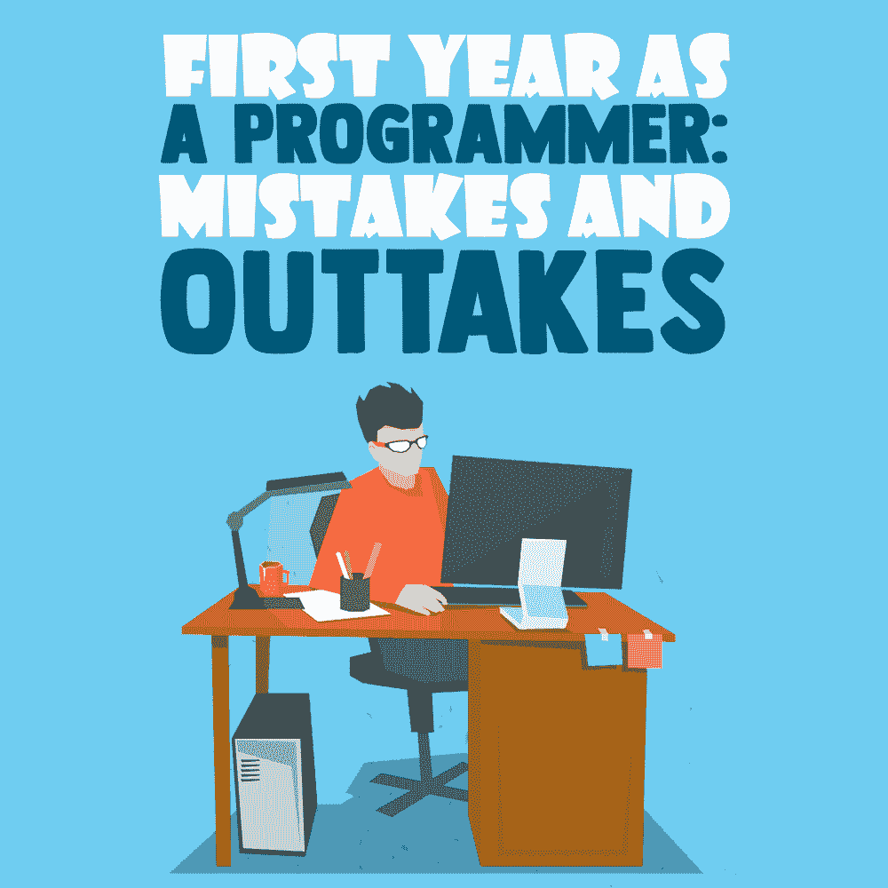

# 作为程序员的第一年:错误和摘录

> 原文：<https://simpleprogrammer.com/first-year-programmer-mistakes/>

<figure class="alignright size-large is-resized">

</figure>

有一种说法是，每个程序员都是在第一年的职业经历中形成的。虽然我相信第一年后你可以(通过巨大的努力)重塑自己，但这对你的成功确实至关重要。

我在四年学士学位的第二年开始了我的第一份工作。我在第三学期结束时(12 月初)开始做兼职，然后很尴尬地转而在夏天每周工作 6 天，平均每天工作 10 个小时。

在这份工作中，我学到了很多关于这个行业的细节。不幸的是，这种学习的大部分是通过我犯错误并不得不回头纠正它们来完成的。这花费了我本可以用在其他地方来提高我的技能和职业声誉的时间。

让我们深入了解我作为专业软件开发人员的第一年，看看我犯的许多错误，以及为了你的专业成长，你如何才能有一个更好的开始。

## 我从第一年的错误中吸取教训

我轻而易举地找到了第一份工作——这是我参加的唯一一次面试。一天深夜，我向寻找初级开发人员的公司发出了几份简历。大约两个星期和几个阶段的面试后，我得到了这份工作。

几乎是在瞬间，我开始犯下无数严重阻碍我职业成长的错误。

### 对自己的知识过于自信

不用说，我以前没有实际项目的经验；我从未构建过任何被实际人员部署和使用的东西。

那时我的项目由几个类组成，这些类通常从终端控制台获取输入。

没有数据库。没有外部系统。没有外部 API。没有配置。

为自己辩护，一年前我不知道如何写“hello world”，但这并没有让我的日常任务变得更容易。

更糟糕的是，我不知道如何浏览大型代码库，如何问正确的问题，或者如何让人们伸出援手而不惹恼他们。这不是我想象中的开始。

回想起来，很有趣的是，我以为我会粉碎它。那是一个非常纯粹的程序员自大的时刻。

我是怎么修好的？

辛苦了。还记得我提到的一天 10 小时，一周 6 天吗？那是我的暑假。我会说我是一个不错的程序员。另一种选择是花一到两年的时间做兼职来达到那个水平，但是天哪，天哪，这太难了。我并不喜欢它，但发现它极其必要。

醒来，去工作，下班回家，吃一顿电视晚餐，几乎每晚都去睡觉，这一点都不好玩，相信我。如果我能重新来过，我绝对不会把自己置于那种境地。

我认为事先学习和理解工作的某些方面很重要，但当实际应用时，这些方面就变得不那么重要了。

不要误解我，算法一次性类型的问题肯定会出现在面试中，准备这些问题会让你通过面试，但这只是开始。

除了个人项目，如果你能负担得起，不要急于得到你的第一份工作，直到你的技能相对发达。第一年，你的大部分时间不仅要花在项目上，还要学习公司使用的所有工具、框架和库。提前学习 git 的基础知识是一个经常被忽视的留下好印象的机会。

### 缺乏软技能

<figure class="alignright size-large is-resized">

</figure>

让我们开门见山吧——我没有合适的软技能。我不知道如何问正确的问题。我不知道什么时候打断别人，如何写有价值的邮件，或者如何与人合作。

结果是我的生产力一落千丈。我浪费时间做错误的事情，不得不重做，并且需要比我知道该问什么更多的帮助。

它感觉灵魂粉碎。

然而，我知道，尽管人们宽容和理解，这不会永远持续下去。我不得不采取行动。

约翰·桑梅兹关于软技能的书当时还没有写出来，所以我不得不四处寻找信息。这个过程很痛苦，但是在短短的几个月里，我设法解决了所有的主要问题。

我面临的最大问题是，我的电子邮件往往不够详细。我通过想象阅读邮件的人不知道我在说什么，不知道任何细节来解决这个问题。

尽管有时会阅读电子邮件的人*确实*知道所有的细节，但现实是大多数技术人员在他们的任务之间阅读电子邮件，这意味着他们不一定在你的电子邮件的背景下思考，所以细节可能会帮助他们更快地记住事情，并防止他们犯错误。

设身处地为他人着想，可以帮助你为他人提供足够的价值，让他们轻松地完成你需要他们做的工作，这几乎是犯罪行为。

### 不关心我的利益

作为一名大三学生，我的心态是“做任何事，只要变得更好；尽我所能地学习，无论代价如何。”这是快速移动的好方法，但是你必须小心不要让[耗尽](https://simpleprogrammer.com/avoiding-burnout-software-developer/)。

对我来说，这就是我正在做的项目和影响。显然，作为一名大三学生，你不能被赋予太多的责任或有影响力的任务，但即使是简单的任务也可以以有益于你并帮助你学习的方式进行。

就我个人而言，这种情况持续了大半年，我才能够和我的老板交谈，并开始得到更有影响力的工作。

我根本没有准备好自己做这些决定，但是我的老板指导了我，渐渐地我开始自己做出改变。

我看到第一年开发者不关心自己利益的第二大原因是人们在工作时不关心自己的健康——加班、不经常从椅子上站起来、不喝水等等。

幸运的是，这是一件很容易处理的事情。每 40 分钟或者任何你方便的时候设置一个计时器，然后离开你的椅子。花几分钟四处走走，让你的眼睛休息一下。喝点水。

照顾好你自己和你的事业。你是你的责任。

## 第一年是你的基础，但你可以重建

假设你在第一年就处在一个不好的地方，或者你已经有几十年的坏习惯了。你是如何提高的？

当然会有一些挑战，但我相信任何人都可以做到。

如果你想在任何事情上有所进步，你需要一件特别的东西:时间。大块的，最好是不间断的。

你有那个吗？好的，很好。

接下来要问自己的是“一个人如何提高自己的基础？”

有几个关键因素。

首先，你需要对改变持开放态度。你需要接受你已经养成的一些习惯是错误的，你需要进一步磨练你的技艺。

第二，你想回顾你的工作，看看有什么可以改进的地方。

关于找出你的弱点，没有金科玉律。你可能不得不用一本[规则手册](https://simpleprogrammer.com/CleanCodeBook)作为参考来测试你的代码。这可能是一个棘手的步骤，因为糟糕的规则手册实际上可能会对你产生负面影响。

导师会有所帮助，但对许多人来说这实际上是不可能的。

记住，学习是一个迭代的过程。例如，如果你想提高你的代码的质量，你选择了一本[规则手册](https://simpleprogrammer.com/hunting-mythical-high-quality-code/)，在你开始采用它的实践之前，你可能不得不仔细阅读它几次。

自动化永远是你的朋友，你应该尽可能地使用它。启用所有代码转换器、样式检查器等等！它会帮助你在写作时注意到错误。

最后，不要放弃。改善需要时间。专注于提高，不要急于求成。我保证你会成功的。

## 准备妥当

<figure class="alignright size-large is-resized">

</figure>

无论你的第一份工作是什么，都要做好准备。如果你跌倒了，爬起来。记住获得经验和资历是一个过程。这需要时间，在这个过程中，你肯定会偶尔犯错。

所以不用担心。慢慢来，学习这份工作的必要要求，获得一些软技能，注意你的个人健康，最重要的是，要有耐心。

成功需要时间。这需要努力工作和持续的承诺。希望这些建议能帮你减轻负担，让你开始走上健康和成功的道路。

我相信你。别忘了也要相信自己。