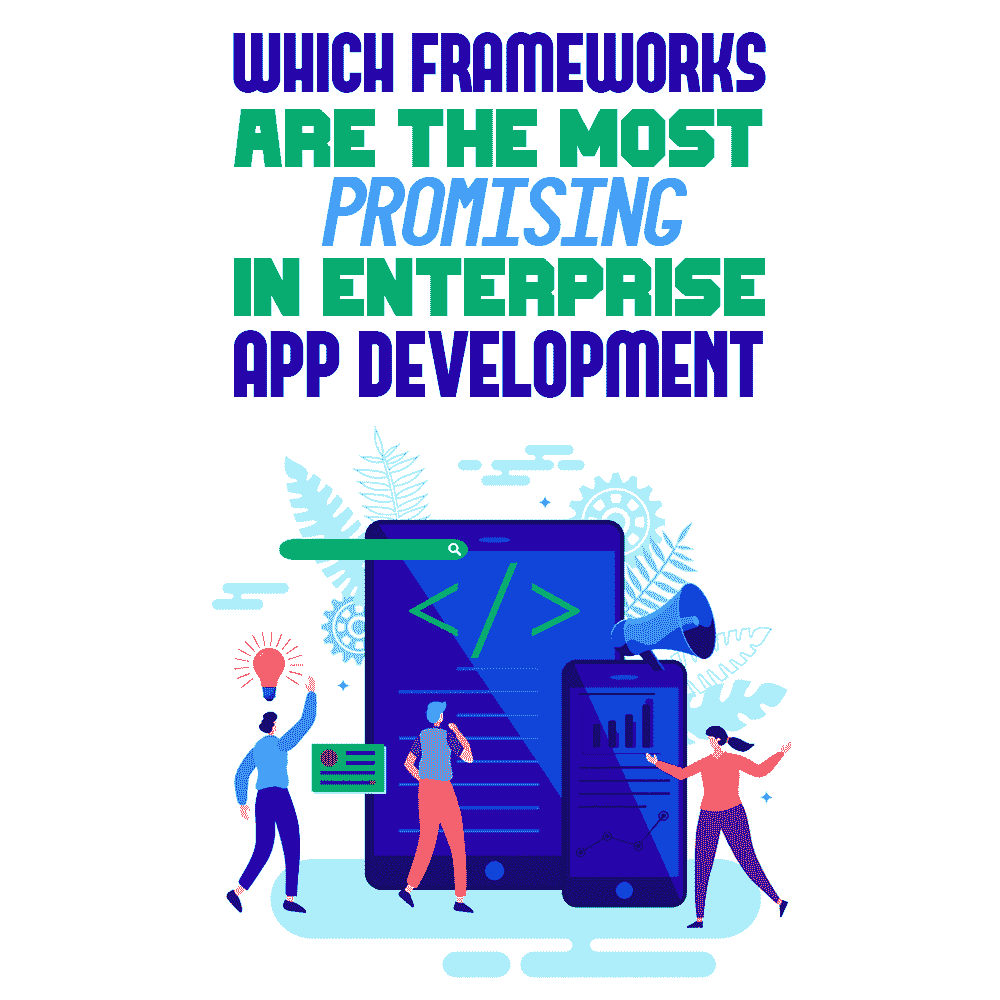

# 哪些框架在企业应用程序开发中最有前途

> 原文:[https://simple programmer . com/frameworks-enterprise-app-development/](https://simpleprogrammer.com/frameworks-enterprise-app-development/)

It’s hard to know where to start when it comes to choosing the right framework for developing your app. It’s harder when you know the framework you choose makes a big difference in how your app turns out. How do you make an informed decision then?

随着公司寻求削减成本和缩短开发生命周期，跨平台应用开发框架将会得到更多的采用。

脸书的 [React Native](https://simpleprogrammer.com/react-native-vs-android-ios-development/) 是构建跨平台应用的最佳框架。不过，尽管谷歌的动荡相对较新，但它的受欢迎程度正在飙升。

然而，即使是跨平台框架，性能和 UI 的差异也可能很明显。许多优先考虑全渠道体验的公司希望缩小这种差距。

因此，关注点不仅限于技术错误，而是同步体验。此外，跨平台框架希望能够更平滑地与云环境集成，并支持更多的非移动环境。

本文探讨了四个主要框架的最新创新:Ionic、Xamarin、React Native 和 Flutter。重点将是解释为什么 Flutter 是*在[应用开发](https://www.amazon.com/dp/B01N4WQRQA/makithecompsi-20)中*未来增强的最佳选择，尽管其他应用也在快速发展。

## 离子的

Ionic 就像 Flutter 一样，从一开始，这两个框架都广泛关注移动以外的应用开发。

然而，与 Flutter 不同，Ionic 基于开放的 web 标准和技术，这创建了一个有点独立的生态系统，包括它对非标准语言 [Dart](https://simpleprogrammer.com/dart-language/) 的使用。此外，它由 HTML、CSS 和 JavaScript——网络的*语言*驱动。Ionic 开发标准的开放性使得它可以灵活地用于不同的平台和不同的技术。

所以，从某种程度上来说，Ionic 可以说是更防未来的。由于使用了 web 组件，所以兼容 Angular、React、Vue 等任何 JavaScript 框架。这意味着，尽管 JavaScript 框架在任何特定时期都占主导地位，但 Ionic 仍然有效。

Ionic 现在支持一项它称之为 [Web Native](https://webnative.tech/) 的技术，由它的原生运行时 Capacitor 3.0 驱动。Ionic 被描述为移动应用开发的未来，旨在提升运行在移动、桌面和网络上的网络应用的性能和功能。

Ionic 希望通过这一创新，将其电容器确立为网络开发者构建移动应用的标准。Capacitor 3 的应用包尺寸更小，便于部署，测试速度也更快。

更重要的是，GitHub 上的电容器社区成员正在进行巨额投资以扩大项目。有了如此强大的支持基础，我们可以说 Ionic 在一段时间内仍将是顶级框架之一。

## Xamarin 和。网络 6

Xamarin。Forms 是众所周知的构建移动应用程序的框架。然而今年，它演变成了。NET 多平台 App UI (MAUI)，这是微软的跨平台 App 开发库。

有了毛伊岛，。NET 也加入了开发框架的行列，将支持从移动扩展到其他平台，特别是桌面、web 和云。

虽然 Xamarin 一直是。在某种程度上，微软现在希望两者成为一个实体，共享同一个类库，并提供一致的体验。因此，Xamarin。Android 和 Xamarin.iOS 成了。NET for Android 和。NET 分别用于 iOS。

因此，。NET MAUI 专注于支持通用 Windows 平台(UWP)桌面应用程序(Xamarin。表单是以移动设备为中心的)以及 macOS。

新的。NET MAUI experience 通过引入单个项目进一步统一了跨平台体验，使开发人员能够从一个平台管理字体和图像等视觉方面，而不是从一个操作系统跳到另一个操作系统。

这包含在*中。NET 统一愿景*，始于。NET 5 并一直延续到最近。NET 6。

显然，[根据微软](https://www.thurrott.com/dev/235204/net-maui-is-the-future-of-xamarin-forms)，。NET MAUI 提供了“一个针对多个平台和设备的项目，一个管理字体和图像等资源的位置，以及组织特定于平台的代码的多目标”

然而，其他所有的框架，尤其是 Flutter，已经开始将更多的操作系统和设备集成到它们的结构中。因此，微软的统一思想并不特别新颖。

## 反应自然

去年，Shopify [决定](https://shopify.engineering/react-native-future-mobile-shopify)使用 React Native 构建他们所有的新移动应用，从原生开发转型。

消息传来时，React Native 刚刚推出了一个新的架构，其中包括一个名为 TurboModules 的新的本机模块系统。新的架构通过简化桥，增强了 JavaScript 和 native 之间直接调用的类型安全性。

CodeGen 支持这种新的架构，改善了项目的编译时间，并带来了“更小的代码大小和更快的执行速度。”涡轮模块还增加了新的扩展。

尽管如此，人们谈论最多的重构方面可能是 Fabric，它只代表 UI 层。Fabric 支持并发线程和[异步渲染](https://reactjs.org/blog/2018/03/27/update-on-async-rendering.html)。它解决了渲染延迟、动画帧丢失和应用程序延迟等问题，同时还减少了内存消耗。

所有这些都基于 JavaScript 接口(JSI)，这使得在编写 C++代码时能够更好地与 JavaScript 引擎协调。

随着物联网工程的进展，脸书还计划让 React 原生支持其他操作系统和设备，如 VR 耳机和物联网设备。这在联网汽车行业中有着有用的应用，其市场规模预计到 2027 年将达到 487.7 亿美元。有了这一点，React Native 在未来将变得更加相关，并适用于更广泛的行业。

## 摆动

Despite React Native’s hold on the cross-platform mobile development market, one framework that has brought a real challenge to its position is Flutter. Indeed, Flutter has surpassed React Native in the number of stars it has [on GitHub](https://github.com/flutter/flutter). As starring a repository indicates user interest in a project, Flutter seems to currently attract more developers. This makes sense considering that Flutter also has a larger development community despite being the more recent of the two.

Flutter 非常容易使用，初学者开发者已经发现在 Flutter 上构建应用程序比其他框架更简单。因此，它非常适合用于市场研究目的的最小可行产品(MVP)的开发。

作为目前许多初级应用程序开发人员的首选框架，这已经意味着 Flutter 是培养下一代应用程序开发人员的最佳选择。

Flutter 已经从移动优先的应用程序开发框架发展而来，采用了其他平台，包括 web、桌面和嵌入式应用。此外，以类似的方式对 Native 做出反应，Flutter [旨在让](https://medium.com/flutter/announcing-flutter-2-2-at-google-i-o-2021-92f0fcbd7ef9)“创造性灵感(而非目标平台)成为唯一的限制因素。”这种扩张的一部分是通过 Flutter 2 实现的。

特别是，Flutter 2.2 的引入着重于改进性能问题。例如，它使 null 安全成为所有新项目的默认选项，从而简化了调试过程并提高了性能。

Flutter 也正在建立一些令人兴奋的合作伙伴关系，以将 Flutter 的使用扩展到移动之外。[丰田最近宣布](https://medium.com/googleplaydev/seamless-multi-platform-app-development-with-flutter-ea0e8003b0f9#f53d)其未来的车载信息娱乐系统将采用嵌入式 API，以颤振为动力。

Flutter 的[嵌入式支持](https://flutter.dev/embedded)通常扩展到[物联网设备](https://www.iotlinks.com/overview#overview-two)，如冰箱或恒温器，即使该设备使用不同的操作系统环境。

## 最有前途的框架

新兴的跨平台应用开发框架正在推动成本效益、性能、用户体验和云集成方面的创新。本文中讨论的所有框架都有很有前途的特性。

Ionic 使用 web 的“自然”语言(HTML、CSS 和 JavaScript)；Xamarin 和。NET 正在重新定义跨平台开发体验；React Native 正在向物联网等创新行业扩张。

然而，Flutter 脱颖而出。尽管它基于一种不寻常的语言 Dart，但 Flutter 非常容易学习，并已成为许多应用程序开发人员的起点。Flutter 也从一个移动优先的框架无缝发展到为其他操作系统和新技术提供更积极的支持。

因此，即使承认其他框架的创新，认为 Flutter 是这些框架中最有前途的也并不牵强。