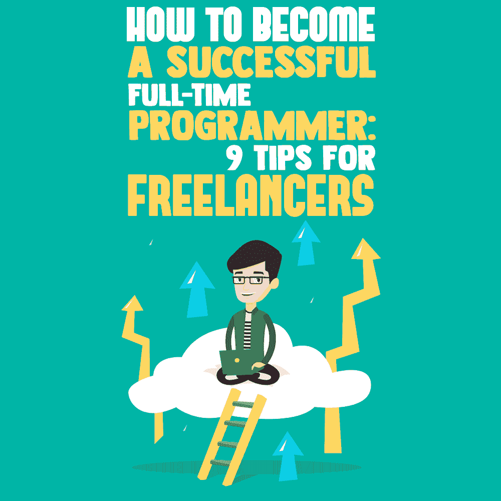

# 如何成为一名成功的全职程序员:给自由职业者的 9 个建议

> 原文：<https://simpleprogrammer.com/full-time-programmer/>

<figure class="alignright is-resized">

</figure>

根据纳斯达克的数据，到 2020 年，43%的美国工人将成为自由职业者。这适用于全世界和大多数行业，包括软件开发。这就是为什么你可以找到很多关于如何从全职程序员跳到自由开发的博客帖子。

但是，如果你不能像以前那样从经营自己的自由职业生意中获得更多的乐趣和利润，那该怎么办呢？选择全职开发工作可能是这种情况下的解决方案，尽管这听起来有点挑战性。

然而，从自由编程到全职开发职位的转变并没有你想象的那么困难。你将在一个新的环境中，结识新的人，但你的工作性质基本保持不变。

## 怎样才能过渡到全职程序员的工作？

为了适应你的环境并在新的岗位上获得成功，有些事情你需要牢记在心。这些是自由程序员可能永远不需要关心的细节，但是作为全职程序员，你肯定会关心。

所以，让我们开始吧！

### **早点设置你的闹钟**

自由职业者会制定自己的时间表，而全职程序员需要在特定的时间内完成工作。这种差异可能会有点不和谐，但一旦你习惯了，找到工作与生活的平衡就会容易得多。

比你需要的更早设置你的闹钟。这将确保你不会睡过头，因为你忘了你有地方要去。它还会给你时间在早上适应你最喜欢的活动。如果你已经吃过早餐，做过瑜伽，还喜欢和你的狗一起散步，你会觉得自己不像一个公司的奴隶。

提前 10 分钟上班也是个好主意。如果你迟到了，你实际上会准时到达。在职业生涯的早期就设定高标准；一旦你理解了公司文化，你就可以放松了。

### **学习公司的速记**

如果你被聘为全职程序员，那么你很有可能加入一个已经存在的团队。每个团队都有自己的项目注释简写和命名文件的方式。尽快学会这些单词和短语。你的项目会很快适应其他人的项目，你也不会浪费时间重复问同一个问题。

为了给自己省些麻烦，当你第一次看到每个速记术语时，就把它写下来。把这些笔记放在你的桌子旁边，直到你确定你懂当地语言。

### **留下额外评论**

关于笔记和评论的主题，在你的程序中留下尽可能多的内容。否则，你的代码对于一个局外人来说可能是完全不可理解的，这会减慢每个人的工作速度。

希望在你的第一堂计算机科学课上，习惯性评论的重要性已经被灌输给你了。但是如果你是那种喜欢限制评论数量的开发者，那就要注意你公司的文化了。留下太多的评论总比留下太少而冒着被误解的风险要好。

当你为自己工作时，你的笔记可能会呈现出更加个人化和放松的态度。记住你在一个公司的环境中，做广泛的、彻底的、专业的笔记。写下你的评论，就好像你的老板会看一样，因为他们很有可能真的会看。

### **对你的项目进行额外的润色**

<figure class="alignright is-resized">

</figure>

你现在为一家公司工作，这意味着你生产的一切都需要符合公司的品牌身份。

从了解你工作的公司和他们想要展示的形象开始。在项目的早期开发阶段，尽量记住这种基调。如果你为一家奢侈品公司工作，制作[奢侈品应用](https://yalantis.com/blog/create-an-app-for-luxury-brand/)，并以更高的标准要求自己。

在项目的每一步之间花一分钟，确保你是在公司的范围内发展。您的项目将需要更少的修改，您将快速晋升。

### **保留自己的备份**

大多数开发公司都有一个[备份系统](https://simpleprogrammer.com/create-simple-backup-solution-can-trust/)。了解如何使用它，并保存所有文件的副本。你可能会将双方的文件上传到一个共享文件夹，并在你的电脑上保留一份单独的副本。

在闪存驱动器上保留另一组备份也是一个好主意。你永远不知道停电什么时候会损坏公司的服务器。一个员工的个人备份曾经保存了一整部[皮克斯电影](https://thenextweb.com/media/2012/05/21/how-pixars-toy-story-2-was-deleted-twice-once-by-technology-and-again-for-its-own-good/)。

当然，你永远不应该把这些备份带回家，而且你绝对应该告诉你的老板你正在保存它们。

不要把你的个人工作交给 It 部门的突发奇想，这很好，但是你的代码现在是公司的财产，你不应该在没有许可的情况下把它带走。当你下班打卡的时候，把你的闪存和工作压力都抛在脑后。

### **了解你合同的限制**

当你是一名自由职业者时，你拥有你所做的一切，直到你把它卖给客户。当你为一家公司工作时，你没有自己的代码，你的雇佣合同可能要求你遵守某些限制:

*   如果你签署了保密协议，你就不能和你的朋友和家人谈论你的项目。
*   如果你签署了竞业禁止条款，你可能在一段时间内不能申请其他开发公司的工作。此条款可能适用于个人发展项目；和你的雇主谈谈细节。
*   即使你没有竞业禁止条款，你仍然不能使用公司财产或软件从事你的个人项目。这包括你在家里使用的办公用笔记本电脑。

在开始为公司工作之前，与你的雇主沟通，如果你有任何问题，请与公司的法律团队联系。记住你不需要公开你的个人项目；你只需要确认你没有违反雇佣合同中的任何条款。

### **学会社交**

社交实际上是工作流程的关键。当你了解你团队的成员时，和他们一起工作会更容易。

一定程度的社交对于了解你的同事如何思考和完成工作是必要的。你应该知道你同事的名字，他们做什么，以及他们的一些个性。积极的工作关系会让你更有效率，所以试着培养职业友谊。

作为一名自由职业者，你可能习惯独自工作。做一个内向的人没问题，但是你仍然应该试着有礼貌，对新的经历持开放态度。你今天的同事是你明天的行业联系人。他们甚至可能帮助你在当前的组织中获得晋升。

每个公司都有不同的社会化文化。一些公司鼓励闲聊，而另一些公司更喜欢把这种谈话留到休息时间。了解当地文化和你在其中的位置。当每个人都感到舒适时，更多的工作就会完成。

### **休息一下**

编程是令人精疲力尽的工作。定期休息对你的精神健康和视力至关重要。

一些公司有具体的休息时间表，但这些在开发人员职位上不太常见。作为一名自由职业者，你可能有一个宽松的休息时间表；试着模仿这个时间表，同时遵守你新工作场所的标准。

为了有效，休息应该从你的屏幕上拿走。站起来在办公室里走一走。装满你的咖啡或水瓶。看挂在墙上的一件艺术品。

如果你不确定多久休息一次，看看你的同事在做什么。如果你注意到一个同事从未离开过办公桌，邀请他们和你一起去喝下一杯咖啡；这可能会帮助他们显著提高工作效率。

### **获得额外的技能并不断进化**

全职工作的主要好处之一是有职业发展的空间。作为一名自由职业者，你几乎没有机会和你的同事交谈，从他们那里学到新的东西。在全职岗位上，正好相反。

<figure class="alignright is-resized">

</figure>

当你全职工作时，你不可避免地会与同事互动，并参与公司会议。这很好，因为您可以获得好习惯和新技术，并发现新的框架和最佳实践，这通常要归功于您的同事或团队领导。最有可能的是，你需要一份包含你未来专长和新技能的个人发展计划，这样你就比你的第一份简历更有价值，公司也能从你的工作中获得更多价值。

如果你选择发展成为一个管理职位，你将不得不培养出色的领导能力、沟通能力和表达能力。你需要表达你的想法，同时仍然能够胜任你想要管理的部门的最低职位。你可能几年都不会成为管理层，但如果你感兴趣，你最终可能会在新公司担任高管。

## **变化带来机遇**

每一次改变开始都会有点压力，但是记住改变也意味着发展新技能，达到新高度，甚至交好朋友的机会。

最终，全职编程和自由职业实际上没什么不同。一旦你走过接待处，坐在你的椅子上，你会发现自己在做你喜欢的工作。让自己适应新的岗位。稳定和报酬通常是值得的。