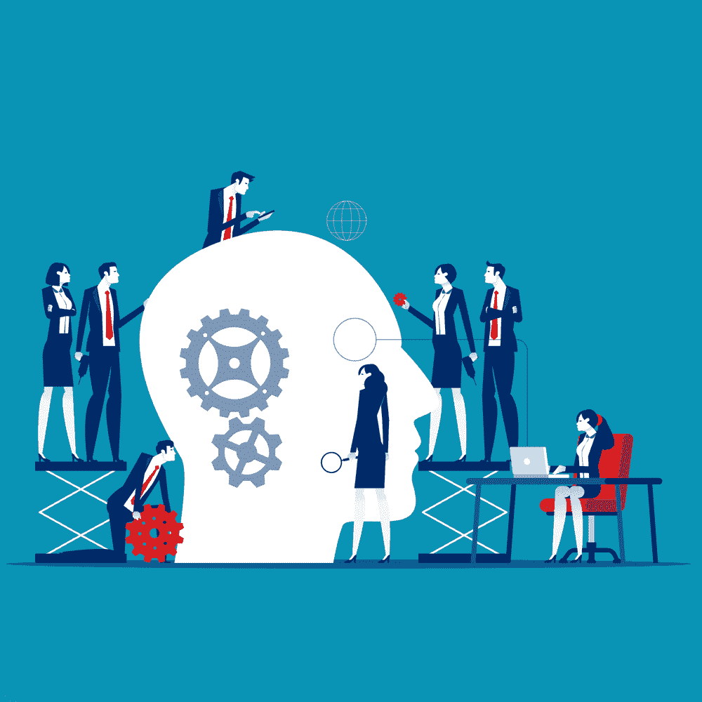

# 开发面向未来的软件:来自全球技术领导者的 4 个关键见解

> 原文:[https://simple programmer . com/future-software-insights-tech-leaders/](https://simpleprogrammer.com/future-software-insights-tech-leaders/)

If the past decade was a period of rapid digitalization, the current decade will be about consolidating this transformation by advancing innovation at an even faster pace.

多年来，软件开发经历了主题各异的重大变革。曾经有一段时间，敏捷的大规模转变促进了迭代和协作开发。另一个时代由微服务和 API 引领，使开发人员能够构建更小的应用程序，并使用更少的资源进行构建。

在所有这些方面，文化是自上而下流动的。因此，当我们步入一个专注于构建更智能、更具创新性的软件的软件开发新时代时，了解行业领导者在领导创新前沿方面所做的工作是至关重要的，因为这是他们的职责所在。

因此，本文探讨了涉及各个领域的技术领导者的研究，以确定预计将影响 2021 年及未来几年软件开发方式的最重要思想和理念的趋势。

## 无代码开发

无代码是一种需要很少或不需要编程技能的软件开发方法。这使得没有编程技能知识的个人可以通过拖放和类似的可视化过程来编辑应用程序。

无代码平台的日益流行将改变我们对软件的看法，并为一个全新的“开发人员”群体开辟一个新的领域。

对于 Zapier 的首席执行官 Wade Foster 来说，无代码开发就是授权。就无代码开发的未来而言，他非常乐观，并且[相信](https://www.adalo.com/the-future-is-no-code-experts/wade-foster):

*   在不到一年的时间里，没有代码的产品将会比有代码的产品多。
*   第一个无代码产品将在未来五年内上市。
*   在接下来的五年里，将会有更多的机构和开发公司使用非代码工具。

他不是唯一一个分享这些高期望的人。 [Gartner 预测](https://www.forbes.com/sites/ilkerkoksal/2020/04/29/the-rise-of-low-code-app-development/?sh=3cf9ccb66807)到 2024 年，65%的应用程序开发将由低代码驱动，这被誉为[革命](https://www.amazon.com/dp/B08R2GYNX1/makithecompsi-20)。

事实上，无代码开发通过将构建可伸缩技术解决方案的能力带给更广泛的受众，并使其易于在所有行业中使用，从而使开发过程民主化。无代码解决方案肯定会加速创新和新软件产品的引入。毕竟，任何一个有好主意的人都可以[用一个高度可扩展的、高效的、可定制的产品开始新的业务](https://yesforfairtax.org/how-to-start-an-llc/)。

## 测试和开发

最近软件测试的一个主要[趋势是敏捷和开发运维的结合。](https://simpleprogrammer.com/software-testing-trends-2021/)

当被问及他推荐什么样的测试最佳实践来避免发布延迟时，[git lab 的高级开发宣传员 Brendan O'Leary 说](https://jaxenter.com/oleary-interview-174607.html)“你越是能够将测试整合、自动化并集成到你的整个 DevOps 流程中，你将会获得越大的回报。”

当测试人员使用不同的工具来创建和运行测试，而开发人员使用不同的工具来部署产品时，各种工具的激增使得组织很难建立一个统一的 DevOps 流程，以便团队更容易地协作和共享信息。结果，这些组织经常发现他们自己与测试人员和开发人员一起重复工作，并且工作目标不一致。

O'Leary 还建议从自动化测试开始，而不是在后期阶段包括它。用他的话说，“虽然这可能是开始的前期投资，但关键是一旦建立，自动化测试程序将比从头开始更容易迭代。”

一旦您有了一个坚实的基础，比如带有自动化测试的部署管道，为特定用例集成额外的测试工具就容易多了。这就是 DevOps 实践可以帮助加速您的整体开发周期和[扩展软件交付性能](https://www.amazon.com/dp/1942788339/makithecompsi-20)的地方。

## 数据驱动软件

数据驱动的软件开发是一种新兴的软件工程方法，它促进了工程洞察、代码重构和自动化决策的数据化。

[据微软首席执行官兼新任董事会主席塞特亚·纳德拉](https://www.bosch.com/stories/digital-ecosystems/#:~:text=%E2%80%9CIn%20the%20past%2C%20when%20you,predictive%20and%20casual%20reasoning%20power.)称，“过去，当你想到软件(开发)时，你想到的是编写代码的人。在软件 2.0 中，你训练软件从数据中学习。”纳德拉谈到了软件工程向数据驱动方法的转变。

数据驱动的软件工程并不是一个新概念，但它已经通过人工智能和物联网的进步找到了新的应用。[比如 Python](https://simpleprogrammer.com/5-benefits-of-python/) ，因为与数据科学和人工智能的融合，人气飙升。

因为数据驱动的工程比传统的软件工程方法更好地与商业运作相结合，随着商业努力[构建可扩展的系统](https://www.amazon.com/dp/1449373321/makithecompsi-20)，这种方法肯定会获得更多的关注。

数据驱动软件是现代软件工程的核心。谷歌、亚马逊和脸书等公司的成功建立在数据驱动的文化之上。他们每天运行数万次实验，利用数据对一切做出更好的决策，包括产品设计、招聘算法和客户服务。

数据科学通过提供关于客户和产品的更准确、可操作的信息，正在改变企业的运营方式。它还从根本上改变了软件工程师的工作方式，使他们能够构建更能响应客户体验的产品。

## 人工智能

We are still years away from the proliferation of AI technologies writing complex code on their own. In fact, artificial intelligence remains a [high-value skill](https://simpleprogrammer.com/in-demand-programming-skills-2021/) for programmers today. However, we see the emergence of AI programming assistants that help developers write code and program more efficiently.

LoginRadius 的联合创始人兼首席执行官迪帕克·古普塔(Deepak Gupta)表示，“程序员投入大量精力来审查文档和解决代码问题。开发人员可以使用智能编程助手提供即时指导和建议，如最佳实践、代码示例和相关文档，从而节省时间。”

显然，这超越了智能代码完成，因为它包括程序员的全面助手。智能编程助手建立在自然语言处理(NLP)、深度学习和人工智能的基础上。它们旨在通过提供上下文指导和建议来增强开发人员的能力。

助手可以立即了解开发人员正在做什么，就如何解决问题提供指导，帮助查找代码示例和文档，并确定代码可以优化的地方。

## 一场新革命

软件正在改变世界，这就是为什么观察发展趋势如此重要。

每一个主要行业都在被正在发生的数字化变革所彻底改变，这种变革是由软件创新所引领的。软件创新的速度和复杂性正在加快，我们需要做好准备。对于想要跟上技术并保持相关性的组织来说，敏捷和适应变化的能力至关重要。

开发人员和数据科学家在努力构建将驱动我们未来的软件和其他数字技术时，面临着巨大的挑战。浏览不同领导人的思想，你会意识到企业必须设计和创造比以往任何时候都更具关联性、响应性、个性化、直观性和高效性的创新。