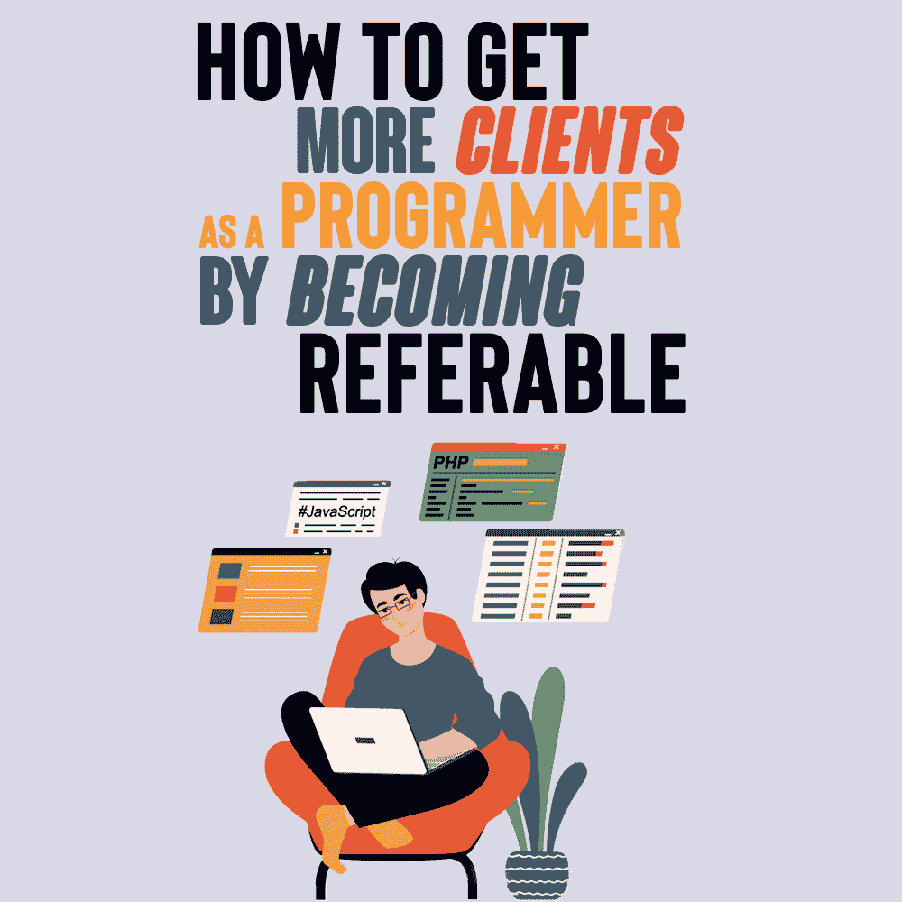

# 如何通过成为可推荐的程序员来获得更多的客户

> 原文：<https://simpleprogrammer.com/get-more-client-referrals/>

The pandemic and recession have led some programmers and developers to lose their jobs and clients this past year. Widespread vaccinations offer a light at the end of this long struggle, but the economy may not recover for quite some time.

尽管对程序员和开发人员的需求不断上升，但失去一个长期客户会给财务带来巨大压力，即使是对最有技能的人来说也是如此。根据人力资源管理协会的数据，由于新冠肺炎危机，28%的自由职业者，相当于美国劳动力的 10%，不得不停止自由职业。

未来仍然不确定。然而，很明显，拥有更多客户将有助于你的企业保持运转。与不同的公司或客户合作意味着有更多的收入来源和稳定性。因此，在可预见的未来，你更有可能度过艰难时期。

你如何扩大你的客户群？答案在于口碑推荐。

## 为什么口口相传对程序员有效？

想想你最后一次预订酒店或去新餐馆的时候。

朋友或家人的推荐可能会鼓励你尝试一下。他们是我们最信任的人，我们想把血汗钱用在他们担保的品牌上。他们知道我们的偏好，所以他们的推荐很可能给了你尝试的动力。

简而言之，这就是口碑营销。

86%的客户信任推荐，使其成为最受信任的营销形式。同样，59%的消费者喜欢谈论新产品，这导致美国每天 24 亿次品牌相关对话中有 33 亿次品牌提及。

这些统计数据证明了口碑对于自由程序员来说是一个强大的工具。由于人们更容易相信他们认识的人的推荐，你可以很容易地通过销售漏斗获得推荐线索。

不仅推荐对潜在客户很重要，招聘人员在 LinkedIn 等社交平台招聘时也经常会寻找推荐。

## 推荐是如何工作的？

推荐可能是自然发生的。当他们在 LinkedIn 的工作岗位上给你贴标签或者推荐你的服务时，你的网络利用了口碑。但是推荐并不总是偶然发生的。

程序员可能需要向客户寻求推荐，以获得回报。然而，获得推荐不是一朝一夕的事。自然，人们只会推荐他们信任的企业。你需要建立关系或持续提供优质服务来赢得他们的好感。

## 如何从现有客户那里获得推荐

获得推荐可能需要时间，但这不是火箭科学。

当要求现有客户推荐时，以下是一些可以考虑的建议:

### 交付优秀的作品并展示出来

人们只会向熟练的程序员或开发人员推荐他们的网络。因此，始终如一地交付优秀的作品非常重要。除了显而易见的——编程和开发技能——成为一名可推荐的自由职业者还需要同时管理多项任务。使用[任务管理软件](https://www.timecamp.com/blog/2018/11/best-free-task-software/)更好地执行任务，更高效地组织工作。

为客户提供[卓越的客户体验](https://getvoip.com/blog/2019/04/29/customer-experience-management/)。了解他们的需求，提供解决方案，并兑现您的承诺。这样做可以确保他们对你的服务感到满意。

完成一个项目后，让客户写一篇推荐文章，刊登在你的网站或作品集页面上。突出那些能为你的企业担保的人，会让你的个人品牌变得合法和有参考价值。一份来自你所在行业中一家受欢迎企业的值得注意的[推荐书](https://simpleprogrammer.com/client-testimonials-freelance-developer/)甚至可以帮助你赢得更多的客户。

### 请求推荐

俗话说得好，想要什么就要索取。

即使你提供五星级服务，客户也不会自动推荐。相反，你需要坦率地要求他们提供一个。

下面是一个在会议或谈话中如何提出这个问题的例子:

*“您好(客户名称！我很高兴得知你对我们合作的结果感到满意。既然事情进展顺利，我想知道你是否知道任何企业或同事会从我的服务中受益？”*

一些客户目前可能无法保证推荐。这完全没问题。至少，他们会知道你需要更多的客户，可能会努力向可能需要的人推销你的业务。

### 发送推荐电子邮件

发送电子邮件是从客户那里获得推荐的一种快速、非侵入性的方式。然而，你不想听起来像一个绝望的销售代表。当你提出要求时，你会想表现得真实可信。

这里有一封电子邮件示例，您可以发送邮件提出这个问题:

*日安[客户名称]*

非常感谢您给我机会在[项目或活动]上与贵公司合作。我很高兴看到您很快就达到了[插入里程碑]。我希望你对我的服务感到满意。

在接下来的几个月里，我计划扩大我的业务。既然您对我最近的成果感到满意，我想知道您是否有任何商业伙伴或同事会从我的能力中受益。我渴望帮助他们取得成功。

*谢谢，*

*【你的名字】*

有些客户可能不会回复你的邮件，这没关系。你可以随时跟进他们，但不要太执着。一些客户可能不知道目前需要程序员的业务或联系人。

你可以看看 Rohan Mahtani 的 [*网络电子邮件手册*](https://www.amazon.com/dp/B07THQTWTN/makithecompsi-20) 和 Shireen DuPreez 的 *[网络电子邮件模板，并访问隐藏的就业市场](https://www.amazon.com/dp/B07QML5T6Q/makithecompsi-20)* 来找到你可以用作灵感的推荐电子邮件模板。

### 感谢推荐

Making a referral takes time and effort.

不考虑产品或服务，说服同事或朋友尝试新事物并不容易。这正是为什么你应该感谢那些向你推荐业务的客户。

发一封电子邮件让他们知道你感谢他们的努力。如果可能的话，邀请他们喝杯咖啡，或者送他们一份礼物以示友好。也许这将激励他们继续推荐潜在客户，或者从长远来看成为忠实客户。

### 为客户提供不同的参考方式

客户进行口碑推荐后会发生什么？

有一个推荐过程可以让客户把他们推荐的朋友介绍给你的服务。获得推荐可能需要客户填写表格或发送私人信息或电子邮件，只要他们想推荐他们的朋友。有了这个策略，你就能保证联系到被推荐的朋友，向他们介绍你的服务，并让他们加入你的团队。

一个推荐程序也将帮助你自动化整个过程。你所需要做的就是让客户注册一个账户，创建一个推荐登陆页面，剩下的事情就交给这个工具了。一个[推荐项目](https://www.referralcandy.com/blog/47-referral-programs)也给你提供奖励的选择，比如现金或折扣。

### 推荐你的客户

客户可能不会主动推荐你的服务，这完全没问题。

在你得到推荐之前，你可能必须先采取行动，先推荐或推广你客户的业务。通过口碑向你的朋友、同事和你关系网中的其他人推销你的客户。

当你推荐的朋友最终成为你客户的付费客户时，这可能会促使客户回报你的帮助，并推荐其他人给你。

注意，你应该只推荐你可以作证的客户或企业。毕竟，推荐可能是一把双刃剑。

如果你推荐你的朋友或同事，而他们与你的客户有不愉快的经历，那么这可能会对你的个人关系产生持久的影响。这就是为什么你应该在推荐客户之前先了解他们的业务。

### 在适当的时候问

时机对于您的推荐请求获得积极回应至关重要。

向客户提供最新的服务结果。每季度监控关键绩效指标([KPI](https://diggitymarketing.com/seo/kpis/))，并告知他们你已经实现的里程碑。如果你在你的项目上分享了显著的成就，那么这可能是请求推荐的最佳时机。另一个选择是询问你什么时候完成了你的项目，客户表示了他们的满意。

建立积极的长期业务关系需要时间。坚持推荐请求是没问题的，尤其是如果你对得到积极的回应没有信心的话。

### 寻求反馈

获得推荐需要让你的客户满意。

衡量客户的需求很难，尤其是如果这些需求是基于你的假设。这就是为什么向客户寻求反馈并定期与他们沟通是很重要的。

鼓励他们填写网上表格,比如 Google Forms 或 Typeform 来评价你的服务。不要忘记包括一些开放式的问题，比如“作为一名程序员，我该如何改进？”或者“你对我目前提供的服务有什么意见吗？”

这样做可以确保客户对服务感到满意。他们不太可能因为未知原因结束工作关系。征求反馈也让你有机会解决潜在的问题，并找到改善对现有客户服务的方法。

## 通过引荐保持业务增长

推荐是获得更多客户和发展业务的快速有效的方法。

被推荐的客户已经对你的业务有了积极的看法，特别是因为它得到了他们信任的网络的赞扬。然而，让自己变得值得推荐需要与你当前的客户群建立信任和关系。

你需要始终如一地交付出色的工作，并寻求反馈以确保客户满意。当你已经和你的客户建立了良好的关系，请他们推荐，或者先推荐其他人去他们的公司。

一旦你有了一个强大的推荐过程，你就能扩大你的客户群，保护自己免受任何意想不到的经济衰退的影响。