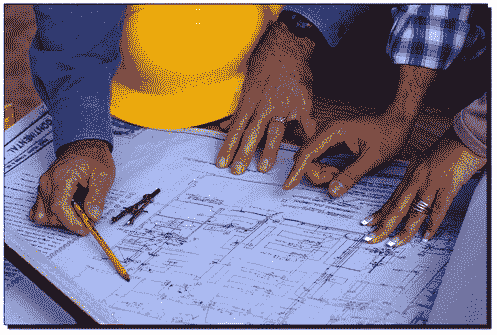

# 起床蝙蝠:添加烟雾测试到您的构建

> 原文：<https://simpleprogrammer.com/getting-up-to-bat-adding-smoke-tests-to-your-build/>

一旦你已经用你闪亮的新自动化框架建立了一些冒烟测试，你会想要让那些冒烟测试尽快启动并运行…

但是！你可能要考虑暂停一下，读读这篇文章！

值得花点时间思考一下将冒烟测试添加到常规构建过程中的策略和心理。

在向构建中添加自动化测试之前，我们有几件事情需要讨论和思考。

## 为什么我们要在构建中加入烟雾测试？

我认为在我们做一件事之前，我们问自己为什么要做这件事是很重要的。做事，因为有人说好，或者因为看起来对，都不是很好的理由。

我们现在就将冒烟测试添加到构建中，而不是等待编写更大部分的测试，这样做的主要好处是，我们将能够立即判断系统的基本功能是否被破坏，而不是在我们将构建部署到不同的环境并使用它之后才发现。

我们希望能够尽快得到这个值。我们不想等到我们有了大量的测试，因为即使是少量的测试也会给我们一些这方面的价值。

我们将测试添加到构建中的另一个原因是，当测试失败时，我们可以通知开发人员，这样他们就知道修复任何被破坏的部分。通过将冒烟测试作为构建的一部分运行，我们能够减少引入中断和发现中断之前的时间。

减少引入和发现之间的差异这一概念非常重要，因为它使得识别导致中断的原因更加容易。

也许在这个阶段增加冒烟测试的第三个原因是为了证明我们的框架和技术。最好从少量的测试开始，让一切正常工作。

有了这些想法，我们就可以开始考虑一些更重要的问题了。

## 永远不要在构建中添加失败的测试

当您将冒烟测试套件添加到自动化构建中时，所有的测试都应该通过！

我要再说一遍，因为这真的很重要，忽视这个建议可能会毁掉你的整个 BAT 项目。

> 不要将失败的测试添加到构建中！

这看起来是一件足够无辜的事情，但它造成了巨大的伤害，因为它非常像那个喊狼来了的男孩。考虑一下，当我们引入新的 BAT 系统，并将冒烟测试添加到构建中时会发生什么，但是我们有 3 个失败的测试。

首先会发生的是，我们的测试将在下一次构建中运行，3 将失败。这会导致团队收到某种构建失败的通知，此时您将处于一个不舒服的位置，说一些大意为“忽略那个失败，那些是真正的缺陷，但是它们是已知的问题。”

接下来，让我们假设一个开发人员签入了一些糟糕的代码，导致第四次测试失败。

你认为大多数人会注意到这第四次失败的测试吗？

即使他们知道，你认为他们会认为这是另一个已知的问题吗？

更糟糕的是，他们可能认为你的蝙蝠毫无意义，只是随机失败。

你明白我的意思了吗？我们希望从正确的期望开始，我们希望测试失败有意义。总是有意义的。一旦你有了没有意义的测试失败，你就失去了未来任何有意义的失败的可信度。

对于构建系统和自动化测试来说，这是一场至关重要的心理战，以至于我经常实施一个策略，当构建失败时，除了修复构建或测试失败之外，不允许任何人做其他事情。当你有 20 个开发人员或者无所事事，或者在一个问题上工作了 2 个小时，这传达了一个非常明确的信息，那就是我们非常重视构建失败。

确保你的测试不会破坏这个信息。

## 那我该怎么处理失败的测试呢？

如果它们是真正的缺陷，将它们放入您的缺陷跟踪系统，或者为它们创建 backlogs，并确保测试被禁用，直到这些缺陷被修复。

您的自动化测试应该作为已经工作的东西的回归测试。认为编写自动化测试来对新特性或代码进行实际的功能测试是非常划算的想法是荒谬的！

正是编写自动化测试的过程应该发现缺陷。自动化测试的运行应该会发现新的缺陷，在这些缺陷中，功能已经从工作退化到不工作了。

## 其他考虑

以下是你在踏上旅程之前需要考虑的一些其他事项。

*   你将如何实际运行测试？(你会使用构建脚本来启动它吗，一些第三方插件，等等)
*   你将在哪里运行测试？(你会使用构建服务器本身，还是另一台机器。您现在可能不需要担心扩展到多台机器，但是您至少应该把它放在脑后。)
*   进行烟尘测试需要多长时间？(快更好，因为反馈周期减少。如果你有一个非常长的测试套件，你可能想要削减冒烟测试，在每个构建中运行一些，现在是每晚都运行。)
*   开发者能够在本地运行测试吗？(在将测试放入构建之前，确保您考虑了如何做这件事。没有什么比拿自己看不到的标准来衡量更令人沮丧的了。)
*   您将如何通知和报告测试失败的结果？(我们不在乎通过，只在乎失败，但是你需要一个好的方法来报告促使行动的结果。)
*   测试失败的政策是什么？(确保在测试失败时采取何种措施上达成一致。如果你能让管理层接受，一个很好的开始就是停止所有的工作，直到所有的测试都通过。极端，但极其有效。)
*   您将如何防止并识别虚假故障？(脸上别卡蛋。如果您的框架失败了，并且问题不是真正的缺陷，您需要能够快速识别它并修复框架问题。有几个策略可以做到这一点，但那是另一篇文章。)
*   如何添加和调试新的测试？(您将不断增加您的测试套件，因此您将需要一个好的方法来将测试添加到 smoke 测试套件中。)

记住，第一印象只有一次机会！