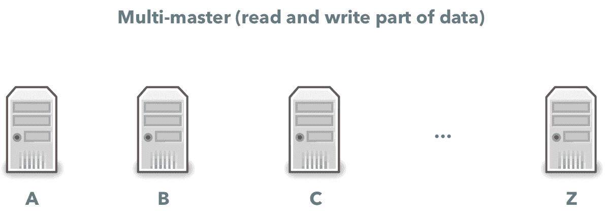
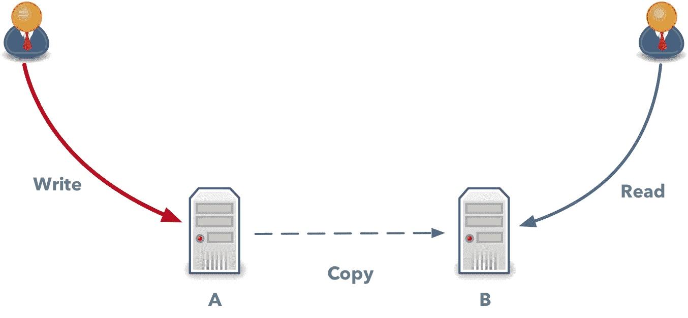
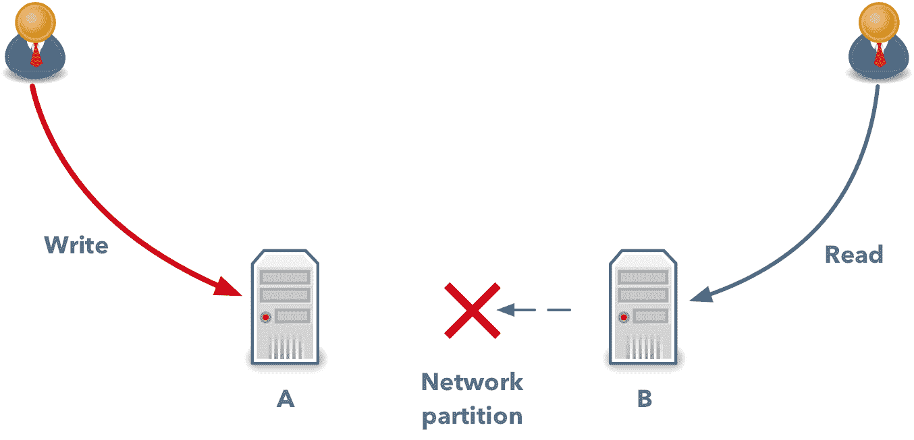
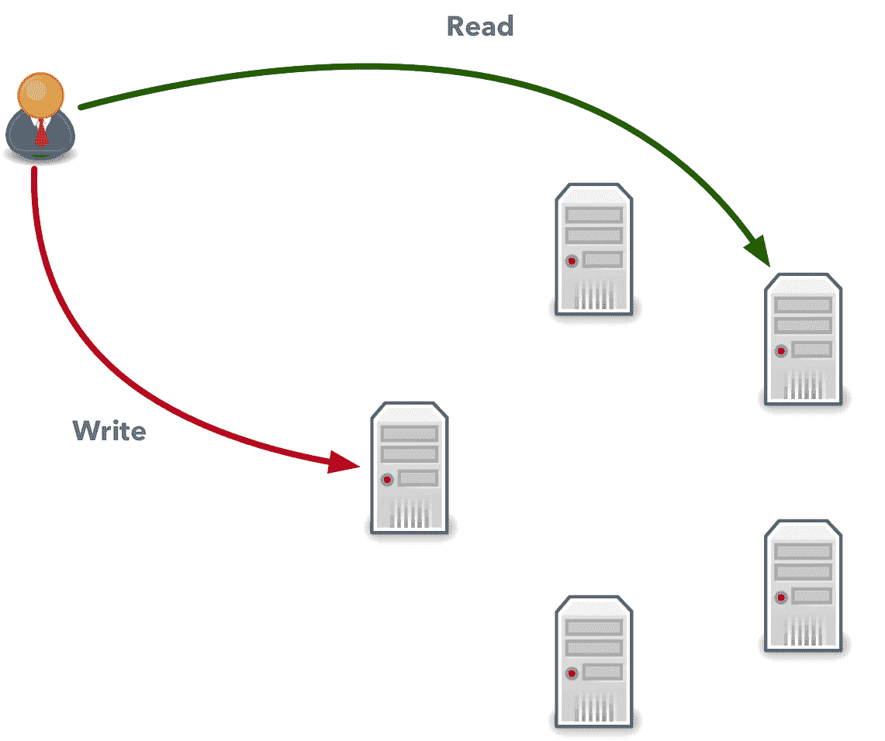

# 软件开发人员 NoSQL 指南

> 原文:[https://simple programmer . com/guide-no SQL-software-developers/](https://simpleprogrammer.com/guide-nosql-software-developers/)

如果你在关注后端开发或大数据领域，你可能已经注意到，在过去的几年里，有很多关于 NoSQL 数据库的宣传。虽然有些人似乎对它们非常热情，但其他人可能认为它们是一个噱头:它们有不同的、不寻常的数据模型，不熟悉的应用程序编程接口，有时还有不清楚的应用程序。

在这篇文章中，我将描述为什么首先创建 NoSQL 数据库，它们解决什么问题，以及为什么我们突然需要这么多不同的数据库。

如果您刚到 NoSQL，您可能会对本文的最后一部分特别感兴趣，在那里，我列出了您应该首先了解的 NoSQL 数据库，以便获得该地区的 360 度视图。

## 为什么我们突然需要一个新的数据库？

[https://www.youtube.com/embed/kZxFq7VBhXI](https://www.youtube.com/embed/kZxFq7VBhXI)

You may wonder what is wrong with [relational databases](https://en.wikipedia.org/wiki/Relational_database) in the first place. They worked fine for many years, but now we have a new obstacle that they can’t handle anymore.

根据[一些预测](http://www.vcloudnews.com/every-day-big-data-statistics-2-5-quintillion-bytes-of-data-created-daily/)，2018 年人类作为一个整体每秒将产生 5 万 GB 的数据。这是一个巨大的数据量，存储和处理它是一个严重的工程挑战。更可怕的是这个数字还在不断增长。

关系数据库无法处理如此大量的数据。它们被设计成运行一台机器，如果你需要处理更多的请求，你只有一个选择:买一台更大的计算机，有更多的内存和更好的 CPU。不幸的是，一台机器可以处理的请求数量是有限的，我们需要一种可以在多台机器上运行的不同的数据库技术。

现在，你们中的一些人可能会嗤之以鼻，说如果使用关系数据库，有两种广泛使用的多机技术:复制和分片。但它们不足以应对我们面临的挑战。

读复制是一种技术，在这种技术中，对数据库的每次更新都会传播到只能处理读请求的其他主机。在这种情况下，所有更改都由一台主机(称为领导者)应用，而所有其他主机(称为读取副本)维护一份数据拷贝。用户可以从任何机器读取数据，但只能通过 leader 主机更改数据。这是一种有用且非常流行的技术，但是它只允许处理更多的读取请求，并不能解决处理所需数量的传入数据的问题。

分片是另一种流行的技术，其中有许多关系数据库实例，每个实例都接受对部分数据的读写。如果您在数据库中存储有关客户的信息，使用分片，一台机器可以处理姓名以 A 开头的客户的所有请求，另一台机器将存储姓名以 B 开头的客户的所有数据，依此类推。

虽然分片允许您写入更多的数据，但是管理一个分片的数据库可能是一场噩梦。您必须平衡机器之间的数据，并在必要时扩展集群。虽然这在理论上看起来很简单，但正确实施却是一个巨大的挑战。

## 我们能有一个更好的关系数据库吗？

我希望到目前为止，您已经看到关系数据库无法处理我们生成的数据量，但是您可能仍然会感到疑惑，为什么有人不能构建一个可以在多台机器上运行的更好的关系数据库。你可能认为技术还没有出现，我们将很快享受分布式关系数据库。

然而不幸的是，这永远不会发生，因为这在数学上是不可能的，我们对此无能为力。

为了理解为什么会出现这种情况，有必要谈谈所谓的上限定理。CAP 定理于 1999 年得到证明，它指出运行在多台机器上的任何分布式数据库都可以具有这三个属性:

*   **一致性**–如果你将数据写入一个系统，你应该能够在之后立即读回来。如果我们的系统是一致的，在您写入新数据后，您不能读取旧的、被覆盖的数据。
*   **可用性**–分布式系统总是能够为传入的请求提供服务，并返回无错误的回复。
*   **分区容忍度**–即使一些主机暂时无法相互通信，数据库也会继续回复读写请求。这种暂时的中断称为网络分区，它可能是由多种因素引起的，从底层网络的实际问题(如主机运行缓慢)到网络设备的物理损坏。

所有这些特性显然都很有用，我们希望这三者都具备。没有一个头脑正常的人会想在没有任何回报的情况下放弃可用性。不幸的是，CAP 定理还指出，我们无法在一个系统中实现所有这三个特性。

理解起来可能有点棘手，但你可以这样想。首先，如果我们想要一个分布式数据库，它应该支持“分区容错”没得商量。分区一直在发生，尽管有分区，我们的数据库也应该工作。

现在让我们看看为什么我们不能同时拥有一致性和可用性。假设我们有一个运行在两台机器上的简单数据库:A 和 b。该数据库的任何用户都可以写入任何机器，然后副本被传播到第二台主机。

现在想象一下，这些机器暂时无法相互通信，机器 B 无法向机器 a 发送数据或从机器 a 接收数据。如果在此期间，机器 B 收到来自客户端的读取请求，它有两种选择:

*   返回其本地数据，即使这不是最新数据。在这种情况下，它将选择可用性(返回一些可能过时的数据)。
*   返回一个错误。在这种情况下，它会选择一致性；客户端看不到陈旧的数据，但是他们也不会得到任何数据。

关系数据库试图实现“一致性”和“可用性”属性，因此它们不能在分布式环境中工作。如果有人试图实现关系数据库的所有特性，在分布式系统中，这要么是不切实际的(即使对于普通操作也有巨大的延迟),要么是根本不可能的。

另一方面，NoSQL 数据库优先考虑可伸缩性和性能。它们通常没有诸如连接和事务之类的“基本”特性，而是有一个不同的，甚至是有限的数据模型。所有这些都允许存储比以往更多的数据和处理更多的请求。

## NoSQL 如何在一个数据库中结合一致性和可用性？

此时，您可能会有这样的印象，如果您选择了一个 NoSQL 数据库，它要么总是返回一些陈旧的数据，要么在出现任何小问题时返回错误。实际上，可用性和一致性不是二元选项。有许多选项可供你选择。

关系数据库没有这些参数，但是 NoSQL 数据库提供了这种控制来选择应该如何执行查询。在某种程度上，它们允许您在对 NoSQL 数据库执行读或写操作时指定两个参数:

*   **W**–当您**执行写操作**时，集群中有多少台机器应该确认它们已经存储了您的数据。写入数据的机器越多，下一次读取最新数据就越容易，但需要的时间也越多。
*   **R**——从您想要**的多少台机器上读取数据**。在分布式系统中，数据传播到集群中的所有机器可能需要一些时间，因此一些主机可以拥有最新的数据，而一些主机仍然会落后。您读取数据的机器越多，读取最新数据的机会就越大。

让我们更实际一点。如果您的集群中有五台机器，并且您决定只将数据写入一台机器，然后从一台随机机器读取数据，那么您将有 80%的机会获得陈旧数据。另一方面，您将使用最少量的资源，如果您可以暂时容忍陈旧数据，您可以选择此选项。在这种情况下，W 参数等于 1，R 也等于 1。

另一方面，如果您将数据写入 NoSQL 数据库中的所有五台机器，那么您可以立即从任何一台机器读取数据，并且保证每次都能获得最新的数据。用更多的机器执行同样的操作会花费更长的时间，但是如果这对你很重要，你可以这样做。在这种情况下，W=5，R=5。

为了获得一致的数据库，我们需要执行的最少读写次数是多少？这里有一个简单的公式:R + W ≥ N + 1，其中 N 是集群中的机器数量。这意味着，如果我们有五台主机，我们可以选择 R=2 和 W=4，R=3 和 W=3，或者 R=4 和 W=2。在这种情况下，无论您向什么机器写入数据，您都将至少从一台拥有最新数据的机器上读取数据。

其他数据库(如 DynamoDB)有其他约束，只允许一致写入。每个数据项都存储在三台主机上，当您写入任何数据时，它都会被写入三台机器中的两台。但是，如果您读取数据，您可以选择以下选项之一:

*   强一致性读取将从三台机器中的两台机器读取数据，并应始终返回最新写入的数据。
*   最终一致读取将随机选取一台机器并从中读取数据。但是，这可能会暂时返回过时的数据。

## 为什么有这么多 NoSQL 数据库？

如果您一直关注软件开发新闻，那么您一定听说过许多不同的 NoSQL 数据库，比如 MongoDB、DynamoDB、Cassandra、Redis 等等。您现在可能想知道为什么我们需要这么多不同的 NoSQL 数据库。原因是不同的 NoSQL 数据库侧重于解决不同的问题，这就是为什么我们有这么多的竞争对手。NoSQL 数据库的分类包含四个主要类别:

### 面向文档的数据库

这些数据库允许存储复杂的嵌套文档，而大多数关系数据库只支持一维行。这在很多情况下都很有用，例如，如果您想在系统中存储有关用户的信息，并允许每个用户拥有多个地址。使用面向文档的数据库，您可以简单地存储一个包含地址数组的复杂对象，而关系数据库迫使您创建两个表:一个用于存储用户信息，另一个用于存储地址。

面向文档的数据库允许您在数据库的对象模型和数据模型之间架起一座桥梁。一些关系数据库如 PostgreSQL 现在也支持面向文档的存储，但是大多数关系数据库仍然没有这个特性。

### 键值数据库

键值数据库通常实现最简单的 NoSQL 模型。在它们的核心，它们为你提供了一个分布式的[散列表](https://en.wikipedia.org/wiki/Hash_table)，允许你为一个指定的键写数据，并使用这个键读回数据。

键值数据库很容易扩展，并且比其他数据库有更低的延迟。

### 图形数据库

许多领域，如社交网络或关于电影和演员的信息，都可以用图来表示。虽然您可以使用关系数据库来表示一个图形，但这将是困难和繁琐的。如果需要用图形表示数据，可以使用专门的图形数据库，这些数据库可以在分布式集群中存储有关图形的信息，并允许您高效地实现图形算法。

### 列存储数据库

列存储数据库和其他类型数据库的主要区别在于它们在磁盘上存储数据的方式。关系数据库为每个表创建一个文件，并按顺序存储每行的值。列式数据库为表中的每一列创建一个文件。

这种结构允许您更有效地聚合数据和运行特定的查询，但是您需要确保您的数据符合这些数据库的约束，并且可以有效地使用它们。

## 我们应该选择哪一个？

挑选一个数据库通常是一项令人痛苦的工作，而且有这么多选择，这似乎是一项不可能完成的任务。好消息是你不需要只选择一个。

使用另一种称为“[微服务](https://martinfowler.com/articles/microservices.html)的现代模式，而不是开发一个实现所有功能并访问系统中所有数据的单一应用程序，您可以将该应用程序拆分为一组独立的服务。每个服务都解决一个狭义定义的任务，它应该只使用自己的数据库，这个数据库完全适合这个微服务的任务。

## 我们怎么能学会所有的东西？

周围有这么多数据库，你可能想知道你将如何学习它们。好消息是你不需要。只有几种主要的 NoSQL 数据库类型，如果您了解它们是如何工作的，您将能够更快地学习其他 NoSQL 数据库。此外，一些 NoSQL 数据库比其他数据库使用得更频繁，所以最好将精力集中在最流行的解决方案上。

以下是最常用的 NoSQL 数据库列表，我认为您应该看看:

*   MongoDB——这似乎是市场上最受欢迎的 NoSQL 数据库。如果一家公司没有使用关系数据库作为其主要数据存储，那么它可能正在使用 MongoDB。它是一个具有良好工具支持的多功能文档库。在早期，它的名声不好，因为在某些情况下它会丢失数据，但从那以后，它变得更加稳定和可靠。如果你想了解更多，可以看看这个关于 MongoDB 的[课程。](http://shrsl.com/kzpn)
*   DynamoDB——如果你正在使用亚马逊网络服务(AWS ),你应该学习更多关于 dynamo db 的知识。这是一个坚如磐石、可扩展的数据库，提供了低延迟、丰富的功能集以及与许多其他 AWS 服务的集成。最棒的是，您不需要自己部署它。只需几次点击，您就可以设置一个可伸缩的 DynamoDB 集群，能够处理数千个请求。有兴趣的可以看一下[这门课](http://shrsl.com/kzpt)。
*   neo4j——这是分布最广的图表数据库。这是一个可扩展的稳定的解决方案，如果您想采用图形数据模型，可以使用它。如果想了解更多，可以从[这门课](http://shrsl.com/kzsy)开始。
*   Redis——虽然这里描述的其他数据库可以用来存储应用程序的主要数据，但 Redis 通常用于实现缓存和存储辅助数据。在许多情况下，您可能最终会将上述数据库之一与 Redis 一起使用。想了解更多，可以看一下[这个课程](http://shrsl.com/kzt5)。

## 和 NoSQL 一起准备迎接 2018 年

NoSQL 数据库是一个广阔而快速发展的领域。它们允许你存储和处理比以前更多的数据，但这是有代价的。

这些数据库没有关系数据库所具有的相同特性，可能很难理解如何使用它们。然而，一旦您理解了这一点，您将能够使用可伸缩的分布式数据库来处理大量的读和写请求，这在我们继续产生越来越多的数据时将是极其重要的。