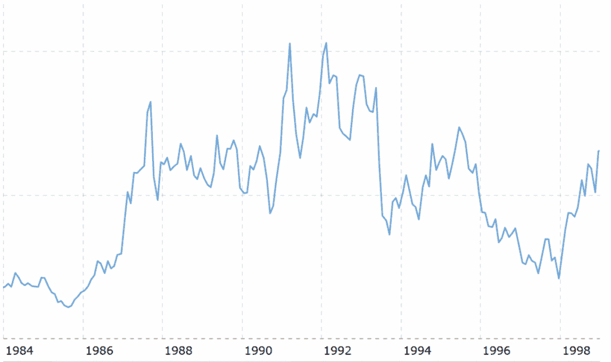
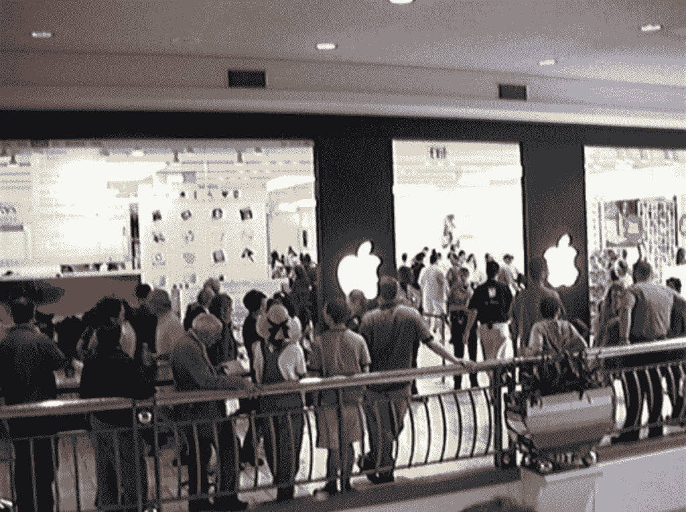
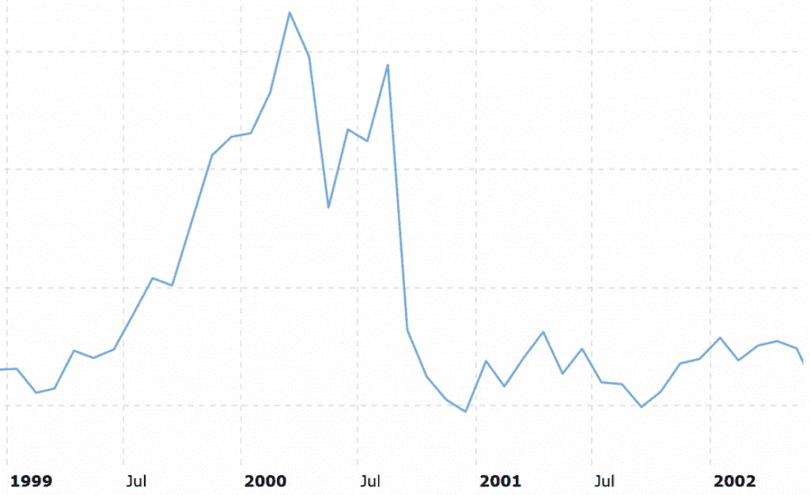
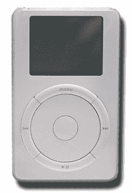

# 互联网的历史:第十一部分——苹果和史蒂夫·乔布斯

> 原文:[https://simple programmer . com/history-internet-11-apple-and-Steve-jobs/](https://simpleprogrammer.com/history-internet-11-apple-and-steve-jobs/)

欢迎来到我们穿越时空之旅的第十一部分，了解互联网是如何发展的，以及它对我们生活的影响。

在迄今为止的[系列](https://simpleprogrammer.com/?s=history+of+the+internet)中，我们关注了来自微软、网景、太阳微系统、MySpace、雅虎、脸书和谷歌的互联网创新。这在很大程度上忽略了我们行业中最伟大的公司之一苹果电脑的贡献，所以我们现在必须纠正这一点。

如果不提到史蒂夫·乔布斯，这个他共同创立并深爱的公司的救世主，就不可能涵盖苹果电脑的历史。这篇文章讨论了他如何引人注目地扭转了公司的局面，从一个漫无目的的企业自由落体走向破产，成为世界上最有动力和最成功的公司之一。

我希望这能给你带来商业中最重要的规则之一的灵感:敏锐地关注你的业务和你的客户的基本需求。

## 斯卡利和乔布斯

史蒂夫·乔布斯和约翰·斯卡利，1984 年

乔布斯是苹果电脑公司的联合创始人兼首席执行官，不久他将首席执行官的职位让给了经验丰富的商人兼天使投资人迈克·马尔库拉。然后，在长时间工作两年后，马库拉的妻子坚持要他找一个替代者，再次花更多的时间与家人在一起。

乔布斯和马库拉一致认为，乔布斯还没有准备好管理公司，乔布斯向百事可乐的老板约翰·斯卡利寻求这个职位。斯卡利承认他被乔布斯“迷住了”，当斯卡利同意接受最高职位时，乔布斯非常激动。这个“蜜月”持续了不到两年。

1984 年 5 月，乔布斯帮忙为斯卡利安排了一个惊喜派对，庆祝他在苹果工作一周年，并称赞他:

> “对我来说，最快乐的两天是麦金塔发货和约翰·斯卡利同意加入苹果的时候。这是我一生中最美好的一年，因为我从约翰身上学到了很多东西。”

到 1985 年，现实开始变得残酷。包括联合创始人史蒂夫·沃兹尼亚克在内的许多顶级工程师都离开了公司。沃兹尼亚克甚至告诉记者，“苹果的方向已经错误了五年。”

麦金塔电脑的销售没有达到预期。斯卡利和乔布斯开始在业务的越来越多的方面越来越频繁地发生分歧。乔布斯讨厌斯卡利对产品卓越缺乏热情，斯卡利对乔布斯粗鲁和自私的态度越来越失望。

斯卡利告诉乔布斯，“我们彼此建立了很好的友谊，但我对你管理麦金塔部门的能力失去了信心。”乔布斯抱怨说，斯卡利对电脑一窍不通，而且工作做得很糟糕。

乔布斯开始策划让斯卡利下台，斯卡利告诉董事会，他希望乔布斯下台。董事会私下会见了他们两人，并支持斯卡利。在乔布斯的要求下，斯卡利同意在接下来的几个月里慢慢过渡。

## 摊牌

乔布斯没有遵守这一协议；相反，他策划了一场政变来驱逐斯卡利。这一背信弃义的行为适得其反，因为斯卡利得知了这一计划，并在下一次董事会上提出了这一计划。“我注意到你想把我赶出公司。我想知道这是不是真的。”乔布斯回答说:“我认为你对苹果不利，我认为你不适合管理公司。”

斯卡利加大了赌注，向董事会其他成员宣布，“要么是我，要么是史蒂夫——你投谁的票？”董事会支持斯卡利。“我想我知道事情的进展，”乔布斯离开房间时说。

乔布斯和斯卡利都考虑在这次会议后从公司辞职，但他们都很快改变了主意。接下来的几天，董事会形成了一个重组计划，斯卡利告诉乔布斯，他不再控制麦金塔部门，但可以继续担任董事会主席。

三个月后，乔布斯宣布他计划创办一家新公司。这家公司是下一个的[。](https://en.wikipedia.org/wiki/NeXT)

## 失业后的平静期

乔布斯离开后的几年里，苹果公司的业务有所恢复，但到了 1988 年，它再次陷入困境。在 20 世纪 90 年代早期到中期，苹果的市场份额稳步下降。它的糟糕表现促使约翰·斯卡利和他的继任者迈克尔·施平德勒离开苹果电脑公司。

吉尔·阿梅里奥于 1996 年 2 月成为新的首席执行官，但也未能扭转公司局面。阿梅里奥上任不到一年，苹果就损失了 10 亿美元。

苹果电脑公司股价从 1984 年 1 月到 1999 年 1 月的涨跌曲线图

乔布斯第一次见到阿梅里奥是在 1994 年，他向阿梅里奥寻求帮助，让他重新担任苹果公司的首席执行官，并夸口说:“只有一个人能够团结苹果的队伍。”阿梅里奥不为所动，毫不客气地把乔布斯赶出了他的办公室。

然而，在阿梅里奥成为首席执行官后不久，他意识到苹果公司正在开发的操作系统存在重大问题。他公开承诺，他将很快找到替代方案，这意味着他需要与另一家公司合作。

阿梅里奥开始与让-路易·加塞就收购 T2 Be 公司进行谈判。感觉到阿梅里奥的真正弱点，Gasée 一直对他的公司定价过高，在消息传到阿梅里奥那里后，Gasée 吹嘘道，“我抓住了他们的要害，我要挤压到它受伤为止，”阿梅里奥决定认真考虑其他选择。

这些选项包括 Sun 的 Solaris 操作系统、微软的 Windows NT 和 T2 的 NeXTSTEP 操作系统。

到 1996 年末，NeXT 陷入了比苹果更严重的财务困境。在听说苹果正在寻求投资一个新的操作系统后，乔布斯打电话给苹果 CEO，阿梅里奥同意让乔布斯过来向他们推销。

## 工作的回归

当乔布斯向苹果推销时，他建议苹果不仅购买软件，还要购买他的整个公司。阿梅里奥邀请 NeXT 和 Be 给苹果做最后的演示。乔布斯做了一个阿梅里奥称之为“令人眼花缭乱”的推销，很快就达成一致，苹果将收购 NeXT。

在财务谈判进行的同一天，乔布斯提出他应该在苹果董事会拥有一个席位。虽然阿梅里奥最初拒绝了，但乔布斯一直施展魅力，直到阿梅里奥同意接受他的想法。

当比尔·盖茨被告知苹果不会投资微软，而是收购 NeXT 时，他勃然大怒。但多年后，当盖茨反思阿梅里奥的决定时，他说，“他们最终买下的是一个大多数人都没有预料到会成为伟大首席执行官的人，因为他在这方面没有太多经验，但他是一个有着伟大设计品味和伟大工程品味的聪明人。”

阿梅里奥组织了一场新闻发布会，宣布史蒂夫·乔布斯将以兼职顾问的身份回归。

乔布斯的第一个主题演讲是 1997 年 1 月的旧金山 MacWorld 大会。在演讲技巧方面，他立刻让自己与吉尔·阿梅里奥脱颖而出，受到了观众英雄般的欢迎。华尔街日报惊叹道，“埃尔维斯的回归不会引起更大的轰动。”

乔布斯早期的主要影响是将 NeXT 公司最优秀的工程师安排到苹果公司的一些高层职位，包括软件工程高级副总裁阿维·特瓦尼安和硬件工程高级副总裁乔恩·鲁宾斯坦。

乔布斯还敦促阿梅里奥杀死苹果的个人数字助理苹果牛顿，尽管阿梅里奥反对说这会让公司损失一大笔钱。

## 董事会大屠杀

没过多久，新闻媒体就开始猜测乔布斯可能在策划另一次收购。尽管乔布斯当时没有公开这么说，但他认为阿梅里奥是个“笨蛋”，私下里说他坏话，说他是“我见过的最糟糕的首席执行官，我认为如果你需要一个首席执行官的执照，他就不会得到。”

他的好朋友拉里·埃里森告诉记者，“史蒂夫是唯一能拯救苹果的人”，这加剧了紧张气氛乔布斯拒绝证实或否认这些传言。

在经历了更多的财务困境后，董事会似乎同意了乔布斯对阿梅里奥的悲观看法，并问他是否会接任首席执行官，但乔布斯已经是皮克斯的首席执行官了，他对这个想法感到矛盾。他拒绝了，但同意在接下来的 90 天里更加积极地与苹果合作，同时寻找新的首席执行官。

乔布斯极力推动董事会对顶级员工的股票期权重新定价，以激励最优秀的员工继续为苹果努力工作，扭转其命运。“这件事必须尽快完成。我们正在失去优秀的人才，”他争辩道。当董事会反对时，他威胁说，“伙计们，如果你们不想这么做，我周一就不回来了。”

苹果董事长埃德·伍拉德(Ed Woolard)第二天打电话给乔布斯说，“我们打算批准这件事，但董事会的一些成员不喜欢。我们觉得你用枪指着我们的头。”

乔布斯没有感谢董事会，而是抱怨道:“这个公司一团糟，我没有时间去照顾董事会。所以我需要你们全部辞职。否则我就辞职，周一不回来了。”埃德·伍拉德被排除在这一要求之外。

董事会实际上不需要太多的劝说就辞职了，并同意选举乔布斯进入董事会。乔布斯聘请拉里·埃里森作为他的第一个董事会成员，随后是比尔·坎贝尔和 T2 的杰里·约克。

## 微软合作伙伴

Earlier in this series, we examined [The First Browser War](https://simpleprogrammer.com/history-internet-part-five-browser-war/) and learned that Microsoft’s win over Netscape was partly due to a [surprise partnership](https://www.youtube.com/watch?v=WxOp5mBY9IY) with their acrimonious rivals Apple Computers.

意识到微软对苹果的生存至关重要，乔布斯打电话给盖茨说:“我需要帮助。”他要求微软承诺继续在麦金塔上开发应用程序，并向苹果投资 1.5 亿美元。作为回报，苹果放弃了正在进行的对微软的专利诉讼，并同意在 Mac 上推广 ie 浏览器。

1997 年 8 月，乔布斯在波士顿 MacWorld 大会上宣布了这一消息，比尔·盖茨通过卫星连线出现在震惊的 5000 名苹果粉丝面前。乔布斯后来对超大盖茨的演示感到后悔，声称这是他“有史以来最糟糕和最愚蠢的舞台活动”

盖茨同意道，“我不知道我的脸会被吹得越来越大。”

次月，乔布斯宣布他将从弗雷德·安德森手中接过临时 CEO 的头衔。为了证明公司对他来说不仅仅是一份薪水，他只给了自己每年 1 美元的薪水，没有股票期权。他开玩笑说，“我出场赚五毛钱，另外五毛钱按业绩算。”

董事会继续寻找新的首席执行官几个月，然后悄悄地放弃了寻找。乔布斯总结道，“苹果没有能力吸引任何优秀的人。”

## 简单:未完成工作的艺术

成功企业最重要的原则之一是“刺猬概念”

它的名字来源于希腊诗人阿奇洛·丘斯，他写道:“狐狸知道许多事情，但刺猬只知道一件伟大的事情。”这个想法就是忘掉许多事情，专注于一件伟大的事情。

考虑以下三个问题:

*   什么点燃了你的激情？
*   你在世界上最擅长什么？
*   什么让你赚钱？

任何与这三个答案相交的工作都是你应该关注的工作。排除其他一切。关于这个想法的更多细节，请看吉姆·科林斯的商业经典 *[从优秀到卓越](http://a.co/0UsMjP1)* 。

乔布斯是刺猬概念的大师，尤其是在他回到苹果之后。

前任 CEO 吉尔·阿梅里奥一直要求员工创造更多的产品，到乔布斯掌权时，麦金塔已经有了十几个不同的版本。他们中没有一个人特别突出。

乔布斯完全不能理解，当他问他的员工:“我告诉我的朋友买哪些？”他无法得到直接的回答。

他在白板上画了一个四方形的图表，像这样:

从那时起，该公司只被允许制造四种产品——四种伟大的产品。每个类别中可能制造的最佳产品。

乔布斯坚持说，公司总是有一个清晰的焦点，但他也要求最高水平的质量:“如果有些事情不对劲，你不能忽视它，然后说你以后会解决它。其他公司都是这么做的。”

对于想要台式机的普通消费者来说，苹果推出了 iMac T1。

寻找笔记本电脑的消费者得到了 iBook。

对于高端专业人士，苹果提供了 [Power Macintosh G3](https://en.wikipedia.org/wiki/Power_Macintosh_G3) 。

对于在旅途中寻找强大计算机的专业人士来说，有一款 [PowerBook G3](https://en.wikipedia.org/wiki/PowerBook_G3) 。

对于 iMac 和 iBook 以及许多后续产品,“I”用来表示产品中集成了互联网功能。

乔布斯还坚持认为苹果的营销是简化和精简的。乔布斯接手后，有十几个不同的广告活动在进行，但他们没能传达出一致的信息。

也许苹果最具标志性的电视广告是“ [1984](https://en.wikipedia.org/wiki/1984_(advertisement)) ”，在这部广告中，苹果被描绘成反抗老大哥(观众很容易认出是 IBM)暴政的英雄。这则广告背后的策划人是 Chiat/Day agency，乔布斯永远不会忘记它在推出第一代麦金塔电脑时所产生的影响。

迈克尔·斯平德勒成为首席执行官后，他用 BBDO 代理公司取代了恰特/戴公司。几年后，当苹果陷入严重的财务困境时，BBDO 抛出了“我们回来了”的口号，但乔布斯讨厌这个想法。他解释说，“这个口号很愚蠢，因为苹果没有回来。”

乔布斯打电话给 Chiat/Day，他们提出了他们的最新想法，“[与众不同](https://en.wikipedia.org/wiki/Think_different)”这个广告没有展示任何产品本身，而是颂扬了有创造力的人可以利用电脑做些什么。

乔布斯认为这个概念“比其他机构展示的任何东西都好 10 倍”，他在推销过程中情绪激动，开始哭了起来。

这种新的聚焦方法的艰难一面是许多苹果员工被解雇。乔布斯回来的第一年就裁掉了 3000 多个职位。但是如果他没有这么做，整个公司很可能已经破产了。

## 工艺和设计

乔布斯希望引入一名世界级的设计师，为苹果的产品增添魅力。但随着他对苹果设计部门负责人的了解，他开始意识到自己可能已经有一个了。

乔纳森“乔尼”伊夫自 1996 年以来一直是设计部门的负责人，但在阿梅里奥的领导下感到窒息:“他们想从我们这些设计师那里得到的只是一个外观模型，然后工程师会让它尽可能便宜。我正准备辞职。”听到乔布斯谈论制造伟大产品的目标改变了他的观点，他决定留在苹果公司。

伊夫是工业设计师迪特·拉姆斯的粉丝，他以一种“少而精”的方式成名。乔布斯对此也充满热情，讨厌任何比它需要的更复杂的东西。

乔布斯坚持认为，产品设计必须驱动工程，而不是相反，就像苹果前几任首席执行官所做的那样。

到了 2000 年，很明显苹果已经被扭转了。乔布斯最终决定去掉头衔中的“临时”一词，成为永久 CEO。

在旧金山举行的 Macworld 2000(T1)即将结束时，乔布斯宣布了这一消息，全场起立鼓掌欢呼。然而，他最后说他喜欢 iCEO 这个头衔，因为它提醒他互联网对苹果的未来有多重要。

对于苹果的戏剧性转变，董事会同意奖励乔布斯自己的飞机:一架湾流 v。乔布斯太没有耐心，要求与商业航空公司打交道，一直租用拉里·埃里森的私人飞机。

然而，决定它的设计对他来说是一个有毒的圣杯:他为他的飞机内部应该是什么样子的许多小细节烦恼了一年多。

湾流 V 飞机的例子

## 证明批评家是错的

苹果面临的困难之一是，其产品通常比竞争对手更贵，零售商没有太多的动力来推销苹果的产品，而不是它能做的任何其他销售。

乔布斯想开自己的商店，专门销售苹果产品，并与罗恩·约翰逊和 T2·波林·西温斯基·杰克森密切合作实现了这个想法。

在苹果公司预定在弗吉尼亚州泰森角开设第一家商店的前一周，克里夫·爱德华兹写道，[“对不起，史蒂夫，这就是为什么苹果商店不行了。”](https://www.bloomberg.com/news/articles/2001-05-20/commentary-sorry-steve-heres-why-apple-stores-wont-work)这篇文章解释了乔布斯“完美主义者对美学的关注导致了漂亮但昂贵的产品在忠实用户之外的吸引力有限:苹果的市场份额只有区区 2.8%。”

传统观点表明，新商店可能会吸引现有的苹果粉丝，而几乎所有人都继续从正规电脑商店购买更便宜的产品。

研究机构 Channel Marketing Corp .的总裁大卫·a·戈尔茨坦(David A. Goldstein)预测，租赁零售空间和建设的高昂成本将高于新店的销售利润:“我给他们两年时间，让他们在一个非常痛苦和昂贵的错误上关灯。”

来自美国弗吉尼亚州亚历山大市的 Blake Patterson 在美国第一家 Apple Store 开业时排队， [CC BY 2.0](https://commons.wikimedia.org/w/index.php?curid=4772383)

怀疑论者错误地低估了苹果品牌强大且不断增长的吸引力。当第一家店在 2001 年 5 月开业时，粉丝们排队就是为了进入这家店。随着苹果推出更好的产品，需求只会越来越强劲。

随着新场地的开放，许多粉丝通宵排队，希望成为第一批体验商店的人。现在全世界有数百家商店。

## 网络崩溃

在我们系列的第八部分中，我们了解到网络公司的崩溃打击了雅虎！很难，但谷歌确实从中受益。苹果电脑公司的利润也受到了网络泡沫的冲击，其股价在 2000 年暴跌。

在此期间，行业分析师指出，电脑的销售普遍下降。较新的型号逐渐变得与之前的电脑不太一样，随着许多更小的支持互联网的设备进入市场，这些设备夺走了台式机制造商的市场份额。

整个行业正处于大规模转型的开端，这带来了巨大的机遇和威胁。任何反应迟缓的公司都有可能被淘汰，而创新者却可以获得丰厚的回报。

乔布斯决定将麦金塔重新想象成苹果和许多其他公司正在开发的新设备的数字中枢。他认识到并厚颜无耻地吹嘘说，苹果在提供端到端解决方案的市场中处于独一无二的地位:“我们是唯一一家拥有整个部件的公司——硬件、软件和操作系统。我们可以对用户体验负全责。我们可以做其他人做不到的事情。”

2000 年，苹果发现自己在新兴的电脑音乐市场中落后了。苹果公司买断了音乐软件 [SoundJam](https://en.wikipedia.org/wiki/SoundJam_MP) 并指派其创造者——[杰夫·罗宾斯](https://en.wikipedia.org/wiki/Jeff_Robbin)，戴夫·海勒和[比尔·金凯](https://en.wikipedia.org/wiki/Bill_Kincaid)——将其改造成苹果官方产品:iTunes。

## 数字生活方式

在旧金山举行的 2001 年 Macworld 大会进行了 45 分钟后，乔布斯解释了互联网如何增强了计算体验，称之为第二时代。他预言了第三个时代，他称之为“数字生活方式”——手机、便携式 CD 和 DVD 播放器、MP3 播放器、数码相机和摄像机的时代。他将麦金塔电脑定位为数字生活方式的“数字中枢”。

“那么我们接下来要关注什么？”乔布斯问观众。他解释说，用户希望将他们的音乐 CD 转换成 MP3 格式，创建他们自己的播放列表，并刻录到他们自己的可刻录 CD 光盘上。

乔布斯插入了一些竞争对手的产品——real jukebox、MusicMatch 和 Windows Media Player——然后批评它们太复杂，而且有一些限制，只有你购买了它们的专业版，这些限制才会解除。iTunes 提供了一个简化的用户界面，并免费提供给所有 Mac 用户。

## 东京

2001 年 2 月，乔布斯在东京展示了另一款 Macworld，并介绍了新的 iMac 颜色“花之力量”和“蓝色斑点狗”

苹果的硬件主管 Rubinstein 也在日本拜访东芝，在那里他发现他们正在开发一款存储容量为 5GB 的超薄 1.8 英寸硬盘。这正是乔布斯要求他寻找的新技术。

鲁宾斯坦当晚会见了乔布斯，并说:“我现在知道该怎么做了。我只需要一张 1000 万美元的支票。”乔布斯甚至不需要考虑这个问题；他知道他们正在做一件大事。

鲁宾斯坦雇佣托尼·法德尔开发他们新的便携式 MP3 播放器，法德尔很快就创造了概念和初步设计。[菲尔·席勒](https://en.wikipedia.org/wiki/Phil_Schiller)增加了滚轮的概念，可以快速滚动歌曲。乔布斯在许多方面简化了设计，并坚持让团队去掉开关。Jony Ive 认为设备、耳机和电源的颜色都应该是纯白色。

## 苹果特别活动:iPod

2001 年 10 月 23 日，乔布斯在库比蒂诺向媒体展示了一场特别的活动，活动邀请函的标语是:“提示:这不是 Mac。”他宣布，苹果正在推出 iPod，它可以存储 1000 首歌曲，有 20 分钟的跳过保护，使用苹果的 FireWire 技术快速传输歌曲，电池寿命长达 10 小时。

史蒂夫·乔布斯在库比蒂诺的苹果市政厅介绍 iPod

他指出，iBook 已经可以播放歌曲，而且是便携的，但 iPod 是超便携的，因为它只有一包卡片那么大，比大多数手机都轻。他将滚轮描述为另一项突破，可以实现快速导航。

iPod 是为 iTunes 设计的，iTunes 最初只适用于 Macintosh。后来发布了 Windows 版本的 iPod，尽管乔布斯本人非常不愿意支持他对手的操作系统。

乔布斯最初的立场是 Windows 用户将得到支持，“除非我死了”，但在他的高管向他证明这样做有很大的商业意义后，乔布斯推动他的团队让 iTunes 也适用于 Windows。

## 苹果商店

21 世纪初，音乐盗版盛行，Napster 和许多其他点对点软件服务使用户能够分享有版权的音乐。

唱片公司在如何应对这种对其业务的威胁上陷入混乱。他们发起了许多针对盗版的诉讼，但很难就数字音乐的崛起达成任何商业解决方案。

乔布斯希望支持音乐行业打击盗版，并说，“我们认为 80%的人都不想去偷东西，”但他发现说服顶级唱片公司允许他们的音乐的数字版本出人意料地困难。乔布斯回忆道，“我从来没有花这么多时间试图说服人们为自己做正确的事情。”

麦金塔的市场份额较小，这对于苹果来说是一个优势，因为这让乔布斯可以主张唱片公司可以和他们一起小规模试验这个想法。

最大的分歧是允许歌曲单独销售还是只销售整张专辑。一些音乐家不喜欢单独销售歌曲是有艺术原因的，但乔布斯认为人们已经在单独盗版歌曲，单独销售歌曲是与盗版竞争的唯一方式。

乔布斯会见了许多主要艺术家，说服他们允许他们的歌曲在 iTunes 商店销售。在看到 iTunes 商店与 iPod 配合得如此之好后，德瑞医生评论道，“伙计，终于有人做对了！”

在决定支持 Windows 之后，苹果公司回到唱片公司重新谈判合同，因为他们最初只同意在麦金塔上提供他们的音乐。

虽然索尼有一个名为 Pressplay 的竞争对手在线音乐服务，对乔布斯在交易完成后这么快就改变条款感到不满，但其他唱片公司可以看到 iPod 非常成功，并签署了新的合同。这迫使索尼也签署了协议。

2003 年 4 月 28 日，乔布斯[主持了另一场特别活动](https://www.youtube.com/watch?v=S6DX5NaPvk4)，发布了几条消息。第一个是第三代 iPods，有 10、15 和 30GB 的空间和一个基座连接器，允许 FireWire 或 USB 连接。

他还谈到了 iTunes 版本 4 的新功能，例如支持[高级音频编码](https://en.wikipedia.org/wiki/Advanced_Audio_Coding)，这比相同比特率的 MP3 编码歌曲听起来更好，并允许将专辑插图拖入 iTunes。

然后他谈到 Napster 是一种现象，但强调从它那里下载音乐是偷窃。他说，这种现象激增的原因是因为没有合法的替代方法。

一些例外是基于订阅的服务 [Pressplay](https://en.wikipedia.org/wiki/PressPlay) 和 [Rhapsody](https://en.wikipedia.org/wiki/Napster_(streaming_music_service)) 。乔布斯猛烈抨击竞争对手的产品，称“这些服务把你当成罪犯。”

iTunes 音乐商店推出了 20 万首可供下载的歌曲。它在头六天内卖出了一百万首歌曲。在微软，比尔·盖茨震惊了，他向同事承认“乔布斯又让我们有点措手不及了”，但他保证微软会推出比苹果更好的产品。

他们从来没有。事实上，没有人知道。索尼还在 2004 年推出了 [Sony Connect](https://en.wikipedia.org/wiki/Sony_Connect) 来与 iTunes 商店竞争，但这是一个失败。微软在 2006 年发布了 [Zune](https://en.wikipedia.org/wiki/Zune) 音乐播放器，但它从未像 iPod 那样广受欢迎。

当微软推出第一款 Zune 产品时，苹果已经推出了 iPod Mini 和 iPod Shuffle。iTunes 商店用户亚历克斯·奥斯特洛夫斯基在购买了酷玩乐队的《音速小子》后，惊喜地收到了史蒂夫·乔布斯的祝贺电话。他下载了第十亿首歌曲，并获得了 10 台 iPods、一台 iMac 和一张价值 1 万美元的音乐礼券。

## 结论

iPod 和 iTunes 商店的巨大成功使苹果成为世界上最大的科技公司之一。对于一家 8 年前距破产仅 90 天的公司来说，这是一个不小的成就。

但是苹果并没有固步自封。相反，1000 名员工正在全力以赴开发一个更具革命性的产品，代号为“紫色计划”。

加入我们的第 12 部分，了解 iPhone 的故事。