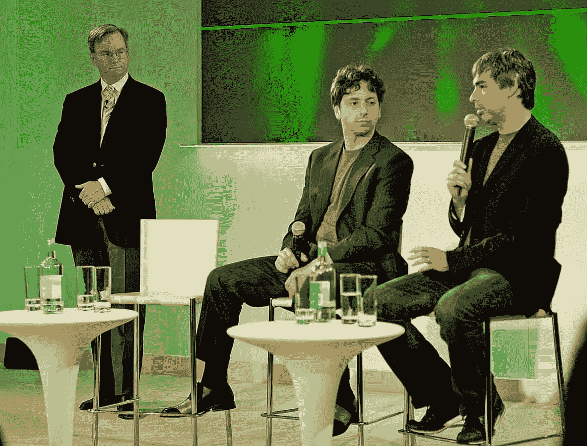
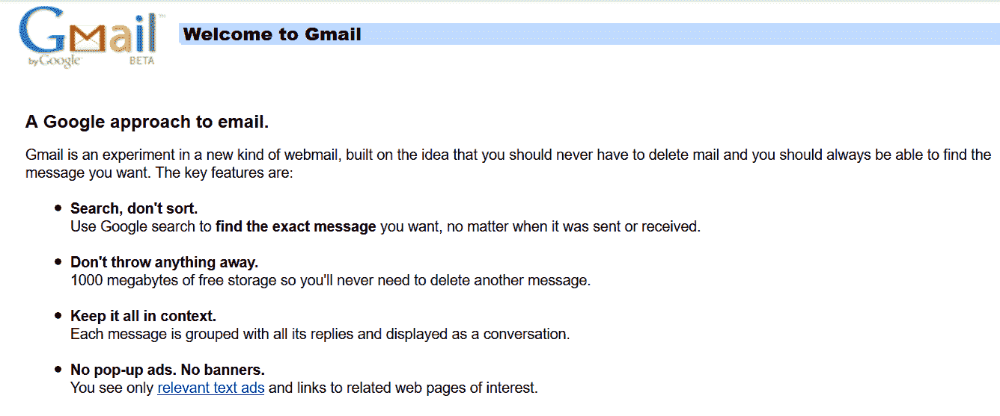
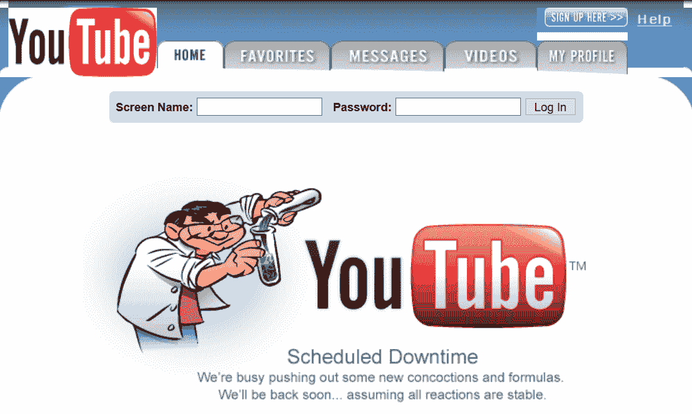

# 互联网的历史:第 14 部分——谷歌和 AJAX 应用

> 原文：<https://simpleprogrammer.com/history-internet-14-google-and-ajax-apps/>

在第八部分:谷歌的故事中，我们涵盖了 1996 年到 2003 年。谷歌创始人拉里·佩奇和谢尔盖·布林在 2001 年聘请埃里克·施密特担任谷歌董事长，然后担任首席执行官——三位高管学会了如何顺利合作。

2008 年谷歌的埃里克·施密特、谢尔盖·布林和拉里·佩奇。照片由来自日本 Inbamura 的 Joi Ito 拍摄

谷歌专注于为用户快速提供高质量的搜索结果，这是他们早期成功的关键。到 2003 年，他们已经超过了雅虎！作为世界上最受欢迎的搜索引擎，谷歌 AdWords 有助于保持收入。

同年还推出了 AdSense，允许第三方出版商访问他们的广告客户网络，并在他们自己的网站上放置上下文相关的广告。广告不是链接到搜索结果，而是与网站内容相关。

然而，谷歌仍然容易受到竞争对手的攻击，因为确保客户不断回到其搜索引擎的唯一机制是其技术是优越的。如果一个更好的搜索引擎出现了，没有什么可以阻止客户放弃他们。

为了保护未来的利润，谷歌制定了一项战略，将客户锁定在谷歌的产品和功能套件上。要让这个计划成功，他们需要一个与众不同的产品。他们的哲学是“关注用户，其他一切都会水到渠成。”

谷歌有各种各样的实验产品，员工每周花 20%的时间在这些产品上。2004 年，整个公司大约有 500 个不同的开发项目。

他们中的大多数人都没能活着见到天日。

然而，他们中的一些人表现出如此大的潜力，以至于从根本上改变了公司。这些新产品利用了 web 开发史上最大的技术突破:AJAX。

## AJAX 是如何被发明的

异步 JavaScript 和 XML (AJAX)允许开发人员编写响应速度更快的 web 应用程序，其用户体验与桌面软件风格相似。如果你以前从未听说过 AJAX，John Sonmez 在他的文章[什么是 Web 开发中解释了 AJAX 和其他 Web 技术。](https://simpleprogrammer.com/what-is-web-development/)。

现在所知的 AJAX 是微软在 199 年发明的；当时，没有人知道它会有多大，或者会导致什么。

在[第二部分:万维网早期](https://simpleprogrammer.com/world-wide-web-early-years/)中，我们了解到 Tim Berners Lee 在 1990 年发明了超文本标记语言(HTML)，然后成立了万维网联盟(W3C)。W3C 在第一次会议上同意标准化 HTML，并且

整个 20 世纪 90 年代，该组织发布了 HTML 新版本的建议。

然而，HTML 的局限性在于它只定义了一小部分可以使用的实体。1996 年，开始研究一种叫做可扩展标记语言(XML)的新语言。

其中一名设计师是来自微软的吉恩·保利。他们与网景公司的蒂姆·布雷和伊利诺伊大学的 C. M. Sperberg-McQueen 一起，在 1998 年为 XML 1.0 的第一版和 2000 年的第二版提出了 W3C 推荐标准。

微软相信 XML 技术是值得投资的，当 Paoli 和他的同事们正在开发 W3C 推荐标准时，微软的其他工程师为它开发了一套服务，称为 MSXML。

1999 年，MSXML 与 Outlook Web Access (OWA)一起发布，Internet Explorer 5 是第一个提供 XML HTTP 请求的浏览器(通过 MSXML 库的 XMLHTTP 包装使用 IXMLHTTPRequest)。

如果 IXMLHTTPRequest 对象对您来说意义不大，那么您肯定并不孤单。很少有人理解它是关于什么的，或者为什么他们应该想要使用它。这项技术需要微软专有的 ActiveX 技术。

微软网站在 1999 年发布广告，通过“国际”下载或光盘提供 Internet Explorer 5。

在第五部分:第一次浏览器战争中，我们报道了微软的 ie 浏览器如何击败网景浏览器的故事。一些前网景员工组成了一家名为 Mozilla 的新公司。2002 年，他们发布了新浏览器的预览版，[凤凰](https://en.wikipedia.org/wiki/Phoenix_(mythology))。这是由一个新的 JavaScript 引擎 Gecko 支持的，它支持 XmlHttpRequest (XHR)对象。

Phoenix 浏览器是今天 Firefox 浏览器的基础，它有助于 AJAX 开发的普及和标准化。

在 21 世纪初，由于缺乏标准化，开发人员可能会使用类似这样的 JavaScript 代码来尝试 AJAX 编程:

函数 createXHR()

{

尝试{

//由 Phoenix (2002)或 Safari (2004)或 Opera (2005)支持

返回新的 XMLHttpRequest()；

}
catch(e){ }//如果不存在，继续程序

尝试{

//支持 Internet Explorer 

返回新的 ActiveXObject{"Msxml2。XMLHTTP " }；

}

catch(e) {}

alert("抱歉，您的浏览器不支持 XHR ")；

}

虽然 XHR 技术是由微软发明的，但向世界展示其惊人潜力的却是谷歌的工程师。他们创造了几个应用程序，这些应用程序永远改变了人们对互联网开发可能性的看法。

让我们来看看谷歌最具变革性的 AJAX 应用:

## 谷歌邮件

第一个获得巨大成功的实验性项目是由[保罗·布赫海特](https://en.wikipedia.org/wiki/Paul_Buchheit)在 2001 年发起的，他们称之为 Caribou。

今天这被称为谷歌邮件。

在开发了第一代 Google Groups 之后，Paul 被邀请开发一个电子邮件产品。由于搜索是谷歌最擅长的，Caribou 的第一个版本只执行电子邮件搜索，而且只用了一天的时间就用 Groups 代码创建出来了。

保罗·布赫海特。罗伯特·斯考伯的照片 [CC BY 2.0](https://commons.wikimedia.org/w/index.php?curid=34000523)

2004 年 4 月 1 日，Gmail 发布了一份新闻稿，看起来完全像是愚人节的恶作剧。它声称搜索只是第二大在线活动，而电子邮件是第一大，所以他们因为一个用户投诉而创造了整个产品。此次发布还宣布了 Gmail 的 1gb 存储空间，这在当时是任何其他免费电子邮件服务的 500 倍。

那天很少有人把它们当回事。

一旦人们意识到这个声明是真的，采用率就会很高。虽然它宣传只是一个预览，但它受益于口口相传，朋友向其他朋友推荐它。新用户感觉自己是网络用户特权群体中的一员，他们了解最热门的互联网新发展。

早期的电子邮件服务缺乏良好的搜索工具，因此用户可能会浪费大量时间寻找很久以前写的电子邮件。谷歌搜索让查找这些旧邮件变得轻而易举。有了 1gb 的存储空间，用户不再需要玩苏菲的选择来删除邮件。

拉里·佩奇最初决定 Gmail 甚至不应该给用户删除任何邮件的选项，认为“如果你删除了一些东西，你可能以后会决定你想要它。另外，你花时间考虑我是否应该删除这个。”电子隐私信息中心(EPIC)认为 Gmail 是“对隐私通信神圣性的前所未有的侵犯”,随着隐私反弹的继续，谷歌承认增加了删除按钮。

然而，谷歌的目标始终是消除删除电子邮件的需要，他们意识到删除邮件最常见的原因是为了避免存储空间耗尽。

2005 年 4 月 1 日，Gmail 的一周年纪念日，存储空间限制增加到 2g，谷歌承诺“永远给人们更多的空间。”

gmail 的完整故事在《工作中的创始人:创业初期的故事》一书中有所解释。

## 谷歌建议

2004 年夏天，谷歌工程师凯文·吉布斯也开始了一个 20%时间项目。Google Suggest 通过在用户输入搜索词时提供自动补全建议来增强他们的搜索引擎。

例如，如果你在谷歌搜索框中输入“我们”，它很可能会向你建议“天气”。今天，这种工具无处不在，很难想象没有它会有人在网上搜索。

## 谷歌地图

2004 年 10 月，Google 收购了 Where 2 Technologies，后者使用 C++开发了一个桌面地图应用程序。谷歌开始将其转化为网络应用的任务。

在一两秒钟内在屏幕上绘制一张横跨世界数千英里的详细地图是一个难题，但 XHR 解决了这个难题。谷歌工程师将地图分成一组图块，并使用 XHR 一次更新一幅地图。用户看到地图很快进入焦点，而不是需要等待很长时间才能一口气画出完整的地图。

谷歌地图于 2005 年 2 月推出。

Google Suggest 和 Google Maps 启发杰西·詹姆斯·加勒特为这项技术创造了术语 AJAX。他很兴奋地看到网络和桌面用户体验之间的差距正在迅速缩小，变化几乎是瞬间发生的。

这些突破性的技术在 Jesse 的脑海中挥之不去，他在淋浴时想到了首字母缩写词 AJAX！AJAX 是“异步 JavaScript 和 XML”的简称。

Garrett 的文章[Ajax:Web 开发的新方法](http://adaptivepath.org/ideas/ajax-new-approach-web-applications/)激发了全世界开发者的热情，Ajax 实践开始成为主流。

杰西·詹姆斯·加勒特

## 油管（国外视频网站）

2005 年，YouTube 被谷歌收购之前

谷歌非凡增长的关键之一是其预见和规划下一件大事的能力，而不是满足于现状。

在 2005 年约翰·巴特利的一次采访中，施密特被要求透露谷歌未来的商业战略。“我们知道视频是下一个圣杯，”施密特宣布，但他避免透露更多细节。凭借数十亿美元的利润，谷歌经常收购较小的公司，它密切关注的热门初创公司之一是 YouTube。

YouTube 是由三名前 PayPal 员工于 2005 年 2 月创建的，他们分别是[查德·赫利](https://en.wikipedia.org/wiki/Chad_Hurley)、[陈士骏](https://en.wikipedia.org/wiki/Steve_Chen)和[贾韦德·卡里姆](https://en.wikipedia.org/wiki/Jawed_Karim)。在确信 YouTube 对他来说是个更好的主意之前，陈也曾短暂地成为脸书的首批员工之一。

YouTube 推出之时，全球的宽带普及率正在迅速提高，它获得了巨大的成功。截至 2006 年 11 月，每天有超过 1 亿的 YouTube 视频被观看，超过互联网所有视频的一半。

2006 年 10 月 9 日，谷歌宣布同意以 16.5 亿美元收购 YouTube。 [BBC 新闻分析师](https://www.youtube.com/watch?v=BGdEeriLD7c) [罗伯特·佩斯顿](https://en.wikipedia.org/wiki/Robert_Peston)评论说这个价格是“一个惊人的数目，当你考虑到 YouTube 是在去年二月才创建的。”他解释说，这一价值是“为了(谷歌)认为巨大的广告潜力。”

YouTube 的创始人对收购他们尚未盈利的新公司欣喜若狂。查德·赫利说:“我们将能够为您提供更好的服务，为您打造更多创新功能。”

收购 YouTube 是将谷歌与流畅和有趣的用户体验联系起来的又一个例子。21 世纪初，谷歌成功地建立在一项源自微软的技术之上，并遵循“关注用户，其他一切都会随之而来”的口号。

随之而来的是因其质量和易用性而闻名于世的产品。

虽然收购 YouTube 成为了全世界的头条新闻，但另一个非常重要的收购几乎完全没有被注意到:2005 年对 Android Inc .的收购。

加入我们的第 15 部分，了解 Android 的故事。