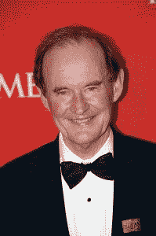
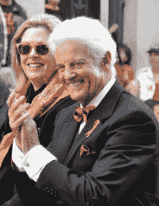
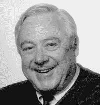
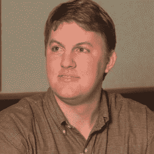
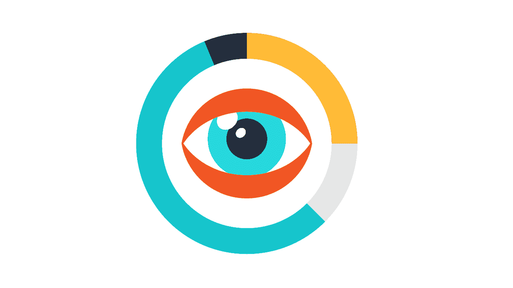
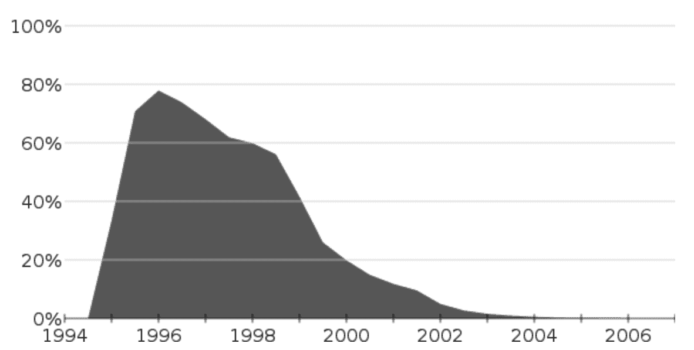

# 互联网的历史:第六部分-美国与微软公司

> 原文：<https://simpleprogrammer.com/history-internet-microsoft-corporation/>

欢迎来到我们穿越时空之旅的第六部分，了解互联网是如何发展的，以及它对我们生活的影响。

在第五部分，我们研究了微软和网景公司之间的第一次浏览器大战。我们了解到，在微软在市场份额上超过网景公司后不久，网景公司的首席执行官吉姆·巴克斯代尔认为微软垄断了操作系统市场，并犯有反竞争行为。

但是微软真的对这一指控有罪吗，还是网景为了伤害对手而夸大了事实？这个问题和其他问题一样，需要通过诉讼来权衡。

司法部聘请大卫·博伊斯作为其主要诉讼律师，于是美国政府开始了对微软的反垄断审判。

[David Boies，由 David Shankbone 拍摄，CC 3.0](https://commons.wikimedia.org/w/index.php?curid=15057896)

带头辩护的是微软的比尔·纽科姆。

2010 年巨人队 2010 年世界系列游行上的比尔·纽康。照片由 Mike Deerkoski 拍摄，CC BY-SA 2.0

## 联邦反垄断案开始

审判于 1998 年 10 月 19 日在哥伦比亚特区法院开始。

杰克逊法官。照片由贝弗利·雷兹内克拍摄，公共领域

地区法院法官托马斯·彭菲尔德·杰克逊(Thomas Penfield Jackson)表示，审判的焦点问题将是该公司是否“通过排他性和掠夺性行为维持了其操作系统的垄断地位。”

Boies 开始审判，指责微软胁迫作为一个标准的操作程序。

博伊斯播放了盖茨证词的精选片段，这些片段将他描绘成对据称犯下的强制行为高度无知。“我不知道网景在做什么，”盖茨谈到网景的商业战略。

博伊斯通过展示盖茨 1995 年的备忘录“[互联网浪潮](https://simpleprogrammer.com/2017/01/20/history-of-the-internet-3/)”反驳了这一说法，其中包括一句很有说服力的话:

“一个诞生于互联网的新竞争对手是网景公司。他们的浏览器占主导地位，拥有 70%的使用份额，这让他们可以决定哪些网络扩展会流行起来。”

在指责微软想将其“窒息控制”延伸到互联网之后，博伊斯展示了盖茨的附加备忘录，上面写道:

“我认为我们可以与网景公司达成某种非常强大的交易。”

“作为交易的一部分，我们甚至可以付钱给他们，购买他们的一些东西或其他东西。”

Boies 推测道:“你所拥有的，就其本身而言，是一种垄断的企图”，并把微软免费赠送 Windows 系统的 Internet Explorer 的决定称为“一场掠夺性的定价运动”

马克·安德森

博伊斯还介绍了马克·安德森对网景公司 1995 年 6 月与微软会面的非凡评论:

“这就像堂-科利昂的一次拜访。我预计第二天会在我的床上发现一个带血的电脑显示器。”

Boies 认为，即使是微软的亲密盟友，如英特尔，也被欺负，微软告诉其他公司什么产品可以或不可以出货。他认为，如果法院不干预，微软将成功“谋杀”网景。

微软的律师约翰·沃顿否认了所有这些指控，并为盖茨的职业形象辩护:

“反垄断法不是商业文明的准则，对一个人的个人攻击不能代替反竞争行为和反竞争影响的证据，这个人的远见和创新是人们从信息时代获得的巨大利益的核心。”

沃登指责政府依赖于断章取义的电子邮件片段，并试图通过以断章取义的方式分割比尔·盖茨的录像证词来妖魔化他。

## 第一证人

第一个证人是网景公司首席执行官詹姆斯·巴克斯代尔，他准备了一份 126 页的书面证词，并安排与记者分享。

在信中，他将与微软的会面描述为“在我三十多年与美国大公司打交道的经历中，我从未见过这种事情发生。”他还说，如果网景公司生产一种与 Internet Explorer 竞争的 Windows 95 浏览器，微软公司威胁要“利用其操作系统垄断地位粉碎网景公司”。

巴克斯代尔还声称:

面对微软旨在“切断网景公司的空气供应”的一系列行动，网景公司已经显示出惊人的能力来承受微软施加给它的各种反竞争压力，并且足够强大和足够创新来重新发明它的商业模式。""

约翰·沃顿抱怨说，证词包含“第四手道听途说”，这是不可接受的，应该被删除，但杰克逊法官裁定，将听取道听途说的证据。

沃登认为，软件公司总是把各种功能结合起来，让消费者更容易使用，这就是微软所做的一切。在交叉询问中，沃顿要求巴克斯代尔定义他证词中使用的“垄断产品”一词。

巴克斯代尔回答说，这是“一种在市场上占据明显主导地位的产品，以至于市场不再有自由选择的余地。”

当被问及在哪里第一次听到“空气供应”这句话时，Barksdale 说这是甲骨文公司首席执行官拉里·埃里森用来表示“使竞争对手处于劣势”的他还承认，他不记得有哪个微软员工说过这样的话，但他知道媒体报道过。

作为交叉质询的一部分，沃顿声称网景公司想要破坏微软。沃顿引用马克·安德森的话说，他将“把 Windows 简化成一套调试很差的设备驱动程序。”巴克斯代尔说这只是安德森的一个玩笑。

微软的律师提交了一封电子邮件作为证据，这封邮件是网景公司的创始人詹姆斯·克拉克发给一位微软高管的，提议微软成为网景公司的投资者:“合作可能符合你我双方的利益。”这对巴克斯代尔来说是一个惊喜，典狱长对詹姆斯·克拉克的真实性产生了怀疑，巴克斯代尔承认“我把他当成一个推销员。”

沃顿提出了这样一个观点，即消费者使用免费浏览器比他们需要付费时更富裕。巴克斯代尔回答说，消费者会受到伤害，因为缺乏激励开发者改进免费浏览器。

博伊斯问微软是否扣留了网景公司支持视窗 95 所需的软件。巴克斯代尔说，“微软直到 1995 年 10 月才提供这些 API，这导致我们错过了大部分假期销售旺季。”

博伊斯出示证据表明，微软与苹果的交易是基于苹果放弃网景浏览器作为其默认浏览器。苹果的弗雷德·安德森写道:“苹果需要确保微软将继续为 Mac 提供 MS Office，否则我们就死定了。他们威胁要抛弃麦克。交易卡使 Internet Explorer 成为默认浏览器。微软实际上与苹果联手对抗网景，尽管许多苹果用户表示强烈偏好网景的浏览器。

## 第二个证人

美国在线(AOL)商务高级副总裁大卫·科尔本(T1)是下一个。当时，AOL 为 40%的在线用户提供互联网服务，并且与微软有过争斗。

两年前，即 1996 年，AOL 与 Netscape 签署了一项协议，许可其浏览器，但第二天就放弃了这项协议，转而与微软签订了一项独家合同，允许它们在 Windows 95 上出现。

沃登展示了一份文件，作为 AOL 认为 Internet Explorer 4 在技术上优于 Netscape 浏览器的证据，以及一份备忘录，表明 AOL 对 Netscape 作为潜在竞争对手保持警惕，希望成为盟友。AOL 试图避免 Netscape 扩展到他们的业务领域。

美国在线首席执行官[史蒂夫·凯斯](https://en.wikipedia.org/wiki/Steve_Case)曾考虑在网景公司董事会获得一个席位，但他更愿意寻找一种方法来控制网景公司的网站。沃顿称这是一个“市场分割提案”

科尔伯恩回应说，他只是在寻找一种战略关系，但通过他的证词，很明显，微软不是唯一一家寻求与竞争对手建立伙伴关系的公司。事实上，这是商业竞争战略的正常组成部分。

博伊斯认为，不同之处在于，与美国在线不同，微软是垄断企业，法律禁止垄断企业做非垄断企业可以做的事情。Boies 说，微软对 AOL 的还价迫使他们避开 Netscape。

微软的行为是非法的，还是好生意，取决于杰克逊法官对微软是否垄断的裁决。

## 第三个证人

苹果软件工程高级副总裁阿瓦德斯·特凡尼安博士被史蒂夫·乔布斯派去作证，因为如果乔布斯亲自作证，对苹果与微软的微妙关系的损害会小得多。Tevanian 准备了一份[书面证词](https://www.justice.gov/atr/direct-testimony-avadis-tevanian-jr-us-v-microsoft-corporation-state-new-york-v-microsoft)辩称:

“微软对苹果公司积极采用这种反竞争策略，不仅是为了控制互联网浏览器市场，也是为了控制新兴的创建、发送、接收和显示多媒体内容的技术市场。”

在与证人交谈之前，博伊斯播放了更多盖茨的证词，显示盖茨回答了关于微软与苹果公司商业关系的问题。在证词中，盖茨说他不记得看到过《华尔街日报》关于微软告诉苹果“远离多媒体软件市场”的报道。

Tevanian 作证说“微软已经在它的操作系统中编写了一些步骤，以确保 QuickTime 文件不能在 Windows 上可靠地运行”,并向电脑制造商施压，要求他们不要在他们的机器上安装 Quicktime。

微软否认了这些指控，称两家公司合作“确保我们各自的工具和应用程序为了消费者的利益而互操作”，并援引史蒂夫·乔布斯的话说，Internet Explorer 是“最好的浏览器”

杰克逊法官后来向肯·奥莱塔透露了他对特瓦尼安考试的想法:“我得到的感觉是，苹果真的担心微软会终止他们的业务，我相信他们。”

## 第四个证人

英特尔公司的 Steven McGeady 出庭作证。

从表面上看，英特尔是微软最重要的盟友，自 1984 年以来一直与他们合作。到 1998 年，大约 80%的个人电脑装有英特尔处理器和 Windows 操作系统，这通常用通俗的简写“Wintel”来描述。

麦吉迪认为微软是一个“邪恶的公司”，不同意英特尔官方对微软的立场。

博伊斯通过播放另一个令人尴尬的盖茨证词视频剪辑开始了他的检查，盖茨在视频中声称他不知道有任何努力说服英特尔不要与 Sun 做生意，或说服他们不要进入软件行业。

麦吉迪反驳了盖茨的观点，他描述了一次会议，会上微软威胁要撤回对英特尔微处理器的支持。博伊斯出示了一封来自盖茨的电子邮件，称“我们是这里的软件公司，我们不会在软件方面与英特尔有任何平等的关系。”

麦吉迪作证说，微软曾威胁说，如果英特尔不停止开发与微软产品竞争的软件，它将停止向英特尔提供关键的技术支持。

他还声称，微软的一位高级副总裁告诉他，他打算通过免费赠送 Internet Explorer 来“消灭”竞争对手网景，并“切断网景的空气供应”。

微软辩称，麦吉迪是一名心怀不满的高管，他错过了晋升机会，而且他对这些事件的记忆与其他英特尔高管形成鲜明对比。

作为一个不太可能，但却是微软的死敌，麦吉迪扮演了一个特立独行的角色，是司法部最令人难忘的证人之一。

## 第五个证人

计算机顾问兼独立软件公司总裁格伦·e·威多克被传唤，对集成浏览器能更好地服务于顾客利益的说法提出质疑。

他认为，除了微软，没有人把网络浏览器描述为操作系统软件。

微软辩称，应用程序和操作系统之间的区别变得越来越模糊，曾经可选的软件现在被视为必不可少的。

## 第六个证人

IBM 的约翰·索林被政府传唤，希望他能证明微软甚至欺负大公司。

索林将 IBM 的 OS/2 操作系统的相对失败归咎于微软的应用程序壁垒，他说:

“许多设计在 Windows 上运行的重要应用程序在设计在 OS/2 上运行的版本中没有提供。”

他还说，微软的限制性合同限制了软件公司向 Windows 竞争对手销售产品的能力。

索林批评微软的 Java 战略，指责他们纵容使用其版本的 Java 来阻止软件开发者编写通用应用程序。

Boies 出示了一封比尔·盖茨写的关于他对 Java 的恐惧的邮件，他写道:

“( IBM 的)软件团队对 Java 的信仰是一个大问题……他们继续用他们的个人电脑散布针对我们的东西。”

微软为自己辩护，称 IBM 与 Sun 和 Netscape 结盟，并出示了一封 IBM 发给 Netscape 的电子邮件，内容是:

“我们必须齐心协力，利用我们所有的集体联系，将 Java 确立为标准。我们必须迅速行动，抢先微软一步。”

微软辩称，OS/2 的失败是因为它比 Windows 更难使用，而且它需要的内存超过了许多消费者的购买能力。

## 第七个证人

接下来是经济学家弗雷德里克·r·沃伦-博尔顿(Frederick R. Warren-Boulton)被传唤，但他关于微软垄断的声明因博伊斯如何利用盖茨的证词和一些突发新闻而黯然失色。

这份证词对微软的法律团队来说越来越尴尬，约翰·沃顿抱怨说这是在“零零碎碎”地播放。他要求立刻播放这一切。

杰克逊法官回答道:“我认为你的问题在于你的证人，而不是他的证词呈现方式。”他补充说，“盖茨先生对他的证词询问没有特别的反应。”

## 突发新闻

1998 年 11 月 24 日，给沃伦-博尔顿的证词蒙上阴影的还有一个令人震惊的消息:网景公司同意以 42 亿美元的价格将其股票出售给美国在线。网景公司的股价在消息被消化后迅速上涨。

该交易预计在 1999 年春季完成，目前正等待股东和监管机构的批准。

美国在线也宣布与太阳微系统公司合作。根据一项新的三年协议，AOL 和 Sun 将开发和销售帮助互联网用户访问美国在线品牌的产品，目的是建立一个互联网服务公司，与微软和 IBM 竞争。

这对微软来说是一个喜忧参半的消息:他们即将面临一个新的行业威胁，但这对他们的反垄断案件来说是个好消息。

微软的 Bill Neukom 说，新的联盟表明市场竞争是活跃的，如果 AOL 用 Netscape Navigator 取代 Internet Explorer 浏览器，Netscape 可能再次成为使用最频繁的浏览器。

“毫无疑问，没有一家公司能够控制技术供应。我们是这个充满活力、不断变化的行业的一部分。”

AOL 的史蒂夫·凯斯最初说 AOL 将继续捆绑 Internet Explorer 和 AOL 在线服务软件，因为“我们希望继续捆绑 AOL 和 Windows”

在法院的台阶上，大卫·博伊斯告诉记者，“如果美国在线计划在收购后继续使用微软浏览器，因为这是他们进入[Windows]桌面的唯一途径，这是一个相当强烈的迹象，表明微软已经创造了竞争壁垒。”

## 第八个证人

Java 编程语言的创始人詹姆斯·高斯林博士是下一个出庭的人。他的证词解释了 Java 如何为软件开发者提供跨平台的开发机会，这是对微软商业模式的威胁。

大卫·博伊斯再次高兴地播放了盖茨作证的另一集，盖茨否认他关心 Java。

这一声明与盖茨自己的电子邮件中所说的“[Java]吓死我了”，以及微软发给盖茨的电子邮件中所说的“如果我们进一步将 Java 视为我们的主要威胁，那么 Netscape 就是主要的分发工具。”

微软的律师通过阅读高斯林的一封电子邮件进行反驳，这封邮件鼓吹与微软的欺骗性关系，给他们“与他们合作的错觉”，同时努力“击败他们”。

## 第九个证人

宾夕法尼亚大学教授 David J. Farber 对软件进行了技术解释，并讨论了“允许微软添加现在的应用程序来创建一个越来越大的单一软件包的负面后果”

微软声称将 Internet Explorer 集成到 Windows 98 中可以提高效率。

Farber 表示，这种说法具有误导性，因为不捆绑浏览器软件也能达到同样的效果。

“这是因为没有任何技术障碍阻止微软将其 Windows 操作系统作为独立于其浏览器软件的独立产品进行开发和销售。”

## 第十个证人

普林斯顿大学计算机科学家 Edward W. Felten 同意 Farber 的观点，他论证说，Internet Explorer 可以很容易地从 Windows 95 和 Windows 98 中删除，而不会危及 Windows 系统的任何非网页浏览功能。

他认为，与单独安装的产品相比，将浏览器和 Windows 结合起来的决定没有给消费者带来任何技术上的好处。

微软的律师辩称，费尔滕只是隐藏了浏览器，而不是删除它。Felten 未能卸载浏览器，因为它是操作系统不可或缺的一部分。

## 第十一个证人

生产税务准备软件的 Intuit 公司总裁兼首席执行官 William H. Harris 表示，Windows 已经成为软件应用程序供应商和互联网相关内容和服务提供商的一个“瓶颈”,他们必须利用这个瓶颈来获得客户。

他认为微软利用其垄断力量迫使软件公司将网景拒之门外。

博伊斯播放了盖茨作证的另一集，揭示了他更多的记忆缺失。盖茨不记得曾要求 Intuit 放弃与网景公司的任何推广协议，尽管收到了微软高级副总裁布拉德·蔡斯的一封电子邮件，通知他 Intuit 已经同意“不与其他浏览器制造商达成营销/推广协议。”

约翰·沃顿强调说，网景公司未能生产出具有 Intuit 所要求的功能的浏览器，而 Internet Explorer 却成功了。在反诘问下，哈里斯承认，在某些方面，Intuit 和其他公司的行为类似于微软，比如向电脑制造商提供资金，让他们将软件加载到新的个人电脑上。

## 政府的最后证人

麻省理工学院的经济学教授 Franklin M. Fisher 博士被要求回答审判中最重要的问题之一:微软是垄断吗？

费舍尔引用了那些觉得有义务购买 Windows 操作系统的个人电脑制造商的证词，并表示微软声称他们受到其他操作系统的严重挑战是一个笑话。

然而，当费希尔被问及消费者是否是微软的受害者时，他回答说，“总的来说，我认为答案是否定的，到目前为止。”

费希尔认为，随着价格上涨和创新受到抑制，对消费者的真正伤害将在未来出现。但是这种信念被攻击为纯粹的猜测。

在对费希尔的直接提问中，杰克森法官引用了《华盛顿邮报》对美国在线首席执行官史蒂夫·凯斯的采访:“美国在线与网景公司的合并与微软一案无关，因为我们所做的一切都无法与视窗系统竞争。我们没有幻想可以以任何方式削弱、塑造或形成操作系统行业的垄断。”

费舍尔完全同意这一观点，并认为微软采取了反竞争行动来保护其 Windows 操作系统的主导地位。

## 微软见证人

微软的证人名单主要是微软的高管，但也包括经济学家理查德·l·施马伦塞和康柏电脑公司的约翰·罗斯。

微软副总裁 Brad Chase 能够证明 Internet Explorer 在某些方面比 Netscape 的浏览器在技术上更胜一筹，并强调了 AOL 和 Sun 之间的战略协议，表明他们计划重振 Netscape。

然而，微软的高管们普遍未能显著改变该案的势头。政府未能找到任何愿意为他们作证的个人电脑制造商，但是对康柏公司的约翰·罗斯的盘问使大卫·博伊斯得以攻击微软公司与康柏公司的关系。

罗斯被迫承认，个人电脑制造商没有可行的 Windows 替代品。大卫·博伊斯随后在 1996 年 5 月表示，康柏希望“突出品牌领导者网景的特色”,但在微软威胁停止向他们提供 Windows 之后，康柏屈服了，将 Internet Explorer 作为他们所有个人电脑的默认浏览器。

在最后的证词后，杰克逊法官要求休庭，并宣布他将在适当的时候公布他的事实调查结果。

## 微软新闻活动

比尔·盖茨邀请《纽约客》的肯·奥莱塔到他的办公室，抱怨微软和 Linux 都受到了媒体的不公平对待:

“只有在法庭上，才能有人说‘嘿，Linux 是一个强有力的竞争对手’，媒体笑得让法官觉得，‘好吧，那肯定是一个错误的声明，那肯定是故作姿态。’在我的世界里，来自 Linux 和许多其他产品的激烈竞争。"

盖茨承认，他对微软没有在 1998 年达成庭外和解感到遗憾，并补充说，“我们一直想解决这件事。”

在另一场新闻发布会上，史蒂夫·鲍尔默告诉分析师，“今天的竞争比我在微软的 19 年中感受到的竞争都要多，也更激烈。”

微软还在《华盛顿邮报》和《T2 时报》上刊登广告，向消费者宣传自己的观点，称:

“消费者没有要求采取这些反垄断行动，而是竞争对手企业要求的。高科技的消费者享受着价格下降、产量增加以及一系列令人惊叹的新产品和创新。”

在《华盛顿邮报》和《T2 纽约时报》的广告中，微软认为将 ie 浏览器从 Windows 中分离出来会对消费者不利，因为他们希望电脑使用起来更简单，而不是更难。

它还认为，他们在市场份额上的增长是由于 Internet Explorer 在技术上优于 Netscape Navigator。

## 事实调查结果

杰克逊法官于 1999 年 11 月 5 日发布了法院的判决。

法院几乎在每一点上都站在司法部一边。

它认定微软是垄断者，其市场份额可能会“在未来几年攀升得更高”,竞争对手没有公平的机会战胜他们。

它为微软的竞争对手定义了一个“[应用进入壁垒](https://www.justice.gov/sites/default/files/atr/legacy/2006/04/11/iii-b.pdf)”。也被称为鸡和蛋的问题，它解释了大多数消费者只使用已经存在大量高质量应用程序的操作系统。

杰克逊法官裁定这一事实“会阻止有抱负的进入者进入相关市场”，并发现很少有人采用 Linux 代替 Windows。

关于 Java 和 Netscape 的浏览器，Jackson 发现它们有消除应用程序壁垒的潜力，微软对它们的流行和它们对微软业务构成的威胁感到震惊。

法院还发现微软对网景公司隐瞒了重要的技术信息。

但最激烈的谴责留到了最后一段，它发现微软阻碍了有竞争力的投资，伤害了竞争对手，扼杀了创新。

杰克逊法官后来引用法律格言 [falsus in uno，falsus in omnibus](https://en.wikipedia.org/wiki/Falsus_in_uno,_falsus_in_omnibus) 作为其决策过程的一部分:在注意到微软证词和书面证据中的矛盾后，他们案件的整体可信度受到质疑。

听到这个消息后，比尔·盖茨宣读了一份书面声明，称“我们恭敬地不同意。”微软提出上诉，并希望上诉法院能够推翻这一裁决。

## 调解

理查德·波斯纳。GFDL 陈思远摄

1999 年 11 月 19 日，杰克逊法官任命第七巡回上诉法院首席法官[理查德·波斯纳](https://en.wikipedia.org/wiki/Richard_Posner)担任调解员，希望能说服双方和解。微软对这一决定感到高兴，因为法律团队尊重这位法学家，将其视为反垄断法的权威、成功的作家和强烈支持自由市场的经济学家。

波斯纳邀请双方在芝加哥的标准俱乐部共进午餐，在那里他邀请双方进行陈述，但敦促每个人对他们的谈话严格保密。

在接下来的几个月里，波斯纳成功地与比尔·盖茨建立了良好的关系，并让他意识到安定下来的必要性。

然而，调解因 19 名州检察长的额外要求而变得复杂。据一位微软高管称，波斯纳说与他们的谈判“就像赶猫一样；他们没救了。”

2000 年 4 月 1 日，波斯纳发表了一份声明，开头写道:

“经过四个多月的时间，很明显，各方对持续诉讼的可能过程、结果和后果，以及替代解决条款的影响和后果的分歧根深蒂固，难以弥合。”

波斯纳感谢司法部、微软和杰克逊法官。他没有感谢美国！比尔·盖茨说，“最终，由于司法部和各州不合作，和解变得不可能。”

## 法律结论

2000 年 4 月 3 日，杰克逊法官宣布了他的[法律结论](https://www.justice.gov/atr/microsoft-conclusions-law-us-v-microsoft-corporation-state-new-york-et-al-v-microsoft)，确认微软违反了反垄断法。

“微软通过反竞争手段维持其垄断权力，并试图垄断网络浏览器市场，这两种行为都违反了《谢尔曼法案》第 2 条。”

杰克逊宣称，微软非法地将其网络浏览器与其操作系统捆绑在一起，并发起了“对企业家努力的蓄意攻击”

在那一天，由于投资者集体抛售微软股票，微软的市值下跌了 800 亿美元。

第二天，杰克逊宣布他想利用[加快法案](https://en.wikipedia.org/wiki/Expediting_Act)绕过上诉法院，直接进入最高法院。

微软的首席执行官们仍然无悔意。史蒂夫·鲍尔默告诉《华盛顿邮报》:“我深深感到我们在每一个事件中都表现得超级正直。”比尔·盖茨出现在 PBS 的[晚间商业报道](https://en.wikipedia.org/wiki/Nightly_Business_Report)中宣称，“微软非常清楚它绝对没有做错任何事情。”

## 补救听证和裁决

法庭诉讼于 5 月 24 日重新开始，杰克森法官提到了来自[计算机和通信行业协会](http://www.ccianet.org/)和[软件和信息行业协会](http://www.siia.net/)的“一份出色的简报”，其中建议将微软的浏览器业务拆分为一家独立的公司。

这份简报引用了史蒂夫·鲍尔默的话说:“没有 Windows 2000 服务器，桌面版 Windows 2000 的 40%的功能是无用的。”杰克逊法官询问微软的律师这一引用是否正确，在五分钟的休庭后，律师们回答说，他们既不能确认也不能否认这一引用，而且无论如何这与审判无关。

杰克逊裁定，微软有 90 天的时间来建立一个至少由三名微软以外的董事会成员组成的合规委员会。

微软向上诉法院提交了一份延期申请，指控杰克逊法官“一系列严重的实质性程序错误，几乎影响了诉讼的每个方面。”上诉法院同意审理此案。

杰克逊法官的回应是同意推迟任何行为补救措施，直到上诉程序完成，但也要求最高法院直接审查他的决定。

## 最终裁决

最终裁定于 2002 年 11 月 12 日发布。这是一项基于行为的补救措施，禁止微软对其 OEM 被许可方采取反竞争行为，并要求其向独立开发者披露更多 API 和相关文档，以实现与 Windows 操作系统的互操作。

为了确保合规，微软还同意任命一个三人小组，他们有权访问微软的系统、记录和源代码，为期五年。

对微软来说，这是一场漫长而昂贵的法律战，但该协议保护了微软最珍视的目标:被允许在未来继续将其他软件与 Windows 捆绑在一起。

九个州和哥伦比亚特区认为和解还不够，但在 2004 年 6 月 30 日，美国上诉法院驳回了这些反对意见，批准了和解。

## 微软赢得浏览器大战

在 2000 年期间，微软在浏览器市场的份额飙升至 86 %,而网景公司的份额降至 14%以下。

在 AOL 的领导下，网景浏览器继续改进，但速度不够快，无法与微软竞争或阻止其市场下滑。急于给产品添加更多的特性使得开发团队更难解决质量问题。用户抱怨缓慢的性能，错误，甚至崩溃。

美国在线首席执行官史蒂夫·凯斯继续坚持认为网景浏览器优于 Internet Explorer，但由于它在网景被收购前与微软签署的合同，它继续通过美国在线网站推广 Internet Explorer，而不是自己的浏览器。

网景浏览器份额的兴衰。

几年后，AOL 决定从 Netscape Navigator 9 开始停止浏览器开发。微软赢了。

在比尔·盖茨的畅销书《未来之路》的后续作品《商业@思维的速度》中，他写了一章，题为“坏消息必须传播得快”，将网络浏览器技术描述为一种威胁，这种威胁可能会轻易让微软永远出局。他认为“j·阿拉德、史蒂文·辛诺夫斯基(当时我的技术助理)和其他几个人”是迅速拥抱网络的原因。

但最重要的是，他相信微软愿意听到坏消息并采取行动，并引用珍珠港事件作为一个教训，告诉我们需要时刻为坏消息做好心理准备。

在整个浏览器大战中，两家公司都分享了彼此相反的观点，但对自己的看法也完全相同。他们都认为自己是失败者，试图对抗咄咄逼人的外来者。网景公司的安德森说:

“我们是一家小公司。他们是微软，来到这个城市。”

但是亚马逊的创始人杰夫·贝索斯支持盖茨，他说“我的观点是他被我在高科技圈子里遇到的大部分人不公平地诽谤了。”

比尔·盖茨用下面的话结束了这一章:

“在过去的 20 年里，我每天都看到我们处于劣势。如果我们不坚持这种观点，一些竞争对手将会吃掉我们的午餐…有一天一个渴望的暴发户将会把微软挤出市场。我只希望是五十年后，而不是两年或五年。”

在这篇文章中，我们看到了 20 世纪最后几年的激烈竞争。

我希望这已经给了你这个有争议的故事的两个方面的强烈味道。如果你想深入了解，你可以在司法部网站上阅读证词全文。

在这些年里，其他主要互联网技术公司之间也发生了另一场同样重要的行业斗争。

加入我们的第七部分，探索雅虎和谷歌的诞生故事。