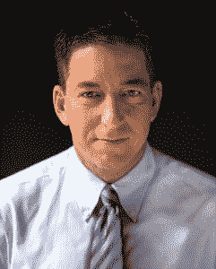
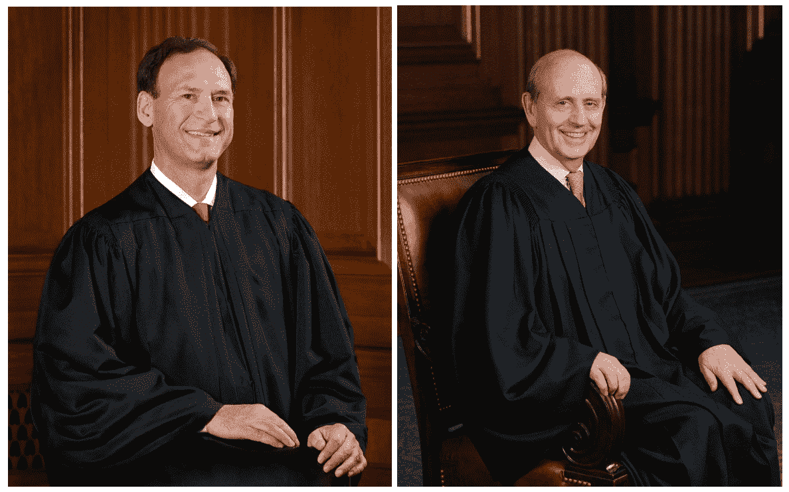
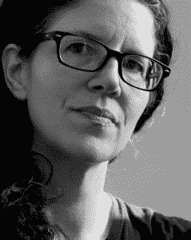
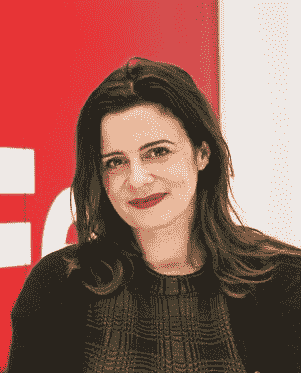

# 互联网的历史:第 23 部分——爱德华·斯诺登

> 原文：<https://simpleprogrammer.com/history-part-23-edward-snowden/>

> 人民的人身、房屋、文件和财产安全不受无理搜查和扣押的权利不得侵犯，除非有正当理由，并经宣誓或证实，特别说明要搜查的地方和要扣押的人或物，否则不得发出搜查令。——1789 年美国权利法案第四修正案

> “任何没有卷入非法活动的美国公民都没有什么可害怕的。”—约翰·米切尔，美国司法部长，1969 年

在过去的几集里，我们一直在政府监管的背景下研究互联网的历史。互联网比万维网早几十年诞生于 1969 年的美国国防部，这一年因其惊人的技术进步和民权运动而被人们铭记。

在第 17 部分，我们了解到第四修正案是针对英国政府在美国独立前的行为而写的。英国政府有一种保密和侵入的文化，包括[秘密打开邮件](https://www.questia.com/read/48991663/the-culture-of-secrecy-britain-1832-1998)和例行的财产搜查。

开国元勋们认为这是完全不合理的，并撰写了第四修正案，认为它将废除政府的权力，使其公民受到普遍的，无怀疑的监视。

第 17 部分还报道了水门事件、三叶草计划和 COINTELPRO。这些和其他的滥用导致了 1978 年[外国情报监视法案](https://en.wikipedia.org/wiki/Foreign_Intelligence_Surveillance_Act)的颁布，该法案通常要求政府在监视美国人的通信之前寻求授权。

在第 20 部分中，我们报道了 9/11 暴行和美国政府随后的行动:美国爱国者法案和一项新的无授权窃听计划。该计划得到了 2008 年 [FISA 修正案](https://en.wikipedia.org/wiki/Foreign_Intelligence_Surveillance_Act_of_1978_Amendments_Act_of_2008)的批准和扩展，美国公民自由联盟(ACLU)和大赦国际对此提起诉讼。大赦国际诉克拉珀案声称 FISA 修正案是违宪的。

美国政府没有争论该法案准许的监控活动的合宪性，而是成功地论证了美国公民自由联盟的客户无法证明他们受到了监控。

美国公民自由联盟无法找到必要的证据，因为如果这些客户被监视，那么这些证据就是“国家机密”。纽约的一名法官在 2009 年驳回了这起诉讼，但在 2012 年，该案件由美国最高法院审理。

当最高法院正在考虑此案时，FISA 修正案即将到期，国会投票决定将其延长五年。巴拉克·奥巴马总统于 2012 年 12 月 30 日将该法案签署成为法律。

## 初次接触

格伦·格林沃尔德， [CC 乘 3.0](https://creativecommons.org/licenses/by/3.0)

2012 年 12 月 1 日，美国记者、前宪法和民权律师、美国国家安全局评论家、[维基解密](https://simpleprogrammer.com/history-of-the-internet-part-21-wikileaks-and-julian-assange/)的支持者格伦·格林沃尔德收到一封神秘的电子邮件，发件人自称“ [Cincinnatus](https://en.wikipedia.org/wiki/Lucius_Quinctius_Cincinnatus)

邮件开头写道，“人们通信的安全对我来说非常重要。”它敦促格林沃尔德安装相当好的隐私(PGP)加密软件，这样他就可以接收他感兴趣的信息。“加密很重要，不仅仅是对间谍和花花公子来说，”邮件中写道。格林沃尔德不予理会。

三天后，格林沃尔德收到了神秘的辛辛那提斯发来的邮件。这一次，格林沃尔德回答说:“我得到了这个，并打算继续努力。我没有 PGP 代码，也不知道该怎么做，但我会努力找到能帮我的人。”他在另一封电子邮件中收到了 PGP 的一步一步指南，落款是“密码你的，Cincinnatus。”

七个星期后，对自己不作为的愧疚促使格林沃尔德再次回复了他的联系人，告诉他他会很快找到人来帮他加密。Cincinnatus 发了一个 10 分钟的视频，题为“记者 PGP”。格林沃尔德又一次忽略了这一点。

当辛辛纳图斯对格林沃尔德的不作为逐渐感到更加沮丧时，最高法院做出了裁决。

## 克拉珀诉大赦国际美国裁决

2013 年 2 月 26 日，美国最高法院以 5 票对 4 票的裁决决定[支持美国政府](https://en.wikipedia.org/wiki/Clapper_v._Amnesty_International_USA)。

多数意见作家塞缪尔·阿利托法官(左)和斯蒂芬·布雷耶法官(右)，持异议

支持政府的五名法官之一塞缪尔·阿利托(Samuel Alito)法官写道，“被告不能仅仅因为害怕假设的未来伤害而伤害自己，而这种伤害并不一定即将发生。”布雷耶法官在异议书中写道，政府间谍活动“就像常识推理和人类本性常识告诉我们的大多数未来事件一样可能发生。”

当 Cincinnatus 听到最高法院的裁决时，他住在华盛顿特区以西近 5000 英里的夏威夷瓦胡岛上。与他在情报界的大多数同事不同，他对这一判决感到震惊。

## 格林沃尔德会见波伊特拉斯

劳拉·珀特阿斯。凯蒂·斯考金在 www.praxisfilms.org 的照片，[CC 3.0](https://commons.wikimedia.org/w/index.php?curid=31846729)

2013 年 1 月，电影制片人劳拉·珀特阿斯开始收到化名为“公民四号”的人发来的电子邮件:

“你问我为什么选了你。我没有。你做到了。

“你所经历的监视意味着你被‘选中’——随着你了解现代 SIGINT 系统如何工作，这个术语对你来说将意味着更多。

“现在，你要知道，你跨越的每一个边界，你进行的每一次购买，你拨打的每一个电话，你经过的每一个手机信号塔，你结交的朋友，你写的文章，你访问的网站，你键入的主题行，你发送的数据包都在一个系统的控制之下，这个系统的覆盖范围是无限的，但这些安全措施却是有限的。”

2013 年 4 月，格林沃尔德收到了波伊特拉斯的一封电子邮件，要求会面。第二天，他在酒店餐厅见到了她。Poitras 告诉他，她有一个“极其重要和敏感的问题”要讨论，并要求他要么把手机电池取出来，要么留在酒店房间里。

格林沃尔德把手机放在酒店房间，然后回到了波伊特拉斯。她告诉他，她收到了来自“公民四号”的电子邮件，声称可以获得关于美国政府监视本国公民和世界其他地方的极其秘密和有罪的文件。

波伊特拉斯打印了其中两封邮件。看完之后，格林沃尔德回答说:“他是真实的。我无法解释确切的原因，但我只是直觉地觉得这很严重，他就是他所说的那个人。”

或者他是吗？他可能是浪费他们时间的幻想家，或者是试图通过诱导他们发布欺诈性文件来损害他们的可信度的人？格林沃尔德和波伊特拉斯讨论了风险，但最终一致认为他们相信他是真实的。

格林沃尔德飞回了他在里约热内卢的家，后来(在海关莫名其妙的延误之后)收到了两个邮寄过来的 u 盘。利用拇指驱动器上的软件，他使用 [OTR 消息](https://en.wikipedia.org/wiki/Off-the-Record_Messaging)加密技术与 Poitras 在线交流，以防止不必要的窥探。波伊特拉斯告诉他，他们需要飞到香港去见他们的线人。

## 维拉克斯

格林沃尔德很快也收到了一封来自消息来源的电子邮件，他的名字叫 [Verax](https://en.wikipedia.org/wiki/Verax_(film)) ，拉丁语意为“真相讲述者”，还有一个关于[朱利安·阿桑奇](https://simpleprogrammer.com/history-of-the-internet-part-21-wikileaks-and-julian-assange/)的原名“Mendax”的剧本，意思是“谎言的代言人”

这封邮件写道，“有没有什么方法可以让我们在短时间内谈一谈？我知道你们没有多少安全基础设施，但我会解决你们有的问题。”

格林沃尔德了解到，消息来源与《华盛顿邮报》发生的事情有关:波伊特拉斯给了一名记者一些国家安全局的文件，但他们没有迅速就此发表一篇报道，而是似乎被律师告诉他们的事情吓坏了。

“我不喜欢这种发展方式，”消息人士告诉格林沃尔德。“我已经读了你很长一段时间，我知道你会积极和无所畏惧地做这件事。”

“我准备好了，也很渴望，”格林沃尔德回答道。

“你的首要任务是去香港，”Verax 说。

格林沃尔德的丈夫建议他，“告诉他，你想先看看几份文件，以了解他是认真的，这对你来说是值得的。”在格林沃尔德安装了更多的安全程序后，Verax 发送了一个包含大约 25 份文件的文件，每份文件都标有“绝密//COMINT//NOFORN”。格林沃尔德被其中包含的信息淹没了。

格林沃尔德通过 Skype 给《卫报》美国版的英国编辑珍妮·吉布森打电话，脱口而出:“珍妮，我有一个大新闻。我有一个能接触到似乎是大量美国国家安全局绝密文件的消息来源。”

吉布森很快阻止了他，说:“我认为我们不应该在电话上谈论这个，而且绝对不应该通过 Skype。”

珍妮·吉布森。照片由 StevenVig 拍摄， [CC BY-SA 4.0](https://commons.wikimedia.org/w/index.php?curid=68966753)

格林沃尔德飞回纽约，向吉布森和她的副手斯图亚特·米勒展示他所掌握的文件。吉布森总结道，“你需要尽快去香港，比如明天，对吗？”她坚持让长期担任《卫报》记者的伊万·麦卡斯基尔(Ewan MacAskill)加入进来，条件是在格林沃尔德和波伊特拉斯同意之前，麦卡斯基尔不能与消息来源见面。

当格林沃尔德和波伊特拉斯一同抵达 JFK 机场准备飞往香港时，波伊特拉斯从背包里拿出了另一个优盘。

“猜猜这是什么？”她问。

“什么？”格林沃尔德回答道。

“文件。所有的人”

在飞往香港的航班上，格林沃尔德注意到消息来源包含了一个名为“README_FIRST”的文件，其中披露了消息来源的名字爱德华·约瑟夫·斯诺登，以及他犯下如此严重罪行的反独裁动机:

“当被边缘化的年轻人犯下轻微的违法行为时，我们作为一个社会视而不见，因为他们在世界上最大的监狱系统中承受着难以忍受的后果，然而当这个国家最富有和最强大的电信提供商故意犯下数千万项重罪时，国会通过了我们国家的第一部法律，为他们的精英朋友提供了完全的追溯豁免权。”

斯诺登是 Cincinnatus、citizenfour 和 Verax 这些假名背后的真实身份。他选择了波伊特拉斯和格林沃尔德，因为他们早期批评国家安全“国家”。

## 香港采访

到达香港后，波伊特拉斯和格林沃尔德收到一条信息，邀请他们第二天早上，即 2013 年 6 月 3 日，在他下榻的酒店与他见面。他们被要求去一个特定的会议室，问第一个附近的酒店员工是否有餐馆开门，然后在一个沙发上等待，靠近一只巨大的塑料鳄鱼！

餐馆的问题是给谨慎地站在附近的斯诺登的一个加密信息，即他们没有被跟踪。“我们怎么知道是他？”格林沃尔德问道。“他会带着一个魔方，”波伊特拉斯回答。

当斯诺登到达时，手里拿着承诺的魔方，格林沃尔德对他们的消息来源如此年轻感到震惊。年仅 29 岁的他无疑冒着余生大部分时间在监狱度过的风险。他告诉斯诺登，他本以为会是一个年纪更大的人，也许是一个生命中最后几个月的人。“那么，跟我来，”斯诺登说，然后他带着他们走进一部电梯。他们在 10 楼下了车，走进 1014 房间。

随后，斯诺登坚持要他们把手机电池取出来，放在迷你吧冰箱里。他警告他们，美国政府有能力远程激活手机，并将其转化为监听设备。然后，他把枕头放在门脚下，以防有人试图从走廊偷听。

波伊特拉斯拿出摄像机，开始拍摄斯诺登。尽管这是在他同意的情况下完成的，但作为一个为了逃避监视而活着的人，讽刺的是斯诺登没有忘记，他变得强硬起来。

他后来将这一经历描述为“超现实的动态”，并将相机上的红灯比作狙击手的瞄准器。斯诺登最初不愿意谈论太多关于他自己的事情，因为他担心这会被用来转移对他想要揭露的秘密材料的注意力。

作为一名前律师，格林沃尔德在录取证人证词方面经验丰富，并在采访中采用了这种方法，对他进行了五个小时的提问，并评估他是聪明和理性的。斯诺登表示，自 2009 年开始，他对美国国家安全局缺乏监督和问责感到担忧，但他曾希望巴拉克奥巴马(Barack Obama)的当选将改革他认为是他们最严重的滥用职权行为。

“但后来很明显，奥巴马不只是在继续，而且在许多情况下扩大了这些虐待。我当时意识到，我不能等着领导来解决这些问题。”

在回答关于他披露机密信息的动机的问题时，斯诺登引用了坎贝尔·约瑟夫的书[千面英雄](https://en.wikipedia.org/wiki/The_Hero_with_a_Thousand_Faces)作为童年的影响，这本书教会他，“是我们通过我们的行动和我们用行动创造的故事赋予生活意义。”

对斯诺登的另一个重要影响是互联网:“互联网让我体验自由，探索我作为一个人的全部能力。对许多孩子来说，互联网是自我实现的一种方式。它允许他们探索他们是谁，他们想成为谁，但这只有在我们能够保密和匿名，在没有他们跟踪我们的情况下犯错误的情况下才行得通。我担心我这一代是享受这种自由的最后一代。我不想生活在一个没有隐私和自由、互联网的独特价值被扼杀的世界里。”

格林沃尔德问他为什么选择飞往香港？斯诺登回答说，美国特工会发现在那里更难对付他。比起 mainland China，他更喜欢香港，因为香港有更大的政治自由，尽管他知道自己仍可能被诬蔑为中国的双重间谍。

斯诺登预测，“他们会说我违反了《反间谍法》。我犯了重罪。我帮助了美国的敌人。我危及了国家安全。我敢肯定，他们会抓住我过去的每一个事件，可能会夸大甚至捏造一些，尽可能地妖魔化我。”

那天晚上，格林沃尔德根据斯诺登提供的信息起草了四篇文章:一篇关于 FISA 法院迫使威瑞森向美国国家安全局提供所有电话记录的秘密命令，一篇关于小布什总统未经授权的窃听计划的历史，一篇关于无限线人，一篇关于棱镜计划。

格林沃尔德随后给吉宁·吉布森发了短信，催促她尽快发表。吉布森回答说，她的律师很担心:“他们说联邦调查局可能会进来，关闭我们的办公室，拿走我们的文件。”

第二天，波伊特拉斯和格林沃尔德带着麦卡斯基尔去见斯诺登。麦卡斯基尔询问了他大约两个小时，检查了他的外交护照和其他政府证件，并得出结论，“我完全相信他是真实的。”

## 威瑞森故事出版公司

在纽约，吉布森打电话给国家安全局和白宫，告知他们计划公布绝密材料。然而，就在这天早上，苏珊·赖斯被任命为新的国家安全顾问。吉布森认为这是她迟迟不回电话的原因。

下午 3 点左右，她接到了包括美国国家安全局、DOJ 和白宫在内的许多机构的电话会议，这些机构警告她，“没有一家正常的新闻媒体会在没有与我们会面的情况下这么快就发表这篇文章。”

吉布森还受到格林沃尔德的压力，格林沃尔德坚持认为，如果他们当天没有出版，他将与另一个组织，如沙龙或国家，出版这个故事，甚至在网上自行出版信息。Gibson 同意并公布了 NSA 每天收集的数百万威瑞森用户的电话记录。美国公民自由联盟回应称，“这个节目简直不能再令人担忧了”，并称之为“超越奥威尔”。

CNN 很快报道了这件事，并联系格林沃尔德安排了对杰克·塔珀的采访。格林沃尔德解释道:

“这很重要，因为人们已经明白，这样做所依据的法律，也就是 9/11 之后颁布的《爱国者法案》，是一部允许政府拥有非常广泛权力的法律，可以获得比传统标准更低怀疑水平和可能原因的人的记录。因此，根据《爱国者法案》,如果政府怀疑你涉嫌犯罪或恐怖主义，他们可以获得大量关于你的信息。

“这项法院命令之所以如此引人注目，是因为它不是针对任何他们认为或怀疑犯了罪或属于恐怖组织的个人。它正在收集威瑞森公司的每一个客户的电话记录，找出他们打过的每一个国际电话和本地电话。所以是不分青红皂白，是横扫一切。”

那天晚上，格林沃尔德回复了斯诺登，他说，“每个人都认为这是一个一次性的故事，一个独立的独家新闻。没人知道这只是冰山一角。”

## 棱镜

第二天，也就是 2013 年 6 月 5 日，波伊特拉斯和巴顿·盖尔曼在《华盛顿邮报》上披露了棱镜计划，揭露美国国家安全局秘密获取了所有主要互联网公司的数据:微软、雅虎、谷歌、脸书、美国在线、Skype、YouTube 和苹果。

任何非美国人的所有通信，包括与美国公民的通信，包括所有电子邮件、社交媒体活动和互联网搜索，都可以根据要求从这些公司获得。

10 分钟后,《卫报》刊登了格林沃尔德关于同一事件的文章，但重点是对互联网公司的否认。与威瑞森的故事一样，他们事先联系了政府，但在这个故事中，他们也联系了互联网公司，后者回应说，他们从未听说过棱镜。

CNN 立即将此事作为突发新闻进行了报道，前国家安全局官员威廉·宾尼评论说他并不感到惊讶，因为这是他在那里工作时他们一直在做的事情的延续。

前白宫新闻秘书阿里·弗莱舍为这个项目辩护说:“我不希望我们放松警惕。我不希望我们再次遭到袭击，就像我们在波士顿看到的那样，”并辩称，“人们愿意牺牲他们的公民自由。”

一些记者也强烈批评格林沃尔德。《纽约时报》发表了一篇名为“ [Blogger，关注监控，是辩论的中心](https://web.archive.org/web/20130607093318/http://www.nytimes.com/2013/06/07/business/media/anti-surveillance-activist-is-at-center-of-new-leak.html?hp)”的贬低文章，“声称格林沃尔德”预计将吸引司法部的调查，司法部已经积极追查泄密者”，并引用了加布里埃尔·舍恩菲尔德对他的描述，称他为“任何形式的反美主义的高度专业的辩护者，无论多么极端。”

《纽约每日新闻》的一名记者发来电子邮件，通知他正在就过去的债务、纳税义务以及过去对一家成人视频发行公司的投资接受调查。不知是巧合还是其他原因，在同一天,《纽约时报》的迈克尔·施密特就同样的税务债务联系了他。

格林沃尔德回到美国有线电视新闻网争辩说，“事实上，没有检查，没有监督谁在美国国家安全局的肩膀上看，这意味着他们可以想拿什么就拿什么，事实上，这一切都在一堵秘密的墙后面，他们威胁想揭露它的人意味着，无论他们在做什么，甚至违反法律，我们都不可能知道，直到我们开始真正的调查和真正的透明政府在做什么。”

斯诺登在家里安装了一个互联网安全设备，通知他有两个美国国家安全局的人来找过他。在这一点上，他觉得他们已经怀疑他是泄密的源头，而且用不了多久他们就会追踪到他的位置。

格林沃尔德、波伊特拉斯和麦卡斯基尔同意斯诺登的观点，即在另外两篇文章发表后，他们会揭露斯诺登是泄密者。

## 揭露与逃避:像逃犯一样生活

波伊特拉斯录制了一段斯诺登揭露自己是泄密者的视频，并于 2013 年 6 月 9 日发布了[“爱德华·斯诺登:美国国家安全局监控揭秘者”](https://web.archive.org/web/20130609232601/http://www.guardian.co.uk/world/2013/jun/09/edward-snowden-nsa-whistleblower-surveillance)。

在夏威夷，斯诺登的女朋友林赛·米尔斯接到一个朋友的电话，她很震惊，朋友告诉她《赫芬顿邮报》的主页上有一段斯诺登的视频。她在日记中写道:“我平静地等待 12 分钟的 YouTube 视频加载。然后他就出现了。真实的。活着。我惊呆了。”

在厄瓜多尔驻伦敦大使馆，朱利安·阿桑奇饶有兴趣地观看了斯诺登的视频，然后指示他的维基解密同事莎拉·哈里森飞往香港，试图找到他。

第二天，五角大楼文件泄密者丹尼尔·埃尔斯伯格称赞了斯诺登，称“美国历史上没有比爱德华·斯诺登泄露国家安全局材料更重要的泄密事件——这肯定包括 40 年前的五角大楼文件。”

格林沃尔德随后接到了一个来自香港联系人的紧急电话:“我们已经到了，”那人说，“在你酒店楼下。我身边有两位律师。你的大厅里挤满了摄像机和记者。媒体正在搜寻斯诺登的酒店，很快就会找到，律师们表示，他们必须在媒体找到他之前找到他，这一点至关重要。”

穿上他能找到的第一件衣服后，格林沃尔德打开酒店的门，发现多个摄像头对准了他。《华尔街日报》和美联社的记者跟随他进入电梯，当他到达大厅时，他发现更多的记者，如此之多，以至于他无法找到需要找到斯诺登的律师。

在大厅里举行了一场即兴新闻发布会后，记者们大多散去了，格林沃尔德找到了两名香港律师和《卫报》的首席律师吉尔·菲利普斯。他们通过加密聊天联系了斯诺登，斯诺登通知他们，“我正在改变自己的外貌，我可以让自己变得不可辨认。”

下一个问题是如何让律师们离开格林沃尔德的酒店而不被记者跟踪，有些记者就在酒店房间外面等着。格林沃尔德和菲利普斯把记者们引回大厅，几分钟后，香港律师偷偷溜了出去，没有被发现。

律师们把他带到该市最贫困的一个街区，并把他介绍给一些来自斯里兰卡和菲律宾的难民，他们同意帮助他。当天晚些时候，格林沃尔德收到了斯诺登的一条信息，称“目前在一个安全的房子里。但我不知道这里有多安全，也不知道我会在这里呆多久。我将不得不从一个地方搬到另一个地方，我的互联网不可靠，所以我不知道我什么时候或者多长时间会在线。”

回到夏威夷后，林赛·米尔斯接到了律师的电话，建议她与联邦调查局会面，这是几次会面中的第一次。两名特工质疑她与斯诺登的关系，她被告知，在可预见的未来，她将被 FBI 全天候跟踪。

6 月 14 日，美国政府根据《反间谍法》在一份密封的诉状中指控斯诺登。

6 月 20 日，英国政府向《卫报》施压，要求其销毁交给香港伊万·麦卡斯基尔的 GCHQ 档案。

6 月 21 日，美国政府正式要求引渡他。斯诺登清空了他的笔记本电脑，销毁了他的解密密钥，这样他就无法接触到任何机密文件。

他的律师建议他，厄瓜多尔将是最有可能捍卫他政治避难权利的国家。还建议他设法获得通行证，这是一种不被承认的单程旅行证件，发给难民安全通行。

大约在这个时候，斯诺登通过波伊特拉斯被介绍给了维基解密的莎拉·哈里森。在见面之前，他们通过电子邮件联系了一两天。哈里森安排厄瓜多尔驻伦敦领事出示通行证，并交给了斯诺登。她还租了一辆货车送他去机场。

## 俄罗斯

哈里森和斯诺登于 6 月 23 日抵达谢列梅捷沃，他们预计将在那里停留 24 小时。据斯诺登称，他在护照检查站被拦下，官员告诉他，“护照有问题。请跟我来。”

斯诺登说，他告诉官员们，“我不会与任何情报机构合作，”然后他们解释说，他的护照被吊销了:“这是你们部长约翰·克里的决定。你的护照已被你的政府取消，航空服务已被指示不允许你旅行。”

斯诺登从机场向 27 个国家申请政治庇护。所有人都拒绝了，除了俄罗斯在 2013 年 8 月 1 日给予斯诺登临时庇护。这一庇护后来被延长，斯诺登至今仍留在俄罗斯。

## 英雄还是叛徒？

斯诺登泄密极大地改变了公众对隐私问题的看法。2013 年 7 月底，皮尤研究中心(Pew Research Center)发布了一项民意调查，显示“大多数美国人——56%——表示联邦法院未能对政府作为反恐努力的一部分而收集的电话和互联网数据提供足够的限制。”而且“更大比例(70%)的人认为政府将这些数据用于调查恐怖主义以外的目的。”

在 2013 年 6 月的一次新闻发布会上，奥巴马总统说，“我不认为斯诺登先生是一个爱国者。在斯诺登泄露这些信息之前，我呼吁对我们的监控行动进行彻底审查。我的偏好，我认为美国人民的偏好，是对这些法律进行合法、有序的审查。”

在 2016 年民主党辩论中，总统候选人被问到，“前国家安全局承包商和举报者爱德华·斯诺登是揭露美国政府大规模监控项目的英雄，还是背叛自己国家的叛徒？”

前马里兰州州长、巴尔的摩市长马丁·欧玛利最为关键，他说，“斯诺登让许多美国人的生命处于危险之中。斯诺登触犯了法律。告密者不会跑到俄罗斯，试图得到普京的保护。如果他真的相信，他应该回到这里。"

国务卿希拉里·克林顿回答说:“他违反了美国的法律。他可能是个告密者。他本可以得到作为举报者的所有保护。他本可以提出他已经提出的所有问题。我认为会有一个积极的回应。”

参议员伯尼·桑德斯回应说:“我认为斯诺登在教育美国人民重视我们的公民自由和宪法权利方面发挥了非常重要的作用。他确实违反了法律，我认为应该受到惩罚，但我确实认为他对我们的教育应该被考虑在内。”

前罗德岛州长林肯·查菲是唯一一个认为斯诺登应该返回美国而不会面临任何惩罚的候选人:“我会带他回家，”他说，并补充说“美国政府的行为是非法的，这是联邦法院已经说过的。”

前弗吉尼亚州参议员吉姆·韦伯(Jim Webb)拒绝给斯诺登贴标签，他辩称，“我会把他的最终判断留给法律体系。我确实相信:在这个国家，我们在收集个人信息方面存在严重问题。”