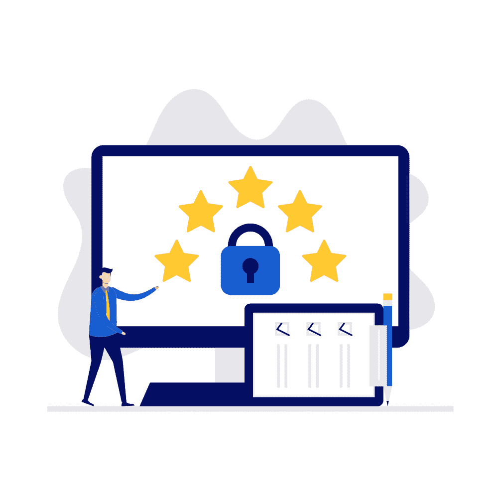

# 互联网的历史:第 24 部分——GDPR

> 原文：<https://simpleprogrammer.com/history-part-24-gdpr/>

在互联网历史系列的前一集，我们报道了前中情局和国家安全局雇员爱德华·斯诺登的故事，他泄露了大量关于美国国家安全局及其英国同行 GCHQ 进行的大规模监控的高度机密信息。

在这一集里，我们将看到这是如何影响新的数据保护立法的，并研究这对企业和消费者权利的一些影响。

## 斯诺登爆料后的反响

The first stories based on secret documents provided by Snowden were published in June 2013\. Two journalists, Laura Poitras and Glenn Greenwald retained the full set of documents and continued to work with major news organizations to reveal further scandals.

到了七月，这些间谍活动的揭露开始使美国和它的一些欧洲和亚洲盟友之间的外交关系变得紧张。法国总统告诉媒体，“我们不能接受伙伴和盟友之间的这种行为，”欧洲议会外交事务委员会主席埃尔马·布罗克(Elmar Brok)声称，美国已经“失去了所有平衡——相比之下，乔治·奥威尔(George Orwell)算不了什么。”

2013 年 10 月 21 日,《世界报》披露，美国国家安全局(NSA)一直在大规模监视法国公民(T1 ),在其业务高峰期，每天有近 700 万次拦截。法国外交部长洛朗·法比尤斯做出回应，召见美国驻法国外交部大使。

在法比尤斯与美国国务卿约翰·克里会晤之前，法比尤斯告诉媒体，“我们在 6 月份就已经得到了警告，我们做出了强烈反应，但显然我们需要采取进一步行动。伴侣之间侵犯隐私的这种做法是完全不可接受的，我们必须尽快确保这种情况不再发生。”

巴拉克·奥巴马总统很快打电话给弗朗索瓦·奥朗德总统讨论此事，白宫很快发布了一份声明，指出“总统和奥朗德总统讨论了媒体最近披露的内容——其中一些内容扭曲了我们的活动，一些内容向我们的朋友和盟友提出了这些能力是如何被利用的合法问题。”

## 呼吁全欧洲范围的隐私协议

在欧盟，自 2012 年初以来，官员们一直在讨论新数据保护法的早期草案。许多游说者正在努力证明，这项立法将成为硅谷公司不必要的负担，这种负担将干扰他们的商业模式。

到 2013 年 10 月，这些持续的披露对德国总理安格拉·默克尔的思想产生了影响。斯诺登曾声称，德国是欧洲最受监视的国家——美国情报机构认为德国对中国同样重要。

安格拉·默克尔受到德国反对党的压力，要求其反对对德国公民进行间谍活动，infratest dimap 的一项民意调查发现，78%的德国人认为默克尔应该对奥巴马政府施加更多压力。

德国已经有了一些欧洲最强的数据保护规则，但默克尔现在主张制定新的全欧洲规则:“这必须是这样一个数据隐私协议的一部分，因为我们对德国有很好的监管，但如果脸书在爱尔兰注册，那么它就属于爱尔兰管辖范围，”她说。"因此，我们需要一个共同的欧洲协议."

许多不同的公民和人权组织，包括电子自由前沿(EFF)、欧洲自由软件基金会(FSFE)和电子隐私信息中心(EPIC)都成为了成立于 2003 年的欧洲数字权利协会的成员。

2013 年 6 月，在第一批斯诺登泄密事件公布后不久，欧洲数字权利组织[认为](https://edri.org/prism/)云计算产业将会大规模增长，对于“能够证明自己在处理个人和商业数据方面值得信赖的国家和地区”来说，将会有巨大的金融机会

它批评欧盟成员国在数据保护方面的立场软弱，指责它们“竭力确保欧盟不会保持对美国的战略优势。”

欧洲数字权利呼吁“全面改革，以确保公民的个人数据和隐私得到保护。"

## GDPR 的诞生

在该方案推出三年零十个月后,《一般数据保护条例》( GDPR)已经完成。它于 2016 年 4 月 14 日正式通过，并于 2018 年 5 月 25 日开始实施。

GDPR 法案生效后不久，隐私游说团体负责人 Max Schrems 在爱尔兰对谷歌和脸书提起诉讼，控告他们强迫用户接受他们的数据收集政策。

GDPR 给予欧盟公民一系列数字权利。“被遗忘权”允许公民要求删除自己的个人数据。公民也有权获得影响他们的数据泄露的通知。

欧盟立法还影响了 2018 年 6 月 28 日通过的[加州消费者隐私法](https://en.wikipedia.org/wiki/California_Consumer_Privacy_Act) (CCPA)，并成为智利、日本、巴西、韩国、阿根廷和肯尼亚国家法律的范本。

在 2019 年的[网络峰会](https://websummit.com/)上，爱德华·斯诺登发表了题为“[科技监控时代的道德”](https://www.youtube.com/watch?v=X4_7A-SGLo8)的演讲，被问及他对 GDPR 监控的看法。他回答道:

“This is a good bit of legislation in terms of the effort that they’re trying to do. Is GDPR the correct solution? I think no, and I think the mistake that it makes is actually in the name: General Data Protection Regulation, misplaces the problem.

问题不在于数据保护，而在于数据收集。规范数据保护首先假设数据收集是适当的，它是恰当的，它不代表威胁或危险，任何时候监视每个人都是可以的，无论他们是你的客户还是你的公民，只要它从不泄露。"

斯诺登继续将 GDPR 描述为“一个良好的开端”和“有意义的事情”

有关 GDPR 的更多信息，请参见 Nathan Sykes 的文章[为什么程序员需要了解通用数据保护条例(GDPR)](https://simpleprogrammer.com/general-data-protection-regulation-gdpr/) 。