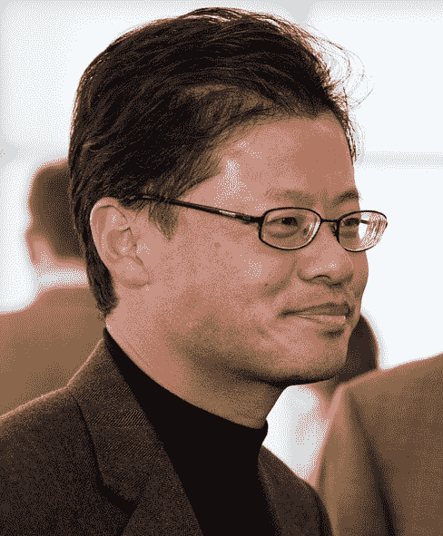
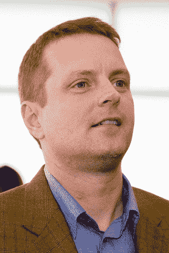
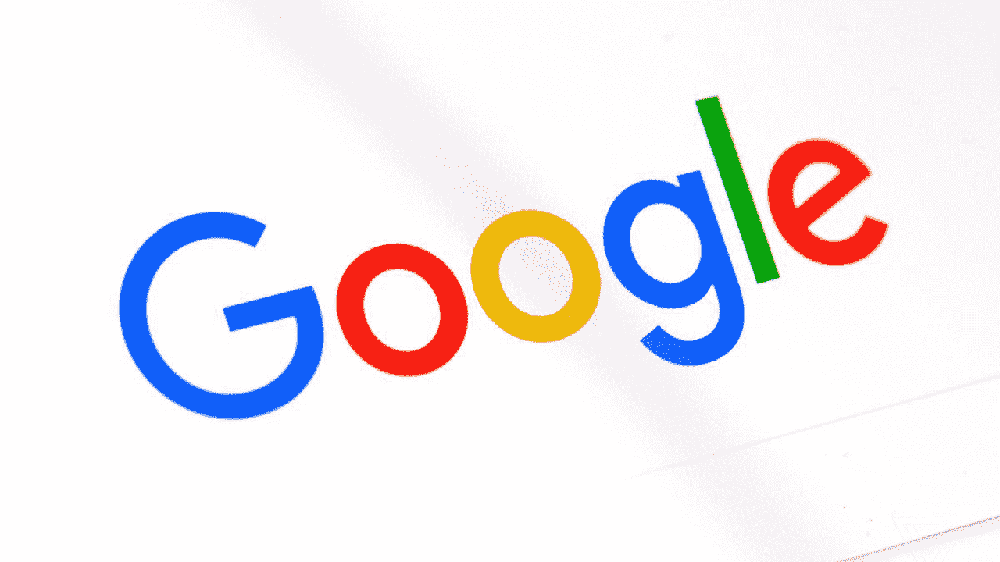

# 互联网的历史:第七部分-搜索引擎

> 原文:[https://simple programmer . com/history-part-seven-search-engines/](https://simpleprogrammer.com/history-part-seven-search-engines/)

欢迎来到我们穿越时空之旅的第七部分，了解互联网是如何发展的，以及它对我们生活的影响。在前两篇文章中，我们关注了微软和网景公司争夺浏览器市场主导权的激烈竞争。然而在同一时期，另一场战斗正在搜索引擎市场展开。

让我们先来看看一些最早的搜索引擎:

## 阿奇和维罗妮卡

第一个互联网搜索引擎是阿奇于 1990 年在蒙特利尔的麦吉尔大学创建的。Archie 这个名字来源于 archive 这个词，因为它的工作是索引基于文件传输协议(FTP)的档案。

两年后，史蒂文·福斯特和弗雷德·巴里在内华达大学创造了阿奇的精神继承者。她被命名为维罗妮卡是为了向最初的搜索引擎和阿奇漫画致敬。Veronica 没有使用 FTP，而是基于当时流行的 [TCP/IP](https://simpleprogrammer.com/2016/08/10/the-history-of-the-internet/) 协议，Gopher。

90 年代初，Gopher 与蒂姆·伯纳斯·李的 HTTP 和广域信息服务(WAIS)协议竞争，直到 HTTP 成为最受欢迎的选择。

与 Archie 相比，Veronica 的主要优势在于它返回了实际查询文档的链接。阿奇只是归还了文件所属的机器。

## 网络爬虫

最早的[搜索引擎](http://www.amazon.com/exec/obidos/ASIN/0684832674/makithecompsi-20)(至今仍在广泛使用)是[网络爬虫](http://www.webcrawler.com/)，由 Brian Pinkerton 创建。平克顿是华盛顿大学的分子生物技术和计算机科学研究员，也是史蒂夫·乔布斯的公司 [NeXT](https://en.wikipedia.org/wiki/NeXT) 的雇员。

早期 WebCrawler 引擎的主要创新是使用网站超链接的数量来确定网站在搜索结果中的排名。

平克顿发现 1994 年链接最多的网站是欧洲核子研究中心的第一个也是最早的网站。毫无疑问，这是由于欧洲核子研究中心的高度成功的万维网项目。

网络爬虫的流行也是因为它的易用性。凭借简单的 HTML 界面，它是第一个非常适合大众市场的引擎。

网络爬虫于 4 月上线，7 个月后，有人对“核武器设计和研究”的查询是第 100 万次记录请求。

1995 年 6 月，平克顿以 100 万美元的价格将 WebCrawler 卖给了 AOL。

## 莱科思(网路资讯收集网站)

1994 年，卡内基梅隆大学的迈克尔·莫丁博士获得了美国国防高级研究计划局(DARPA)的一笔拨款。

他着迷于网络的隐喻，以狼蛛科的拉丁名命名了他的研究项目，因为他打算复制它们寻找猎物的能力，而不是等待猎物被网住。

Mauldin 的灵感来自网络爬虫，但包括开创性的算法，如分析超链接锚文本，以更好地理解页面的意义。

Lycos 首创了使用超链接作为确定主机网页与用户搜索查询相关性的基础的想法。

## 阿尔塔维斯塔

AltaVista 搜索引擎由 Paul Flaherty、Louis Monier 和 Michael Burrows 在数字设备公司创建。

一些细节仍然是传说，其中最著名的是，该搜索引擎是为了展示 DEC 的 [Alpha 处理器](https://en.wikipedia.org/wiki/DEC_Alpha)的巨大能力而创建的。路易斯·莫尼耶反驳了这个故事，称之为“事后合理化”。

DEC 的网络系统实验室经理 Brian Reid 说，事实仍然存在争议，并引用了对最初想法的信用背后中伤。

然而，有一点很难否认，AltaVista 是一项伟大的技术成就:其他早期的搜索引擎只能识别网络上的一小部分最新内容，而 AltaVista 使用了一千个并行工作的网络蜘蛛来返回非常接近万维网完整索引的结果。

然而，由于许多有缺陷的商业决策，AltaVista 未能实现其全部商业潜力。我们将在第 8 部分解释错过的一个重要的合作机会。

## Inktomi / HotBot

Eric Brewer 和 Paul Gauthier 于 1995 年在加州大学伯克利分校开发了 Inktomi(发音为“ink-to-me”)网络搜索引擎。

Inktomi 这个名字来源于平原印第安人的一种神话中的蜘蛛，以给人们带来文化而闻名

Inktomi 公司成立于 1996 年 2 月。该公司使用并行处理技术来提供高性能搜索。

该大学计算机科学助理教授埃里克·布鲁尔博士夸口说:“我们的引擎是唯一能够随着互联网的指数增长而扩展的引擎，因此 Inktomi 将始终能够为数百万用户提供整个网络——而不仅仅是我们个人认为合适的信息子集。通过将超级计算引入互联网，我们能够为用户提供最相关、最及时和最完整的信息，而无需牺牲速度和昂贵的硬件。”

Inktomi 与 HotWired Ventures LLC 合作，他们的数据库技术被用于 HotBot 搜索引擎。《连线》杂志于 1996 年 5 月向读者推出了 Hotbot 搜索引擎。Lycos 收购 HotBot 是其 1998 年收购 Wired 的一部分。

## 雅虎！，搜索门户之王

在 90 年代中期，像雅虎这样的网站、 [AltaVista](http://web.archive.org/web/20000929213036/http://www.altavista.com:80//cgi-bin/query) 、 [Excite](http://web.archive.org/web/19961026164353/http://www07.excite.com:80/) 和 [WebCrawler](http://web.archive.org/web/19961226095523/http://www.webcrawler.com:80/) 通常被消费者用作寻找许多有用和有趣网站的起点。这些网站被称为门户网站，这些技术的主要焦点是使人们能够轻松地找到任何东西。

就像谷歌，雅虎！始于斯坦福大学。雅虎！开始是一个想法，成长为一种爱好，然后变成一种全职的激情。这是大卫和杰瑞的故事。

杨致远(Jerry Yang)来自美国加州旧金山的米切尔·艾德尔鲍姆(Mitchell Aidelbaum)，CC BY 2.0

杨致远出生时名叫杨致远，1978 年从台湾移居美国后，他用了美国名字杰里。他的母亲害怕他被台湾军队征召入伍，这一举动给了他许多新的机会。在皮埃蒙特山高中，他是数学方面最有天赋的学生，他总是在数学竞赛中获胜，不到三年，他就从补习英语变成了高级英语。

大卫·费罗来自美国加利福尼亚州旧金山的米切尔·艾德尔鲍姆

1989 年，大卫·费罗和 T2·杨致远在斯坦福相遇，他们成了好朋友。他们都对体育、数学和工程感兴趣。到 1993 年底，他们开始建立一个网站，可以将互联网网站分类。

他们在一个校园拖车里工作，创建了“杰里和大卫的万维网指南”，作为在互联网上跟踪他们个人兴趣的一种方式。这是第一个帮助冲浪者在网上找到方向的互联网目录服务。

几个月后，他们将其更名为雅虎！。

费罗和杨都说雅虎！代表“又一个等级森严、多管闲事的先知”，但他们选择这个名字是因为他们喜欢雅虎“粗鲁、不老练和粗鲁”的定义。

他们最初引导网站用户浏览感兴趣的网页内容的方法是不同的:他们雇佣了一个编辑团队，这些编辑为按字母顺序排列的目录选择网站。

雅虎！很快成为网络上最受欢迎的网站之一，培育了一个由成千上万用户组成的紧密联系的互联网社区。费罗和杨没有钱给网站做广告，但这没关系。口口相传给了他们免费的广告，该网站在 1994 年秋天庆祝了它的第一个百万点击日。

斯坦福大学的官员礼貌地要求他们找到一家愿意并适合托管他们的计算密集型服务的公司。费罗和杨很快与达成了一项明智的协议，在网景公司的高性能计算机上托管他们的软件。

1995 年 3 月，费罗和杨成立了公司，并会见了几十位硅谷风险投资家。由于费罗和杨还没有想出可行的商业模式，大多数投资者没有兴趣承担这样的风险。然而[红杉资本](https://en.wikipedia.org/wiki/Sequoia_Capital)的[迈克尔·莫里茨](https://en.wikipedia.org/wiki/Michael_Moritz)认为潜在的收益足以冒险，并同意资助雅虎！最初投资近 200 万美元。

另一个聪明的斯坦福学生蒂姆·布雷迪也加入了他们，帮助他们制定商业计划，他们很快就有了横幅广告来资助他们的网站。

雅虎的“什么是酷”页面有能力创造甚至破坏互联网网站。1995 年 7 月 16 日，[推出了](https://simpleprogrammer.com/2017/01/20/history-of-the-internet-3/)，这家公司很快引起了杨的注意，他很快给发了电子邮件，说他们想链接到他们的网站上。

贝佐斯认为“这可能就像从消防水管中啜饮一口。”他的新网站能够处理大量增加的流量吗？最终，他认为这是一个不能拒绝的好机会，而且这是一个正确的决定:几天之内，订单激增了 1000%以上！

## 库格尔

然而，另一位斯坦福毕业生蒂姆·库格尔已经经营了一家成功的公司，但他还是被这个令人兴奋的新搜索引擎项目所吸引。他成为雅虎的第一任首席执行官。1995 年 7 月。

他的第一个决定是将 Netscape hardware 托管的软件转移到内部。他这样做的原因是，与费罗和杨不同，他认为网景是一个潜在的竞争对手。

按字母顺序排列的列表永远不可能包罗万象，也无法跟上网络上不断加快的变化步伐。费罗和杨意识到他们需要在网站上增加一个搜索功能，于是他们征求了库格尔的意见。Koogle 认为开发自己的技术太过昂贵，而且太过分散其他商业目标的注意力。所以雅虎！与合作伙伴一起提供搜索工具。

最初是雅虎！搜索由 OpenText 技术支持，但该公司很快就转而与 AltaVista 合作。作为协议的一部分，AltaVista 同意不向搜索市场的任何其他竞争对手提供其技术。

1996 年，雅虎！启动了非常成功的首次公开募股(IPO ),筹集了 3500 万美元，股价在交易的第一天上涨了两倍。市值达到 10 亿美元。

雅虎的许多新部门！涌现出来。雅虎财经提供金融新闻、股票报价和新闻发布。Yahooligans 于 1996 年 3 月推出，旨在让儿童找到安全、合适的互联网内容。

虽然雅虎！显然不仅仅是搜索，1998 年雅虎！连续第三年被选为最佳搜索引擎。

## 斯坦福效应

就像雅虎一样！，两个聪明热情的斯坦福大学学生创建了谷歌。

这些远不是这所大学孵化的唯一的硅谷大公司。一个鲜为人知的事实是 Sun (Microsystems)代表斯坦福大学网络。惠普(Hewlett Packard)和罗技(Logitech)也是与斯坦福有关联的成功案例。

斯坦福大学校长约翰·汉尼斯说:“我们有一个促进企业家精神和冒险研究的环境。你有这样的环境，让人们思考如何解决最前沿的问题。”另一个因素是，该地区到处都是风险资本家，斯坦福的学生和教授都比其他地方的许多学生更容易获得资金。

1996 年 1 月，计算机科学系搬进了以比尔·盖茨命名的新大楼。虽然盖茨本人从未去过斯坦福大学，但当他捐赠 600 万美元用于建设成本“投资于行业的未来”时，冠名权得到了同意。

在奉献仪式上，工程学院的院长做了一个大胆的预测:

“这里会发生一些事情，会有某个地方、某个办公室、某个角落，人们会指着那里说，‘是的，那就是他们在 1996 年和 1997 年空白工作的地方。你知道，这是一件大事。"

詹姆斯·吉本斯完全正确。确实发生了一些事情，过去是，现在仍然是一件大事。

请加入我们的第 8 部分，了解谷歌是如何诞生的。