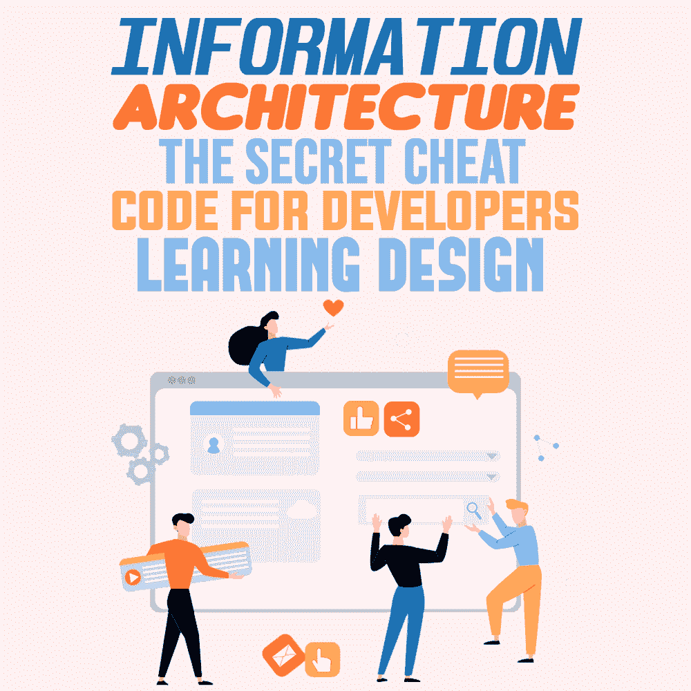

# 信息架构——开发者学习设计的秘密秘籍

> 原文:[https://simple programmer . com/information-architecture-developer-learning-design/](https://simpleprogrammer.com/information-architecture-developers-learning-design/)

For developers facing programming challenges, most problems are solved with the use of logic. If you ever heard a developer say they solved a problem within their code completely intuitively, you’d probably shake your head.

然而，如果一个设计师对你说以上的话，你的反应可能会非常不同。这是因为对于开发人员来说，编程解决方案的主要思维模式是逻辑，而对于设计人员来说，主要的思维工具是直觉。

但是，这里的关键词是 *primary。*

发展的某些方面是直观的。同样，正如我们将在这篇文章中看到的，设计的某些方面也是合乎逻辑的。

当进入一个新的研究领域时，最好的方法通常是采用一种建构主义的方法。这仅仅意味着当你学习的时候，你利用你已经拥有的知识或者思维方式来让自己轻松进入新的主题。

对于从事设计的开发人员来说，理想的策略是从设计领域中最符合逻辑的概念开始:*信息架构。*

## 信息架构，最符合逻辑的设计概念

Google 将信息架构定义为信息结构的标记和组织。本质上，信息结构是已经或能够被创建的一切。在这篇文章的上下文中，我们将使用这个术语来指代网站、移动应用程序等等。

创建一个信息体系结构归结为找出要问的正确问题—解决您所遇到的问题的问题。下一步是以用例的最佳方式组织信息，并解决它。

这是一个相对合乎逻辑的、类似编程的过程，并带有一些直觉。这使得它成为渴望学习设计的逻辑开发人员的完美起点。

利用设计中的逻辑和我们在本文中提出的信息架构第一的策略，可以让你以最快、最有效的方式学习设计。

## 利用设计中的逻辑

信息架构是设计过程中最合乎逻辑的部分。这使得它成为所有想要学习设计的开发人员的一个很好的起点。

在这种情况下，也许产品设计过程中最重要的问题是设计的产品是否真正解决了遇到的问题。

因为信息架构也依赖于[设计规划过程](https://planflow.dev)的最基本的末端，从信息架构的构建，到用户流，再到高分辨率设计的最终实现，正是在这个层次上，产品是否能解决问题的基本问题也得到了回答。

换句话说，因为产品设计中最重要的事情是解决产品要解决的问题，并且只有通过正确、合理地使用信息架构才能实现，所以信息架构是设计过程中最重要的部分。

信息架构的坚实基础让你对设计有了初步的了解，也让你知道如何创建一个*有效*的设计，最终解决问题。

## 创建信息架构

当我开始写这篇文章时，我首先列出了标题，其中包含了我将在整篇文章中涉及的要点，比如你在上面看到的标题。

这个标题充当了最初的“信息架构”脚手架，然后我在其中编写并充实了这篇文章。这是一个低分辨率的想法或信息的排序，将在整个作品中呈现。

从这个最初的基础开始，我逐渐向下写，增加越来越高分辨率的内容或信息，以完成这篇文章。

同样的，如果我正在[创建一个网站](https://simpleprogrammer.com/wordpress-for-programmers/)，我将从一个网站地图开始，并从该网站地图中的页面开始，逐渐创建这些页面的更高分辨率的线框表示。从那里，我可以开发具体的，现实生活中的元素，最终构成网页，然后是网站。

随着你深入上述过程，完成最终设计所需的直觉数量[会增加。](http://www.designbynumbers.io/how-to-develop-designers-intuition/)

但是在良好的信息架构的坚实基础上，简单地说就是准确理解如何构造信息元素以获得可能的最佳用户体验，这是一个可以学习的过程，然后通过分析和实践进行迭代。

随着设计过程的进行，设计过程可能会变得复杂，但是从简单的、低分辨率的、鸟瞰式的网站地图开始，作为初始信息，会使过程变得简单很多。

## 了解信息架构的最佳场所

要开始对信息架构有一个坚实的理解，最好从更多的可视化教程开始。通过这种方式，你也可以了解背后的思维过程。

以下是 YouTube 上一些关于信息架构的最佳视频，它们真正关注了基础知识:

*   [了解信息架构–Brian Miller](https://www.youtube.com/watch?v=Ytv21Jx0hD4)
*   [理解的架构——彼得·诺维尔](https://www.youtube.com/watch?v=rkcIfepMJ94)
*   [建筑中的模式——克里斯托弗·亚历山大](https://www.youtube.com/watch?v=98LdFA-_zfA)
*   [用力量设计:如何在日常工作中应用克里斯托弗·亚历山大——瑞安·辛格](https://www.youtube.com/watch?v=vjWJBy_9DO0)

如果您正在寻找一些详细解释信息架构概念的优秀书籍，请阅读以下内容:

*   [在折叠上方——布莱恩·米勒](http://www.amazon.com/exec/obidos/ASIN/B01GP0D07I/makithecompsi-20)
*   [日常用品的设计——唐·诺曼](http://www.amazon.com/exec/obidos/ASIN/B00E257T6C/makithecompsi-20)
*   [情感设计——唐·诺曼](http://www.amazon.com/exec/obidos/ASIN/B005GKIYD4/makithecompsi-20)

## 将逻辑和直觉结合在一起是最好的设计

Once you’ve started to grasp information architecture at a decent level, you can move forward to designing and iterating interfaces that use your information architectures. From there, you can get into the design fundamentals that will guide you toward developing a good design intuition.

记住，在互联网上总有更多的资源可以作为你下一步行动的指南。

当学习新的东西时，最好的方法是利用你已经熟悉的知识模式来简化你的理解过程并逐渐获得对该主题的欣赏。

对于开发者来说，最好的模式是逻辑。因此，对于一个寻求理解设计的开发者来说——这需要逻辑和直觉——从光谱的逻辑端开始，从这个基础开始逐步深入，直到更直观的元素开始出现。

我希望这篇文章是对信息架构概念的一个很好的介绍，并将帮助你开始发展你自己的设计直觉的旅程。