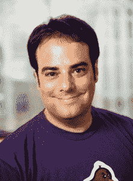
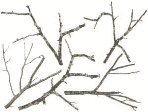
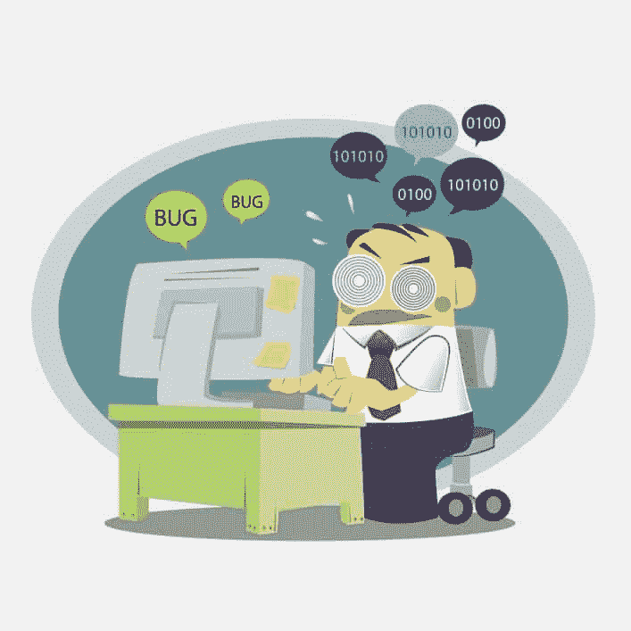
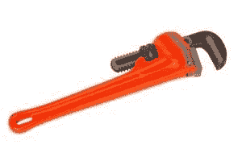

# 程序员乔尔测试(简单程序员测试)

> 原文：<https://simpleprogrammer.com/joel-test-programmers-simple-programmer-test/>

不久前——确切地说是 2000 年——Joel Spolsky 写了一篇博客文章，题为:“[Joel 测试:更好编码的 12 个步骤](http://www.joelonsoftware.com/articles/fog0000000043.html)”

许多软件工程师和开发人员使用这种测试来评估一家公司，以确定这家公司是否是一家好公司。

事实上，许多软件开发组织使用 Joel 测试作为一种自测来决定他们需要做什么。

如果你不熟悉的话，下面是 Joel 测试的样子:

**乔尔测验**

1.  你使用源代码管理吗？

    

2.  你能一步到位吗？
3.  你每天都进行构建吗？
4.  你有 bug 数据库吗？
5.  在编写新代码之前，你会修复 bug 吗？
6.  你有最新的时间表吗？
7.  你有说明书吗？
8.  *程序员有安静的工作环境吗？*
9.  你是否使用了金钱所能买到的最好的工具？
10.  你有测试员吗？
11.  新应聘者在面试时会写代码吗？
12.  你做走廊可用性测试吗？

根据乔尔的说法，这是它的应用方式:

乔尔测试的巧妙之处在于，每个问题都很容易得到一个简单的是或否的答案。您不必计算每天的代码行数或每个拐点的平均错误数。每个“是”答案给你的团队 1 分。乔尔测试的令人不快之处在于，你真的不应该用它来确保你的核电站软件是安全的。

12 分是完美的，11 分是可以忍受的，但是 10 分或更低，你就有严重的问题了。事实是，大多数软件组织的运行分数为 2 或 3，他们需要认真的帮助，因为像微软这样的公司全职运行 12。"

## 但是针对程序员的“乔尔测试”怎么样呢？

Joel 测试对于软件开发商店和对快速评估公司软件开发环境感兴趣的程序员来说很棒，但是对于真正的程序员来说 Joel 测试怎么样呢？

最近有几个人问我是否有一个 Joel 测试的想法来评估一个真正的程序员，而不是一个软件开发组织，所以我决定整理一个列表，我认为它可能是 Joel 测试的一个很好的等价物，用于评估一个真正的软件开发人员的技能。

这是我想到的。

我将把它们列出来，然后深入挖掘每一个，就像 Joel 在他最初的帖子中所做的那样。

**简单的程序员测试**

1.  你能有效地使用源代码管理吗？[T2T4](https://simpleprogrammer.com/wp-content/uploads/2014/03/IMG_0037-withoutlogo-Mobile.jpg)T6】
2.  你能解决算法类型的问题吗？
3.  你能用一种以上的语言或技术编程吗？
4.  你每天都做一些事情来增加你的教育或技能吗？
5.  你会恰当地给事物命名吗？
6.  你能有效地表达你的想法吗？
7.  你了解基本的设计模式吗？
8.  你知道如何有效地调试吗？
9.  你测试过你自己的代码吗？
10.  你分享你的知识吗？
11.  你在工作中使用了最好的工具吗？
12.  你能构建一个实际的应用程序吗？

显然，这是一个简单的测试，**并没有包含成为一名优秀软件开发人员**的所有要素，但是你可以用这个测试来自我评分——或者在面试候选人以了解其总体能力时。

对于自我评分，当然重要的是**根据这 12 条标准诚实地评估自己**，如果你可以自信地说你符合该点的标准，只给自己打一分。

如果你真的得到了低于 8 分的分数，不要灰心。**这只意味着你有很多事情要做。**

我会说任何一个 8+分的人都应该很容易找到一份软件开发的好工作。

## 1.你能有效地使用源代码管理吗？

(我讨厌有效地使用这个词，但我选择在整个列表中使用它，只是因为能够做某事是一回事，而能够有效地做又是另一回事。因此，虽然“有效地”是主观的，但我会在这里的每个描述中尽可能客观地定义它。)

是的，几乎任何开发人员都可以从源代码控制中签入和签出文件，但是有效地使用源代码控制不仅仅意味着理解从存储库中取出源代码并进行提交的基础知识。

不同的源代码控制技术有不同的使用方法，但是不管你使用什么样的源代码控制技术，你应该知道如何使用它来做更多的事情，而不仅仅是签出和签入代码。

为了有效地使用源代码控制，**你应该理解像[分支和合并](https://simpleprogrammer.com/2010/06/04/simple-branching-strategy-part-1-back-to-basics/)这样的概念。**

你应该知道如何使用你的源代码控制系统来回顾和比较代码的修改。

你应该知道**如何在合并**时解决冲突，并了解**如何利用分支或工作空间在适当的时候单独工作或与队友一起工作**。

由于源代码控制对每个软件开发人员来说都非常重要，**你应该是使用任何源代码控制技术的专家，并且理解适用于所有源代码控制系统的基本概念。**

## 2.你能解决算法类型的问题吗？

我很惊讶有这么多程序员不能解决相当简单的算法问题——特别是因为这类问题几乎总是在任何主要的编码面试中被问到。

作为一名软件开发人员，**你应该能够解决一个基本的算法问题**，比如:

写一个函数来判断两个单词是否是彼此的变位词。

你应该能够在白板上解决比这困难得多的问题。

这是程序员的谋生之道。尽管大多数现实世界的问题与你在求职面试中经常被问到的算法问题类型不同，但现实世界中确实存在相同类型的问题。事实上，真正识别它们的唯一方法是拥有一些解决这类问题的经验。

我已经写了很多次关于解决这类问题的文章，并提供了许多不同主题的资源，所以我不打算在这里重复，但是如果你有兴趣提高这方面的技能，可以看看这些帖子:

*   [解决问题，分解问题](https://simpleprogrammer.com/2011/01/08/solving-problems-breaking-it-down/)
*   [破解编码面试:你需要知道的 12 件事](https://simpleprogrammer.com/2015/01/19/cracking-the-coding-interview/)

## 3.你能用一种以上的语言或技术编程吗？

你在这个行业工作得越多，你就越会意识到[对技术的虔诚是多么的毫无意义](https://simpleprogrammer.com/2013/07/08/how-religion-destroys-programmers/)以及精通多种编程语言或技术堆栈是多么的有益。

最好的程序员能够使用最好的工具来完成工作。他们意识到不同的问题最好用不同的技术来解决。他们不会尝试并仅仅使用他们所知道的东西，他们也不会仅仅因为这是他们所知道的，就和某个特定的技术或编程语言结婚。

一个真正优秀的程序员会通过学习一种以上的编程语言来获得广泛的经验和知识，并会花一些时间在多种技术栈中进行自我教育。

当然，[专业化很重要](https://simpleprogrammer.com/2014/04/28/well-biggest-mistake-make-software-development-career/)，但是精通多个技术领域也很重要，即使你并不在日常生活中使用这些知识。

在我看来，我真正从一个普通的开发人员转变为一个优秀或真正优秀的开发人员的时候，是我走出自己的舒适区，开始进行 Java 开发的时候，尽管我的兴趣和大部分经验都是在 C#和. NET 中。

在过渡到第二种编程语言和一个完全不同的技术堆栈之后，我对我从事的未来项目有了一个更广阔的视角，不再受单一技术领域的狭隘视野的限制。

## 4.你每天都做一些事情来增加你的教育或技能吗？

我问任何我面试的软件开发人员的第一个问题是他们做什么来跟上技术，以及他们如何保持最新。

我发现，有某种自我教育计划的程序员最终会做得最好，他们是我最喜欢与之共事的开发人员，总体来说也是最有效率的。

在当今这个新技术和进步几乎每天都在涌现的环境中，如果你没有某种习惯来跟上，就不可能与时俱进。

你应该每天都做一些事情——即使是很小的事情——来提升你的技能或者学习新的东西。

只要每天花 15 分钟阅读编程博客(就像这篇)，阅读技术书籍或做其他事情来提高你的技能，在几年的时间里就会产生巨大的变化。

## 5.你能恰当地给事物命名吗？

你工作中最困难也是最重要的一部分就是给事物命名。

一个好的软件开发人员会写出清晰易懂的代码。

除非你擅长命名变量、方法、类以及你创建的任何需要名字的东西，否则你不可能写出清晰易懂的代码。

如果我看着你的代码，看到你是如何选择命名事物的，它告诉了我很多关于你是如何思考的，以及你有多理解编写代码的重要性，这些代码不仅要做它应该做的事情，而且要易于理解和维护。

一本教你如何正确命名事物的好书是“[代码完成](http://www.amazon.com/gp/product/0735619670/ref=as_li_tl?ie=UTF8&camp=1789&creative=390957&creativeASIN=0735619670&linkCode=as2&tag=makithecompsi-20&linkId=U75OYO5CZIIY5YXA)”

另一个好的是“[干净代码](http://www.amazon.com/gp/product/0132350882/ref=as_li_tl?ie=UTF8&camp=1789&creative=390957&creativeASIN=0132350882&linkCode=as2&tag=makithecompsi-20&linkId=BAHHOEAT3BF6UI5X)”

## 6.你能有效地表达你的想法吗？

你可以成为世界上最好的软件工程师，但如果你不能有效地沟通你的想法，你对一个团队来说就不会很有用。

沟通是一项关键技能，它几乎影响到我们在软件开发世界中所做的一切。

从写电子邮件，到在白板上解释架构思想，到与客户和利益相关者交流，软件开发涉及到大量的交流。

发展你的沟通技巧的一个好方法是定期写作。一旦我开始定期在这个博客上写东西，我自己的沟通技巧就突飞猛进。我知道许多其他软件开发人员也有类似的结果。

查看我关于如何创建博客的免费电子邮件课程，并从这里开始写博客。

## 7.你了解基本的设计模式吗？

要成为一名优秀的软件开发人员，您不一定要经常使用设计模式，但是您至少应该了解您所使用的技术和编程语言中最常用的设计模式。

面向对象编程语言中最常用的设计模式将与函数式语言中使用的设计模式有所不同——或者说，它们中的许多将在语言本身的使用中表现出来——但是，您至少应该知道大多数最常用的设计模式。

如果你还没有读过四人帮的书《[设计模式](http://www.amazon.com/gp/product/0201633612/ref=as_li_tl?ie=UTF8&camp=1789&creative=390957&creativeASIN=0201633612&linkCode=as2&tag=makithecompsi-20&linkId=VHKRKDNK56PEMCQ6)》，那就去读吧。

如果你想要一个更容易理解的版本，试试“[头先设计模式](http://www.amazon.com/gp/product/0596007124/ref=as_li_tl?ie=UTF8&camp=1789&creative=390957&creativeASIN=0596007124&linkCode=as2&tag=makithecompsi-20&linkId=E4GWT7QA5NJSI2UA)”

## 8.你知道如何有效地调试吗？

这是一个棘手的问题。许多软件开发人员认为他们知道如何调试，但是他们真正知道的是如何使用调试器。

不要误解我的意思，你需要知道如何使用调试器，但是调试不仅仅是一行行的代码，寻找可能出错的地方。

一个好的程序员知道调试包括从错误的假设开始，然后只使用调试器来证明或否定这个假设。

有可能[浪费几个小时去调试一个问题](https://simpleprogrammer.com/2011/06/17/the-debugger-mindset/)，如果采用正确的方法，这个问题本可以在不到一半的时间内被调试好。

由于大多数软件开发人员花在调试代码上的时间比写新代码的时间多，所以一个能有效调试的开发人员是非常有价值的。

## 9.你测试你自己的代码吗？

质量和测试不是测试和 QA 部门的责任。质量是每个人的责任，尤其是开发人员。

一个好的程序员会对自己代码的质量负责，并确保在将代码交给 QA 或其他人之前对其进行测试。

别人应该总是测试你的代码，但是在你把它交给别人测试之前，你应该尽你所能地测试它。

我坚信成为一名优秀的软件开发人员的一部分就是成为一名优秀的测试人员。

我最喜欢的一本关于测试的书是"[测试计算机软件](http://www.amazon.com/gp/product/0471358460/ref=as_li_tl?ie=UTF8&camp=1789&creative=390957&creativeASIN=0471358460&linkCode=as2&tag=makithecompsi-20&linkId=FKHMSNGDX23L3V4V)，虽然有点过时，但仍然是一本好书

## 10.你分享你的知识吗？

一个优秀开发人员的标志之一是他们公开和自由地分享他们的知识。

这不仅有助于团队和他们周围的其他开发人员，而且我坚信[你永远不会真正学到东西，直到你教它](https://simpleprogrammer.com/2014/05/26/never-really-learn-something-teach/)。

最好的程序员总是与他人分享他们的知识。他们不怕工作不稳定，也不怕泄露自己的秘密。

任何团队中最有价值的人都是让团队中的其他人变得更有价值的人，而不是知道得最多的人。

知道很多，却不分享，除了对自己没有任何好处。

## 11.你在工作中使用最好的工具了吗？

一个真正优秀的程序员总是有一套工具，他们用这些工具来更有效地工作。

您对工具的偏好并不重要，但是您应该有一些您认为最适合您正在做的工作的工具，并且您应该花一些时间来学习这些工具。

真正关心自己工作的开发人员会花时间去寻找能帮助他们做得更好的工具。

以 Scott Hanselman 为例，他有一个优秀的开发者工具列表。)

您的工具集可能不同，但工具很重要。

他们总是说什么来着？合适的工具适合合适的工作。

你可以用工具箱里不同的扳手和钳子花几个小时来转动管道上的垫圈，或者用活动扳手花几秒钟来完成同样的任务。(相信我，我已经吃过苦头了。)

## 12.你能构建一个实际的应用程序吗？

会写代码还不够。

有很多软件开发人员可以修改现有的代码库并修复错误，但是很少有软件开发人员能够真正从头开始编写一个完整的应用程序。

一个优秀的软件开发人员可能无法独自开发大型企业应用程序或大型软件套件，但他们至少应该能够自己编写某种简单的应用程序。

能够创建一个完整的应用程序——即使是一个很小的应用程序——显示了对软件如何工作和如何构造的基本理解。

在我职业生涯的大部分时间里，我都不知道该怎么做。

我可以修复错误，我可以改变现有应用程序的某些特性，我甚至可以给应用程序添加新的特性，但是我不知道如何从头开始创建自己的应用程序。

只有在我自己创建了一些小的附带项目并实际构建了一个真正的应用程序之后，我才真正理解了一个复杂软件系统的所有部分是如何工作的，以及如何将它们组合在一起。

## 这个列表完整吗？你应该用它打别人的头吗？

两个都不行。

这些只是一些指导方针，你可以用来看看你的立场和你可以做些什么。

(顺便说一下，我在我的书《软技能:软件开发人员的生活手册》中深入讨论了许多这些话题。)

软件开发是一个复杂的领域。永远不会有一个清单可以用来确定你或其他人是否是一个好的开发人员，但我相信一套通用的指南对于了解你或你面试的人的立场是有用的，我相信这个列表可以作为一种快速的方法来识别你可能有的任何弱点，你可能想继续努力。

如果你喜欢这篇文章，并且想要更多关于软件开发人员的职业建议，一定要注册我免费的每周邮件。

另外，我很高兴听到你关于这个测试的消息。

你觉得有用吗？

我是不是漏掉了什么应该写在这里的东西？

我有一个大约 30 个条目的列表，并把它缩小到我认为的前 12 个。