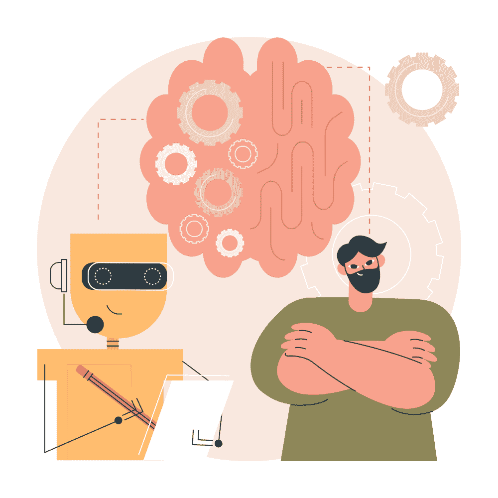

# Web 开发的 7 大机器学习框架

> 原文:[https://simple programmer . com/machine-learning-frameworks-for-web-development/](https://simpleprogrammer.com/machine-learning-frameworks-for-web-development/)

Proving to be a revolutionary technology of our generation, machine learning has its roots in the 1950s. It was in 1959 that Arthur Samuel, a computer scientist working at IBM coined the term machine learning. Interestingly enough, he developed the program to teach computers to play the game of Checkers.

20 世纪 60 年代，艾伦·图灵的研究进一步推进了这一领域。机器学习的一个更实际的应用是在 1967 年用最近邻算法开发的。这是第一个模式识别算法，用于帮助销售人员找到到达目的地的最佳路径。

快进到今天，机器学习是自动驾驶汽车、自然语言处理和动态定价等概念背后的燃料。它正在重塑互联网模式。

在本文中，我们将探索[机器学习如何影响 web 开发](https://simpleprogrammer.com/ai-and-ml-revolutionizing-developers/)。我们将从机器学习在 web 开发中的相关性开始，然后看看不同的框架。机器学习是未来，所以了解更多关于这种迷人技术的知识肯定可以帮助你作为一名开发人员。

## 机器学习在 Web 开发中的相关性

采用能够临时满足客户需求的可扩展解决方案已经成为当前的需要。为了成功地巩固 web 开发中的这一转变，我们必须使用像机器学习这样的智能技术。

为了理解与我们日常生活的相关性，让我们看一个机器学习的实际使用案例。如今，电子商务平台会建议我们买什么，点播娱乐平台会告诉我们看哪部电影，送餐解决方案会给我们最好的膳食选择。

这种级别的个性化是机器学习在未来 web 开发中的巨大作用的证据。

此外，个性化只是许多可能的应用之一。机器学习在其他几个方面也有助于网络开发，比如聊天机器人开发和内容生成。在未来几年，我们将看到机器学习在其大步前进中添加更多的东西。

## Web 开发的七大机器学习框架

为 web 开发选择机器学习框架需要很好的研究。如此多的选择取决于一个网站为什么要整合机器学习，它的优先事项是什么，以及他们将使用的 [web 开发框架](https://www.globalmediainsight.com/blog/web-development-frameworks/)是什么。在这一节中，我将列出机器学习的七大框架，这些框架目前被广泛使用，并将在未来保持相关性。

### TensorFlow

谷歌大脑团队最初开发 TensorFlow 供他们内部使用，但在 2015 年，它向公众发布。它是一个开源软件库，支持 Python、C、C++、Java 和 Go 等编程语言。

TensorFlow 用于为神经网络、自然语言处理、语音/文本识别和预测开发机器学习模型。它是谷歌翻译服务背后的大脑，也被 Twitter、IBM 和其他公司使用。

Tensorflow 具有灵活的架构和强大的库，允许开发复杂的模型。此外，由于它允许开发者用 JavaScript 构建网络应用，它在他们的最爱中获得了一席之地。

使用单个高级 API 有助于使代码更简洁，更易于阅读、编写和调试，从而简化一个或多个 CPU 或 GPU 上的计算。总的来说，它将机器学习技术带到了前端，通过 web 浏览器给用户带来了真实世界的体验。

### 微软认知工具包

由微软研究院开发的认知工具包(CNTK)于 2016 年发布。它是一个开源的深度学习框架，用 C++编写，接口支持 Python。CNTK 主要用于语音识别、预测分析和大型非结构化数据集的分析。它支持并行执行和自动微分等特性。

CNTK 具有可伸缩性和功能性，消除了对庞大代码的需求。它支持各种框架和工具，由于易于培训而广受欢迎。它对卷积神经网络(CNN)和递归神经网络(RNN)的支持也是 CNTK 框架最值得注意的特性之一。

### 阿帕奇看象人

这是一个开源的机器学习框架，由 Apache Software Foundation 开发，用于协助构建复杂的 web 应用程序。 [Apache Mahout](https://www.amazon.com/Learning-Apache-Mahout-Chandramani-Tiwary/dp/1783555211/ref=sr_1_4?keywords=apache+mahout&qid=1638863585&sr=8-4) 主要是为数学家、数据科学家和统计学家设计的，简化并提高了数学算法执行的效率。作为一个分布式线性代数框架，Mahout 被认为具有卓越的性能。

Mahout 是用 Java 和 Scala 编写的，对于跨平台开发很灵活。该工具在基于推荐的引擎开发中有广泛的应用，在这些引擎中，对大量数据进行分类、挖掘和分组是必要的。因此，基于 Mahout 的 web 开发经常用于需要根据购买模式、产品特性和其他类似元素对组进行分类的地方。

### 咖啡 2

2017 年，伯克利视觉与学习中心发布了用 C++和 Python 编写的深度学习框架 Caffe2。作为一个灵活简单的框架，Caffe2 只需要开发人员具备 C++的基础知识就可以开始编码。

Caffe2 的可扩展代码增强了 app 性能，对高级模型的支持保证了 app 代码不复杂。它具有 Python 和 Matlab 绑定以及支持 web 开发的预定义网络。此外，使用预先训练的模型，可以进行无代码开发。

该框架通常应用于创建需要实现图像分割和分类的网站。感谢 CNN，保证了开发过程的快速高效。

### Apache Singa

If a secure, fast, and popular framework for building machine learning models is your requirement, Apache Singa makes a top contender. It was developed by Apache Software Foundation and released in 2015\. Initially, it was developed to support an abstraction-based programming model, but its flexible architecture ensures that it can support synchronous, asynchronous, and hybrid approaches.

Singa 是一个非常通用的框架，可以在不同的领域和场景中找到应用。一些医疗保健解决方案使用 Singa 来分析电子病历数据。它也用于图像识别和自然语言处理。目前，Singa-Lite 和 Singa-Easy 的开发正在进行中，这些增强功能将确保机器学习变得更容易和更容易。

### PyTorch

[PyTorch](https://www.amazon.com/dp/B078TLWD3F/wwwerobillarc-20) 是一个机器学习框架，在 2016 年发布后不久就获得了即时的认可。在脸书的 AI 小组下，PyTorch 被开发为基于 Torch(另一种机器学习框架)的 Python 的开源机器学习库。其算法开发符合 Python 控制流；因此，Python 开发人员发现它很容易使用。

PyTorch 主要用于自然语言处理。PyTorch 凭借其高性能、高效的 GPU 利用率和预制的数据训练模型，被认为是机器学习的最佳框架之一。

### 设置

Chainer 由一家日本公司与 IBM、英特尔、微软和英伟达合作开发，是一个基于 Python 的 Numpy 和 CuPy 库构建的开源深度学习框架。它主要用于语音识别、机器翻译和情感分析。

Chainer 使用一种由运行定义的方法，其中网络中的连接不是预先确定的，而是在实际训练过程中动态完成的。其快速的性能和简单的调试使 Chainer 成为开发大型系统的首选框架。

## 机器学习是 Web 开发的未来

机器学习正在蓬勃发展，这是我们当前数字现实中不可否认的事实。这是因为有大量数据可用于训练机器学习模型，也是因为现在机器学习更加经济实惠，硬件、存储要求和其他东西都更加经济实惠。

正如我们在这篇文章中看到的，机器学习带来了巨大的好处。它有助于分析客户活动并了解他们的行为，以确定他们的期望并[改善用户体验。](https://simpleprogrammer.com/machine-learning-customer-experience/)此外，它采用自动化来改进数据挖掘，更有效地检测趋势，并根据观察结果自动做出响应。

由于简化的营销策略以及以事实为中心和以结果为导向的改进，机器学习使网站浏览体验个性化、独特和相关，帮助客户更快更好地实现目标。此外，机器学习创建了强大的安全检查流程，并保护网站免受不断演变的安全威胁。

毫不奇怪，机器学习与网络开发相结合的力量将改变数字世界的未来。 [web 开发服务](https://www.globalmediainsight.com/web-development-services)将在开发过程中嵌入机器学习算法，以满足用户和企业的未来期望。这项突破性的技术为开发者提供了无限的可能性，其影响无疑将是革命性的！