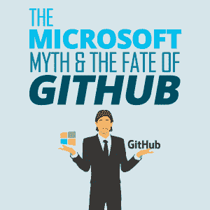

# 微软的神话和 Github 的命运

> 原文：<https://simpleprogrammer.com/microsoft-github/>

Recently, [Microsoft purchased GitHub](http://www.businessinsider.com/microsoft-buys-github-for-2018-6). This caused something of a stir in the developer community (GitHub is the most popular platform for developers and companies to host code repositories and perform version control on software projects).

为什么这是如此大的新闻？要了解这一点，我们必须看看微软的历史。很长一段时间，微软有一个负面的名声，可以说是一个封闭的商店，对开发者不友好。微软对开源软件(OSS)开发(尤其是 Linux 开发社区)的消极态度在 1998 年广为流传的一份内部备忘录中被披露。

显然，微软感到他们的市场主导地位受到了 Linux 和开源社区的威胁。这种态度，加上微软近乎垄断的地位，以及与美国司法部的相关争论，清楚地表明开放源码软件永远不会在微软受到欢迎。

这就是为什么它对 GitHub 的收购可能是一个不受欢迎的惊喜。

直到今天，仍有软件开发社区的成员非常不喜欢微软。但这种情绪是 20 年前的。一些人对微软的负面评价仍然是理所应当的吗？

让我们来看看微软最近和开发人员一起做了些什么。

2015 年，微软推出了 Visual Studio Code，这是他们完整 Visual Studio 产品的免费版本。这是一个集成开发环境(IDE)。虽然 Visual Studio 代码精简了，但它的功能可以通过许多可用的扩展来增强。这些扩展中的许多都是由社区成员开发的，就像 OSS 不断改进的方式一样。

根据 [2018 Stack Overflow 开发者调查](https://insights.stackoverflow.com/survey/2018/#development-environments-and-tools)，Visual Studio 代码现在是最受欢迎的 IDE。

微软最近对一些重要的开源项目做出了贡献，比如 Node.js。该公司还收购了 Xamarin，这是一个在 iOS 和 Android 上开发移动应用的平台；微软随后开源了 Xamarin SDK(软件开发工具包)。[你可以看看约翰·桑梅兹关于 Xamarin 的帖子。表单在这里](https://simpleprogrammer.com/xamarin-forms-mobile/)，你可以在这里阅读 Jason Lowenthal 关于为什么要为开源项目[做贡献的帖子。](https://simpleprogrammer.com/why-contribute-to-open-source/)

## 为什么？

那么*为什么是*？为什么微软开始摆脱其作为一个铁板一块、专有和据称垄断的公司的声誉？为什么要转向热爱开源、社区驱动和共享呢？为什么要购买 GitHub？

一个关键原因是微软的新领导层。

2014 年，塞特亚·纳德拉接替史蒂夫·鲍尔默担任公司首席执行官。在成为微软首席执行官之前，纳德拉是开发微软云基础设施和服务的关键人物。纳德拉在云计算领域工作的时间对他影响很大。鉴于大多数 Apache 服务器都运行 Linux，纳德拉应该会敦促微软接受开源和 Linux。

纳德拉的影响导致微软不再主要是一家操作系统/软件公司。相反，它现在主要是一家云公司。2015 年第四季度，微软大约 20%的收入来自其云服务 Azure。虽然微软确实有来自其他来源的收入，云服务是微软收入的最大来源。

2017 年第三季度，微软报告称，Azure 收入增长了 93%:据报道，Azure 收入在该时间点为[152 亿美元](https://venturebeat.com/2017/04/27/microsoft-reports-23-6-billion-in-q3-2017-revenue-azure-up-93-surface-down-26-and-windows-up-5/)。

如果微软想在未来继续赚这么多钱，很难忽略它需要把精力放在哪里。

## GitHub 战略

现在看起来很明显，微软对开发者和开源产品的想法比前几年更友好了。看起来他们更像是一家云公司。尽管如此，收购 GitHub 背后的策略是什么？微软不是非营利组织，希望帮助开源社区。GitHub 的年收入为 1.1 亿美元，虽然这对一家小公司来说不是一个小数目，但与微软的年收入相比，这只是九牛一毛。

One possibility is that GitHub will be used as an onboarding platform for Azure. Microsoft will likely nurture GitHub and attempt to encourage enterprise clients to sign up for it, and then coax them onto Azure. One powerful possibility is that Microsoft will potentially integrate Github into Windows directly. Windows 10, with its free update from Windows 8, can essentially be seen as an advertising platform for Azure.

微软不是仅仅对开源和 Linux 做出反应，而是为倾向于开源的开发者开发了一个培养策略。这基本上是一场发展和影响的稳定的点滴运动。提升商誉和提供价值可能是一种非常引人注目的营销策略——这种行为比惩罚性措施和好斗更受欢迎。

这是微软的新时代。

## 未来

对微软来说，这是一个有趣且回报丰厚的时代，该公司正寻求对未来进行投资。除了利用他们的云基础设施来支持面向商业消费者的 Office 365 等 SaaS 平台，微软还着眼于未来的趋势。使用混合云(数据中心和内部硬件的混合)、人工智能和物联网的产品都可能在其视线范围内。

微软的计划似乎是让自己成为主要开发者和企业不可或缺的服务提供商。GitHub 的收购巩固了微软的新时代，预示着它将拥抱曾经拒绝的事物。