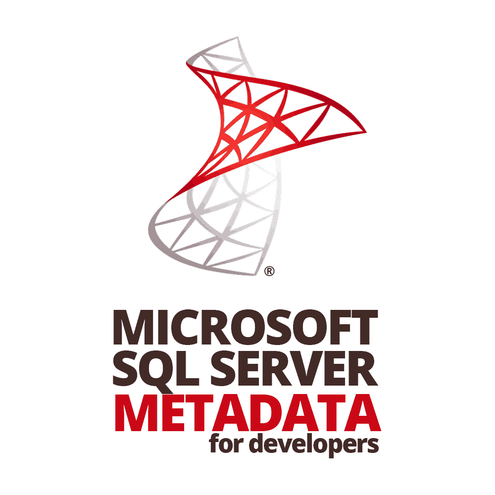

# 面向开发人员的 Microsoft SQL Server 元数据

> 原文:[https://simple programmer . com/Microsoft-SQL-server-metadata-developers/](https://simpleprogrammer.com/microsoft-sql-server-metadata-developers/)

Microsoft SQL Server 2016 has recently taken the lead in relational database management systems (RDBMSs). [The combination of high performance, security, analytics, and cloud compatibility make it the leading RDBMS](https://www.insight.com/en_US/learn/content/2017/03092017-sql-server-vs-other-rdbmss-how-it-ranks.html). SQL Server 2017 even supports the programming languages R and Python, which further increases its appeal among data scientists and data professionals in academic institutions.

对于一名 SQL Server 开发人员来说，这是一个激动人心的时刻，原因超出了本文的范围，但是简单地总结一下:SQL Server 不仅已经成为头号 RDBMS——它还变得比 RDBMS 更加*。*

*考虑到这些令人印象深刻的 SQL Server 新版本，您可能会发现自己想知道如何从您认为对您的整体工作效率最有影响的功能中获取最大价值，尤其是在您缺乏经验的情况下。另一方面，如果你没有参加每一个网上研讨会，浏览每一篇文章的新特性，那么不要太担心；许多公司仍在使用 SQL Server 2008 R2，尤其是那些在金融和医疗保健等受到严格监管的行业。*

*我提醒任何人，在没有精通(如果不是掌握)基本技能之前，不要专注于 SQL Server 的任何新特性和功能。*

*本文解释了元数据为什么有价值，什么是元数据，然后通过引用元数据的 Transact-SQL (T-SQL)代码解决了两个实际问题。从查询目录视图到动态使用元数据，您应该掌握一些知识，通过减少熟悉数据和独立解决问题所需的时间和精力，使您的 SQL Server 开发技能变得更有价值。*

*无论您所在的行业、公司，甚至是您正在使用的 SQL Server 的当前版本，您可以学习的这三项常见技能都是高度可移植的，即使是在软件版本发生相对较大的变化时(例如，从 SQL Server 2008 R2 版到 2014 版)。*

## *开发人员的三项基本 SQL Server 技能*

*SQL 是你需要掌握的第一个也是最明显的技能。学习这种脚本语言的主要原因之一(除了它有趣的事实之外)是它的可移植性——甚至跨其他 RDBMSs。当然，我说的是美国国家标准协会(ANSI)标准 SQL (SQL)语法，不一定是 T-SQL，这是微软对 SQL 的方言。就我个人而言，我还发现学习 SQL/T-SQL 语法的新元素比适应图形用户界面的新特性更容易。出于本文的目的，我将重点讨论 T-SQL，假设阅读本文的任何人都是 SQL Server 开发人员的变体。*

***PowerShell** 是第二个技能。PowerShell 是另一种脚本语言，它允许用户自动执行各种有用的任务，这些任务通常涉及运行 SQL Server Reporting Services 报表、计划作业以及基本上执行大量数据库管理员(DBA)工作。然而，使 PowerShell 更有吸引力的是，它取代了使用的 Windows DOS 批处理语言(即，您在命令提示符中使用的批处理语言)。NET 对象和方法。其价值的另一个原因是，与 T-SQL 不同，PowerShell 可以自动执行跨 Windows 和 SQL Server 环境的任务。*

*除了这两种丰富的脚本语言之外，还有第三种技能会让精通它的 SQL Server 用户受益匪浅，那就是使用**元数据**。从技术上来说，理解 SQL Server 元数据(出于本文的目的，除非明确指定，否则所有“元数据”的引用都意味着“SQL Server”)是一个需要学习的主题，也是一个练习和应用技能(例如，记忆关系和学习 T-SQL)的机会，而不是真正的技能本身。因此，每当我提到“元数据的使用”时，我的意思是“开发人员在 T-SQL 中应用元数据知识的能力有多强。”*

*然而，我认为元数据也是*开发者*社区中最被忽视和低估的话题之一(而学习 T-SQL 显然不是)。许多介绍 SQL Server 或 T-SQL 的书籍甚至直到后面的章节才讨论它，即使有，也很少涉及细节。*

*熟悉 [SQL Server](https://simpleprogrammer.com/guide-nosql-software-developers/) 元数据是一项比大多数教师认为的更有价值的技能，尤其是对初学者来说，因为它是应用 SQL 语言、数据库设计以及物理和逻辑处理的理论概念知识的实用方法。*

*即使对于更有经验的开发人员和数据库管理员来说，SQL Server 元数据也是非常有价值的，因为它的效用与您在数据库设计和编程的其他领域的创造力和能力成正比。在整篇文章中，我将提供复杂性增加的 T-SQL 脚本的例子，并演示在试图解决问题时，熟悉元数据是如何证明是非常宝贵的。*

*然而，在我深入例子之前，我应该提出几个重要的一般观点。微软的网站，通常被称为“在线书籍”(BOL)，是我在这个话题上可以推荐的最棒的资源。事实上，您应该查看[本页](https://technet.microsoft.com/en-us/library/ms180119(v=sql.90).aspx)以熟悉各种类型的元数据，并查看[本页](https://technet.microsoft.com/en-us/library/ms189082(v=sql.105).aspx)以了解您应该如何访问元数据(即，使用目录视图)。*

## *基本元数据查询*

*查询[对象目录视图](https://docs.microsoft.com/en-us/sql/relational-databases/system-catalog-views/object-catalog-views-transact-sql)的简单性和灵活性使得即使是 SQL 知识很少的用户也能很好地探索数据库中的对象和关系。请允许我用一个简单的例子来说明为什么元数据对开发人员有用。*

*对于那些有兴趣跟随的人，请注意，我使用的是 SQL Server 2016 Express Edition 和 AdventureWorks2014 示例数据库(两者都是完全免费的)。*

*假设你是虚构公司 Adventure Works Cycles 的新员工。在查看了几个表之后，您会注意到一个名为“BusinessEntityId”的列出现了很多次。让查询显示数据库中具有该名称的每一列不是很好吗？了解 SQL Server 元数据的基础知识会使这一点变得容易。*

*因为你知道[sys]。[所有对象]，[系统]。[schemas]和[sys]。[all_columns]中，您可以编写一个简单的查询来实现 BusinessEntityId 的单一视图。*

*以下是结果集:*

**

*元数据不仅仅用于编写基本的即席查询。考虑进行极其复杂的查询来回答极其困难或耗时的问题的机会。例如，在给定的数据库中存在多少重复的索引？它们是什么类型的索引？*

*不管您当前的 T-SQL 技能水平如何，熟悉元数据，尤其是通过目录视图和动态管理视图(dmv ),都是非常有价值的。这是一个有趣且易于使用的机制，可以磨练您对 T-SQL 语言和公司主数据的知识，随着您在数据库编程方面能力的提高而扩展。*

*现在，按照剩余查询中的注释，演示使用元数据(结合一点业务知识)探索主数据如何帮助您独立回答问题。*

**

*如果您了解 SQL Server 元数据，那么您可以独立地了解公司的很多数据。*

## *元数据的高级应用*

*但是元数据更高级的应用呢？如果你是一个在公司工作多年的有经验的开发人员呢？为什么应该了解 SQL Server 元数据？嗯，一个更复杂的例子可能会说服你。*

*在 Grant Fritchey 在 PASS 本地用户组活动中的一次演讲中，他描述了关于如何提高 SQL Server 性能的 10 个技巧。其中之一是寻找嵌套视图并重写它们(理想情况下，通过连接到表)。所谓“嵌套”，我的意思是视图是在它们的定义中引用其他视图而创建的。给定视图定义中的嵌套层次越多，性能下降的幅度就越大。*

*显而易见的解决方案是不要编写嵌套视图，但是即使这样也不能成为避免假设存在嵌套视图的借口，因为这样做，您就妨碍了您的性能调优能力，并且依赖于这在将来不会成为问题的假设。此外，如果您正在研究数据库性能问题，并且不确定嵌套视图是否困扰着您的数据库，那么至少花点时间来验证一下这个问题是否是您必须解决的。*

*但是你怎么能这样做呢？除了手动右键单击对象资源管理器中的每个视图并查看定义之外，为什么不创建一个利用动态 SQL 的元数据存储过程来给你答案呢？*

*我写了两个存储过程，本文后面会提到，它们可以帮助您开始解决这个问题。恰好有一个名为“sys.dm_sql_referenced_entities”的系统函数，它接受两个输入参数:一个限定的视图名(即，“schema.view”或“[schema]”。[视图]”)和“引用类”*

*出于本文的目的，我们只对数据库对象感兴趣，这意味着我们需要在第二个参数中使用字符串“object”。如果您想知道，如果您使用不同的引用类，您可以查看触发器的引用。更多信息，请参见[此链接](https://docs.microsoft.com/en-us/sql/relational-databases/system-dynamic-management-views/sys-dm-sql-referenced-entities-transact-sql)。*

*既然我已经提到了“动态 sql”，我应该解决两类可能的问题:安全性和性能。*

## *动态 SQL 开销:安全性和性能*

## 

*T2】*

*动态 SQL 基本上是“写 SQL 的 SQL”虽然它在存储过程中非常有用，但也有一些代价。但是，在详细说明这些成本之前，我必须声明，与嵌套视图对数据库的长期影响相比，这些成本可以忽略不计。*

*我很清楚 SQL 注入是一个严重的安全风险，当开发人员编写动态 SQL 时，这种风险就有可能出现。对我来说幸运的是，“父”存储过程不接受用户输入，也不打算在任何面向客户的应用程序中使用。更具体地说，动态 SQL 不接受来自应用程序前端的用户输入来获取其参数值。*

*另一方面，如果您关心的是动态 SQL 的性能，那么我有两个答案:*

*首先，这个“嵌套视图”练习的目的是通过解决一个潜在的严重问题来提高数据库的整体性能，这个问题应该很少发生(也就是说，除非您有一个开发团队继续定期嵌套视图，在这种情况下，您有一个更大的问题)。*

*由于问题(理论上)很少发生，所以您应该希望只是偶尔运行代码，这意味着代码的低性能只会在您运行几次时才引起关注。换句话说，如果您以牺牲整个数据库的性能为代价来关注这些过程的性能，那么您就完全忽略了问题的背景，所以不要对这段代码的性能进行过多的批判性思考(但是如果可以的话，可以随意地对它进行更多的调优)。*

*其次，您可能还会担心，由于动态 SQL 的非关系特性，性能会受到影响。我非常赞同这样一种观点，即任何编写 SQL 的人都应该尽可能以关系的方式来编写(即，以符合集合论原则的方式编写)。不幸的是，除了这个方法之外，没有其他方法可以解决这个符合关系模型的问题。如果你不同意，或者已经找到任何方法来改进我的代码，使它更有关系，那么请立即与我联系。我还应该提到，我已经就这个主题写了一整篇文章。*

*简单总结一下这些批评:与嵌套视图可能对不断增长的数据库产生的长期累积的性能下降影响相比，安全风险和性能问题可以忽略不计。代码本身可能没有针对可伸缩性和性能进行优化，但是如果使用得当，它将帮助您确保您的数据库。*

## *使您的元数据动态化*

*那么，动态 SQL 值得冒这些风险吗？我能给你的最好答案是，这取决于你试图解决的问题的价值。动态 SQL 是 SQL 开发人员工具箱中的一个附加工具，它极大地增加了解决问题的方法。自动化这个嵌套视图清道夫搜索的第一步是使用 sys.dm_sql_referenced_entities(为了简洁起见，我将使用“被引用的实体”)编写一个动态 SQL 语句，以返回所有被引用视图的名称和引用频率:*

### *[dbo]。[CountObjectReferences]*

### *【dbo】。[FindNestedViews_v3]*

*在动态 SQL 和游标之间，T-SQL 有一些特性是这个解决方案不可避免的部分。据我所知，使这个想法可行的唯一方法是使用动态 SQL 来执行被引用的实体系统函数。*

*此外，多次运行动态 SQL 的唯一方法是使用游标(除非您想尝试使用扩展存储过程，但这超出了本文的范围)。除了动态 SQL 和游标，您还剩下几个重要的设计决策。*

*一旦有了执行动态 SQL 语句(传递数据库、模式和视图名称)的存储过程，您可能想放慢速度，考虑一下设计，具体来说，就是回答设计问题:“我是想把它分解成另一个存储过程并调用它，还是想把所有逻辑封装在一个巨大的存储过程中？”*

*事实上，我将动态 SQL 包含在一个单独的存储过程中，而不是将其作为一个大型存储过程的第一部分，这是我经过深思熟虑的设计决定。当时，我认为这样更容易阅读和维护。此外，我希望确保动态 SQL 的执行计划是一致的(存储过程的优点之一是防止优化器偶尔生成不同的执行计划)。我还发现它更容易编写和测试。*

*决定如何存储合格的视图，将它们传递给[dbo]。[CountObjectReferences]存储过程，存储游标的结果，然后显示最终的输出是这个问题比较难的部分之一。我们可以使用表变量、临时表、用户定义的表或视图。*

*如果在这个存储过程中使用嵌套视图，会有多讽刺？从技术上讲，只有当您编写存储过程的数据库除了过程中的视图之外没有任何嵌套视图时，这才是具有讽刺意味的。这真是讽刺！*

*我选择了临时表，因为我不太熟悉表变量；我不想在这个过程中维护一个用户定义的表，也没有安全问题阻止我直接访问数据(因此排除了视图)。稍后添加索引的能力以及在局部和全局之间轻松改变临时表的范围也是影响我最初决定的吸引人的特征。*

*我从一开始就没有弄清楚我是想要一个更详细的结果集——为用户提供尽可能多的相关元数据——还是包含最少的数据以换取更高的性能、可维护性和简单性。*

*在对最初的问题进行反思并考虑到我希望能够在特定的基础上运行这些存储过程，并且我只需要一个简单的结果集来找到嵌套视图之后，我选择了后者。基本上，您希望返回尽可能少的信息来回答您的问题。在我们的例子中，这意味着返回包含其他视图的所有视图名，以及理想情况下，在原始视图和表之间存在多少层嵌套视图。*

*在继续之前，我必须指出，我知道使用游标会限制这种方法的可伸缩性。另一方面，在数据库中嵌套视图也不是数据库设计的可伸缩方法，所以请记住这一点。*

## ***需要进一步考虑的要点***

*如果我不知道[sys]，这些存储过程是不可能的。[视图]或被引用的实体功能。其实我最初加入【sys】。[sys]上的[all_objects]。[schemas]和[sys]。[all_columns]，它的性能比本文中引用的版本差。指出元数据特权和动态 SQL 背后的安全问题也很重要。*

*由于安全策略因组织的规模和行业而异，所以无论何时接受涉及 SQL Server 开发的工作，都要使用这些因素来将您的期望保持在与您一起工作的 DBA 相同的范围内。有关 SQL Server 元数据安全性的更多信息，请查看 Kalen Delaney 的这篇文章。事实上，我还建议多读读 Delaney 关于 SQL Server 元数据的文章。*

*其次，元数据访问需要 DBA 的批准。虽然允许任何用户访问系统元数据有一点安全风险，但这实际上是 DBA 或公司对开发人员信任程度的问题。除非你在一个高度监管的行业工作，否则这对你来说不太可能是个问题。*

## ***探索元数据的其他用途***

##  ***

T4】***

***当使用术语元数据时，我特别关注系统元数据。我还应该指出 dmv 的用处，因为 DBA 大量使用和依赖 dmv，我建议任何开发人员都应该熟悉上述所有信息。***

***我发现最具挑战性的是快速找到正确的 DMV 或系统元数据——这个问题肯定会减少，因为我从上一段中得到了自己的建议。在这一点上，我鼓励任何遇到同样问题的人使用我的第一个例子，并根据您正在寻找的内容对它进行修改(即，修改它以根据关键字搜索来查找 dmv 或感兴趣的系统视图)。***

***通过额外的练习，元数据和 dmv 将对您产生难以置信的价值，它可以最大限度地提高您在没有任何第三方软件帮助的情况下解决 SQL Server 中的问题的能力。更好的是，你的许多依赖于 SQL Server 元数据的代码仍然可以在 Microsoft Azure 中运行，这使得元数据的应用成为一项更容易转移的技能。***

***考虑到技术兴衰的混乱，可转移的技能变得越来越难以识别和依赖，这使得开发人员的生活(有时)变得不必要的困难。因此，SQL Server 元数据的价值是微软致力于增强用户能力的证明，这无疑表明他们正在与您,*开发人员*一起开发产品。***